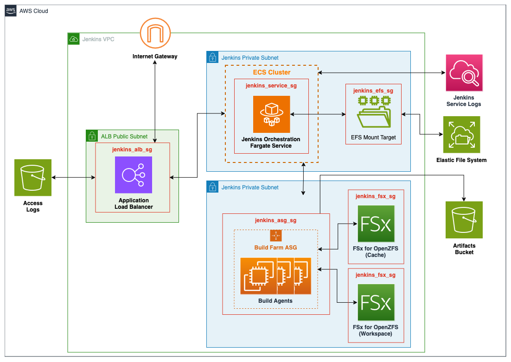

# Jenkins Module

[Jump to Terraform docs](./terraform-docs.md){ .md-button .md-button--primary }

Jenkins is an open source automation server that simplifies repeatable software development tasks such as building, testing, and deploying applications. This module deploys Jenkins on an Elastic Container Service (ECS) cluster backed by AWS Fargate using the latest Jenkins container image ([jenkins/jenkins:lts-jdk17](https://hub.docker.com/r/jenkins/jenkins)). The deployment includes an Elastic File System (EFS) volume for persisting plugins and configurations, along with an Elastic Load Balancer (ELB) deployment for TLS termination. The module also includes the deployment of an EC2 Autoscaling group to serve as a flexible pool of build nodes, however the user must configure Jenkins to use the build farm.

This module deploys the following resources:

- An Elastic Container Service (ECS) cluster backed by AWS Fargate.
- An ECS service running the latest Jenkins container image ([jenkins/jenkins:lts-jdk17](https://hub.docker.com/r/jenkins/jenkins)) available.
- An Elastic File System (EFS) for the Jenkins service to use as a persistent datastore.
- A user defined number of ZFS File Systems
- An Elastic Load Balancer (ELB) for TLS termination of the Jenkins service
- A configurable number of EC2 Autoscaling groups to serve as a flexible pool of build nodes for the Jenkins service
- Supporting resources including KMS keys for encryption and IAM roles to ensure security best practices

## Deployment Architecture



## Prerequisites
There are a few prerequisites to the deployment of Jenkins which are not directly provided in the module. The first is a public certificate used by the Jenkins ALB for SSL termination, instructions are included for provisioning the certificates using the AWS Certificates Manager (ACM) but certificates created else where can also be uploaded into the service for later use. The second is an AWS Secrets Manager secret which is used to store sensitive information, such as SSH keys, which can then be made available to Jenkins through a Plugin.

### Create a Public Certificate

??? note "How to Create a Public Certificate Using Amazon Certificate Manager"

    1. Sign in to the AWS Management Console and open the Amazon Certificate Manager (ACM) [console](https://console.aws.amazon.com/acm/home) and choose Request a certificate.

    2. In the Domain names section, type your domain name.

        a. You can use a fully qualified domain name (FQDN), such as www.example.com, or a bare or apex domain name such as example.com. You can also use an asterisk (\*) as a wild card in the leftmost position to protect several site names in the same domain. For example, \*.example.com protects corp.example.com, and images.example.com. The wild-card name will appear in the Subject field and in the Subject Alternative Name extension of the ACM certificate.

        b. When you request a wild-card certificate, the asterisk (\*) must be in the leftmost position of the domain name and can protect only one subdomain level. For example, \*.example.com can protect login.example.com, and test.example.com, but it cannot protect test.login.example.com. Also note that \*.example.com protects only the subdomains of example.com, it does not protect the bare or apex domain (example.com). To protect both, see the next step.

        !!! note
            In compliance with [RFC 5280](https://datatracker.ietf.org/doc/html/rfc5280), the length of the domain name (technically, the Common Name) that you enter in this step cannot exceed 64 octets (characters), including periods. Each subsequent Subject Alternative Name (SAN) that you provide, as in the next step, can be up to 253 octets in length.

        c. To add another name, choose Add another name to this certificate and type the name in the text box. This is useful for protecting both a bare or apex domain (such as example.com) and its subdomains such as *.example.com).
    3. In the Validation method section, choose either DNS validation – recommended or Email validation, depending on your needs.

        !!! note
            If you are able to edit your DNS configuration, we recommend that you use DNS domain validation rather than email validation. [DNS validation](https://docs.aws.amazon.com/acm/latest/userguide/dns-validation.html) has multiple benefits over email validation. See DNS validation.

        a. Before ACM issues a certificate, it validates that you own or control the domain names in your certificate request. You can use either email validation or DNS validation.

        b. If you choose email validation, ACM sends validation email to three contact addresses registered in the WHOIS database, and up to five common system administration addresses for each domain name. You or an authorized representative must reply to one of these email messages. For more information, see [Email validation](https://docs.aws.amazon.com/acm/latest/userguide/email-validation.html).

        c. If you use DNS validation, you simply add a CNAME record provided by ACM to your DNS configuration. For more information about DNS validation, see [DNS validation](https://docs.aws.amazon.com/acm/latest/userguide/dns-validation.html).

    4. In the Key algorithm section, chose one of the three available algorithms:
        * RSA 2048 (default)
        * ECDSA P 256
        * ECDSA P 384

        a. For information to help you choose an algorithm, see [Key algorithms](https://docs.aws.amazon.com/acm/latest/userguide/acm-certificate.html#algorithms) and the AWS blog post [How to evaluate and use ECDSA certificates in AWS Certificate Manager](https://aws.amazon.com/blogs/security/how-to-evaluate-and-use-ecdsa-certificates-in-aws-certificate-manager/).

    5.In the Tags page, you can optionally tag your certificate. Tags are key-value pairs that serve as metadata for identifying and organizing AWS resources. For a list of ACM tag parameters and for instructions on how to add tags to certificates after creation, see [Tagging AWS Certificate Manager certificates](https://docs.aws.amazon.com/acm/latest/userguide/tags.html). When you finish adding tags, choose Request.

    6. After the request is processed, the console returns you to your certificate list, where information about the new certificate is displayed.
        a. A certificate enters status Pending validation upon being requested, unless it fails for any of the reasons given in the troubleshooting topic [Certificate request fails](https://docs.aws.amazon.com/acm/latest/userguide/troubleshooting-failed.html). ACM makes repeated attempts to validate a certificate for 72 hours and then times out. If a certificate shows status Failed or Validation timed out, delete the request, correct the issue with [DNS validation](https://docs.aws.amazon.com/acm/latest/userguide/dns-validation.html) or [Email validation](https://docs.aws.amazon.com/acm/latest/userguide/email-validation.html), and try again. If validation succeeds, the certificate enters status Issued.

        !!! note
            Depending on how you have ordered the list, a certificate you are looking for might not be immediately visible. You can click the black triangle at right to change the ordering. You can also navigate through multiple pages of certificates using the page numbers at upper-right.

[Amazon Certificate Manager Documentation](https://docs.aws.amazon.com/acm/latest/userguide/gs-acm-request-public.html)

### (Optional) Upload Secrets to AWS Secrets Manager

AWS Secrets Manager can be used to store sensitive information such as SSH keys and access tokens, which can then be made available to Jenkins. We recommend using the service to store the private key for the Jenkins agents which the Jenkins orchestrator uses to communicate over SSH.

!!! warning
    To grant Jenkins access to the secrets stored in the AWS Secrets Manager, the `AWS Secrets Manager Credentials Provider` Jenkins plugin is recommended. **There are requirements around tagging your secrets for the plugin to work properly**. See the [AWS Secrets Manager Credentials Provider Plugin Documentation](https://plugins.jenkins.io/aws-secrets-manager-credentials-provider/) for additional details. Step-by-step instructions for uploading SSH keys into AWS Secrets Manager can be found in the [Configure Plugins](#configuring-plugins) section.

??? note "How to Upload Secrets to AWS Secrets Manager"

    1. Open the Secrets Manager [console](https://console.aws.amazon.com/secretsmanager/).

    2. Choose Store a new secret.

    3. On the Choose secret type page, do the following:
        1. For Secret type, choose Other type of secret.

        1. In Key/value pairs, either enter your secret in JSON Key/value pairs, or choose the Plaintext tab and enter the secret in any format (you must choose Plaintext if storing SSH keys). You can store up to 65536 bytes in the secret.

        1. For Encryption key, choose the AWS KMS key that Secrets Manager uses to encrypt the secret value. For more information, see [Secret encryption and decryption](https://docs.aws.amazon.com/secretsmanager/latest/userguide/security-encryption.html).

            - For most cases, choose aws/secretsmanager to use the AWS managed key for Secrets Manager. There is no cost for using this key.

            - If you need to access the secret from another AWS account, or if you want to use your own KMS key so that you can rotate it or apply a key policy to it, choose a customer managed key from the list or choose Add new key to create one. For information about the costs of using a customer managed key, see [Pricing](https://docs.aws.amazon.com/secretsmanager/latest/userguide/intro.html#asm_pricing).

            - You must have [Permissions for the KMS key](https://docs.aws.amazon.com/secretsmanager/latest/userguide/security-encryption.html#security-encryption-authz). For information about cross-account access, see [Access AWS Secrets Manager secrets from a different account](https://docs.aws.amazon.com/secretsmanager/latest/userguide/auth-and-access_examples_cross.html).

        1. Choose Next

    4. On the Configure secret page, do the following:
        1. Enter a descriptive Secret name and Description. Secret names must contain 1-512 Unicode characters.

        1. (Optional) In the Tags section, add tags to your secret. For tagging strategies, see [Tag AWS Secrets Manager secrets](https://docs.aws.amazon.com/secretsmanager/latest/userguide/managing-secrets_tagging.html). Don't store sensitive information in tags because they aren't encrypted.

        1. (Optional) In Resource permissions, to add a resource policy to your secret, choose Edit permissions. For more information, see [Attach a permissions policy to an AWS Secrets Manager secret](https://docs.aws.amazon.com/secretsmanager/latest/userguide/auth-and-access_resource-policies.html).

        1. (Optional) In Replicate secret, to replicate your secret to another AWS Region, choose Replicate secret. You can replicate your secret now or come back and replicate it later. For more information, see [Replicate secrets across Regions](https://docs.aws.amazon.com/secretsmanager/latest/userguide/replicate-secrets.html).

        1. Choose Next.


    5. (Optional) On the Configure rotation page, you can turn on automatic rotation. You can also keep rotation off for now and then turn it on later. For more information, see [Rotate secrets](https://docs.aws.amazon.com/secretsmanager/latest/userguide/rotating-secrets.html). Choose Next.

    6. On the Review page, review your secret details, and then choose Store.

    Secrets Manager returns to the list of secrets. If your new secret doesn't appear, choose the refresh button.


[AWS Secrets Manager Documentation](https://docs.aws.amazon.com/secretsmanager/latest/userguide/create_secret.html)

### (Optional) Create Amazon Machine Image (AMI) for Jenkins Agent Using Packer

The CGD Toolkit provides packer templates for generating Amazon Machine Images (AMIs) for use as Jenkins Agents. The Toolkit provides both Windows and Linux options

??? note "How to Generate SSH Keys"

    1. Open your preferred Command Line App.

    2. Paste the text below, replacing the email used in the example with your email

    ``` bash
    # This command creates a new SSH key, using the provided email as a label
    ssh-keygen -t ed25519 -C "your_email@example.com"
    ```

    3. When prompted to "Enter a file in which to save the key", enter a path in which to save the generated key, or press **Enter** to accept the default location.

    4. When prompted to "Enter passphrase", enter a password for your key, or leave empty for no password.

    !!! warning
        If using the [AWS Secrets Manager Credentials Provider](https://plugins.jenkins.io/aws-secrets-manager-credentials-provider/), leave the passphrase empty. The AWS Secrets Manager Credentials Provider plugin does **NOT** support passphrases.

??? note "How to Create Linux AMI using Packer"

    1. Copy the existing example Packer configuration file located at **assets/packer/build-agents/linux/example.pkvars.hcl**
    2. Replace placeholder values
        * **region** - AWS Region code to deploy the AMI into. i.e. "us-west-2"
        * **vpc_id** - The ID of the VPC you wish to use to create the AMI.
        * **subnet_id** - The ID of the subnet you wish to use to create the AMI.
        * **profile** - The name of the [AWS CLI profile](https://docs.aws.amazon.com/cli/latest/userguide/cli-configure-files.html) you wish to use to create the AMI.
        * **public_key** - The public ssh key to be used by Jenkins when communicating with its agents.
    3. Download the Packer dependencies
        ``` shell
        # This command will download all necessary dependencies to build the AMI
        packer init
        ```

        !!! note
            If you do not have Hashicorp Packer installed, see [Packer Installation Instructions](https://developer.hashicorp.com/packer/tutorials/docker-get-started/get-started-install-cli).

    4. Build the Image
        ``` shell
        # This command builds the Linux x86_64 AMI using the configurations provided in the .pkvars.hcl you created above
        packer build -var-file your-vars.pkvars.hcl amazon-linux-2023-x86_64.pkr.hcl
        ```

    5. Notate the AMI id (**ami-#################**) returned from the previous command.
        ``` shell
        ==> Wait completed after 10 minutes 23 seconds

        ==> Builds finished. The artifacts of successful builds are:
        --> jenkins-linux-packer.amazon-ebs.al2023: AMIs were created:
        us-east-1: ami-08862...e2e
        ```

## Installation
```shell
terraform init
```

## Deploy
```shell
# Review architecture to be deployed
terraform plan -var-file=deployment-variables.tfvars

# Deploy terraform module
# We recommend enabling the debug flag for the first deployment - it force deletes all data on destroy.
terraform deploy -var-file=deployment-variables.tfvars
```

## Accessing Jenkins

Once deployed, the Jenkins service can be accessed through its associated load balancer. The service is accessible through the ALB on ports 443 and 80 by default. The module does **NOT** allowlist any IP addresses by default. Users must edit the ALB security group to grant access to the Jenkins Service.

You can find the DNS address for the ALB created by the module by running the following command:

``` bash
# This command pulls the DNS address of the ALB associated with the Jenkins ECS service
terraform output jenkins_alb_dns_name
```

## Configuring Jenkins

When accessing Jenkins for the first time, an administrators password is required. This password is auto-generated and available through the ECS logs. The administrative user will be replaced with a new user upon completion of the setup.


### Retrieve the Jenkins Administrator Password

1. Open the AWS console and navigate to the [Elastic Container Service (ECS) console](https://console.aws.amazon.com/ecs).
2. In the `Clusters` tab, select the name of the cluster you created
3. Select the name of the jenkins service you created
4. Select the `Logs` tab
5. Scroll through the logs until you find the password, below is an example of what the password section looks like. Note that each line is shown as its own log entry in the console.


### Jenkins Initial Configuration

1. Open the Jenkins console on your preferred browser, see [Accessing Jenkins](#accessing-jenkins) for details.
2. Paste the password you retrieved from the logs in the previous step into the text box and click **Continue**
3. You will then be prompted to select the plugins you wish to install.
   a. If you are unsure of which plugins to install, select `Install suggested plugins`.
   b. Otherwise, select `Select plugins to install` and choose your preferred plugins.
4. You are then prompted to create your first admin user.
   a. Enter a username for your new user
   b. Enter a password
   c. Enter your full name
   d. Enter you email
   e. Click `Save and Continue`
5. For the Jenkins URL, accept the default value by clicking `Save and Finish`.
6. Click `Start using Jenkins`

### Configuring Plugins

There are 2 plugins recommended for the solutions: The [EC2 Fleet](https://plugins.jenkins.io/ec2-fleet/) Plugin and the [AWS Secrets Manager Credentials Provider](https://plugins.jenkins.io/aws-secrets-manager-credentials-provider/) Plugin. The `EC2 Fleet` Plugin is used to integrate Jenkins with AWS and allows EC2 instances to be used as build nodes through an autoscaling group. The `AWS Secrets Manager Credentials Provider` Plugin will allow users to store their credentials in AWS Secrets Manager and seamlessly access them in Jenkins.

#### Install the Plugins

1. Open the Jenkins console.
2. On the left-hand side, select the `Manage Jenkins` tab.
3. Then, under the `System Configuration` section, select `Plugins`.
4. On the left-hand side, select ` Available plugins`.
5. Using the search bar at the top of the page, search for `EC2 Fleet`.
6. Select the `EC2 Fleet` plugin.
7. Using the search bar at the top of the page, search for `AWS Secret Manager Credentials Provider`.
8. Select the `AWS Secret Manager Credentials Provider` plugin.
9. Click `install` on the top-right corner of the page.
10. Once the installation is complete, Select `Go back to the top page` at the bottom of the page

#### Create the Necessary Credentials

!!! note ""
    === "Using the Jenkins Console"
        1. From the Jenkins homepage, on the left-hand side, select `Manage Jenkins`
        2. Under the `Security` section, select `Credentials`
        3. Under `Stores scoped to Jenkins`, select `System`
        4. Select `Global credentials (unrestricted)`
        5. In the top right corner, click the `Add Credentials` button
        6. For the `Kind` dropdown, select `SSH Username with private key`
        7. For `ID` enter a name for your credentials
        8. For `Description` add a description of your credential
        9. For `Username`, enter the username to be used for the SSH connection
        10. For `Private Key`, select the `Enter directly` radio button.
        11. In the next section displayed, select the `Add` button
        12. Paste the Private Key created earlier into the text box.
        13. For `Passphrase` enter the Passphrase for the SSH key, if no passphrase was entered when creating the keys, leave this blank
        14. Note the `ID` of your newly created credentials. This will be referenced in the next section.

    === "Using the AWS Secrets Manager Plugin"

        1. Open the Secrets Manager [console](https://console.aws.amazon.com/secretsmanager/).

        2. Choose Store a new secret.

        3. On the Choose secret type page, do the following:
            1. For Secret type, choose Other type of secret.

            1. Select the `Plaintext` test tab, select all text in the textbox and delete it.

            1. Paste your Private key into the textbox

            1. Choose Next

        4. On the Configure secret page, do the following:
            1. Enter a descriptive Secret name and Description. Note that the name chosen here will also be used as the name of the credentials within Jenkins.

            1. In the Tags section, add the 2 required tags for the [AWS Secrets Manager Credentials Provider](https://plugins.jenkins.io/aws-secrets-manager-credentials-provider/) Plugin
                * `jenkins:credentials:type` = `sshUserPrivateKey`
                * `jenkins:credentials:username` = `<username>`


                !!! info
                    The username will depend on the image being used for the build agent.

                    * Amazon Linux -> `ec2-user`
                    * Ubuntu -> `ubuntu`
                    * Windows -> `Administrator`


            1. Choose Next.

        6. On the Review page, review your secret details, and then choose Store.

#### Connect Jenkins to the Build Farm

1. From the Jenkins homepage, on the left-hand side, choose `Manage Jenkins`.
2. Under the `System Configuration` section, choose `Clouds`
3. Select `New Cloud`
3. Enter a name for your cloud configuration
4. Select `Amazon EC2 Fleet`
5. Click `Create`
6. On the `New Cloud` configuration page, change the following settings.
    1. **Region** - Select the region in which you deployed the module
    1. **EC2 Fleet** - Select the autoscaling group created by the module
    1. **Launcher** - Select `Launch agents via SSH`
    1. **Launcher** -> **Credentials** - Select the credentials created in the previous step
    1. **Launcher** -> **Host Key Verification Strategy** - Select `Non verifying Verification Strategy`
    1. **Connect to instaces via private IP instead of public IP** - Select the `Private IP` check box
    1. **Max Idle Minutes Before Scaledown** - Set this variable to `5` (minutes). Feel free to change this based on your needs.
