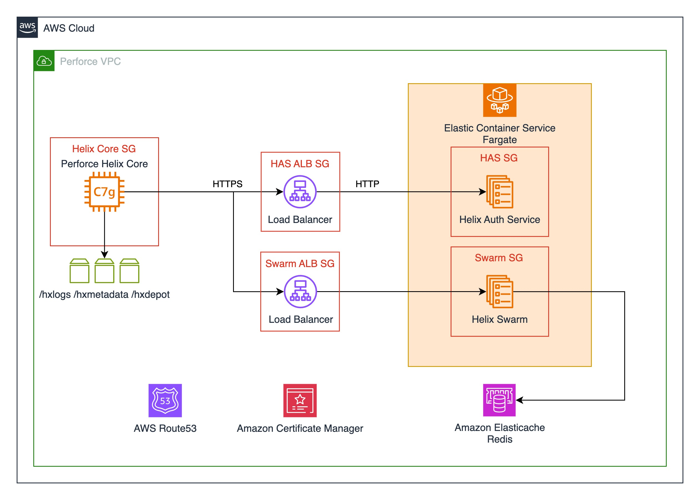

# Perforce Complete Example

This example provisions [Helix Core](https://www.perforce.com/products/helix-core), [Helix Swarm](https://www.perforce.com/products/helix-swarm), and the [Helix Authentication Service](https://www.perforce.com/downloads/helix-authentication-service). It also configures security groups for each of these modules to allow inter-service communication. This example takes a single input variable:`root_domain_name` is expected to correspond to an existing [AWS Route53 hosted zone](https://docs.aws.amazon.com/Route53/latest/DeveloperGuide/route-53-concepts.html#route-53-concepts-hosted-zone). This hosted zone is used for provisioning DNS records used for external and internal routing, and enables this example to create validated SSL certificates on your behalf.

If you do not have a domain yet you can [register one through Route53](https://docs.aws.amazon.com/Route53/latest/DeveloperGuide/domain-register.html#domain-register-procedure-section).

If you already have a domain with a different domain registrar you can leverage Route53 for DNS services. [Please review the documentation for migrating to Route53 as your DNS provider.](https://docs.aws.amazon.com/Route53/latest/DeveloperGuide/MigratingDNS.html)

If you own the domain: "example.com" this example will deploy Helix Core to "core.helix.example.com" and Helix Swarm to "swarm.helix.example.com" - this can be modified from the `dns.tf` file.

## Deployment Architecture

