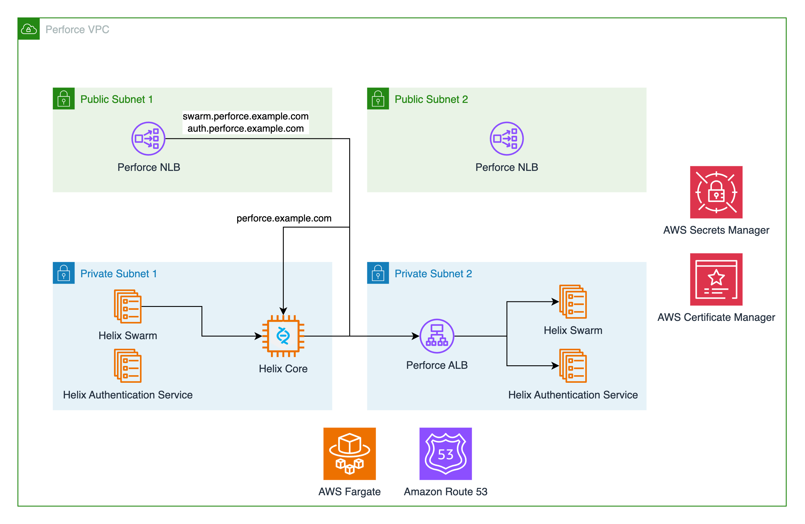

# Perforce Complete Example

This complete example configuration deploys [**Perforce Helix Core**](https://www.perforce.com/products/helix-core),
[**Perforce Helix Swarm**](https://www.perforce.com/products/helix-swarm), and [**Perforce
Helix Authentication Service**](https://www.perforce.com/downloads/helix-authentication-service) into a new Virtual
Private Cloud. It is designed to be used as a starting point for
your Perforce Helix Core deployment.

## Architecture



## Deployment

This example configuration can be used out of the box and takes only a single variable: `root_domain_name` corresponds
to the fully qualified domain name of an existing public hosted zone in the AWS account where you are deploying this
reference architecture. The deployment steps below will get you up and running.

1. You will need the Cloud Game Development Toolkit's Perforce Helix Core Amazon Machine Image. This Amazon Machine
   Image (AMI) can be build using
   our [provided Packer template](https://github.com/aws-games/cloud-game-development-toolkit/tree/main/assets/packer/perforce/helix-core).
   This example uses the ARM64 version of this AMI, and
   leverages Amazon Graviton for the Helix Core instance. Follow our documentation for provisioning this AMI in your AWS
   account.
2. Next, you will need to ensure you have an [Amazon Route 53](https://aws.amazon.com/route53/) hosted zone created in
   your account for a domain name
   that you already own. This example configuration creates DNS records and a private hosted zone for you, but this
   pre-requisite hosted zone is necessary for certificate creation. If you do not wish to use the provided DNS resources
   you will need to customize this example.
3. Once you have completed these pre-requisites you are ready to deploy the infrastructure:

    ```shell
    terraform apply -var "root_domain_name=<YOUR ROOT HOSTED ZONE NAME>"
    ```

4. Review the plan provided by the above command. When you are ready to deploy you can confirm by typing "yes" on the
   command line. Terraform will take a few minutes to provision everything. When it completes, you are ready to proceed
   with testing.
5. By default, none of the deployed resources are available on the public internet. This is to prevent unintended
   security violations. You can update the security group for the Perforce Network Load balancer through the console, or
   add the following rules to the example configuration in [
   `security.tf`](https://github.com/aws-games/cloud-game-development-toolkit/blob/main/modules/perforce/examples/complete/security.tf):

    ```terraform
   # Grants access on HTTPS port for Helix Swarm and Helix Authentication
   resource "aws_vpc_security_group_ingress_rule" "private_perforce_https_ingress" {
      security_group_id = aws_security_group.perforce_network_load_balancer.id
      description = "Enables private access to Perforce web services."
      from_port = 443
      to_port = 443
      ip_protocol = "TCP"
      cidr_ipv4 = "<YOUR IP>/32"
   }

   # Grants access on Helix Core port
   resource "aws_vpc_security_group_ingress_rule" "private_perforce_https_ingress" {
      security_group_id = aws_security_group.perforce_network_load_balancer.id
      description = "Enables private access to Perforce Helix Core."
      from_port = 1666
      to_port = 1666
      ip_protocol = "TCP"
      cidr_ipv4 = "<YOUR IP>/32"

   }
    ```
6. You should now have access to your deployed resources. The URLs for Helix Swarm and Helix Authentication Service are
   provided as Terraform outputs and should be visible in your console after a successful deployment. The connection
   string for Helix Core is also provided as an output. Use the Helix Core CLI or the P4V application to connect to your
   Helix Core server.
