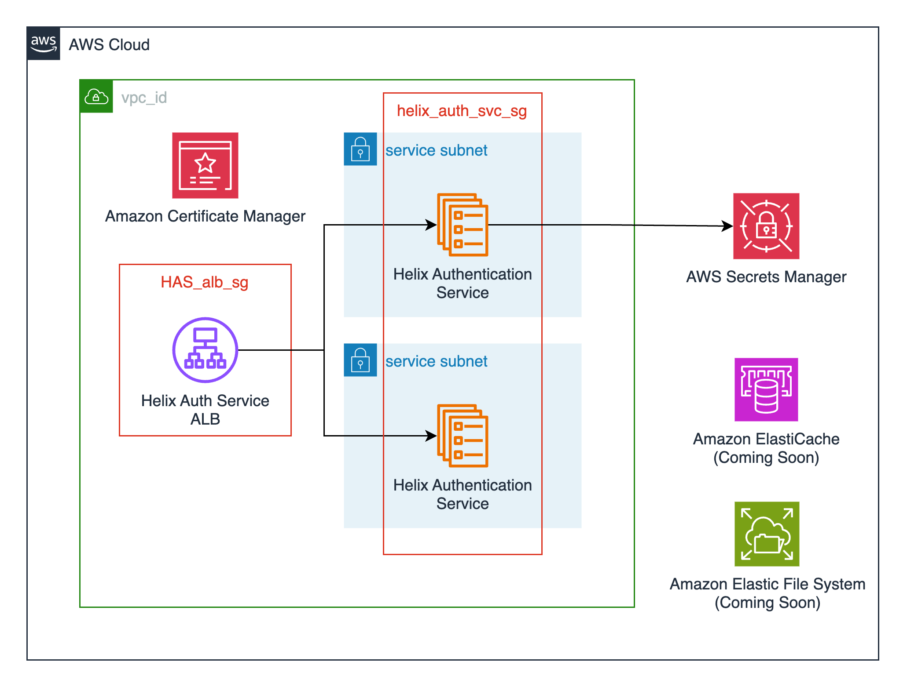

<!-- ---
title: Perforce Helix Authentication Service
description: Helix Authentication Service Terraform Module for AWS
---

# Helix Authentication Service (HAS)

[Jump to Terraform docs](./terraform-docs.md){ .md-button .md-button--primary }

[Perforce Helix Authentication Service](https://www.perforce.com/downloads/helix-authentication-service) enables you to integrate certain Perforce products with your organization's Identity Provider (IdP).

This module creates the following resources:

- An Elastic Container Service (ECS) cluster backed by AWS Fargate. This can also be created externally and passed in via the `cluster_name` variable.
- An ECS service running the latest Helix Authentication Service container ([perforce/helix-auth-svc](https://hub.docker.com/r/perforce/helix-auth-svc)) available.
- AWS Secrets Manager secrets for an administrative user that has access to the Helix Authentication Service's web UI. These credentials are needed to configure external identity providers through the UI.
- An Application Load Balancer for TLS termination of the Helix Authentication Service.
- Supporting resources such as Cloudwatch log groups, IAM roles, and security groups.

## Deployment Architecture


## Prerequisites

The Helix Authentication Service can be configured at deployment time or through the web UI following deployment. If you opt to configure Helix Authentication Service through the web-based UI you will need to create an administrative user for initial login. You can either create and upload these credentials to AWS Secrets Manager yourself, or you opt to have the module create these credentials for you.

Should you choose to create this administrative user yourself you will need to specify the ARN for the username and password as module variables. You can create the secret using the AWS CLI:

```bash
aws secretsmanager create-secret \
    --name HelixAuthAdmin \
    --description "Helix Authentication Service Admin" \
    --secret-string "{\"username\":\"admin\",\"password\":\"EXAMPLE-PASSWORD\"}"
```

And then provide the relevant ARNs as variables when you define the Helix Authentication module in your Terraform configurations:

```hcl
module "perforce_helix_authentication_service" {
    source = "modules/perforce/helix-authentication-service"
    ...
    helix_authentication_service_admin_username_secret_arn = "arn:aws:secretsmanager:us-west-2:123456789012:secret:HelixAuthAdmin-a1b2c3:username::"
    helix_authentication_service_admin_password_secret_arn = "arn:aws:secretsmanager:us-west-2:123456789012:secret:HelixAuthAdmin-a1b2c3:password::"
}
```

If you do not provide these the module will create a random Super User and create the secret for you. The ARN of this secret is then available as an output to be referenced elsewhere, and can be accessed from the AWS Secrets Manager console.

## Enabling System for Cross-domain Identity Management (SCIM)

Helix Authentication Service supports [System for Cross-domain Identity Management (SCIM)](https://en.wikipedia.org/wiki/System_for_Cross-domain_Identity_Management) for provisioning users and groups from an identity management system.

To enable SCIM in the Terraform module, you need to:

1. Set up a secret containing your SCIM Bearer Token in [AWS Secrets Manager](https://docs.aws.amazon.com/secretsmanager/latest/userguide/intro.html).
2. Provide the appropriate `scim_bearer_token_arn`, `p4d_super_user_arn`, `p4d_super_user_password_arn` and `p4d_port` variables to the module.
3. Set up connectivity between Helix Authentication Service and Helix Core:
```hcl
resource "aws_vpc_security_group_ingress_rule" "perforce_helix_core_inbound_helix_auth" {
  security_group_id            = module.perforce_helix_core.security_group_id
  description                  = "Helix Core inbound from Helix Authentication Service"
  ip_protocol                  = "TCP"
  from_port                    = 1666
  to_port                      = 1666
  referenced_security_group_id = module.perforce_helix_authentication_service.service_security_group_id
}

resource "aws_vpc_security_group_egress_rule" "perforce_helix_auth_outbound_helix_core" {
  security_group_id            = module.perforce_helix_authentication_service.service_security_group_id
  description                  = "Helix Authentiation Service outbound to Helix Core"
  from_port                    = 1666
  to_port                      = 1666
  ip_protocol                  = "TCP"
  referenced_security_group_id = module.perforce_helix_core.security_group_id
}
```

Once this is set up, you can verify that SCIM works by making the following call to create a user:

```bash
curl -X POST -H 'Authorization: Bearer <base64-encoded bearer token>' \
  -H "Content-Type: application/scim+json" \
  -d '{
    "schemas": ["urn:ietf:params:scim:schemas:core:2.0:User"],
    "userName": "example1",
    "externalId": "example1",
    "name": {
      "formatted": "Example 1",
      "familyName": "Example",
      "givenName": "One"
    }
  }' \ -v -v -v https://<perforce helix auth domain name>/scim/v2/Users
``` -->
