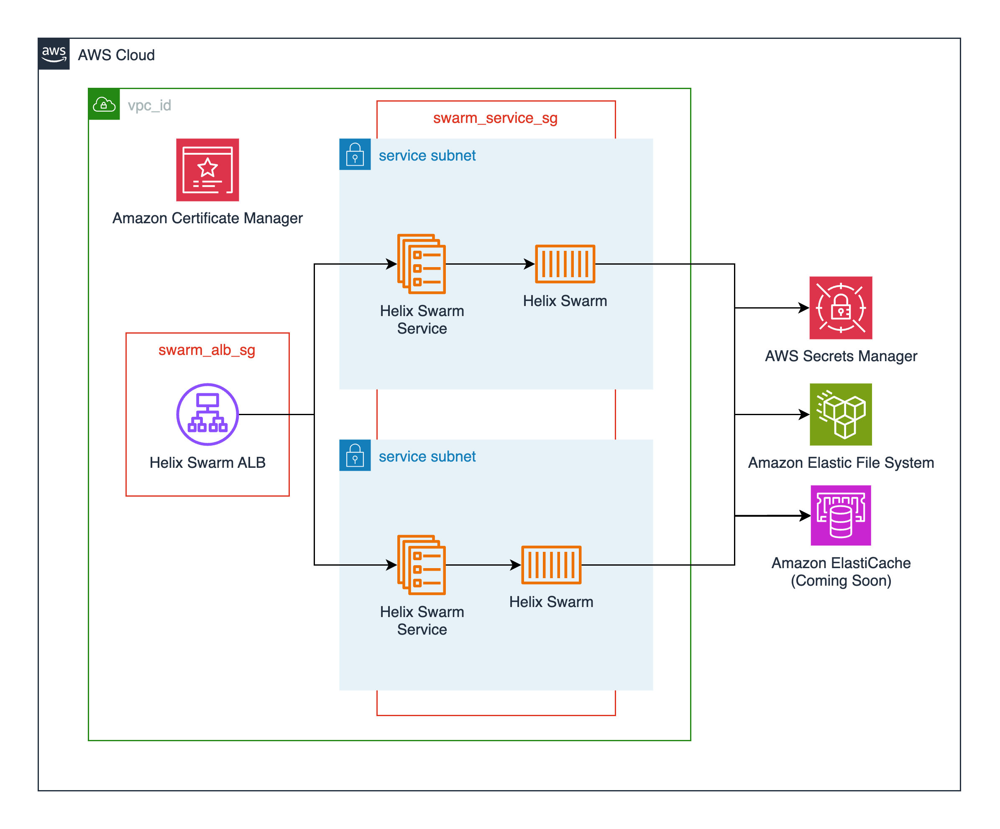

# Perforce Helix Swarm

[Jump to Terraform docs](./terraform-docs.md){ .md-button .md-button--primary }

[Perforce Helix Swarm](https://www.perforce.com/products/helix-swarm) is a free code review tool for projects hosted in [Perforce Helix Core](https://www.perforce.com/products/helix-core). This module deploys Helix Swarm as a service on AWS Elastic Container Service using the [publicly available image from Dockerhub](https://hub.docker.com/r/perforce/helix-swarm).

Helix Swarm also relies on a Redis cache. The module runs Redis as a service alongside Helix Swarm as part of the same task definition.

This module deploys the following resources:

- An Elastic Container Service (ECS) cluster backed by AWS Fargate. This can also be created externally and passed in via the `cluster_name` variable.
- An ECS service running the latest Helix Swarm container ([perforce/helix-swarm](https://hub.docker.com/r/perforce/helix-swarm)) available and a Redis sidecar.
- An Application Load Balancer for TLS termination of the Helix Swarm service.
- Supporting resources such as Cloudwatch log groups, IAM roles, and security groups.

## Deployment Architecture


## Prerequisites

Perforce Helix Swarm needs to be able to connect to a Perforce Helix Core server. Helix Swarm leverages the same authentication mechanism as Helix Core, and needs to install required plugins on the upstream Helix Core instance during setup. This happens automatically, but Swarm requires an administrative user's credentials to be able to initially connect. These credentials are provided to the module through variables specifying AWS Secrets Manager secrets, and then pulled into the Helix Swarm container during startup. See the `p4d_super_user_arn`, `p4d_super_user_password_arn`, `p4d_swarm_user_arn`, and `p4d_swarm_password_arn` variables below for more details.

The [Helix Core module](/docs/modules/perforce/helix-core/helix-core.md) creates an administrative user on initial deployment, and stores the credentials in AWS Secrets manager. The ARN of the credentials secret is then made available as a Terraform output from the module, and can be referenced elsewhere.

Should you need to manually create the administrative user secret the following AWS CLI command may prove useful:

```bash
aws secretsmanager create-secret \
    --name HelixSwarmSuperUser \
    --description "Helix Swarm Super User" \
    --secret-string "{\"username\":\"swarm\",\"password\":\"EXAMPLE-PASSWORD\"}"
```

You can then provide these credentials as variables when you define the Helix Swarm module in your terraform configurations:

```hcl
module "perforce_helix_swarm" {
    source = "modules/perforce/helix-swarm"
    ...
    p4d_super_user_arn = "arn:aws:secretsmanager:us-west-2:123456789012:secret:HelixSwarmSuperUser-a1b2c3:username::"
    p4d_super_user_password_arn = "arn:aws:secretsmanager:us-west-2:123456789012:secret:HelixSwarmSuperUser-a1b2c3:password::"
}
```
