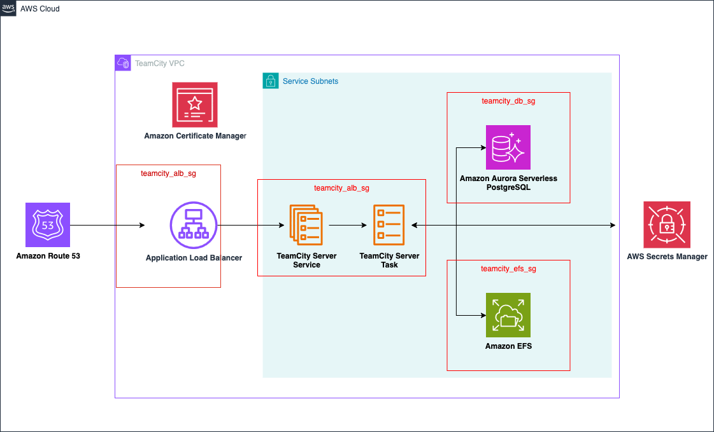

# TeamCity Server

[Jump to Terraform docs](./terraform-docs.md){ .md-button .md-button--primary }

[TeamCity](https://www.jetbrains.com/teamcity/) TeamCity is a user-friendly continuous integration (CI) server for developers and build engineers created by JetBrains. This module deploys a TeamCity server on [AWS Elastic Container Service](https://aws.amazon.com/ecs/).

The TeamCity server relies on shared file system for persistent storage of configuration, build results, and current operation files as well as a SQL database to store build history, user data, build results, and runtime data. This module provides these services by provisioning an [Amazon Elastic File System](https://aws.amazon.com/efs/) and an [Amazon Amazon Aurora Serverless V2](https://aws.amazon.com/rds/aurora/serverless/) cluster running the PostgreSQL engine.

## Deployment Architecture

