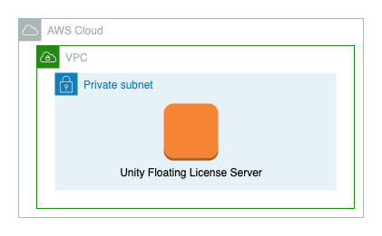

# Unity Floating License Server

[Jump to Terraform docs](./terraform-docs.md){ .md-button .md-button--primary }

[Unity Floating License Server](https://docs.unity.com/licensing/en-us/manual) is software provided to you as part of your Unity subscription. This module deploys a Unity Floating License Server on an AWS EC2 from a preprovisioned AMI created by a packer template.

This module deploys the following resources:

- An EC2 instance that runs the packer created AMI with SSM configured to allow access via EC2 connect.
- A Security Group is created to wrap the licensing server
- A Security Group is created for clients that need to interact with the licensing server on a specific port
- Permissions to upload files to s3 (this is for the configuration workflow)

## Deployment Architecture


## Postrequisites

Unity Floating License Server has post launch requirements. Once the module is up and running go to EC2 connect on the server named "unity-floating-license-server". Once on the command line you will need to do the following commands:
```bash
sudo su ubuntu
cd /opt/UnityLicenseServer
./Unity.License.Server setup
```
The setup process will take you through a wizard that will ask you the following:
- the name of your license server
- if you want to use https (which you will need a certificate PFX file and password)
- which network interface to run the service on (this cannot change)
- what port to run on.
- what password you want to set for the admin dashboard and api

Once this process is finished there are three additional steps to ensure the application is running correctly:
1. Upload "server-registration-request.xml" to an S3 bucket so you can upload this to Unity's portal. To do so you can upload the file to S3 with the following command:
```bash
aws s3 cp ./server-registration-request.xml s3://PLACEHOLDERBUCKET/server-registration-request.xml
```
2. The next step will be to upload and register your Unity licenses to the Floating License Server. After downloading you will need to upload the files to s3 and copy them to the server. To do this you will need to do the following:
```bash
cd ~/
aws s3 cp s3://PLACEHOLDERBUCKET/license.zip ./license.zip
# Then run the import into Unity Licsense Server
cd /opt/UnityLicsenseServer
./Unity.Licensing.Server import ~/license.zip
#you will then need to specify the index number of the toolset see [Unity Docs for importing license set up] (https://docs.unity.com/licensing/en-us/manual/ServerSetup-lic)
```
3. To test this working. Stand up an instance with the Client Security group and run the following command:
```bash
curl http[s]://<SERVER-IP-ADDRESS>:<PORT>/v1/status
```
You should see a response that looks like:
```bash
{"serverStatus":"Healthy","serverUpTime":"1 days 20 hours 43 minutes 46 seconds","serverUpTimeMs":161026780,"version":"2.1.0","serverId":"SampleLicenseServer"}[
```

If you get an Unhealthy response you can run the following command on the Unity Floating License Server instance to get information on what is working and what is not:
```bash
./Unity.Licensing.Server status
```

4. Lastly you will want to create a service on the Unity Floating License Server buy running the following command. You will want to ensure the user who runs the command be apart of the "unity-licensing-server" group:
```bash
sudo ./Unity.Licensing.Server create-service
```
