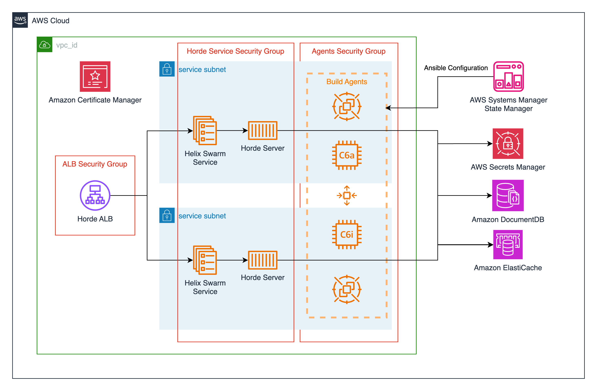

# Unreal Engine Horde

[Jump to Terraform docs](./terraform-docs.md){ .md-button .md-button--primary }

[Unreal Engine Horde](https://github.com/EpicGames/UnrealEngine/tree/5.4/Engine/Source/Programs/Horde) is a set of services supporting workflows Epic uses to develop Fortnite, Unreal Engine, and other titles. This module deploys the Unreal Engine Horde server on AWS Elastic Container Service using the [image available from the Epic Games Github organization.](https://github.com/orgs/EpicGames/packages/container/package/horde-server). Unreal Engine Horde relies on a Redis cache and a MongoDB compatible database. This module provides these services by provisioning an [Amazon Elasticache with Redis OSS Compatibility](https://aws.amazon.com/elasticache/redis/) cluster and an [Amazon DocumentDB](https://aws.amazon.com/documentdb/) cluster.

Check out this video from Unreal Fest 2024 to learn more about the Unreal Horde module:

  <iframe width="1280" height="720" src="https://www.youtube.com/embed/kIP4wsVprYY?si=4aembH2MV3N5-ZEh" frameborder="0" allowfullscreen></iframe>

## Deployment Architecture

## Prerequisites
Unreal Engine Horde is only available through the Epic Games Github organization's package registry or the Unreal Engine source code. In order to get access to this software you will need to [join the Epic Games organization](https://github.com/EpicGames/Signup) on Github and accept the Unreal Engine EULA.
