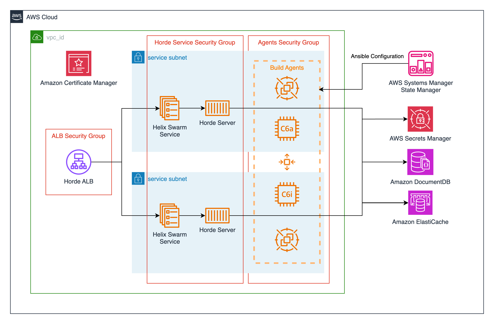

# Unreal Engine Cloud DDC Intra Cluster Module

[Jump to Terraform docs](./terraform-docs.md) { .md-button .md-button--primary }

[Unreal Cloud Derived Data Cache](https://github.com/EpicGames/UnrealEngine/tree/release/Engine/Source/Programs/UnrealCloudDDC) is a set of services supporting distributed team workflows to accelerate cook processes in Unreal Engine. This module deploys the [image available from the Epic Games Github organization.](https://github.com/orgs/EpicGames/packages/container/package/unreal-cloud-ddc), configures service accounts and IAM roles required to run Unreal Cloud DDC.

This module utilizes the [Terraform EKS Blueprints Addons](https://github.com/aws-ia/terraform-aws-eks-blueprints-addons) repository to install CoreDNS, Kube-Proxy, VPC-CNI, EBS CSI Driver, AWS Load Balancer and CloudWatch Metrics Addons to the cluster with the required IAM roles and service accounts.

## Deployment Architecture


## Prerequisites
This module is to be used in conjunction with the Unreal Cloud DDC Infra Module which sets up all the required infrastructure for the images.

This module also requires two secrets to be set up prior:

external_idp_oidc_credential_arn is set up for the Secrets Manager resolver for a Client Secret for  Unreal Cloud DDC("aws!arn:aws:secretsmanager:region-A:<aws-account-number>:secret:ddc-storage-oktaaccount|client_secret"). The format of your secrets needs to be in JSON but can have any field you require. See [Unreal Cloud DDC Helm documentation](https://github.com/EpicGames/UnrealEngine/tree/release/Engine/Source/Programs/UnrealCloudDDC/Helm/UnrealCloudDDC). A sample example is as follows:
```
{
    "client_secret":"CLIENT-SECRET-PLACEHOLDER",
    "client_id":"CLIENT-ID-PLACEHOLDER"
}
```
A value is currently required here for the module to set up properly.

github_credential_arn is required for the ECR pull through cache to resolve the image. This is required to have the prefix of ecr-pullthrough and the fields of username and access_token. Your structure will have be exact as the following:
```
{
    "username":"GITHUB-USER-NAME-PLACEHOLDER",
    "accessToken":"GITHUB-ACCESS-TOKEN-PLACEHOLDER"
}
```
