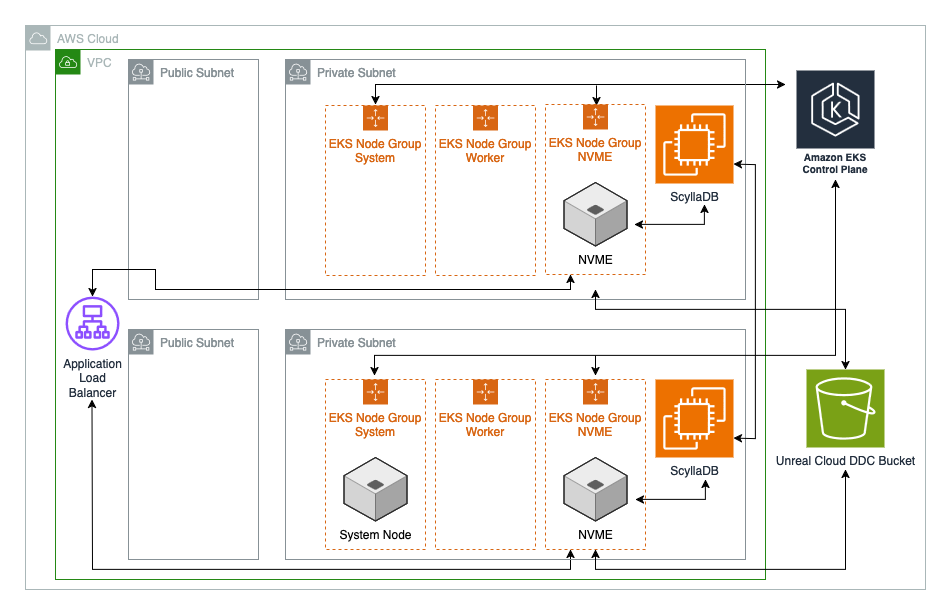

# Unreal Engine Cloud DDC Intra Cluster Module

[Jump to Terraform docs](./terraform-docs.md) { .md-button .md-button--primary }

!!!warning
    Many of the links in this document lead back to the Unreal Engine source code hosted on GitHub. Access to the Unreal Engine source code requires that you connect your existing GitHub account to your Epic account. If you are seeing 404 errors when opening certain links, follow the instructions [here](https://www.unrealengine.com/en-US/ue-on-github) to connect your accounts.

[Unreal Cloud Derived Data Cache](https://dev.epicgames.com/documentation/en-us/unreal-engine/using-derived-data-cache-in-unreal-engine) ([source code](https://github.com/EpicGames/UnrealEngine/tree/release/Engine/Source/Programs/UnrealCloudDDC)) is a caching system that stores additional data required to use assets, such as compiled shaders. This allows the engine to quickly retrieve this data instead of having to regenerate it, saving time and disk space for the development team. For distributed teams, a cloud-hosted DDC enables efficient collaboration by ensuring all team members have access to the same cached data regardless of their location. This Terraform module deploys the [Unreal Cloud DDC container image](https://github.com/orgs/EpicGames/packages/container/package/unreal-cloud-ddc) provided by the Epic Games GitHub organization. It also configures the necessary service accounts and IAM roles required to run the Unreal Cloud DDC service on AWS.

This module currently utilizes the [Terraform EKS Blueprints Addons](https://github.com/aws-ia/terraform-aws-eks-blueprints-addons) repository to install the following addons to the Kubernetes cluster, with the required IAM roles and service accounts:

- **CoreDNS**: Provides DNS services for the Kubernetes cluster, enabling reliable name resolution for the Unreal Cloud DDC service.
    Kube-Proxy: Manages network traffic routing within the cluster, ensuring seamless communication between the Unreal Cloud DDC service and other components.
- **VPC-CNI**: Implements the Kubernetes networking model within the AWS VPC, allowing the Unreal Cloud DDC service to be properly integrated with the network infrastructure.
- **EBS CSI Driver**: Provides persistent storage capabilities using Amazon Elastic Block Store (EBS), enabling the Unreal Cloud DDC service to store and retrieve cached data.

## Deployment Architecture


## Prerequisites
!!!note
    This module is designed to be used in conjunction with the [Unreal Cloud DDC Infra Module](../unreal-cloud-ddc-infra/unreal-cloud-ddc-infra.md) which deploys the required infrastructure to host the Cloud DDC service.

### GitHub Secret
Next, for the module to be able to access the Unreal Cloud DDC container image, there are 2 things you must do. First, if you have not done so, you must [connect your GitHub account to your Epic account](https://www.unrealengine.com/en-US/ue-on-github), thereby granting you access to the container images in the Unreal Engine repository. Next, you will need to create a `github_credentials` secret which includes a `username` and `access-token` field.

!!!note
    Instructions on creating a new access token can be found [here](https://docs.github.com/en/authentication/keeping-your-account-and-data-secure/managing-your-personal-access-tokens). You will need to provide the `read:package` and `repo` permissions to the access token you create.

You can then upload the secret to AWS Secret Manager using the following [AWS CLI](https://aws.amazon.com/cli/) command:

```commandline
aws secretsmanager create-secret --name "ecr-pullthroughcache/github-credentials" --secret-string '{"username":"USERNAME-PLACEHOLDER","access-token":"ACCESS-TOKEN-PLACEHOLDER"}'
```

!!!note
    Make sure to replace the `GITHUB-USERNAME-PLACEHOLDER` and `GITHUB-ACCESS-TOKEN-PLACEHOLDER` with the appropriate values from your GitHub account prior to running the command.

!!!warning
    Note that the name of the secret must be prefixed with `ecr-pullthroughcache/` and the fields must be called `username` and `access-token` for ECR to properly detect the secrets. If making changes to the above command, you must adhere to these rules.

Once the secret is created, pass the newly uploaded secret's ARN into the `ghcr_credentials_secret_manager_arn` variable.

## Customizing Your Deployment

### OIDC Secret
To use client secrets for OIDC authentication, a new secret must be uploaded to AWS Secrets Manager. You can upload the new secret to AWS Secret Manager using the following [AWS CLI](https://aws.amazon.com/cli/) command:

!!!note
    Make sure to replace the `CLIENT-SECRET-PLACEHOLDER` and `CLIENT-ID-PLACEHOLDER` with the appropriate values from your IDP prior to running the command.

```commandline
aws secretsmanager create-secret --name "external-idp-oidc-credentials" --secret-string '{"client_secret":"CLIENT-SECRET-PLACEHOLDER","client_id":"CLIENT-ID-PLACEHOLDER"}'
```

The ARN for the newly created secret must then be passed to the `oidc_credentials_secret_manager_arn` variable. The secret is referenced using the following format and should be passed into the variable using the same format:

```
aws!arn:aws:secretsmanager:<region>:<aws-account-number>:secret:<secret-name>|<json-field>
```

!!!note
    Note the prefix `aws!` and the postfix `|<json-field>` are added to the ARN of the newly created secret.

!!!note
    While we highly encourage the use of OIDC tokens for production environments, users can use a bearer token in its place by providing the token to the `unreal_cloud_ddc_helm_values` variable. See DDC sample for an example implementation.

    ```
        unreal_cloud_ddc_helm_values = [
            templatefile("${path.module}/assets/unreal_cloud_ddc_single_region.yaml", {
                token = <bearer-token>
                # Other templatefile parameters...
            })
        ]
    ```

### Chart Values (Helm Configurations)

The `unreal_cloud_ddc_helm_values` variable provides an open-ended way to configure the Unreal Cloud DDC deployment through the use of YAML files. We generally recommend you to use a template file. An example of a template file configuration can be found in the `unreal-cloud-ddc-single-region` sample located [here](/samples/unreal-cloud-ddc-single-region/assets/unreal_cloud_ddc_single_region.yaml). You can also find additional example templates provided by Epic [here](https://github.com/EpicGames/UnrealEngine/tree/release/Engine/Source/Programs/UnrealCloudDDC/Helm/UnrealCloudDDC).
