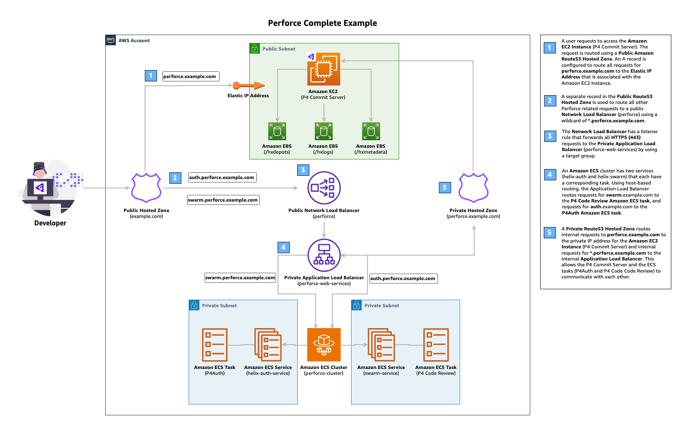

# Perforce Complete Example
This example demonstrates how to deploy **[P4 (formerly Helix Core)](https://www.perforce.com/products/helix-core)**, **[P4 Code Review (formerly Helix Swarm)](https://www.perforce.com/products/helix-swarm)**, and **[P4Auth (formerly Helix Authentication Service)](https://help.perforce.com/helix-core/integrations-plugins/helix-auth-svc/current/Content/HAS/overview-of-has.html)**.

## Prerequisites
To use this example, you must have an existing **public Amazon Route53 Hosted Zone**. This is used to route traffic to your P4 Commit Server and allow user access. You must also create a Perforce AMI to be used for the P4 Commit Server. To expedite this process, we have some sample [HashiCorp Packer](https://www.packer.io/) templates at the root of this repository at `/assets/packer/perforce/helix-core`.

**Note:** You must also reference the `p4_configure.sh` and `p4_setup.sh` files as these are used to configure the P4 Commit Server. These are already references in the `perforce_arm64.pkr.hcl` and `perforce_x86.pkr.hcl` packer templates.

## Architecture

## Deployment Instructions
1. Create the Perforce AMI in your AWS account (using one of the supplied Packer templates is recommended). Ensure you use the Packer template that aligns with the architecture type (e.g. arm64) of the EC2 instance you wish to create. On the Terraform side, you must also set this using the `instance_architecture` variable. Ensure your `instance_type` is supported for your desired `instance_architecture`. For a full list of this mapping, see the [AWS Docs for EC2 Naming Conventions](https://docs.aws.amazon.com/ec2/latest/instancetypes/instance-type-names.html). You can also use the interactive chart on Instances by [Vantage](https://instances.vantage.sh/).

2. Reference your existing public Route53 Hosted Zone name using the `root_domain_name` variable
3. Make any other modifications as desired (such as referencing existing VPC resources) and run `terraform apply`
4. Once the resources have finished provisioning successfully, to test you can modify your inbound Security Group Rules on the P4 Commit Server Instance to allow TCP traffic from your public IP on port 1666 (the perforce default port). Optionally, you can create and use a Customer-managed prefix list to manage access for sets of IP address ranges that you define and manage. This is necessary to allow your local machine(s) to connect to the P4 Commit Server.
5. Next, modify your inbound Security Group rules for the Perforce Network Load Balancer to allow traffic from HTTPS (port 443) from your public IP address (or the other options mentioned above). This is to provide access for you to access Helix Swarm and Helix Authentication Service.
6. Use the provided Terraform outputs to quickly find the URL for Helix Authentication Service, Helix Swarm. If you haven't modified the default values, relevant values for the Helix Core default username/password, and the Helix Swarm default username/password were created for you and are stored in AWS Secrets Manager.
7. In P4V, use the url of `ssl:<your-supplied-root-domain>:1666` and the username and password stored in AWS Secrets Manager to gain access to the commi server.
8. At this point, you should be able to access your P4 Commit Server (P4), P4 Code Review (Helix Swarm), and P4Auth (Helix Authentication Service).
<!-- BEGIN_TF_DOCS -->
## Requirements

| Name | Version |
|------|---------|
|  [terraform](#requirement\_terraform) | >= 1.0 |
|  [aws](#requirement\_aws) | 5.89.0 |

## Providers

| Name | Version |
|------|---------|
|  [aws](#provider\_aws) | 5.89.0 |

## Modules

| Name | Source | Version |
|------|--------|---------|
|  [perforce\_helix\_authentication\_service](#module\_perforce\_helix\_authentication\_service) | ../../helix-authentication-service | n/a |
|  [perforce\_helix\_core](#module\_perforce\_helix\_core) | ../../helix-core | n/a |
|  [perforce\_helix\_swarm](#module\_perforce\_helix\_swarm) | ../../helix-swarm | n/a |

## Resources

| Name | Type |
|------|------|
| [aws_acm_certificate.perforce](https://registry.terraform.io/providers/hashicorp/aws/5.89.0/docs/resources/acm_certificate) | resource |
| [aws_acm_certificate_validation.perforce](https://registry.terraform.io/providers/hashicorp/aws/5.89.0/docs/resources/acm_certificate_validation) | resource |
| [aws_default_security_group.default](https://registry.terraform.io/providers/hashicorp/aws/5.89.0/docs/resources/default_security_group) | resource |
| [aws_ecs_cluster.perforce_cluster](https://registry.terraform.io/providers/hashicorp/aws/5.89.0/docs/resources/ecs_cluster) | resource |
| [aws_ecs_cluster_capacity_providers.providers](https://registry.terraform.io/providers/hashicorp/aws/5.89.0/docs/resources/ecs_cluster_capacity_providers) | resource |
| [aws_eip.nat_gateway_eip](https://registry.terraform.io/providers/hashicorp/aws/5.89.0/docs/resources/eip) | resource |
| [aws_internet_gateway.igw](https://registry.terraform.io/providers/hashicorp/aws/5.89.0/docs/resources/internet_gateway) | resource |
| [aws_lb.perforce](https://registry.terraform.io/providers/hashicorp/aws/5.89.0/docs/resources/lb) | resource |
| [aws_lb.perforce_web_services](https://registry.terraform.io/providers/hashicorp/aws/5.89.0/docs/resources/lb) | resource |
| [aws_lb_listener.perforce_web_services](https://registry.terraform.io/providers/hashicorp/aws/5.89.0/docs/resources/lb_listener) | resource |
| [aws_lb_listener.perforce_web_services_alb](https://registry.terraform.io/providers/hashicorp/aws/5.89.0/docs/resources/lb_listener) | resource |
| [aws_lb_listener_rule.perforce_helix_authentication_service](https://registry.terraform.io/providers/hashicorp/aws/5.89.0/docs/resources/lb_listener_rule) | resource |
| [aws_lb_listener_rule.perforce_helix_swarm](https://registry.terraform.io/providers/hashicorp/aws/5.89.0/docs/resources/lb_listener_rule) | resource |
| [aws_lb_target_group.perforce_web_services](https://registry.terraform.io/providers/hashicorp/aws/5.89.0/docs/resources/lb_target_group) | resource |
| [aws_lb_target_group_attachment.perforce_web_services](https://registry.terraform.io/providers/hashicorp/aws/5.89.0/docs/resources/lb_target_group_attachment) | resource |
| [aws_nat_gateway.nat_gateway](https://registry.terraform.io/providers/hashicorp/aws/5.89.0/docs/resources/nat_gateway) | resource |
| [aws_route.private_rt_nat_gateway](https://registry.terraform.io/providers/hashicorp/aws/5.89.0/docs/resources/route) | resource |
| [aws_route53_record.external_perforce_helix_core](https://registry.terraform.io/providers/hashicorp/aws/5.89.0/docs/resources/route53_record) | resource |
| [aws_route53_record.external_perforce_web_services](https://registry.terraform.io/providers/hashicorp/aws/5.89.0/docs/resources/route53_record) | resource |
| [aws_route53_record.internal_helix_core](https://registry.terraform.io/providers/hashicorp/aws/5.89.0/docs/resources/route53_record) | resource |
| [aws_route53_record.internal_perforce_web_services](https://registry.terraform.io/providers/hashicorp/aws/5.89.0/docs/resources/route53_record) | resource |
| [aws_route53_record.perforce_cert](https://registry.terraform.io/providers/hashicorp/aws/5.89.0/docs/resources/route53_record) | resource |
| [aws_route53_zone.perforce_private_hosted_zone](https://registry.terraform.io/providers/hashicorp/aws/5.89.0/docs/resources/route53_zone) | resource |
| [aws_route_table.private_rt](https://registry.terraform.io/providers/hashicorp/aws/5.89.0/docs/resources/route_table) | resource |
| [aws_route_table.public_rt](https://registry.terraform.io/providers/hashicorp/aws/5.89.0/docs/resources/route_table) | resource |
| [aws_route_table_association.private_rt_asso](https://registry.terraform.io/providers/hashicorp/aws/5.89.0/docs/resources/route_table_association) | resource |
| [aws_route_table_association.public_rt_asso](https://registry.terraform.io/providers/hashicorp/aws/5.89.0/docs/resources/route_table_association) | resource |
| [aws_security_group.perforce_network_load_balancer](https://registry.terraform.io/providers/hashicorp/aws/5.89.0/docs/resources/security_group) | resource |
| [aws_security_group.perforce_web_services_alb](https://registry.terraform.io/providers/hashicorp/aws/5.89.0/docs/resources/security_group) | resource |
| [aws_subnet.private_subnets](https://registry.terraform.io/providers/hashicorp/aws/5.89.0/docs/resources/subnet) | resource |
| [aws_subnet.public_subnets](https://registry.terraform.io/providers/hashicorp/aws/5.89.0/docs/resources/subnet) | resource |
| [aws_vpc.perforce_vpc](https://registry.terraform.io/providers/hashicorp/aws/5.89.0/docs/resources/vpc) | resource |
| [aws_vpc_security_group_egress_rule.perforce_alb_outbound_helix_auth](https://registry.terraform.io/providers/hashicorp/aws/5.89.0/docs/resources/vpc_security_group_egress_rule) | resource |
| [aws_vpc_security_group_egress_rule.perforce_alb_outbound_helix_swarm](https://registry.terraform.io/providers/hashicorp/aws/5.89.0/docs/resources/vpc_security_group_egress_rule) | resource |
| [aws_vpc_security_group_egress_rule.perforce_helix_swarm_outbound_helix_core](https://registry.terraform.io/providers/hashicorp/aws/5.89.0/docs/resources/vpc_security_group_egress_rule) | resource |
| [aws_vpc_security_group_egress_rule.perforce_nlb_outbound_helix_core](https://registry.terraform.io/providers/hashicorp/aws/5.89.0/docs/resources/vpc_security_group_egress_rule) | resource |
| [aws_vpc_security_group_egress_rule.perforce_nlb_outbound_web_alb](https://registry.terraform.io/providers/hashicorp/aws/5.89.0/docs/resources/vpc_security_group_egress_rule) | resource |
| [aws_vpc_security_group_ingress_rule.perforce_alb_inbound_helix_auth](https://registry.terraform.io/providers/hashicorp/aws/5.89.0/docs/resources/vpc_security_group_ingress_rule) | resource |
| [aws_vpc_security_group_ingress_rule.perforce_alb_inbound_helix_swarm](https://registry.terraform.io/providers/hashicorp/aws/5.89.0/docs/resources/vpc_security_group_ingress_rule) | resource |
| [aws_vpc_security_group_ingress_rule.perforce_helix_core_inbound_helix_swarm](https://registry.terraform.io/providers/hashicorp/aws/5.89.0/docs/resources/vpc_security_group_ingress_rule) | resource |
| [aws_vpc_security_group_ingress_rule.perforce_helix_core_inbound_web_alb_https](https://registry.terraform.io/providers/hashicorp/aws/5.89.0/docs/resources/vpc_security_group_ingress_rule) | resource |
| [aws_vpc_security_group_ingress_rule.perforce_nlb_inbound_helix_core](https://registry.terraform.io/providers/hashicorp/aws/5.89.0/docs/resources/vpc_security_group_ingress_rule) | resource |
| [aws_vpc_security_group_ingress_rule.perforce_nlb_inbound_web_alb_https](https://registry.terraform.io/providers/hashicorp/aws/5.89.0/docs/resources/vpc_security_group_ingress_rule) | resource |
| [aws_availability_zones.available](https://registry.terraform.io/providers/hashicorp/aws/5.89.0/docs/data-sources/availability_zones) | data source |
| [aws_route53_zone.root](https://registry.terraform.io/providers/hashicorp/aws/5.89.0/docs/data-sources/route53_zone) | data source |

## Inputs

| Name | Description | Type | Default | Required |
|------|-------------|------|---------|:--------:|
|  [root\_domain\_name](#input\_root\_domain\_name) | The root domain name you would like to use for DNS. | `string` | n/a | yes |

## Outputs

| Name | Description |
|------|-------------|
|  [helix\_authentication\_service\_admin\_url](#output\_helix\_authentication\_service\_admin\_url) | The URL for the Helix Authentication Service admin page. |
|  [helix\_core\_connection\_string](#output\_helix\_core\_connection\_string) | The connection string for the Helix Core server. Set your P4PORT environment variable to this value. |
|  [helix\_swarm\_url](#output\_helix\_swarm\_url) | The URL for the Helix Swarm server. |
<!-- END_TF_DOCS -->
