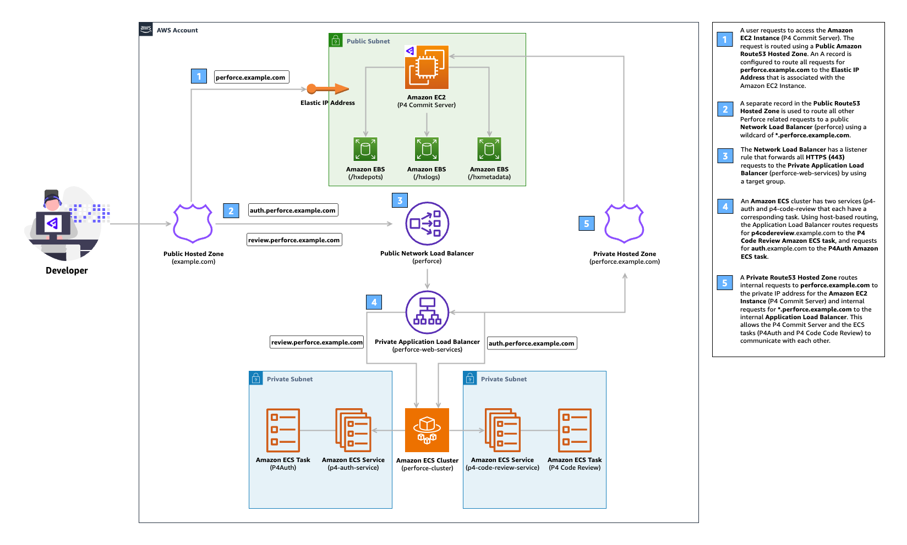

# Create Resources Complete (with Route53)
This example demonstrates how to deploy **[P4 Server (formerly Helix Core)](https://www.perforce.com/products/helix-core)**, **[P4 Code Review (formerly P4 Code Review)](https://www.perforce.com/products/helix-swarm)**, and **[P4Auth (formerly P4Auth)](https://help.perforce.com/helix-core/integrations-plugins/helix-auth-svc/current/Content/HAS/overview-of-has.html)** using Amazon Route53 as the DNS provider.

## Architecture

<!-- BEGIN_TF_DOCS -->
## Requirements

| Name | Version |
|------|---------|
|  [terraform](#requirement\_terraform) | >= 1.0 |
|  [aws](#requirement\_aws) | 5.89.0 |

## Providers

| Name | Version |
|------|---------|
|  [aws](#provider\_aws) | 5.89.0 |
|  [http](#provider\_http) | 3.4.5 |

## Modules

| Name | Source | Version |
|------|--------|---------|
|  [terraform-aws-perforce](#module\_terraform-aws-perforce) | ../../ | n/a |

## Resources

| Name | Type |
|------|------|
| [aws_acm_certificate.perforce](https://registry.terraform.io/providers/hashicorp/aws/5.89.0/docs/resources/acm_certificate) | resource |
| [aws_acm_certificate_validation.perforce](https://registry.terraform.io/providers/hashicorp/aws/5.89.0/docs/resources/acm_certificate_validation) | resource |
| [aws_default_security_group.default](https://registry.terraform.io/providers/hashicorp/aws/5.89.0/docs/resources/default_security_group) | resource |
| [aws_eip.nat_gateway_eip](https://registry.terraform.io/providers/hashicorp/aws/5.89.0/docs/resources/eip) | resource |
| [aws_internet_gateway.igw](https://registry.terraform.io/providers/hashicorp/aws/5.89.0/docs/resources/internet_gateway) | resource |
| [aws_nat_gateway.nat_gateway](https://registry.terraform.io/providers/hashicorp/aws/5.89.0/docs/resources/nat_gateway) | resource |
| [aws_route.private_rt_nat_gateway](https://registry.terraform.io/providers/hashicorp/aws/5.89.0/docs/resources/route) | resource |
| [aws_route53_record.external_perforce_p4_server](https://registry.terraform.io/providers/hashicorp/aws/5.89.0/docs/resources/route53_record) | resource |
| [aws_route53_record.external_perforce_web_services](https://registry.terraform.io/providers/hashicorp/aws/5.89.0/docs/resources/route53_record) | resource |
| [aws_route53_record.perforce_cert](https://registry.terraform.io/providers/hashicorp/aws/5.89.0/docs/resources/route53_record) | resource |
| [aws_route_table.private_rt](https://registry.terraform.io/providers/hashicorp/aws/5.89.0/docs/resources/route_table) | resource |
| [aws_route_table.public_rt](https://registry.terraform.io/providers/hashicorp/aws/5.89.0/docs/resources/route_table) | resource |
| [aws_route_table_association.private_rt_asso](https://registry.terraform.io/providers/hashicorp/aws/5.89.0/docs/resources/route_table_association) | resource |
| [aws_route_table_association.public_rt_asso](https://registry.terraform.io/providers/hashicorp/aws/5.89.0/docs/resources/route_table_association) | resource |
| [aws_security_group.allow_my_ip](https://registry.terraform.io/providers/hashicorp/aws/5.89.0/docs/resources/security_group) | resource |
| [aws_subnet.private_subnets](https://registry.terraform.io/providers/hashicorp/aws/5.89.0/docs/resources/subnet) | resource |
| [aws_subnet.public_subnets](https://registry.terraform.io/providers/hashicorp/aws/5.89.0/docs/resources/subnet) | resource |
| [aws_vpc.perforce_vpc](https://registry.terraform.io/providers/hashicorp/aws/5.89.0/docs/resources/vpc) | resource |
| [aws_vpc_security_group_ingress_rule.allow_http](https://registry.terraform.io/providers/hashicorp/aws/5.89.0/docs/resources/vpc_security_group_ingress_rule) | resource |
| [aws_vpc_security_group_ingress_rule.allow_https](https://registry.terraform.io/providers/hashicorp/aws/5.89.0/docs/resources/vpc_security_group_ingress_rule) | resource |
| [aws_vpc_security_group_ingress_rule.allow_icmp](https://registry.terraform.io/providers/hashicorp/aws/5.89.0/docs/resources/vpc_security_group_ingress_rule) | resource |
| [aws_vpc_security_group_ingress_rule.allow_perforce](https://registry.terraform.io/providers/hashicorp/aws/5.89.0/docs/resources/vpc_security_group_ingress_rule) | resource |
| [aws_availability_zones.available](https://registry.terraform.io/providers/hashicorp/aws/5.89.0/docs/data-sources/availability_zones) | data source |
| [aws_lb.shared_services_nlb](https://registry.terraform.io/providers/hashicorp/aws/5.89.0/docs/data-sources/lb) | data source |
| [aws_route53_zone.root](https://registry.terraform.io/providers/hashicorp/aws/5.89.0/docs/data-sources/route53_zone) | data source |
| [http_http.my_ip](https://registry.terraform.io/providers/hashicorp/http/latest/docs/data-sources/http) | data source |

## Inputs

No inputs.

## Outputs

| Name | Description |
|------|-------------|
|  [p4\_auth\_admin\_url](#output\_p4\_auth\_admin\_url) | The URL for the P4Auth service admin page. |
|  [p4\_code\_review\_url](#output\_p4\_code\_review\_url) | The URL for the P4 Code Review service. |
|  [p4\_server\_connection\_string](#output\_p4\_server\_connection\_string) | The connection string for the P4 Server. Set your P4PORT environment variable to this value. |
