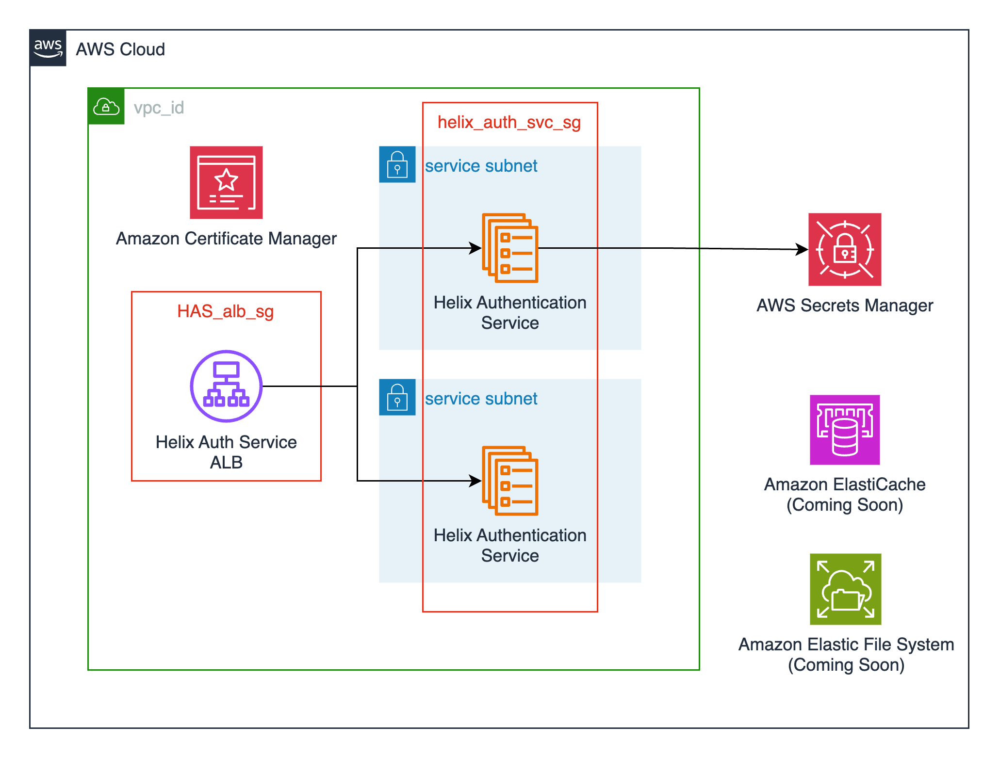

# P4Auth Submodule

[P4Auth](https://www.perforce.com/downloads/helix-authentication-service) enables you to integrate certain Perforce products with your organization's Identity Provider (IdP).

This module creates the following resources:

- An Elastic Container Service (ECS) cluster backed by AWS Fargate. This can also be created externally and passed in via the `cluster_name` variable.
- An ECS service running the latest P4Auth container ([perforce/helix-auth-svc](https://hub.docker.com/r/perforce/helix-auth-svc)) available.
- AWS Secrets Manager secrets for an administrative user that has access to the Helix Authentication Service's web UI. These credentials are needed to configure external identity providers through the UI.
- Supporting resources such as Cloudwatch log groups, IAM roles, and security groups.

## Architecture


## Prerequisites

P4Admin can be configured at deployment time or through the web UI following deployment. If you opt to configure P4Admin through the web-based UI you will need to create an administrative user for initial login. You can either create and upload these credentials to AWS Secrets Manager yourself, or you opt to have the module create these credentials for you. The parent module does this by default.

Should you choose to create this administrative user yourself you will need to specify the ARN for the username and password as module variables. You can create the secret using the AWS CLI:

```bash
aws secretsmanager create-secret \
    --name P4AuthAdmin \
    --description "P4Auth Admin" \
    --secret-string "{\"username\":\"admin\",\"password\":\"EXAMPLE-PASSWORD\"}"
```

And then provide the relevant ARNs as variables when you define the Helix Authentication module in your Terraform configurations:

```hcl
module "p4_auth" {
    source = "modules/perforce/modules/p4-auth"
    ...
    admin_username_secret_arn = "arn:aws:secretsmanager:<your-aws-region>:<your-aws-account-id>:secret:P4AuthAdmin-a1b2c3:username::"
    admin_password_secret_arn = "arn:aws:secretsmanager:<your-aws-region>:<your-aws-account-id>:secret:P4AuthAdmin-a1b2c3:password::"
}
```

If you do not provide these the module will create a random Super User and create the secret for you. The ARN of this secret is then available as an output to be referenced elsewhere, and can be accessed from the AWS Secrets Manager console.

## Enabling System for Cross-domain Identity Management (SCIM)

P4Auth supports [System for Cross-domain Identity Management (SCIM)](https://en.wikipedia.org/wiki/System_for_Cross-domain_Identity_Management) for provisioning users and groups from an identity management system.

To enable SCIM in the Terraform module, you need to:

1. Set up a secret containing your SCIM Bearer Token in [AWS Secrets Manager](https://docs.aws.amazon.com/secretsmanager/latest/userguide/intro.html).
2. Provide the appropriate `scim_bearer_token_arn`, `p4d_super_user_arn`, `p4d_super_user_password_arn` and `p4d_port` variables to the module.
3. Set up connectivity between P4 Server and P4Auth. The parent module does this for you.

Once this is set up, you can verify that SCIM works by making the following call to create a user:

```bash
curl -X POST -H 'Authorization: Bearer <base64-encoded bearer token>' \
  -H "Content-Type: application/scim+json" \
  -d '{
    "schemas": ["urn:ietf:params:scim:schemas:core:2.0:User"],
    "userName": "example1",
    "externalId": "example1",
    "name": {
      "formatted": "Example 1",
      "familyName": "Example",
      "givenName": "One"
    }
  }' \ -v -v -v https://<p4auth domain name>/scim/v2/Users
```


<!-- BEGIN_TF_DOCS -->
## Requirements

| Name | Version |
|------|---------|
| <a name="requirement_terraform"></a> [terraform](#requirement\_terraform) | >= 1.0 |
| <a name="requirement_aws"></a> [aws](#requirement\_aws) | 6.6.0 |
| <a name="requirement_awscc"></a> [awscc](#requirement\_awscc) | 1.50.0 |
| <a name="requirement_random"></a> [random](#requirement\_random) | 3.7.2 |

## Providers

| Name | Version |
|------|---------|
| <a name="provider_aws"></a> [aws](#provider\_aws) | 6.6.0 |
| <a name="provider_awscc"></a> [awscc](#provider\_awscc) | 1.50.0 |
| <a name="provider_random"></a> [random](#provider\_random) | 3.7.2 |

## Modules

No modules.

## Resources

| Name | Type |
|------|------|
| [aws_cloudwatch_log_group.log_group](https://registry.terraform.io/providers/hashicorp/aws/6.6.0/docs/resources/cloudwatch_log_group) | resource |
| [aws_ecs_cluster.cluster](https://registry.terraform.io/providers/hashicorp/aws/6.6.0/docs/resources/ecs_cluster) | resource |
| [aws_ecs_cluster_capacity_providers.cluster_fargate_providers](https://registry.terraform.io/providers/hashicorp/aws/6.6.0/docs/resources/ecs_cluster_capacity_providers) | resource |
| [aws_ecs_service.service](https://registry.terraform.io/providers/hashicorp/aws/6.6.0/docs/resources/ecs_service) | resource |
| [aws_ecs_task_definition.task_definition](https://registry.terraform.io/providers/hashicorp/aws/6.6.0/docs/resources/ecs_task_definition) | resource |
| [aws_iam_policy.default_policy](https://registry.terraform.io/providers/hashicorp/aws/6.6.0/docs/resources/iam_policy) | resource |
| [aws_iam_policy.scim_secrets_manager_policy](https://registry.terraform.io/providers/hashicorp/aws/6.6.0/docs/resources/iam_policy) | resource |
| [aws_iam_policy.secrets_manager_policy](https://registry.terraform.io/providers/hashicorp/aws/6.6.0/docs/resources/iam_policy) | resource |
| [aws_iam_role.default_role](https://registry.terraform.io/providers/hashicorp/aws/6.6.0/docs/resources/iam_role) | resource |
| [aws_iam_role.task_execution_role](https://registry.terraform.io/providers/hashicorp/aws/6.6.0/docs/resources/iam_role) | resource |
| [aws_iam_role_policy_attachment.default_role](https://registry.terraform.io/providers/hashicorp/aws/6.6.0/docs/resources/iam_role_policy_attachment) | resource |
| [aws_iam_role_policy_attachment.task_execution_role_ecs](https://registry.terraform.io/providers/hashicorp/aws/6.6.0/docs/resources/iam_role_policy_attachment) | resource |
| [aws_iam_role_policy_attachment.task_execution_role_scim_secrets_manager](https://registry.terraform.io/providers/hashicorp/aws/6.6.0/docs/resources/iam_role_policy_attachment) | resource |
| [aws_iam_role_policy_attachment.task_execution_role_secrets_manager](https://registry.terraform.io/providers/hashicorp/aws/6.6.0/docs/resources/iam_role_policy_attachment) | resource |
| [aws_lb.alb](https://registry.terraform.io/providers/hashicorp/aws/6.6.0/docs/resources/lb) | resource |
| [aws_lb_listener.alb_https_listener](https://registry.terraform.io/providers/hashicorp/aws/6.6.0/docs/resources/lb_listener) | resource |
| [aws_lb_target_group.alb_target_group](https://registry.terraform.io/providers/hashicorp/aws/6.6.0/docs/resources/lb_target_group) | resource |
| [aws_s3_bucket.alb_access_logs_bucket](https://registry.terraform.io/providers/hashicorp/aws/6.6.0/docs/resources/s3_bucket) | resource |
| [aws_s3_bucket_lifecycle_configuration.access_logs_bucket_lifecycle_configuration](https://registry.terraform.io/providers/hashicorp/aws/6.6.0/docs/resources/s3_bucket_lifecycle_configuration) | resource |
| [aws_s3_bucket_policy.alb_access_logs_bucket_policy](https://registry.terraform.io/providers/hashicorp/aws/6.6.0/docs/resources/s3_bucket_policy) | resource |
| [aws_s3_bucket_public_access_block.access_logs_bucket_public_block](https://registry.terraform.io/providers/hashicorp/aws/6.6.0/docs/resources/s3_bucket_public_access_block) | resource |
| [aws_security_group.alb](https://registry.terraform.io/providers/hashicorp/aws/6.6.0/docs/resources/security_group) | resource |
| [aws_security_group.ecs_service](https://registry.terraform.io/providers/hashicorp/aws/6.6.0/docs/resources/security_group) | resource |
| [aws_vpc_security_group_egress_rule.alb_outbound_to_ecs_service](https://registry.terraform.io/providers/hashicorp/aws/6.6.0/docs/resources/vpc_security_group_egress_rule) | resource |
| [aws_vpc_security_group_egress_rule.ecs_service_outbound_to_internet_ipv4](https://registry.terraform.io/providers/hashicorp/aws/6.6.0/docs/resources/vpc_security_group_egress_rule) | resource |
| [aws_vpc_security_group_egress_rule.ecs_service_outbound_to_internet_ipv6](https://registry.terraform.io/providers/hashicorp/aws/6.6.0/docs/resources/vpc_security_group_egress_rule) | resource |
| [aws_vpc_security_group_ingress_rule.ecs_service_inbound_from_alb](https://registry.terraform.io/providers/hashicorp/aws/6.6.0/docs/resources/vpc_security_group_ingress_rule) | resource |
| [awscc_secretsmanager_secret.admin_password](https://registry.terraform.io/providers/hashicorp/awscc/1.50.0/docs/resources/secretsmanager_secret) | resource |
| [awscc_secretsmanager_secret.admin_username](https://registry.terraform.io/providers/hashicorp/awscc/1.50.0/docs/resources/secretsmanager_secret) | resource |
| [random_string.alb_access_logs_bucket_suffix](https://registry.terraform.io/providers/hashicorp/random/3.7.2/docs/resources/string) | resource |
| [random_string.p4_auth](https://registry.terraform.io/providers/hashicorp/random/3.7.2/docs/resources/string) | resource |
| [aws_ecs_cluster.cluster](https://registry.terraform.io/providers/hashicorp/aws/6.6.0/docs/data-sources/ecs_cluster) | data source |
| [aws_elb_service_account.main](https://registry.terraform.io/providers/hashicorp/aws/6.6.0/docs/data-sources/elb_service_account) | data source |
| [aws_iam_policy_document.access_logs_bucket_alb_write](https://registry.terraform.io/providers/hashicorp/aws/6.6.0/docs/data-sources/iam_policy_document) | data source |
| [aws_iam_policy_document.default_policy](https://registry.terraform.io/providers/hashicorp/aws/6.6.0/docs/data-sources/iam_policy_document) | data source |
| [aws_iam_policy_document.ecs_tasks_trust_relationship](https://registry.terraform.io/providers/hashicorp/aws/6.6.0/docs/data-sources/iam_policy_document) | data source |
| [aws_iam_policy_document.helix_authentication_service_scim_secrets_manager_policy](https://registry.terraform.io/providers/hashicorp/aws/6.6.0/docs/data-sources/iam_policy_document) | data source |
| [aws_iam_policy_document.secrets_manager_policy](https://registry.terraform.io/providers/hashicorp/aws/6.6.0/docs/data-sources/iam_policy_document) | data source |
| [aws_region.current](https://registry.terraform.io/providers/hashicorp/aws/6.6.0/docs/data-sources/region) | data source |

## Inputs

| Name | Description | Type | Default | Required |
|------|-------------|------|---------|:--------:|
| <a name="input_admin_password_secret_arn"></a> [admin\_password\_secret\_arn](#input\_admin\_password\_secret\_arn) | Optionally provide the ARN of an AWS Secret for the P4Auth Administrator password. | `string` | `null` | no |
| <a name="input_admin_username_secret_arn"></a> [admin\_username\_secret\_arn](#input\_admin\_username\_secret\_arn) | Optionally provide the ARN of an AWS Secret for the P4Auth Administrator username. | `string` | `null` | no |
| <a name="input_alb_access_logs_bucket"></a> [alb\_access\_logs\_bucket](#input\_alb\_access\_logs\_bucket) | ID of the S3 bucket for P4Auth ALB access log storage. If access logging is enabled and this is null the module creates a bucket. | `string` | `null` | no |
| <a name="input_alb_access_logs_prefix"></a> [alb\_access\_logs\_prefix](#input\_alb\_access\_logs\_prefix) | Log prefix for P4Auth ALB access logs. If null the project prefix and module name are used. | `string` | `null` | no |
| <a name="input_alb_subnets"></a> [alb\_subnets](#input\_alb\_subnets) | A list of subnets to deploy the load balancer into. Public subnets are recommended. | `list(string)` | `[]` | no |
| <a name="input_application_load_balancer_name"></a> [application\_load\_balancer\_name](#input\_application\_load\_balancer\_name) | The name of the P4Auth ALB. Defaults to the project prefix and module name. | `string` | `null` | no |
| <a name="input_certificate_arn"></a> [certificate\_arn](#input\_certificate\_arn) | The TLS certificate ARN for the P4Auth load balancer. | `string` | `null` | no |
| <a name="input_cloudwatch_log_retention_in_days"></a> [cloudwatch\_log\_retention\_in\_days](#input\_cloudwatch\_log\_retention\_in\_days) | The log retention in days of the cloudwatch log group for P4Auth. | `string` | `365` | no |
| <a name="input_cluster_name"></a> [cluster\_name](#input\_cluster\_name) | The name of the ECS cluster to deploy the P4Auth into. Cluster is not created if this variable is null. | `string` | `null` | no |
| <a name="input_container_cpu"></a> [container\_cpu](#input\_container\_cpu) | The CPU allotment for the P4Auth container. | `number` | `1024` | no |
| <a name="input_container_memory"></a> [container\_memory](#input\_container\_memory) | The memory allotment for the P4Auth container. | `number` | `4096` | no |
| <a name="input_container_name"></a> [container\_name](#input\_container\_name) | The name of the P4Auth container. | `string` | `"p4-auth-container"` | no |
| <a name="input_container_port"></a> [container\_port](#input\_container\_port) | The container port that P4Auth runs on. | `number` | `3000` | no |
| <a name="input_create_application_load_balancer"></a> [create\_application\_load\_balancer](#input\_create\_application\_load\_balancer) | This flag controls the creation of an application load balancer as part of the module. | `bool` | `true` | no |
| <a name="input_create_default_role"></a> [create\_default\_role](#input\_create\_default\_role) | Optional creation of P4Auth default IAM Role. Default is set to true. | `bool` | `true` | no |
| <a name="input_custom_role"></a> [custom\_role](#input\_custom\_role) | ARN of the custom IAM Role you wish to use with P4Auth. | `string` | `null` | no |
| <a name="input_debug"></a> [debug](#input\_debug) | Set this flag to enable execute command on service containers and force redeploys. | `bool` | `false` | no |
| <a name="input_deregistration_delay"></a> [deregistration\_delay](#input\_deregistration\_delay) | The amount of time to wait for in-flight requests to complete while deregistering a target. The range is 0-3600 seconds. | `number` | `30` | no |
| <a name="input_enable_alb_access_logs"></a> [enable\_alb\_access\_logs](#input\_enable\_alb\_access\_logs) | Enables access logging for the P4Auth ALB. Defaults to false. | `bool` | `false` | no |
| <a name="input_enable_alb_deletion_protection"></a> [enable\_alb\_deletion\_protection](#input\_enable\_alb\_deletion\_protection) | Enables deletion protection for the P4Auth ALB. Defaults to true. | `bool` | `false` | no |
| <a name="input_enable_web_based_administration"></a> [enable\_web\_based\_administration](#input\_enable\_web\_based\_administration) | Flag for enabling web based administration of P4Auth. | `bool` | `false` | no |
| <a name="input_existing_security_groups"></a> [existing\_security\_groups](#input\_existing\_security\_groups) | A list of existing security group IDs to attach to the P4Auth load balancer. | `list(string)` | `[]` | no |
| <a name="input_extra_env"></a> [extra\_env](#input\_extra\_env) | Extra configuration environment variables to set on the p4 auth svc container. | `map(string)` | n/a | yes |
| <a name="input_fully_qualified_domain_name"></a> [fully\_qualified\_domain\_name](#input\_fully\_qualified\_domain\_name) | The fully qualified domain name where P4Auth will be available. | `string` | `null` | no |
| <a name="input_internal"></a> [internal](#input\_internal) | Set this flag to true if you do not want the P4Auth load balancer to have a public IP. | `bool` | `false` | no |
| <a name="input_name"></a> [name](#input\_name) | The name attached to P4Auth module resources. | `string` | `"p4-auth"` | no |
| <a name="input_p4d_port"></a> [p4d\_port](#input\_p4d\_port) | The P4D\_PORT environment variable where Helix Authentication Service should look for Helix Core. Required if you want to use SCIM to provision users and groups. Defaults to 'ssl:perforce:1666' | `string` | `"ssl:perforce:1666"` | no |
| <a name="input_p4d_super_user_arn"></a> [p4d\_super\_user\_arn](#input\_p4d\_super\_user\_arn) | If you would like to use SCIM to provision users and groups, you need to set this variable to the ARN of an AWS Secrets Manager secret containing the super user username for p4d. | `string` | `null` | no |
| <a name="input_p4d_super_user_password_arn"></a> [p4d\_super\_user\_password\_arn](#input\_p4d\_super\_user\_password\_arn) | If you would like to use SCIM to provision users and groups, you need to set this variable to the ARN of an AWS Secrets Manager secret containing the super user password for p4d. | `string` | `null` | no |
| <a name="input_project_prefix"></a> [project\_prefix](#input\_project\_prefix) | The project prefix for this workload. This is appended to the beginning of most resource names. | `string` | `"cgd"` | no |
| <a name="input_s3_enable_force_destroy"></a> [s3\_enable\_force\_destroy](#input\_s3\_enable\_force\_destroy) | Enables force destroy for the S3 bucket for P4Auth access log storage. Defaults to true. | `bool` | `true` | no |
| <a name="input_scim_bearer_token_arn"></a> [scim\_bearer\_token\_arn](#input\_scim\_bearer\_token\_arn) | If you would like to use SCIM to provision users and groups, you need to set this variable to the ARN of an AWS Secrets Manager secret containing the bearer token. | `string` | `null` | no |
| <a name="input_subnets"></a> [subnets](#input\_subnets) | A list of subnets to deploy the P4Auth ECS Service into. Private subnets are recommended. | `list(string)` | n/a | yes |
| <a name="input_tags"></a> [tags](#input\_tags) | Tags to apply to resources. | `map(any)` | <pre>{<br/>  "IaC": "Terraform",<br/>  "ModuleBy": "CGD-Toolkit",<br/>  "ModuleName": "p4-auth",<br/>  "ModuleSource": "https://github.com/aws-games/cloud-game-development-toolkit/tree/main/modules/perforce/terraform-aws-perforce",<br/>  "RootModuleName": "terraform-aws-perforce"<br/>}</pre> | no |
| <a name="input_vpc_id"></a> [vpc\_id](#input\_vpc\_id) | The ID of the existing VPC you would like to deploy P4Auth into. | `string` | n/a | yes |

## Outputs

| Name | Description |
|------|-------------|
| <a name="output_alb_dns_name"></a> [alb\_dns\_name](#output\_alb\_dns\_name) | The DNS name of the P4Auth ALB |
| <a name="output_alb_security_group_id"></a> [alb\_security\_group\_id](#output\_alb\_security\_group\_id) | Security group associated with the P4Auth load balancer |
| <a name="output_alb_zone_id"></a> [alb\_zone\_id](#output\_alb\_zone\_id) | The hosted zone ID of the P4Auth ALB |
| <a name="output_cluster_name"></a> [cluster\_name](#output\_cluster\_name) | Name of the ECS cluster hosting P4Auth |
| <a name="output_service_security_group_id"></a> [service\_security\_group\_id](#output\_service\_security\_group\_id) | Security group associated with the ECS service running P4Auth |
| <a name="output_target_group_arn"></a> [target\_group\_arn](#output\_target\_group\_arn) | The service target group for P4Auth |
<!-- END_TF_DOCS -->
