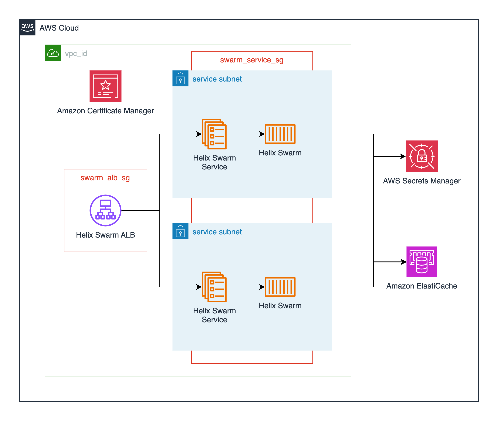

# P4 Code Review Submodule

[P4 Code Review](https://www.perforce.com/products/helix-swarm) is a free code review tool for projects hosted in [P4 Server](https://www.perforce.com/products/helix-core/aws). This module deploys P4 Code Review as a service on AWS Elastic Container Service using the [publicly available image from Dockerhub](https://hub.docker.com/r/perforce/helix-swarm).

P4 Code Review also relies on a Redis cache. The module provisions a single node AWS Elasticache Redis OSS cluster and configures connectivity for the P4 Code Review service.

This module deploys the following resources:

- An Elastic Container Service (ECS) cluster backed by AWS Fargate. This can also be created externally and passed in via the `cluster_name` variable.
- An ECS service running the latest P4 Code Review container ([perforce/helix-swarm](https://hub.docker.com/r/perforce/helix-swarm)) available.
- An Application Load Balancer for TLS termination of the P4 Code Review service.
- A single node [AWS Elasticache Redis OSS](https://aws.amazon.com/elasticache/redis/) cluster.
- Supporting resources such as Cloudwatch log groups, IAM roles, and security groups.

## Architecture


## Prerequisites

P4 Code Review needs to be able to connect to a P4 Server. P4 Code Review leverages the same authentication mechanism as P4 Server, and needs to install required plugins on the upstream P4 Server instance during setup. This happens automatically, but P4 Code Review requires an administrative user's credentials to be able to initially connect. These credentials are provided to the module through variables specifying AWS Secrets Manager secrets, and then pulled into the P4 Code Review container during startup. See the `p4d_super_user_arn`, `p4d_super_user_password_arn`, `p4d_swarm_user_arn`, and `p4d_swarm_password_arn` variables below for more details.

The [P4 Server submodule](../p4-server/README.md) creates an administrative user on initial deployment, and stores the credentials in AWS Secrets manager. The ARN of the credentials secret is then made available as a Terraform output from the module, and can be referenced elsewhere. The is done by default by the parent Perforce module.

Should you need to manually create the administrative user secret the following AWS CLI command may prove useful:

```bash
aws secretsmanager create-secret \
    --name P4CodeReviewSuperUser \
    --description "P4 Code Review Super User" \
    --secret-string "{\"username\":\"swarm\",\"password\":\"EXAMPLE-PASSWORD\"}"
```

You can then provide these credentials as variables when you define the P4 Code Review module in your Terraform configurations (the parent Perforce module does this for you):

```hcl
module "p4_code_review" {
    source = "modules/perforce/modules/p4-code-review"
    ...
    p4d_super_user_arn = "arn:aws:secretsmanager:<your-aws-region>:<your-aws-account-id>:secret:P4CodeReviewSuperUser-a1b2c3:username::"
    p4d_super_user_password_arn = "arn:aws:secretsmanager:<your-aws-region>:<your-aws-account-id>:secret:P4CodeReviewSuperUser-a1b2c3:password::"
}
```

<!-- BEGIN_TF_DOCS -->
## Requirements

| Name | Version |
|------|---------|
| <a name="requirement_terraform"></a> [terraform](#requirement\_terraform) | >= 1.0 |
| <a name="requirement_aws"></a> [aws](#requirement\_aws) | 6.6.0 |
| <a name="requirement_random"></a> [random](#requirement\_random) | 3.7.2 |

## Providers

| Name | Version |
|------|---------|
| <a name="provider_aws"></a> [aws](#provider\_aws) | 6.6.0 |
| <a name="provider_random"></a> [random](#provider\_random) | 3.7.2 |

## Modules

No modules.

## Resources

| Name | Type |
|------|------|
| [aws_cloudwatch_log_group.log_group](https://registry.terraform.io/providers/hashicorp/aws/6.6.0/docs/resources/cloudwatch_log_group) | resource |
| [aws_cloudwatch_log_group.redis_service_log_group](https://registry.terraform.io/providers/hashicorp/aws/6.6.0/docs/resources/cloudwatch_log_group) | resource |
| [aws_ecs_cluster.cluster](https://registry.terraform.io/providers/hashicorp/aws/6.6.0/docs/resources/ecs_cluster) | resource |
| [aws_ecs_cluster_capacity_providers.cluster_fargate_providers](https://registry.terraform.io/providers/hashicorp/aws/6.6.0/docs/resources/ecs_cluster_capacity_providers) | resource |
| [aws_ecs_service.service](https://registry.terraform.io/providers/hashicorp/aws/6.6.0/docs/resources/ecs_service) | resource |
| [aws_ecs_task_definition.task_definition](https://registry.terraform.io/providers/hashicorp/aws/6.6.0/docs/resources/ecs_task_definition) | resource |
| [aws_elasticache_cluster.cluster](https://registry.terraform.io/providers/hashicorp/aws/6.6.0/docs/resources/elasticache_cluster) | resource |
| [aws_elasticache_subnet_group.subnet_group](https://registry.terraform.io/providers/hashicorp/aws/6.6.0/docs/resources/elasticache_subnet_group) | resource |
| [aws_iam_policy.default_policy](https://registry.terraform.io/providers/hashicorp/aws/6.6.0/docs/resources/iam_policy) | resource |
| [aws_iam_policy.secrets_manager_policy](https://registry.terraform.io/providers/hashicorp/aws/6.6.0/docs/resources/iam_policy) | resource |
| [aws_iam_role.default_role](https://registry.terraform.io/providers/hashicorp/aws/6.6.0/docs/resources/iam_role) | resource |
| [aws_iam_role.task_execution_role](https://registry.terraform.io/providers/hashicorp/aws/6.6.0/docs/resources/iam_role) | resource |
| [aws_iam_role_policy_attachment.default_role](https://registry.terraform.io/providers/hashicorp/aws/6.6.0/docs/resources/iam_role_policy_attachment) | resource |
| [aws_iam_role_policy_attachment.p4_auth_task_execution_role_ecs](https://registry.terraform.io/providers/hashicorp/aws/6.6.0/docs/resources/iam_role_policy_attachment) | resource |
| [aws_iam_role_policy_attachment.p4_auth_task_execution_role_secrets_manager](https://registry.terraform.io/providers/hashicorp/aws/6.6.0/docs/resources/iam_role_policy_attachment) | resource |
| [aws_lb.alb](https://registry.terraform.io/providers/hashicorp/aws/6.6.0/docs/resources/lb) | resource |
| [aws_lb_listener.alb_https_listener](https://registry.terraform.io/providers/hashicorp/aws/6.6.0/docs/resources/lb_listener) | resource |
| [aws_lb_target_group.alb_target_group](https://registry.terraform.io/providers/hashicorp/aws/6.6.0/docs/resources/lb_target_group) | resource |
| [aws_s3_bucket.alb_access_logs_bucket](https://registry.terraform.io/providers/hashicorp/aws/6.6.0/docs/resources/s3_bucket) | resource |
| [aws_s3_bucket_lifecycle_configuration.access_logs_bucket_lifecycle_configuration](https://registry.terraform.io/providers/hashicorp/aws/6.6.0/docs/resources/s3_bucket_lifecycle_configuration) | resource |
| [aws_s3_bucket_policy.alb_access_logs_bucket_policy](https://registry.terraform.io/providers/hashicorp/aws/6.6.0/docs/resources/s3_bucket_policy) | resource |
| [aws_s3_bucket_public_access_block.access_logs_bucket_public_block](https://registry.terraform.io/providers/hashicorp/aws/6.6.0/docs/resources/s3_bucket_public_access_block) | resource |
| [aws_security_group.alb](https://registry.terraform.io/providers/hashicorp/aws/6.6.0/docs/resources/security_group) | resource |
| [aws_security_group.ecs_service](https://registry.terraform.io/providers/hashicorp/aws/6.6.0/docs/resources/security_group) | resource |
| [aws_security_group.elasticache](https://registry.terraform.io/providers/hashicorp/aws/6.6.0/docs/resources/security_group) | resource |
| [aws_vpc_security_group_egress_rule.alb_outbound_to_ecs_service](https://registry.terraform.io/providers/hashicorp/aws/6.6.0/docs/resources/vpc_security_group_egress_rule) | resource |
| [aws_vpc_security_group_egress_rule.ecs_service_outbound_to_internet_ipv4](https://registry.terraform.io/providers/hashicorp/aws/6.6.0/docs/resources/vpc_security_group_egress_rule) | resource |
| [aws_vpc_security_group_egress_rule.ecs_service_outbound_to_internet_ipv6](https://registry.terraform.io/providers/hashicorp/aws/6.6.0/docs/resources/vpc_security_group_egress_rule) | resource |
| [aws_vpc_security_group_ingress_rule.ecs_service_inbound_alb](https://registry.terraform.io/providers/hashicorp/aws/6.6.0/docs/resources/vpc_security_group_ingress_rule) | resource |
| [aws_vpc_security_group_ingress_rule.elasticache_inbound_from_ecs_service](https://registry.terraform.io/providers/hashicorp/aws/6.6.0/docs/resources/vpc_security_group_ingress_rule) | resource |
| [random_string.alb_access_logs_bucket_suffix](https://registry.terraform.io/providers/hashicorp/random/3.7.2/docs/resources/string) | resource |
| [random_string.p4_code_review](https://registry.terraform.io/providers/hashicorp/random/3.7.2/docs/resources/string) | resource |
| [aws_ecs_cluster.cluster](https://registry.terraform.io/providers/hashicorp/aws/6.6.0/docs/data-sources/ecs_cluster) | data source |
| [aws_elb_service_account.main](https://registry.terraform.io/providers/hashicorp/aws/6.6.0/docs/data-sources/elb_service_account) | data source |
| [aws_iam_policy_document.access_logs_bucket_alb_write](https://registry.terraform.io/providers/hashicorp/aws/6.6.0/docs/data-sources/iam_policy_document) | data source |
| [aws_iam_policy_document.default_policy](https://registry.terraform.io/providers/hashicorp/aws/6.6.0/docs/data-sources/iam_policy_document) | data source |
| [aws_iam_policy_document.ecs_tasks_trust_relationship](https://registry.terraform.io/providers/hashicorp/aws/6.6.0/docs/data-sources/iam_policy_document) | data source |
| [aws_iam_policy_document.secrets_manager_policy](https://registry.terraform.io/providers/hashicorp/aws/6.6.0/docs/data-sources/iam_policy_document) | data source |
| [aws_region.current](https://registry.terraform.io/providers/hashicorp/aws/6.6.0/docs/data-sources/region) | data source |

## Inputs

| Name | Description | Type | Default | Required |
|------|-------------|------|---------|:--------:|
| <a name="input_alb_access_logs_bucket"></a> [alb\_access\_logs\_bucket](#input\_alb\_access\_logs\_bucket) | ID of the S3 bucket for P4 Code Review ALB access log storage. If access logging is enabled and this is null the module creates a bucket. | `string` | `null` | no |
| <a name="input_alb_access_logs_prefix"></a> [alb\_access\_logs\_prefix](#input\_alb\_access\_logs\_prefix) | Log prefix for P4 Code Review ALB access logs. If null the project prefix and module name are used. | `string` | `null` | no |
| <a name="input_alb_subnets"></a> [alb\_subnets](#input\_alb\_subnets) | A list of subnets to deploy the load balancer into. Public subnets are recommended. | `list(string)` | `[]` | no |
| <a name="input_application_load_balancer_name"></a> [application\_load\_balancer\_name](#input\_application\_load\_balancer\_name) | The name of the P4 Code Review ALB. Defaults to the project prefix and module name. | `string` | `null` | no |
| <a name="input_certificate_arn"></a> [certificate\_arn](#input\_certificate\_arn) | The TLS certificate ARN for the P4 Code Review service load balancer. | `string` | `null` | no |
| <a name="input_cloudwatch_log_retention_in_days"></a> [cloudwatch\_log\_retention\_in\_days](#input\_cloudwatch\_log\_retention\_in\_days) | The log retention in days of the cloudwatch log group for P4 Code Review. | `string` | `365` | no |
| <a name="input_cluster_name"></a> [cluster\_name](#input\_cluster\_name) | The name of the cluster to deploy the P4 Code Review service into. Defaults to null and a cluster will be created. | `string` | `null` | no |
| <a name="input_container_cpu"></a> [container\_cpu](#input\_container\_cpu) | The CPU allotment for the P4 Code Review container. | `number` | `1024` | no |
| <a name="input_container_memory"></a> [container\_memory](#input\_container\_memory) | The memory allotment for the P4 Code Review container. | `number` | `2048` | no |
| <a name="input_container_name"></a> [container\_name](#input\_container\_name) | The name of the P4 Code Review container. | `string` | `"p4-code-review-container"` | no |
| <a name="input_container_port"></a> [container\_port](#input\_container\_port) | The container port that P4 Code Review runs on. | `number` | `80` | no |
| <a name="input_create_application_load_balancer"></a> [create\_application\_load\_balancer](#input\_create\_application\_load\_balancer) | This flag controls the creation of an application load balancer as part of the module. | `bool` | `true` | no |
| <a name="input_create_default_role"></a> [create\_default\_role](#input\_create\_default\_role) | Optional creation of P4 Code Review Default IAM Role. Default is set to true. | `bool` | `true` | no |
| <a name="input_custom_role"></a> [custom\_role](#input\_custom\_role) | ARN of the custom IAM Role you wish to use with P4 Code Review. | `string` | `null` | no |
| <a name="input_debug"></a> [debug](#input\_debug) | Debug flag to enable execute command on service for container access. | `bool` | `false` | no |
| <a name="input_deregistration_delay"></a> [deregistration\_delay](#input\_deregistration\_delay) | The amount of time to wait for in-flight requests to complete while deregistering a target. The range is 0-3600 seconds. | `number` | `30` | no |
| <a name="input_elasticache_node_count"></a> [elasticache\_node\_count](#input\_elasticache\_node\_count) | Number of cache nodes to provision in the Elasticache cluster. | `number` | `1` | no |
| <a name="input_elasticache_node_type"></a> [elasticache\_node\_type](#input\_elasticache\_node\_type) | The type of nodes provisioned in the Elasticache cluster. | `string` | `"cache.t4g.micro"` | no |
| <a name="input_enable_alb_access_logs"></a> [enable\_alb\_access\_logs](#input\_enable\_alb\_access\_logs) | Enables access logging for the P4 Code Review ALB. Defaults to false. | `bool` | `false` | no |
| <a name="input_enable_alb_deletion_protection"></a> [enable\_alb\_deletion\_protection](#input\_enable\_alb\_deletion\_protection) | Enables deletion protection for the P4 Code Review ALB. Defaults to true. | `bool` | `false` | no |
| <a name="input_enable_sso"></a> [enable\_sso](#input\_enable\_sso) | Set this to true if using SSO for P4 Code Review authentication. | `bool` | `false` | no |
| <a name="input_existing_redis_connection"></a> [existing\_redis\_connection](#input\_existing\_redis\_connection) | The connection specifications to use for an existing Redis deployment. | <pre>object({<br/>    host = string<br/>    port = number<br/>  })</pre> | `null` | no |
| <a name="input_existing_security_groups"></a> [existing\_security\_groups](#input\_existing\_security\_groups) | A list of existing security group IDs to attach to the P4 Code Review load balancer. | `list(string)` | `[]` | no |
| <a name="input_fully_qualified_domain_name"></a> [fully\_qualified\_domain\_name](#input\_fully\_qualified\_domain\_name) | The fully qualified domain name that P4 Code Review should use for internal URLs. | `string` | `null` | no |
| <a name="input_internal"></a> [internal](#input\_internal) | Set this flag to true if you do not want the P4 Code Review service load balancer to have a public IP. | `bool` | `false` | no |
| <a name="input_name"></a> [name](#input\_name) | The name attached to P4 Code Review module resources. | `string` | `"p4-code-review"` | no |
| <a name="input_p4_code_review_user_password_secret_arn"></a> [p4\_code\_review\_user\_password\_secret\_arn](#input\_p4\_code\_review\_user\_password\_secret\_arn) | Optionally provide the ARN of an AWS Secret for the p4d P4 Code Review password. | `string` | n/a | yes |
| <a name="input_p4_code_review_user_username_secret_arn"></a> [p4\_code\_review\_user\_username\_secret\_arn](#input\_p4\_code\_review\_user\_username\_secret\_arn) | Optionally provide the ARN of an AWS Secret for the p4d P4 Code Review username. | `string` | n/a | yes |
| <a name="input_p4charset"></a> [p4charset](#input\_p4charset) | The P4CHARSET environment variable to set in the P4 Code Review container. | `string` | `"none"` | no |
| <a name="input_p4d_port"></a> [p4d\_port](#input\_p4d\_port) | The P4D\_PORT environment variable where P4 Code Review should look for P4 Code Review. Defaults to 'ssl:perforce:1666' | `string` | `"ssl:perforce:1666"` | no |
| <a name="input_project_prefix"></a> [project\_prefix](#input\_project\_prefix) | The project prefix for this workload. This is appended to the beginning of most resource names. | `string` | `"cgd"` | no |
| <a name="input_s3_enable_force_destroy"></a> [s3\_enable\_force\_destroy](#input\_s3\_enable\_force\_destroy) | Enables force destroy for the S3 bucket for P4 Code Review access log storage. Defaults to true. | `bool` | `true` | no |
| <a name="input_subnets"></a> [subnets](#input\_subnets) | A list of subnets to deploy the P4 Code Review ECS Service into. Private subnets are recommended. | `list(string)` | n/a | yes |
| <a name="input_super_user_password_secret_arn"></a> [super\_user\_password\_secret\_arn](#input\_super\_user\_password\_secret\_arn) | Optionally provide the ARN of an AWS Secret for the p4d super user password. | `string` | n/a | yes |
| <a name="input_super_user_username_secret_arn"></a> [super\_user\_username\_secret\_arn](#input\_super\_user\_username\_secret\_arn) | Optionally provide the ARN of an AWS Secret for the p4d super user username. | `string` | n/a | yes |
| <a name="input_tags"></a> [tags](#input\_tags) | Tags to apply to resources. | `map(any)` | <pre>{<br/>  "IaC": "Terraform",<br/>  "ModuleBy": "CGD-Toolkit",<br/>  "ModuleName": "p4-code-review",<br/>  "ModuleSource": "https://github.com/aws-games/cloud-game-development-toolkit/tree/main/modules/perforce/terraform-aws-perforce",<br/>  "RootModuleName": "terraform-aws-perforce"<br/>}</pre> | no |
| <a name="input_vpc_id"></a> [vpc\_id](#input\_vpc\_id) | The ID of the existing VPC you would like to deploy P4 Code Review into. | `string` | n/a | yes |

## Outputs

| Name | Description |
|------|-------------|
| <a name="output_alb_dns_name"></a> [alb\_dns\_name](#output\_alb\_dns\_name) | The DNS name of the P4 Code Review ALB |
| <a name="output_alb_security_group_id"></a> [alb\_security\_group\_id](#output\_alb\_security\_group\_id) | Security group associated with the P4 Code Review load balancer |
| <a name="output_alb_zone_id"></a> [alb\_zone\_id](#output\_alb\_zone\_id) | The hosted zone ID of the P4 Code Review ALB |
| <a name="output_cluster_name"></a> [cluster\_name](#output\_cluster\_name) | Name of the ECS cluster hosting P4 Code Review |
| <a name="output_service_security_group_id"></a> [service\_security\_group\_id](#output\_service\_security\_group\_id) | Security group associated with the ECS service running P4 Code Review |
| <a name="output_target_group_arn"></a> [target\_group\_arn](#output\_target\_group\_arn) | The service target group for P4 Code Review |
<!-- END_TF_DOCS -->
