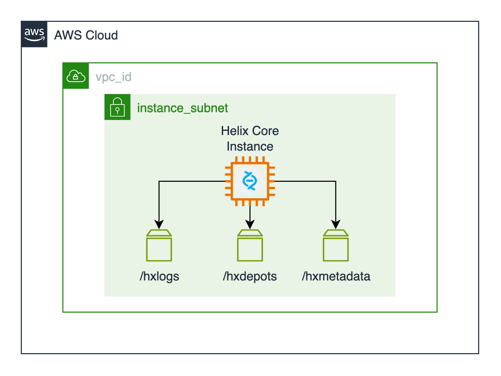

# P4 Server Submodule

[P4 Server](https://www.perforce.com/products/helix-core/aws) is a scalable version control system that helps teams manage code alongside large, digital assets and collaborate more effectively in one central, secure location. With AWS, teams can quickly deploy P4 Server and accelerate innovation.

This module provisions P4 Server on an EC2 Instance with three dedicated EBS volumes for depots, metadata, and logs. It can also be configured to automatically install the required plugins to integrate with P4Auth. This is the default option if using the parent module. This allows end users to quickly set up single-sign-on for their Perforce P4 server.

## Deployment Architecture



## Prerequisites

This module deploys P4 Server on AWS using an Amazon Machine Image (AMI) that is included in the Cloud Game Development Toolkit. You **must** provision this AMI using [Hashicorp Packer](https://www.packer.io/) prior to deploying this module. To get started consult [the documentation for the P4 Server AMI](../../../../assets/packer/perforce/p4-server/README.md).

### Optional

You can optionally define the P4 Server super user's credentials prior to deployment. To do so, create a secret for the P4 Server super user's username and password.:

```bash
aws secretsmanager create-secret \
    --name P4ServerSuperUser \
    --description "P4 Server Super User" \
    --secret-string "{\"username\":\"admin\",\"password\":\"EXAMPLE-PASSWORD\"}"
```

!!! info
**Important** When using a combined secret (e.g. `arn:aws:secretsmanager:region:account:secret:P4ServerAdmin-REDACTED`), the task execution role needs permission to access the entire secret. When using the `:username::` and `:password::` suffixes in ARNs, you're using a feature called "JSON key reference" which requires different IAM permissions.

You can then provide the relevant ARN as variables when you define the P4 Server module in your Terraform configurations:

```hcl
module "p4_server" {
    source = "modules/perforce/p4-server"
    #...additional module args
    super_user_username_arn = "arn:aws:secretsmanager:us-west-2:123456789012:secret:P4ServerSuperUser-a1b2c3:username::"
    super_user_password_arn = "arn:aws:secretsmanager:us-west-2:123456789012:secret:P4ServerSuperUser-a1b2c3:password::"
}
```

If you do not provide these the module will create a random Super User and create the secret for you. The ARN of this secret is then available as an output to be referenced elsewhere.

<!-- BEGIN_TF_DOCS -->

## Requirements

| Name                                                                              | Version |
| --------------------------------------------------------------------------------- | ------- |
| <a name="requirement_terraform"></a> [terraform](#requirement_terraform)          | >= 1.0  |
| <a name="requirement_aws"></a> [aws](#requirement_aws)                            | 5.97.0  |
| <a name="requirement_awscc"></a> [awscc](#requirement_awscc)                      | 1.34.0  |
| <a name="requirement_local"></a> [local](#requirement_local)                      | 2.5.2   |
| <a name="requirement_netapp-ontap"></a> [netapp-ontap](#requirement_netapp-ontap) | 2.1.0   |
| <a name="requirement_null"></a> [null](#requirement_null)                         | 3.2.4   |
| <a name="requirement_random"></a> [random](#requirement_random)                   | 3.7.1   |

## Providers

| Name                                                                        | Version |
| --------------------------------------------------------------------------- | ------- |
| <a name="provider_aws"></a> [aws](#provider_aws)                            | 5.89.0  |
| <a name="provider_awscc"></a> [awscc](#provider_awscc)                      | 1.34.0  |
| <a name="provider_netapp-ontap"></a> [netapp-ontap](#provider_netapp-ontap) | 2.1.0   |
| <a name="provider_random"></a> [random](#provider_random)                   | 3.7.1   |

## Modules

No modules.

## Resources

| Name                                                                                                                                                                            | Type        |
| ------------------------------------------------------------------------------------------------------------------------------------------------------------------------------- | ----------- |
| [aws_ebs_volume.depot](https://registry.terraform.io/providers/hashicorp/aws/5.97.0/docs/resources/ebs_volume)                                                                  | resource    |
| [aws_ebs_volume.logs](https://registry.terraform.io/providers/hashicorp/aws/5.97.0/docs/resources/ebs_volume)                                                                   | resource    |
| [aws_ebs_volume.metadata](https://registry.terraform.io/providers/hashicorp/aws/5.97.0/docs/resources/ebs_volume)                                                               | resource    |
| [aws_eip.server_eip](https://registry.terraform.io/providers/hashicorp/aws/5.97.0/docs/resources/eip)                                                                           | resource    |
| [aws_fsx_ontap_volume.depot](https://registry.terraform.io/providers/hashicorp/aws/5.97.0/docs/resources/fsx_ontap_volume)                                                      | resource    |
| [aws_fsx_ontap_volume.logs](https://registry.terraform.io/providers/hashicorp/aws/5.97.0/docs/resources/fsx_ontap_volume)                                                       | resource    |
| [aws_fsx_ontap_volume.metadata](https://registry.terraform.io/providers/hashicorp/aws/5.97.0/docs/resources/fsx_ontap_volume)                                                   | resource    |
| [aws_iam_instance_profile.instance_profile](https://registry.terraform.io/providers/hashicorp/aws/5.97.0/docs/resources/iam_instance_profile)                                   | resource    |
| [aws_iam_policy.default_policy](https://registry.terraform.io/providers/hashicorp/aws/5.97.0/docs/resources/iam_policy)                                                         | resource    |
| [aws_iam_role.default_role](https://registry.terraform.io/providers/hashicorp/aws/5.97.0/docs/resources/iam_role)                                                               | resource    |
| [aws_iam_role.lambda_role](https://registry.terraform.io/providers/hashicorp/aws/5.97.0/docs/resources/iam_role)                                                                | resource    |
| [aws_iam_role_policy_attachment.default_role_default_policy](https://registry.terraform.io/providers/hashicorp/aws/5.97.0/docs/resources/iam_role_policy_attachment)            | resource    |
| [aws_iam_role_policy_attachment.default_role_ssm_managed_instance_core](https://registry.terraform.io/providers/hashicorp/aws/5.97.0/docs/resources/iam_role_policy_attachment) | resource    |
| [aws_iam_role_policy_attachment.lambda_service_basic_execution_role](https://registry.terraform.io/providers/hashicorp/aws/5.97.0/docs/resources/iam_role_policy_attachment)    | resource    |
| [aws_iam_role_policy_attachment.lambda_service_role](https://registry.terraform.io/providers/hashicorp/aws/5.97.0/docs/resources/iam_role_policy_attachment)                    | resource    |
| [aws_iam_role_policy_attachment.lambda_vpc_access_role](https://registry.terraform.io/providers/hashicorp/aws/5.97.0/docs/resources/iam_role_policy_attachment)                 | resource    |
| [aws_instance.server_instance](https://registry.terraform.io/providers/hashicorp/aws/5.97.0/docs/resources/instance)                                                            | resource    |
| [aws_lambda_function.lambda_function](https://registry.terraform.io/providers/hashicorp/aws/5.97.0/docs/resources/lambda_function)                                              | resource    |
| [aws_security_group.default_security_group](https://registry.terraform.io/providers/hashicorp/aws/5.97.0/docs/resources/security_group)                                         | resource    |
| [aws_security_group.fsxn_lambda_link_security_group](https://registry.terraform.io/providers/hashicorp/aws/5.97.0/docs/resources/security_group)                                | resource    |
| [aws_volume_attachment.depot_attachment](https://registry.terraform.io/providers/hashicorp/aws/5.97.0/docs/resources/volume_attachment)                                         | resource    |
| [aws_volume_attachment.logs_attachment](https://registry.terraform.io/providers/hashicorp/aws/5.97.0/docs/resources/volume_attachment)                                          | resource    |
| [aws_volume_attachment.metadata_attachment](https://registry.terraform.io/providers/hashicorp/aws/5.97.0/docs/resources/volume_attachment)                                      | resource    |
| [aws_vpc_security_group_egress_rule.link_outbound_fsxn](https://registry.terraform.io/providers/hashicorp/aws/5.97.0/docs/resources/vpc_security_group_egress_rule)             | resource    |
| [aws_vpc_security_group_egress_rule.server_internet](https://registry.terraform.io/providers/hashicorp/aws/5.97.0/docs/resources/vpc_security_group_egress_rule)                | resource    |
| [aws_vpc_security_group_ingress_rule.fsxn_inbound_link](https://registry.terraform.io/providers/hashicorp/aws/5.97.0/docs/resources/vpc_security_group_ingress_rule)            | resource    |
| [awscc_secretsmanager_secret.super_user_password](https://registry.terraform.io/providers/hashicorp/awscc/1.34.0/docs/resources/secretsmanager_secret)                          | resource    |
| [awscc_secretsmanager_secret.super_user_username](https://registry.terraform.io/providers/hashicorp/awscc/1.34.0/docs/resources/secretsmanager_secret)                          | resource    |
| [netapp-ontap_lun.depots_volume_lun](https://registry.terraform.io/providers/NetApp/netapp-ontap/2.1.0/docs/resources/lun)                                                      | resource    |
| [netapp-ontap_lun.logs_volume_lun](https://registry.terraform.io/providers/NetApp/netapp-ontap/2.1.0/docs/resources/lun)                                                        | resource    |
| [netapp-ontap_lun.metadata_volume_lun](https://registry.terraform.io/providers/NetApp/netapp-ontap/2.1.0/docs/resources/lun)                                                    | resource    |
| [netapp-ontap_san_igroup.perforce_igroup](https://registry.terraform.io/providers/NetApp/netapp-ontap/2.1.0/docs/resources/san_igroup)                                          | resource    |
| [netapp-ontap_san_lun-map.depots_lun_map](https://registry.terraform.io/providers/NetApp/netapp-ontap/2.1.0/docs/resources/san_lun-map)                                         | resource    |
| [netapp-ontap_san_lun-map.logs_lun_map](https://registry.terraform.io/providers/NetApp/netapp-ontap/2.1.0/docs/resources/san_lun-map)                                           | resource    |
| [netapp-ontap_san_lun-map.metadata_lun_map](https://registry.terraform.io/providers/NetApp/netapp-ontap/2.1.0/docs/resources/san_lun-map)                                       | resource    |
| [random_string.p4_server](https://registry.terraform.io/providers/hashicorp/random/3.7.1/docs/resources/string)                                                                 | resource    |
| [aws_ami.existing_server_ami](https://registry.terraform.io/providers/hashicorp/aws/5.97.0/docs/data-sources/ami)                                                               | data source |
| [aws_iam_policy_document.default_policy](https://registry.terraform.io/providers/hashicorp/aws/5.97.0/docs/data-sources/iam_policy_document)                                    | data source |
| [aws_iam_policy_document.ec2_trust_relationship](https://registry.terraform.io/providers/hashicorp/aws/5.97.0/docs/data-sources/iam_policy_document)                            | data source |
| [aws_subnet.instance_subnet](https://registry.terraform.io/providers/hashicorp/aws/5.97.0/docs/data-sources/subnet)                                                             | data source |

## Inputs

| Name                                                                                                                                 | Description                                                                                                                                                                                     | Type           | Default                                                                                                                                                                                                                                                                                     | Required |
| ------------------------------------------------------------------------------------------------------------------------------------ | ----------------------------------------------------------------------------------------------------------------------------------------------------------------------------------------------- | -------------- | ------------------------------------------------------------------------------------------------------------------------------------------------------------------------------------------------------------------------------------------------------------------------------------------- | :------: |
| <a name="input_amazon_fsxn_filesystem_id"></a> [amazon_fsxn_filesystem_id](#input_amazon_fsxn_filesystem_id)                         | The ID of the existing FSx ONTAP file system to use if storage type is FSxN.                                                                                                                    | `string`       | `null`                                                                                                                                                                                                                                                                                      |    no    |
| <a name="input_amazon_fsxn_svm_id"></a> [amazon_fsxn_svm_id](#input_amazon_fsxn_svm_id)                                              | The ID of the Storage Virtual Machine (SVM) for the FSx ONTAP filesystem.                                                                                                                       | `string`       | `null`                                                                                                                                                                                                                                                                                      |    no    |
| <a name="input_auth_service_url"></a> [auth_service_url](#input_auth_service_url)                                                    | The URL for the P4Auth Service.                                                                                                                                                                 | `string`       | `null`                                                                                                                                                                                                                                                                                      |    no    |
| <a name="input_case_sensitive"></a> [case_sensitive](#input_case_sensitive)                                                          | Whether or not the server should be case insensitive (Server will run '-C1' mode), or if the server will run with case sensitivity default of the underlying platform. False enables '-C1' mode | `bool`         | `true`                                                                                                                                                                                                                                                                                      |    no    |
| <a name="input_create_default_role"></a> [create_default_role](#input_create_default_role)                                           | Optional creation of P4 Server default IAM Role with SSM managed instance core policy attached. Default is set to true.                                                                         | `bool`         | `true`                                                                                                                                                                                                                                                                                      |    no    |
| <a name="input_create_default_sg"></a> [create_default_sg](#input_create_default_sg)                                                 | Whether to create a default security group for the P4 Server instance.                                                                                                                          | `bool`         | `true`                                                                                                                                                                                                                                                                                      |    no    |
| <a name="input_custom_role"></a> [custom_role](#input_custom_role)                                                                   | ARN of the custom IAM Role you wish to use with P4 Server.                                                                                                                                      | `string`       | `null`                                                                                                                                                                                                                                                                                      |    no    |
| <a name="input_depot_volume_size"></a> [depot_volume_size](#input_depot_volume_size)                                                 | The size of the depot volume in GiB. Defaults to 128 GiB.                                                                                                                                       | `number`       | `128`                                                                                                                                                                                                                                                                                       |    no    |
| <a name="input_environment"></a> [environment](#input_environment)                                                                   | The environment attached to P4 Server module resources.                                                                                                                                         | `string`       | `"dev"`                                                                                                                                                                                                                                                                                     |    no    |
| <a name="input_existing_security_groups"></a> [existing_security_groups](#input_existing_security_groups)                            | A list of existing security group IDs to attach to the P4 Server load balancer.                                                                                                                 | `list(string)` | `[]`                                                                                                                                                                                                                                                                                        |    no    |
| <a name="input_fsxn_filesystem_security_group_id"></a> [fsxn_filesystem_security_group_id](#input_fsxn_filesystem_security_group_id) | The ID of the security group for the FSx ONTAP filesystem.                                                                                                                                      | `string`       | `null`                                                                                                                                                                                                                                                                                      |    no    |
| <a name="input_fsxn_management_ip"></a> [fsxn_management_ip](#input_fsxn_management_ip)                                              | FSxN management ip address                                                                                                                                                                      | `string`       | `null`                                                                                                                                                                                                                                                                                      |    no    |
| <a name="input_fsxn_password"></a> [fsxn_password](#input_fsxn_password)                                                             | FSxN admin user password AWS secret manager arn                                                                                                                                                 | `string`       | `null`                                                                                                                                                                                                                                                                                      |    no    |
| <a name="input_fsxn_region"></a> [fsxn_region](#input_fsxn_region)                                                                   | The ID of the Storage Virtual Machine (SVM) for the FSx ONTAP filesystem.                                                                                                                       | `string`       | `null`                                                                                                                                                                                                                                                                                      |    no    |
| <a name="input_fsxn_svm_name"></a> [fsxn_svm_name](#input_fsxn_svm_name)                                                             | FSxN storage virtual machine name                                                                                                                                                               | `string`       | `null`                                                                                                                                                                                                                                                                                      |    no    |
| <a name="input_fully_qualified_domain_name"></a> [fully_qualified_domain_name](#input_fully_qualified_domain_name)                   | The fully qualified domain name where P4 Server will be available. This is used to generate self-signed certificates on the P4 Server.                                                          | `string`       | `null`                                                                                                                                                                                                                                                                                      |    no    |
| <a name="input_instance_architecture"></a> [instance_architecture](#input_instance_architecture)                                     | The architecture of the P4 Server instance. Allowed values are 'arm64' or 'x86_64'.                                                                                                             | `string`       | `"x86_64"`                                                                                                                                                                                                                                                                                  |    no    |
| <a name="input_instance_subnet_id"></a> [instance_subnet_id](#input_instance_subnet_id)                                              | The subnet where the P4 Server instance will be deployed.                                                                                                                                       | `string`       | n/a                                                                                                                                                                                                                                                                                         |   yes    |
| <a name="input_instance_type"></a> [instance_type](#input_instance_type)                                                             | The instance type for Perforce P4 Server. Defaults to c6g.large.                                                                                                                                | `string`       | `"c6i.large"`                                                                                                                                                                                                                                                                               |    no    |
| <a name="input_internal"></a> [internal](#input_internal)                                                                            | Set this flag to true if you do not want the P4 Server instance to have a public IP.                                                                                                            | `bool`         | `false`                                                                                                                                                                                                                                                                                     |    no    |
| <a name="input_logs_volume_size"></a> [logs_volume_size](#input_logs_volume_size)                                                    | The size of the logs volume in GiB. Defaults to 32 GiB.                                                                                                                                         | `number`       | `32`                                                                                                                                                                                                                                                                                        |    no    |
| <a name="input_metadata_volume_size"></a> [metadata_volume_size](#input_metadata_volume_size)                                        | The size of the metadata volume in GiB. Defaults to 32 GiB.                                                                                                                                     | `number`       | `32`                                                                                                                                                                                                                                                                                        |    no    |
| <a name="input_name"></a> [name](#input_name)                                                                                        | The name attached to P4 Server module resources.                                                                                                                                                | `string`       | `"p4-server"`                                                                                                                                                                                                                                                                               |    no    |
| <a name="input_p4_server_type"></a> [p4_server_type](#input_p4_server_type)                                                          | The Perforce P4 Server type.                                                                                                                                                                    | `string`       | n/a                                                                                                                                                                                                                                                                                         |   yes    |
| <a name="input_plaintext"></a> [plaintext](#input_plaintext)                                                                         | Whether to enable plaintext authentication for P4 Server. This is not recommended for production environments unless you are using a load balancer for TLS termination.                         | `bool`         | `false`                                                                                                                                                                                                                                                                                     |    no    |
| <a name="input_project_prefix"></a> [project_prefix](#input_project_prefix)                                                          | The project prefix for this workload. This is appended to the beginning of most resource names.                                                                                                 | `string`       | `"cgd"`                                                                                                                                                                                                                                                                                     |    no    |
| <a name="input_protocol"></a> [protocol](#input_protocol)                                                                            | Specify the protocol (NFS or ISCSI)                                                                                                                                                             | `string`       | `null`                                                                                                                                                                                                                                                                                      |    no    |
| <a name="input_selinux"></a> [selinux](#input_selinux)                                                                               | Whether to apply SELinux label updates for P4 Server. Don't enable this if SELinux is disabled on your target operating system.                                                                 | `bool`         | `false`                                                                                                                                                                                                                                                                                     |    no    |
| <a name="input_storage_type"></a> [storage_type](#input_storage_type)                                                                | The type of backing store [EBS, FSxN]                                                                                                                                                           | `string`       | n/a                                                                                                                                                                                                                                                                                         |   yes    |
| <a name="input_super_user_password_secret_arn"></a> [super_user_password_secret_arn](#input_super_user_password_secret_arn)          | If you would like to manage your own super user credentials through AWS Secrets Manager provide the ARN for the super user's username here. Otherwise, the default of 'perforce' will be used.  | `string`       | `null`                                                                                                                                                                                                                                                                                      |    no    |
| <a name="input_super_user_username_secret_arn"></a> [super_user_username_secret_arn](#input_super_user_username_secret_arn)          | If you would like to manage your own super user credentials through AWS Secrets Manager provide the ARN for the super user's password here.                                                     | `string`       | `null`                                                                                                                                                                                                                                                                                      |    no    |
| <a name="input_tags"></a> [tags](#input_tags)                                                                                        | Tags to apply to resources.                                                                                                                                                                     | `map(any)`     | <pre>{<br> "IaC": "Terraform",<br> "ModuleBy": "CGD-Toolkit",<br> "ModuleName": "p4-server",<br> "ModuleSource": "https://github.com/aws-games/cloud-game-development-toolkit/tree/main/modules/perforce/terraform-aws-perforce",<br> "RootModuleName": "terraform-aws-perforce"<br>}</pre> |    no    |
| <a name="input_unicode"></a> [unicode](#input_unicode)                                                                               | Whether to enable Unicode configuration for P4 Server the -xi flag for p4d. Set to true to enable Unicode support.                                                                              | `bool`         | `false`                                                                                                                                                                                                                                                                                     |    no    |
| <a name="input_vpc_id"></a> [vpc_id](#input_vpc_id)                                                                                  | The VPC where P4 Server should be deployed                                                                                                                                                      | `string`       | n/a                                                                                                                                                                                                                                                                                         |   yes    |

## Outputs

| Name                                                                                                                          | Description                                                                             |
| ----------------------------------------------------------------------------------------------------------------------------- | --------------------------------------------------------------------------------------- |
| <a name="output_eip_id"></a> [eip_id](#output_eip_id)                                                                         | The ID of the Elastic IP associated with your P4 Server instance.                       |
| <a name="output_eip_public_ip"></a> [eip_public_ip](#output_eip_public_ip)                                                    | The public IP of your P4 Server instance.                                               |
| <a name="output_instance_id"></a> [instance_id](#output_instance_id)                                                          | Instance ID for the P4 Server instance                                                  |
| <a name="output_lambda_link_name"></a> [lambda_link_name](#output_lambda_link_name)                                           | Lambda function name for the FSxN Link                                                  |
| <a name="output_private_ip"></a> [private_ip](#output_private_ip)                                                             | Private IP for the P4 Server instance                                                   |
| <a name="output_security_group_id"></a> [security_group_id](#output_security_group_id)                                        | The default security group of your P4 Server instance.                                  |
| <a name="output_super_user_password_secret_arn"></a> [super_user_password_secret_arn](#output_super_user_password_secret_arn) | The ARN of the AWS Secrets Manager secret holding your P4 Server super user's username. |
| <a name="output_super_user_username_secret_arn"></a> [super_user_username_secret_arn](#output_super_user_username_secret_arn) | The ARN of the AWS Secrets Manager secret holding your P4 Server super user's password. |

<!-- END_TF_DOCS -->
