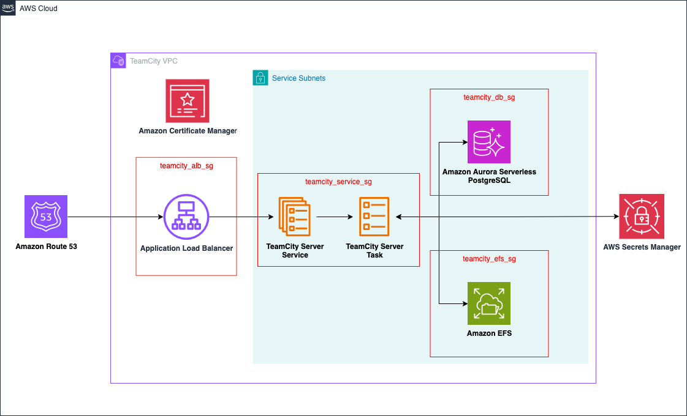

# TeamCity Module

[TeamCity](https://www.jetbrains.com/teamcity/) is a user-friendly continuous integration (CI) server for developers and build engineers created by JetBrains. This module deploys a TeamCity server on [AWS Elastic Container Service](https://aws.amazon.com/ecs/).

The TeamCity server relies on shared file system for persistent storage of configuration, build results, and current operation files as well as a SQL database to store build history, user data, build results, and runtime data. This module provides these services by provisioning an [Amazon Elastic File System](https://aws.amazon.com/efs/) and an [Amazon Amazon Aurora Serverless V2](https://aws.amazon.com/rds/aurora/serverless/) cluster running the PostgreSQL engine.

## Deployment Architecture

## Examples

For example configurations, please see the [examples](https://github.com/aws-games/cloud-game-development-toolkit/tree/main/modules/teamcity/examples).

<!-- TODO -->
<!-- ## Deployment Instructions -->

<!-- BEGIN_TF_DOCS -->
## Requirements

| Name | Version |
|------|---------|
|  [terraform](#requirement\_terraform) | >= 1.9 |
|  [aws](#requirement\_aws) | 6.6.0 |
|  [random](#requirement\_random) | 3.7.2 |

## Providers

| Name | Version |
|------|---------|
|  [aws](#provider\_aws) | 6.6.0 |
|  [random](#provider\_random) | 3.7.2 |

## Modules

No modules.

## Resources

| Name | Type |
|------|------|
| [aws_cloudwatch_log_group.teamcity_agent](https://registry.terraform.io/providers/hashicorp/aws/6.6.0/docs/resources/cloudwatch_log_group) | resource |
| [aws_cloudwatch_log_group.teamcity_log_group](https://registry.terraform.io/providers/hashicorp/aws/6.6.0/docs/resources/cloudwatch_log_group) | resource |
| [aws_db_subnet_group.teamcity_db_subnet_group](https://registry.terraform.io/providers/hashicorp/aws/6.6.0/docs/resources/db_subnet_group) | resource |
| [aws_ecs_cluster.teamcity_cluster](https://registry.terraform.io/providers/hashicorp/aws/6.6.0/docs/resources/ecs_cluster) | resource |
| [aws_ecs_service.teamcity](https://registry.terraform.io/providers/hashicorp/aws/6.6.0/docs/resources/ecs_service) | resource |
| [aws_ecs_service.teamcity_agent](https://registry.terraform.io/providers/hashicorp/aws/6.6.0/docs/resources/ecs_service) | resource |
| [aws_ecs_task_definition.teamcity_agent](https://registry.terraform.io/providers/hashicorp/aws/6.6.0/docs/resources/ecs_task_definition) | resource |
| [aws_ecs_task_definition.teamcity_task_definition](https://registry.terraform.io/providers/hashicorp/aws/6.6.0/docs/resources/ecs_task_definition) | resource |
| [aws_efs_access_point.teamcity_efs_data_access_point](https://registry.terraform.io/providers/hashicorp/aws/6.6.0/docs/resources/efs_access_point) | resource |
| [aws_efs_file_system.teamcity_efs_file_system](https://registry.terraform.io/providers/hashicorp/aws/6.6.0/docs/resources/efs_file_system) | resource |
| [aws_efs_mount_target.teamcity_efs_mount_target](https://registry.terraform.io/providers/hashicorp/aws/6.6.0/docs/resources/efs_mount_target) | resource |
| [aws_iam_policy.teamcity_agent_default_policy](https://registry.terraform.io/providers/hashicorp/aws/6.6.0/docs/resources/iam_policy) | resource |
| [aws_iam_policy.teamcity_default_policy](https://registry.terraform.io/providers/hashicorp/aws/6.6.0/docs/resources/iam_policy) | resource |
| [aws_iam_policy.teamcity_execution_database_policy](https://registry.terraform.io/providers/hashicorp/aws/6.6.0/docs/resources/iam_policy) | resource |
| [aws_iam_role.teamcity_agent_default_role](https://registry.terraform.io/providers/hashicorp/aws/6.6.0/docs/resources/iam_role) | resource |
| [aws_iam_role.teamcity_agent_task_execution_role](https://registry.terraform.io/providers/hashicorp/aws/6.6.0/docs/resources/iam_role) | resource |
| [aws_iam_role.teamcity_default_role](https://registry.terraform.io/providers/hashicorp/aws/6.6.0/docs/resources/iam_role) | resource |
| [aws_iam_role.teamcity_task_execution_role](https://registry.terraform.io/providers/hashicorp/aws/6.6.0/docs/resources/iam_role) | resource |
| [aws_iam_role_policy_attachment.teamcity_agent_default_role_policy_attachment](https://registry.terraform.io/providers/hashicorp/aws/6.6.0/docs/resources/iam_role_policy_attachment) | resource |
| [aws_iam_role_policy_attachment.teamcity_agent_task_execution_default_policy](https://registry.terraform.io/providers/hashicorp/aws/6.6.0/docs/resources/iam_role_policy_attachment) | resource |
| [aws_iam_role_policy_attachment.teamcity_default_role](https://registry.terraform.io/providers/hashicorp/aws/6.6.0/docs/resources/iam_role_policy_attachment) | resource |
| [aws_iam_role_policy_attachment.teamcity_task_execution_database_policy](https://registry.terraform.io/providers/hashicorp/aws/6.6.0/docs/resources/iam_role_policy_attachment) | resource |
| [aws_iam_role_policy_attachment.teamcity_task_execution_default_policy](https://registry.terraform.io/providers/hashicorp/aws/6.6.0/docs/resources/iam_role_policy_attachment) | resource |
| [aws_lb.teamcity_external_lb](https://registry.terraform.io/providers/hashicorp/aws/6.6.0/docs/resources/lb) | resource |
| [aws_lb_listener.teamcity_listener](https://registry.terraform.io/providers/hashicorp/aws/6.6.0/docs/resources/lb_listener) | resource |
| [aws_lb_target_group.teamcity_target_group](https://registry.terraform.io/providers/hashicorp/aws/6.6.0/docs/resources/lb_target_group) | resource |
| [aws_rds_cluster.teamcity_db_cluster](https://registry.terraform.io/providers/hashicorp/aws/6.6.0/docs/resources/rds_cluster) | resource |
| [aws_rds_cluster_instance.teamcity_db_cluster_instance](https://registry.terraform.io/providers/hashicorp/aws/6.6.0/docs/resources/rds_cluster_instance) | resource |
| [aws_s3_bucket.teamcity_alb_access_logs_bucket](https://registry.terraform.io/providers/hashicorp/aws/6.6.0/docs/resources/s3_bucket) | resource |
| [aws_s3_bucket_lifecycle_configuration.access_logs_bucket_lifecycle_configuration](https://registry.terraform.io/providers/hashicorp/aws/6.6.0/docs/resources/s3_bucket_lifecycle_configuration) | resource |
| [aws_s3_bucket_policy.alb_access_logs_bucket_policy](https://registry.terraform.io/providers/hashicorp/aws/6.6.0/docs/resources/s3_bucket_policy) | resource |
| [aws_s3_bucket_public_access_block.access_logs_bucket_public_block](https://registry.terraform.io/providers/hashicorp/aws/6.6.0/docs/resources/s3_bucket_public_access_block) | resource |
| [aws_security_group.teamcity_agent_sg](https://registry.terraform.io/providers/hashicorp/aws/6.6.0/docs/resources/security_group) | resource |
| [aws_security_group.teamcity_alb_sg](https://registry.terraform.io/providers/hashicorp/aws/6.6.0/docs/resources/security_group) | resource |
| [aws_security_group.teamcity_db_sg](https://registry.terraform.io/providers/hashicorp/aws/6.6.0/docs/resources/security_group) | resource |
| [aws_security_group.teamcity_efs_sg](https://registry.terraform.io/providers/hashicorp/aws/6.6.0/docs/resources/security_group) | resource |
| [aws_security_group.teamcity_service_sg](https://registry.terraform.io/providers/hashicorp/aws/6.6.0/docs/resources/security_group) | resource |
| [aws_service_discovery_http_namespace.teamcity](https://registry.terraform.io/providers/hashicorp/aws/6.6.0/docs/resources/service_discovery_http_namespace) | resource |
| [aws_vpc_security_group_egress_rule.alb_outbound_service](https://registry.terraform.io/providers/hashicorp/aws/6.6.0/docs/resources/vpc_security_group_egress_rule) | resource |
| [aws_vpc_security_group_egress_rule.service_outbound_internet](https://registry.terraform.io/providers/hashicorp/aws/6.6.0/docs/resources/vpc_security_group_egress_rule) | resource |
| [aws_vpc_security_group_egress_rule.teamcity_agent_outbound](https://registry.terraform.io/providers/hashicorp/aws/6.6.0/docs/resources/vpc_security_group_egress_rule) | resource |
| [aws_vpc_security_group_ingress_rule.service_db](https://registry.terraform.io/providers/hashicorp/aws/6.6.0/docs/resources/vpc_security_group_ingress_rule) | resource |
| [aws_vpc_security_group_ingress_rule.service_efs](https://registry.terraform.io/providers/hashicorp/aws/6.6.0/docs/resources/vpc_security_group_ingress_rule) | resource |
| [aws_vpc_security_group_ingress_rule.service_inbound_alb](https://registry.terraform.io/providers/hashicorp/aws/6.6.0/docs/resources/vpc_security_group_ingress_rule) | resource |
| [aws_vpc_security_group_ingress_rule.teamcity_agent_inbound](https://registry.terraform.io/providers/hashicorp/aws/6.6.0/docs/resources/vpc_security_group_ingress_rule) | resource |
| [random_string.teamcity_alb_access_logs_bucket_suffix](https://registry.terraform.io/providers/hashicorp/random/3.7.2/docs/resources/string) | resource |
| [aws_ecs_cluster.teamcity_cluster](https://registry.terraform.io/providers/hashicorp/aws/6.6.0/docs/data-sources/ecs_cluster) | data source |
| [aws_efs_file_system.efs_file_system](https://registry.terraform.io/providers/hashicorp/aws/6.6.0/docs/data-sources/efs_file_system) | data source |
| [aws_elb_service_account.main](https://registry.terraform.io/providers/hashicorp/aws/6.6.0/docs/data-sources/elb_service_account) | data source |
| [aws_iam_policy_document.access_logs_bucket_alb_write](https://registry.terraform.io/providers/hashicorp/aws/6.6.0/docs/data-sources/iam_policy_document) | data source |
| [aws_iam_policy_document.ecs_tasks_trust_relationship](https://registry.terraform.io/providers/hashicorp/aws/6.6.0/docs/data-sources/iam_policy_document) | data source |
| [aws_iam_policy_document.teamcity_agent_default_policy](https://registry.terraform.io/providers/hashicorp/aws/6.6.0/docs/data-sources/iam_policy_document) | data source |
| [aws_iam_policy_document.teamcity_default_policy](https://registry.terraform.io/providers/hashicorp/aws/6.6.0/docs/data-sources/iam_policy_document) | data source |
| [aws_iam_policy_document.teamcity_execution_database_policy](https://registry.terraform.io/providers/hashicorp/aws/6.6.0/docs/data-sources/iam_policy_document) | data source |
| [aws_region.current](https://registry.terraform.io/providers/hashicorp/aws/6.6.0/docs/data-sources/region) | data source |

## Inputs

| Name | Description | Type | Default | Required |
|------|-------------|------|---------|:--------:|
|  [agent\_log\_group\_retention\_in\_days](#input\_agent\_log\_group\_retention\_in\_days) | n/a | `number` | `7` | no |
|  [alb\_certificate\_arn](#input\_alb\_certificate\_arn) | The ARN of the SSL certificate to use for the ALB | `string` | `null` | no |
|  [alb\_subnets](#input\_alb\_subnets) | The subnets in which the ALB will be deployed | `list(string)` | `[]` | no |
|  [aurora\_instance\_count](#input\_aurora\_instance\_count) | Number of instances to provision for the Aurora cluster | `number` | `2` | no |
|  [aurora\_skip\_final\_snapshot](#input\_aurora\_skip\_final\_snapshot) | Flag for whether a final snapshot should be created when the cluster is destroyed. | `bool` | `true` | no |
|  [build\_farm\_config](#input\_build\_farm\_config) | n/a | <pre>map(object({     image         = string     desired_count = number     cpu           = number     memory        = number   }))</pre> | `{}` | no |
|  [cluster\_name](#input\_cluster\_name) | The name of the ECS cluster to deploy TeamCity to. | `string` | `null` | no |
|  [container\_cpu](#input\_container\_cpu) | The number of CPU units to allocate to the TeamCity server container | `number` | `1024` | no |
|  [container\_memory](#input\_container\_memory) | The number of MB of memory to allocate to the TeamCity server container | `number` | `4096` | no |
|  [container\_name](#input\_container\_name) | The name of the TeamCity server container | `string` | `"teamcity"` | no |
|  [container\_port](#input\_container\_port) | The port on which the TeamCity server container listens | `number` | `8111` | no |
|  [create\_external\_alb](#input\_create\_external\_alb) | Set this flag to true to create an external load balancer for TeamCity. | `bool` | `true` | no |
|  [database\_connection\_string](#input\_database\_connection\_string) | The database connection string for TeamCity | `string` | `null` | no |
|  [database\_master\_password](#input\_database\_master\_password) | The master password for the database | `string` | `null` | no |
|  [database\_master\_username](#input\_database\_master\_username) | The master username for the database | `string` | `null` | no |
|  [debug](#input\_debug) | Set this flag to enable ECS execute permissions on the TeamCity server container and force new service deployments on Terraform apply. | `bool` | `false` | no |
|  [desired\_container\_count](#input\_desired\_container\_count) | The desired number of containers running TeamCity server. | `number` | `1` | no |
|  [efs\_access\_point\_id](#input\_efs\_access\_point\_id) | The ID of the EFS access point to use for the TeamCity data volume. | `string` | `null` | no |
|  [efs\_encryption\_enabled](#input\_efs\_encryption\_enabled) | Set this flag to true to enable EFS encryption. | `bool` | `true` | no |
|  [efs\_id](#input\_efs\_id) | The ID of the EFS file system to use for the TeamCity service. | `string` | `null` | no |
|  [enable\_teamcity\_alb\_access\_logs](#input\_enable\_teamcity\_alb\_access\_logs) | Enables access logging for the TeamCity ALB. Defaults to true. | `bool` | `true` | no |
|  [enable\_teamcity\_alb\_deletion\_protection](#input\_enable\_teamcity\_alb\_deletion\_protection) | Enables deletion protection for the TeamCity ALB. Defaults to true. | `bool` | `false` | no |
|  [environment](#input\_environment) | The current environment (e.g. dev, prod, etc.) | `string` | `"dev"` | no |
|  [name](#input\_name) | The name applied to resources in the TeamCity module | `string` | `"teamcity"` | no |
|  [service\_subnets](#input\_service\_subnets) | The subnets in which the TeamCity server service will be deployed | `list(string)` | n/a | yes |
|  [tags](#input\_tags) | Tags to apply to resources. | `map(any)` | <pre>{   "iac-management": "CGD-Toolkit",   "iac-module": "TeamCity",   "iac-provider": "Terraform" }</pre> | no |
|  [teamcity\_alb\_access\_logs\_bucket](#input\_teamcity\_alb\_access\_logs\_bucket) | ID of the S3 bucket for TeamCity ALB access log storage. If access logging is enabled and this is null the module creates a bucket. | `string` | `null` | no |
|  [teamcity\_alb\_access\_logs\_prefix](#input\_teamcity\_alb\_access\_logs\_prefix) | Log prefix for TeamCity ALB access logs. If null the project prefix and module name are used. | `string` | `null` | no |
|  [teamcity\_cloudwatch\_log\_retention\_in\_days](#input\_teamcity\_cloudwatch\_log\_retention\_in\_days) | The log retention in days of the cloudwatch log group for TeamCity. | `string` | `365` | no |
|  [teamcity\_efs\_performance\_mode](#input\_teamcity\_efs\_performance\_mode) | The performance mode of the EFS file system used by the TeamCity service. Defaults to general purpose. | `string` | `"generalPurpose"` | no |
|  [teamcity\_efs\_throughput\_mode](#input\_teamcity\_efs\_throughput\_mode) | The throughput mode of the EFS file system used by the TeamCity service. Defaults to bursting. | `string` | `"bursting"` | no |
|  [vpc\_id](#input\_vpc\_id) | The ID of the VPC in which the service will be deployed | `string` | n/a | yes |

## Outputs

| Name | Description |
|------|-------------|
|  [external\_alb\_dns\_name](#output\_external\_alb\_dns\_name) | DNS endpoint of Application Load Balancer (ALB) |
|  [external\_alb\_zone\_id](#output\_external\_alb\_zone\_id) | Zone ID for internet facing load balancer |
|  [security\_group\_id](#output\_security\_group\_id) | The default security group of your Teamcity service. |
|  [teamcity\_cluster\_id](#output\_teamcity\_cluster\_id) | The ID of the ECS cluster |
<!-- END_TF_DOCS -->
