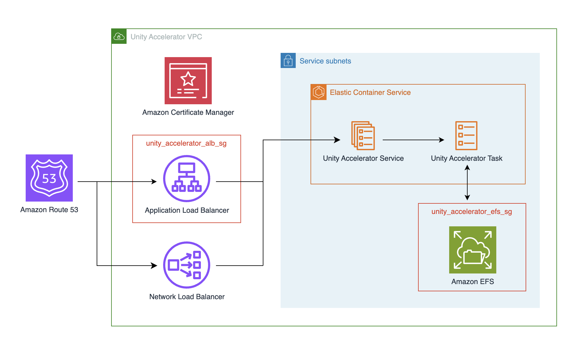

# Unity Accelerator Module
[Unity Accelerator](https://docs.unity3d.com/6000.0/Documentation/Manual/UnityAccelerator.html) is a caching service that speeds up project operations in [Unity](https://unity.com/) by storing and sharing asset cache data among team members, significantly reducing build times and asset imports by allowing team members to reuse previously processed assets instead of having to process the same assets independently.

This Unity Accelerator deployment uses an [Elastic Container Service](https://aws.amazon.com/ecs/) cluster for task deployment, with Amazon [Elastic File System](https://aws.amazon.com/efs/) providing persistent storage for configurations and cache. Access is managed through two load balancers: an [Application Load Balancer](https://aws.amazon.com/elasticloadbalancing/application-load-balancer/) for secure, password-protected web dashboard access via HTTPS, and a [Network Load Balancer](https://aws.amazon.com/elasticloadbalancing/network-load-balancer/) for efficient cache-related protobuf traffic.

A [Secrets Manager](https://aws.amazon.com/secrets-manager/) password entry, to be used as the Unity Accelerator's web dashboard password, is required beforehand. Password must be stored as a plaintext secret, not as key/value JSON secret, and the password's ARN must be provided as the value for the `unity_accelerator_dashboard_password_arn` variable.

## Deployment Architecture

## Examples
For example configurations, please see the [examples](https://github.com/aws-games/cloud-game-development-toolkit/tree/main/modules/unity/accelerator/examples).

<!-- BEGIN_TF_DOCS -->
## Requirements

| Name | Version |
|------|---------|
|  [terraform](#requirement\_terraform) | >= 1.9 |
|  [aws](#requirement\_aws) | 5.89.0 |
|  [awscc](#requirement\_awscc) | 1.50.0 |
|  [random](#requirement\_random) | 3.5.1 |

## Providers

| Name | Version |
|------|---------|
|  [aws](#provider\_aws) | 5.89.0 |
|  [awscc](#provider\_awscc) | 1.50.0 |
|  [random](#provider\_random) | 3.5.1 |

## Modules

No modules.

## Resources

| Name | Type |
|------|------|
| [aws_cloudwatch_log_group.unity_accelerator_log_group](https://registry.terraform.io/providers/hashicorp/aws/5.89.0/docs/resources/cloudwatch_log_group) | resource |
| [aws_ecs_cluster.unity_accelerator_cluster](https://registry.terraform.io/providers/hashicorp/aws/5.89.0/docs/resources/ecs_cluster) | resource |
| [aws_ecs_service.unity_accelerator](https://registry.terraform.io/providers/hashicorp/aws/5.89.0/docs/resources/ecs_service) | resource |
| [aws_ecs_task_definition.unity_accelerator_task_definition](https://registry.terraform.io/providers/hashicorp/aws/5.89.0/docs/resources/ecs_task_definition) | resource |
| [aws_efs_access_point.unity_accelerator_efs_data_access_point](https://registry.terraform.io/providers/hashicorp/aws/5.89.0/docs/resources/efs_access_point) | resource |
| [aws_efs_file_system.unity_accelerator_efs](https://registry.terraform.io/providers/hashicorp/aws/5.89.0/docs/resources/efs_file_system) | resource |
| [aws_efs_mount_target.unity_accelerator_efs_mount_target](https://registry.terraform.io/providers/hashicorp/aws/5.89.0/docs/resources/efs_mount_target) | resource |
| [aws_iam_policy.cloudwatch_logs_policy](https://registry.terraform.io/providers/hashicorp/aws/5.89.0/docs/resources/iam_policy) | resource |
| [aws_iam_policy.secret_access_policy](https://registry.terraform.io/providers/hashicorp/aws/5.89.0/docs/resources/iam_policy) | resource |
| [aws_iam_policy.unity_accelerator_default_policy](https://registry.terraform.io/providers/hashicorp/aws/5.89.0/docs/resources/iam_policy) | resource |
| [aws_iam_role.unity_accelerator_default_role](https://registry.terraform.io/providers/hashicorp/aws/5.89.0/docs/resources/iam_role) | resource |
| [aws_iam_role.unity_accelerator_task_execution_role](https://registry.terraform.io/providers/hashicorp/aws/5.89.0/docs/resources/iam_role) | resource |
| [aws_iam_role_policy_attachment.cloudwatch_logs_policy_attachment](https://registry.terraform.io/providers/hashicorp/aws/5.89.0/docs/resources/iam_role_policy_attachment) | resource |
| [aws_iam_role_policy_attachment.task_execution_role_secret_policy](https://registry.terraform.io/providers/hashicorp/aws/5.89.0/docs/resources/iam_role_policy_attachment) | resource |
| [aws_iam_role_policy_attachment.unity_accelerator_default_policy_attachment](https://registry.terraform.io/providers/hashicorp/aws/5.89.0/docs/resources/iam_role_policy_attachment) | resource |
| [aws_iam_role_policy_attachment.unity_accelerator_task_execution_role_policy_attachment](https://registry.terraform.io/providers/hashicorp/aws/5.89.0/docs/resources/iam_role_policy_attachment) | resource |
| [aws_lb.unity_accelerator_external_alb](https://registry.terraform.io/providers/hashicorp/aws/5.89.0/docs/resources/lb) | resource |
| [aws_lb.unity_accelerator_external_nlb](https://registry.terraform.io/providers/hashicorp/aws/5.89.0/docs/resources/lb) | resource |
| [aws_lb_listener.unity_accelerator_cache_listener](https://registry.terraform.io/providers/hashicorp/aws/5.89.0/docs/resources/lb_listener) | resource |
| [aws_lb_listener.unity_accelerator_https_dashboard_listener](https://registry.terraform.io/providers/hashicorp/aws/5.89.0/docs/resources/lb_listener) | resource |
| [aws_lb_listener.unity_accelerator_https_dashboard_redirect](https://registry.terraform.io/providers/hashicorp/aws/5.89.0/docs/resources/lb_listener) | resource |
| [aws_lb_target_group.unity_accelerator_cache_target_group](https://registry.terraform.io/providers/hashicorp/aws/5.89.0/docs/resources/lb_target_group) | resource |
| [aws_lb_target_group.unity_accelerator_dashboard_target_group](https://registry.terraform.io/providers/hashicorp/aws/5.89.0/docs/resources/lb_target_group) | resource |
| [aws_s3_bucket.unity_accelerator_lb_access_logs_bucket](https://registry.terraform.io/providers/hashicorp/aws/5.89.0/docs/resources/s3_bucket) | resource |
| [aws_s3_bucket_lifecycle_configuration.access_logs_bucket_lifecycle_configuration](https://registry.terraform.io/providers/hashicorp/aws/5.89.0/docs/resources/s3_bucket_lifecycle_configuration) | resource |
| [aws_s3_bucket_policy.lb_access_logs_bucket_policy](https://registry.terraform.io/providers/hashicorp/aws/5.89.0/docs/resources/s3_bucket_policy) | resource |
| [aws_s3_bucket_public_access_block.access_logs_bucket_public_block](https://registry.terraform.io/providers/hashicorp/aws/5.89.0/docs/resources/s3_bucket_public_access_block) | resource |
| [aws_security_group.unity_accelerator_alb_sg](https://registry.terraform.io/providers/hashicorp/aws/5.89.0/docs/resources/security_group) | resource |
| [aws_security_group.unity_accelerator_efs_sg](https://registry.terraform.io/providers/hashicorp/aws/5.89.0/docs/resources/security_group) | resource |
| [aws_security_group.unity_accelerator_service_sg](https://registry.terraform.io/providers/hashicorp/aws/5.89.0/docs/resources/security_group) | resource |
| [aws_security_group.vpc_endpoint_sg](https://registry.terraform.io/providers/hashicorp/aws/5.89.0/docs/resources/security_group) | resource |
| [aws_vpc_endpoint.ec2messages_vpce](https://registry.terraform.io/providers/hashicorp/aws/5.89.0/docs/resources/vpc_endpoint) | resource |
| [aws_vpc_endpoint.ssm_vpce](https://registry.terraform.io/providers/hashicorp/aws/5.89.0/docs/resources/vpc_endpoint) | resource |
| [aws_vpc_endpoint.ssmmessages_vpce](https://registry.terraform.io/providers/hashicorp/aws/5.89.0/docs/resources/vpc_endpoint) | resource |
| [aws_vpc_security_group_egress_rule.unity_accelerator_alb_egress_service_80](https://registry.terraform.io/providers/hashicorp/aws/5.89.0/docs/resources/vpc_security_group_egress_rule) | resource |
| [aws_vpc_security_group_egress_rule.unity_accelerator_service_egress_all](https://registry.terraform.io/providers/hashicorp/aws/5.89.0/docs/resources/vpc_security_group_egress_rule) | resource |
| [aws_vpc_security_group_ingress_rule.service_efs](https://registry.terraform.io/providers/hashicorp/aws/5.89.0/docs/resources/vpc_security_group_ingress_rule) | resource |
| [aws_vpc_security_group_ingress_rule.unity_accelerator_ingress_to_vpce](https://registry.terraform.io/providers/hashicorp/aws/5.89.0/docs/resources/vpc_security_group_ingress_rule) | resource |
| [aws_vpc_security_group_ingress_rule.unity_accelerator_service_ingress_from_alb_80](https://registry.terraform.io/providers/hashicorp/aws/5.89.0/docs/resources/vpc_security_group_ingress_rule) | resource |
| [aws_vpc_security_group_ingress_rule.unity_accelerator_service_ingress_from_nlb_10080](https://registry.terraform.io/providers/hashicorp/aws/5.89.0/docs/resources/vpc_security_group_ingress_rule) | resource |
| [aws_vpc_security_group_ingress_rule.unity_accelerator_service_ingress_from_nlb_80](https://registry.terraform.io/providers/hashicorp/aws/5.89.0/docs/resources/vpc_security_group_ingress_rule) | resource |
| [aws_vpc_security_group_ingress_rule.vpc_endpoint_https](https://registry.terraform.io/providers/hashicorp/aws/5.89.0/docs/resources/vpc_security_group_ingress_rule) | resource |
| [awscc_secretsmanager_secret.dashboard_password_arn](https://registry.terraform.io/providers/hashicorp/awscc/1.50.0/docs/resources/secretsmanager_secret) | resource |
| [awscc_secretsmanager_secret.dashboard_username_arn](https://registry.terraform.io/providers/hashicorp/awscc/1.50.0/docs/resources/secretsmanager_secret) | resource |
| [random_string.unity_accelerator_lb_access_logs_bucket_suffix](https://registry.terraform.io/providers/hashicorp/random/3.5.1/docs/resources/string) | resource |
| [aws_caller_identity.current](https://registry.terraform.io/providers/hashicorp/aws/5.89.0/docs/data-sources/caller_identity) | data source |
| [aws_ecs_cluster.unity_accelerator_cluster](https://registry.terraform.io/providers/hashicorp/aws/5.89.0/docs/data-sources/ecs_cluster) | data source |
| [aws_efs_file_system.efs_file_system](https://registry.terraform.io/providers/hashicorp/aws/5.89.0/docs/data-sources/efs_file_system) | data source |
| [aws_elb_service_account.main](https://registry.terraform.io/providers/hashicorp/aws/5.89.0/docs/data-sources/elb_service_account) | data source |
| [aws_iam_policy_document.access_logs_bucket_lb_write](https://registry.terraform.io/providers/hashicorp/aws/5.89.0/docs/data-sources/iam_policy_document) | data source |
| [aws_iam_policy_document.cloudwatch_logs_policy](https://registry.terraform.io/providers/hashicorp/aws/5.89.0/docs/data-sources/iam_policy_document) | data source |
| [aws_iam_policy_document.ecs_tasks_trust_relationship](https://registry.terraform.io/providers/hashicorp/aws/5.89.0/docs/data-sources/iam_policy_document) | data source |
| [aws_iam_policy_document.unity_accelerator_default_policy](https://registry.terraform.io/providers/hashicorp/aws/5.89.0/docs/data-sources/iam_policy_document) | data source |
| [aws_region.current](https://registry.terraform.io/providers/hashicorp/aws/5.89.0/docs/data-sources/region) | data source |
| [aws_subnet.nlb_subnets](https://registry.terraform.io/providers/hashicorp/aws/5.89.0/docs/data-sources/subnet) | data source |

## Inputs

| Name | Description | Type | Default | Required |
|------|-------------|------|---------|:--------:|
|  [alb\_certificate\_arn](#input\_alb\_certificate\_arn) | The ARN of the SSL certificate to use for the Application Load Balancer. | `string` | `null` | no |
|  [alb\_is\_internal](#input\_alb\_is\_internal) | Set this flag to determine whether the Application Load Balancer to create is internal (true) or external (false). Value is ignored if no ALB is created. | `bool` | `false` | no |
|  [cloudwatch\_log\_retention\_in\_days](#input\_cloudwatch\_log\_retention\_in\_days) | The log retention in days of the cloudwatch log group for Unity Accelerator. | `string` | `365` | no |
|  [cluster\_name](#input\_cluster\_name) | The name of the ECS cluster to deploy Unity Accelerator to. | `string` | `null` | no |
|  [container\_cpu](#input\_container\_cpu) | The number of CPU units to allocate to the Unity Accelerator container. | `number` | `1024` | no |
|  [container\_memory](#input\_container\_memory) | The number of MB of memory to allocate to the Unity Accelerator container. | `number` | `4096` | no |
|  [container\_name](#input\_container\_name) | The name of the Unity Accelerator container. | `string` | `"unity-accelerator"` | no |
|  [create\_alb](#input\_create\_alb) | Set this flag to true to create an Application Load Balancer for the Unity Accelerator dashboard. | `bool` | `true` | no |
|  [create\_nlb](#input\_create\_nlb) | Set this flag to true to create an external Network Load Balancer for the Unity Accelerator protobuf traffic. | `bool` | `true` | no |
|  [debug](#input\_debug) | Set this flag to enable ECS execute permissions on the Unity Accelerator container and force new service deployments on Terraform apply. | `bool` | `true` | no |
|  [efs\_access\_point\_id](#input\_efs\_access\_point\_id) | The ID of the EFS access point to use for the Unity Accelerator data volume. | `string` | `null` | no |
|  [efs\_encryption\_enabled](#input\_efs\_encryption\_enabled) | Set this flag to true to enable EFS encryption. | `bool` | `true` | no |
|  [efs\_id](#input\_efs\_id) | The ID of the EFS file system to use for the Unity Accelerator service. | `string` | `null` | no |
|  [efs\_performance\_mode](#input\_efs\_performance\_mode) | The performance mode of the EFS file system used by the Unity Accelerator service. Defaults to general purpose. | `string` | `"generalPurpose"` | no |
|  [efs\_throughput\_mode](#input\_efs\_throughput\_mode) | The throughput mode of the EFS file system used by the Unity Accelerator service. Defaults to bursting. | `string` | `"bursting"` | no |
|  [enable\_unity\_accelerator\_lb\_access\_logs](#input\_enable\_unity\_accelerator\_lb\_access\_logs) | Enables access logging for the Application Load Balancer and Network Load Balancer used by Unity Accelerator. Defaults to true. | `bool` | `true` | no |
|  [enable\_unity\_accelerator\_lb\_deletion\_protection](#input\_enable\_unity\_accelerator\_lb\_deletion\_protection) | Enables deletion protection for the Unity Accelerator Application Load Balancer and Network Load Balancer. Defaults to true. | `bool` | `true` | no |
|  [environment](#input\_environment) | The current environment (e.g. dev, prod, etc.) | `string` | `"dev"` | no |
|  [lb\_subnets](#input\_lb\_subnets) | The subnets in which the Application Load Balancer and Network Load Balancer will be deployed. | `list(string)` | `[]` | no |
|  [name](#input\_name) | The name applied to resources in the Unity Accelerator module. | `string` | `"unity-accelerator"` | no |
|  [nlb\_is\_internal](#input\_nlb\_is\_internal) | Set this flag to determine whether the Network Load Balancer to create is internal (true) or external (false). Value is ignored if no NLB is created. | `bool` | `false` | no |
|  [service\_subnets](#input\_service\_subnets) | The subnets in which the Unity Accelerator service will be deployed. | `list(string)` | n/a | yes |
|  [tags](#input\_tags) | Tags to apply to resources. | `map(any)` | <pre>{   "iac-management": "CGD-Toolkit",   "iac-module": "UnityAccelerator",   "iac-provider": "Terraform" }</pre> | no |
|  [unity\_accelerator\_alb\_access\_logs\_prefix](#input\_unity\_accelerator\_alb\_access\_logs\_prefix) | Log prefix for Unity Accelerator Application Load Balancer access logs. If null the project prefix and module name are used. | `string` | `null` | no |
|  [unity\_accelerator\_dashboard\_password\_arn](#input\_unity\_accelerator\_dashboard\_password\_arn) | ARN of the AWS Secrets Manager secret containing the Unity Accelerator web dashboard password. Password must be the only value and stored as text, not as key/value JSON. If not passed, one will be created randomly. | `string` | `null` | no |
|  [unity\_accelerator\_dashboard\_username\_arn](#input\_unity\_accelerator\_dashboard\_username\_arn) | ARN of the AWS Secrets Manager secret containing the Unity Accelerator web dashboard username. Username must be the only value and stored as text, not as key/value JSON. If not passed, one will be created and defaulted to 'uauser'. | `string` | `null` | no |
|  [unity\_accelerator\_debug\_mode](#input\_unity\_accelerator\_debug\_mode) | Enables debug output for the Unity Accelerator service. | `string` | `"false"` | no |
|  [unity\_accelerator\_docker\_image](#input\_unity\_accelerator\_docker\_image) | Docker image to use for Unity Accelerator. | `string` | `"unitytechnologies/accelerator:latest"` | no |
|  [unity\_accelerator\_lb\_access\_logs\_bucket](#input\_unity\_accelerator\_lb\_access\_logs\_bucket) | ID of the S3 bucket for Unity Accelerator Application Load Balancer and Network Load Balancer access log storage. If access logging is enabled and this is null the module creates a bucket. | `string` | `null` | no |
|  [unity\_accelerator\_log\_stdout](#input\_unity\_accelerator\_log\_stdout) | When true, outputs logs to stdout only. When false, writes logs to the persist directory. | `string` | `"true"` | no |
|  [unity\_accelerator\_nlb\_access\_logs\_prefix](#input\_unity\_accelerator\_nlb\_access\_logs\_prefix) | Log prefix for Unity Accelerator Network Load Balancer access logs. If null the project prefix and module name are used. | `string` | `null` | no |
|  [vpc\_id](#input\_vpc\_id) | The ID of the VPC in which the service will be deployed. | `string` | n/a | yes |

## Outputs

| Name | Description |
|------|-------------|
|  [alb\_dns\_name](#output\_alb\_dns\_name) | DNS endpoint of Application Load Balancer (ALB) |
|  [alb\_security\_group\_id](#output\_alb\_security\_group\_id) | ID of the Application Load Balancer's (ALB) security group |
|  [alb\_zone\_id](#output\_alb\_zone\_id) | Zone ID for Application Load Balancer (ALB) |
|  [nlb\_dns\_name](#output\_nlb\_dns\_name) | DNS endpoint of Network Load Balancer (NLB) |
|  [nlb\_zone\_id](#output\_nlb\_zone\_id) | Zone ID for Network Load Balancer (NLB) |
|  [unity\_accelerator\_dashboard\_password\_arn](#output\_unity\_accelerator\_dashboard\_password\_arn) | AWS Secrets Manager secret's ARN containing the Unity Accelerator web dashboard's username. |
|  [unity\_accelerator\_dashboard\_username\_arn](#output\_unity\_accelerator\_dashboard\_username\_arn) | AWS Secrets Manager secret's ARN containing the Unity Accelerator web dashboard's password. |
<!-- END_TF_DOCS -->
