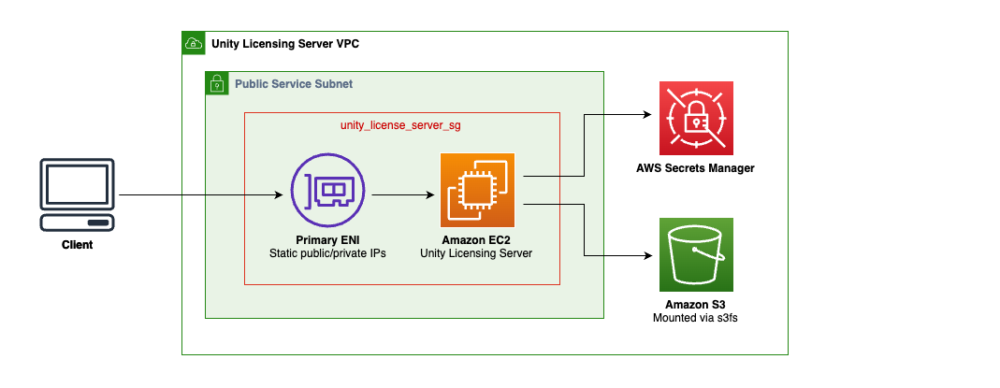
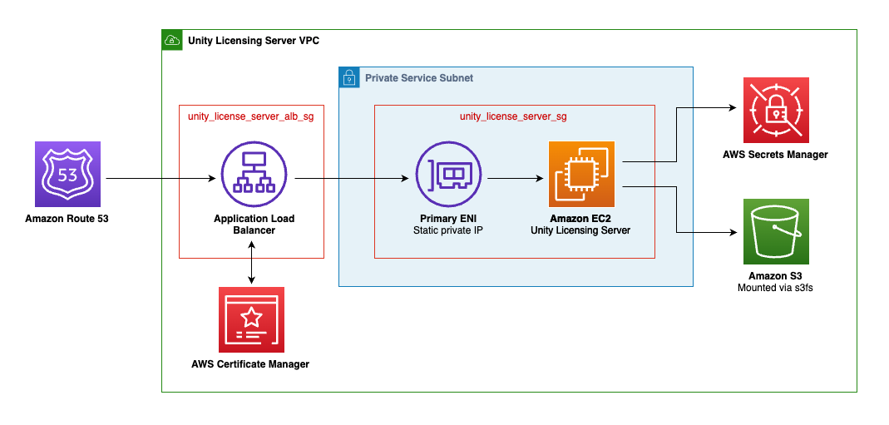

# Unity Licensing Server Module
The [Unity Licensing Server](https://docs.unity.com/licensing/en-us/manual) is an application that manages a pool of floating licenses for the [Unity Editor](https://unity.com/products/unity-engine) within an organization. It functions as a centralized system, allowing administrators to assign and track Unity Editor licenses to users, providing greater control and flexibility compared to node-locked or named-user licenses. The server uses an HTTP or HTTPS connection to communicate with the Unity Licensing Client on user machines and offers a dashboard for administrators to monitor license usage and server health. The Unity Licensing Client is included with the Unity Editor (2019.4 or later) and the Unity Hub (3.1 or later). Floating licensing is available exclusively for Enterprise plans subscribers.

While the Unity Licensing Server deployment has been simplified and streamlined in this module, it remains a multi-step process requiring manual intervention. A local zip file of the Unity Licensing Server is required when configuring and running the module. It can be downloaded from the `Organizations` section in the [Unity ID portal](https://id.unity.com/). For simplicity and cost optimization, this module requires the Linux version of the executable.

The deployment uses an [Amazon EC2 instance](https://aws.amazon.com/pm/ec2/) to run the Unity Licensing Server. An [Amazon Elastic Network Interface](https://docs.aws.amazon.com/AWSEC2/latest/UserGuide/using-eni.html) (ENI) is attached to the instance to provide a static private (and public if configured) IP to separate network settings from the compute instance, as the Unity Licensing Server binds the license to the machine's identity, which includes the following information:

- The server's MAC address
- The server's operating system
- The number of processor cores on the server
- The name of the server

Note that if the Licensing Server needs to be hosted by a new machine, a support ticket will need to be submitted to [Unity Support](https://support.unity.com/hc/en-us/requests/new) to revoke the Licensing Server so a new one can be configured.

The Licensing Server provides an admin dashboard. The username is `admin` and cannot be changed. The password is generated securely by the module and stored in [AWS Secrets Manager](https://aws.amazon.com/secrets-manager/).

An [Amazon S3](https://aws.amazon.com/pm/serv-s3/) bucket is created and mounted to the instance. This bucket will be used to provide the user with files created by the Unity Licensing Server, as well as to provide files to the Licensing Server that will need to be imported in later steps.

Upon deployment, two created files will be copied to the S3 bucket:

- The services configuration file `services-config.json`, which should be deployed to all client computers intending to use the Licensing Server.
- The server registration request file `server-registration-request.xml`, which contains machine binding information from the server.

The `server-registration-request.xml` will need to be uploaded to the [Unity ID portal](https://id.unity.com/) (where the Licensing Server executable was downloaded from) to register the server. Once successful, download the licenses zip file. Without renaming the file, upload it to the S3 bucket. A background process will detect the uploaded licenses file, and import them into the Unity Licensing Server, finishing the process.

## Deployment Architectures

Simple architecture where clients connect directly to an EC2 instance in a public (or private) subnet through a primary ENI with static public/private IPs. The EC2 instance hosts the Unity Licensing Server and connects to AWS Secrets Manager and Amazon S3 (mounted via s3fs).

Architecture providing enhanced security through network isolation where client traffic is routed through Amazon Route 53 to an Application Load Balancer before reaching the Unity Licensing Server.

## Examples
For example configurations, please see the [examples](https://github.com/aws-games/cloud-game-development-toolkit/tree/main/modules/unity/floating-license-server/examples).

<!-- BEGIN_TF_DOCS -->
## Requirements

| Name | Version |
|------|---------|
|  [terraform](#requirement\_terraform) | >= 1.9 |
|  [aws](#requirement\_aws) | 6.0.0 |
|  [awscc](#requirement\_awscc) | 1.51.0 |
|  [local](#requirement\_local) | ~> 2.4.0 |
|  [null](#requirement\_null) | ~> 3.2.0 |
|  [random](#requirement\_random) | 3.7.2 |

## Providers

| Name | Version |
|------|---------|
|  [aws](#provider\_aws) | 6.0.0 |
|  [awscc](#provider\_awscc) | 1.51.0 |
|  [local](#provider\_local) | 2.4.1 |
|  [null](#provider\_null) | 3.2.4 |
|  [random](#provider\_random) | 3.7.2 |

## Modules

No modules.

## Resources

| Name | Type |
|------|------|
| [aws_eip.unity_license_server_eip](https://registry.terraform.io/providers/hashicorp/aws/6.0.0/docs/resources/eip) | resource |
| [aws_iam_instance_profile.ec2_profile](https://registry.terraform.io/providers/hashicorp/aws/6.0.0/docs/resources/iam_instance_profile) | resource |
| [aws_iam_role.ec2_access_role](https://registry.terraform.io/providers/hashicorp/aws/6.0.0/docs/resources/iam_role) | resource |
| [aws_iam_role_policy.access_policy](https://registry.terraform.io/providers/hashicorp/aws/6.0.0/docs/resources/iam_role_policy) | resource |
| [aws_iam_role_policy_attachment.ssm_policy](https://registry.terraform.io/providers/hashicorp/aws/6.0.0/docs/resources/iam_role_policy_attachment) | resource |
| [aws_instance.unity_license_server](https://registry.terraform.io/providers/hashicorp/aws/6.0.0/docs/resources/instance) | resource |
| [aws_lb.unity_license_server_alb](https://registry.terraform.io/providers/hashicorp/aws/6.0.0/docs/resources/lb) | resource |
| [aws_lb_listener.unity_license_server_https_dashboard_listener](https://registry.terraform.io/providers/hashicorp/aws/6.0.0/docs/resources/lb_listener) | resource |
| [aws_lb_listener.unity_license_server_https_dashboard_redirect](https://registry.terraform.io/providers/hashicorp/aws/6.0.0/docs/resources/lb_listener) | resource |
| [aws_lb_target_group.unity_license_server_tg](https://registry.terraform.io/providers/hashicorp/aws/6.0.0/docs/resources/lb_target_group) | resource |
| [aws_lb_target_group_attachment.unity_license_server](https://registry.terraform.io/providers/hashicorp/aws/6.0.0/docs/resources/lb_target_group_attachment) | resource |
| [aws_network_interface.unity_license_server_eni](https://registry.terraform.io/providers/hashicorp/aws/6.0.0/docs/resources/network_interface) | resource |
| [aws_s3_bucket.alb_access_logs_bucket](https://registry.terraform.io/providers/hashicorp/aws/6.0.0/docs/resources/s3_bucket) | resource |
| [aws_s3_bucket.unity_license_server_bucket](https://registry.terraform.io/providers/hashicorp/aws/6.0.0/docs/resources/s3_bucket) | resource |
| [aws_s3_bucket_lifecycle_configuration.access_logs_bucket_lifecycle_configuration](https://registry.terraform.io/providers/hashicorp/aws/6.0.0/docs/resources/s3_bucket_lifecycle_configuration) | resource |
| [aws_s3_bucket_policy.lb_access_logs_bucket_policy](https://registry.terraform.io/providers/hashicorp/aws/6.0.0/docs/resources/s3_bucket_policy) | resource |
| [aws_s3_bucket_public_access_block.access_logs_bucket_public_block](https://registry.terraform.io/providers/hashicorp/aws/6.0.0/docs/resources/s3_bucket_public_access_block) | resource |
| [aws_s3_bucket_public_access_block.block_public_access](https://registry.terraform.io/providers/hashicorp/aws/6.0.0/docs/resources/s3_bucket_public_access_block) | resource |
| [aws_s3_bucket_server_side_encryption_configuration.bucket_encryption](https://registry.terraform.io/providers/hashicorp/aws/6.0.0/docs/resources/s3_bucket_server_side_encryption_configuration) | resource |
| [aws_s3_object.unity_license_file](https://registry.terraform.io/providers/hashicorp/aws/6.0.0/docs/resources/s3_object) | resource |
| [aws_security_group.unity_license_server_alb_sg](https://registry.terraform.io/providers/hashicorp/aws/6.0.0/docs/resources/security_group) | resource |
| [aws_security_group.unity_license_server_sg](https://registry.terraform.io/providers/hashicorp/aws/6.0.0/docs/resources/security_group) | resource |
| [aws_vpc_security_group_egress_rule.unity_license_server_alb_egress_service_8080](https://registry.terraform.io/providers/hashicorp/aws/6.0.0/docs/resources/vpc_security_group_egress_rule) | resource |
| [aws_vpc_security_group_egress_rule.unity_license_server_egress_all](https://registry.terraform.io/providers/hashicorp/aws/6.0.0/docs/resources/vpc_security_group_egress_rule) | resource |
| [aws_vpc_security_group_ingress_rule.unity_license_server_ingress_from_alb_8080](https://registry.terraform.io/providers/hashicorp/aws/6.0.0/docs/resources/vpc_security_group_ingress_rule) | resource |
| [awscc_secretsmanager_secret.admin_password_arn](https://registry.terraform.io/providers/hashicorp/awscc/1.51.0/docs/resources/secretsmanager_secret) | resource |
| [null_resource.generate_presigned_urls](https://registry.terraform.io/providers/hashicorp/null/latest/docs/resources/resource) | resource |
| [null_resource.wait_for_user_data](https://registry.terraform.io/providers/hashicorp/null/latest/docs/resources/resource) | resource |
| [random_string.alb_access_logs_bucket_suffix](https://registry.terraform.io/providers/hashicorp/random/3.7.2/docs/resources/string) | resource |
| [aws_ami.ubuntu_latest](https://registry.terraform.io/providers/hashicorp/aws/6.0.0/docs/data-sources/ami) | data source |
| [aws_elb_service_account.main](https://registry.terraform.io/providers/hashicorp/aws/6.0.0/docs/data-sources/elb_service_account) | data source |
| [aws_iam_policy_document.access_logs_bucket_alb_write](https://registry.terraform.io/providers/hashicorp/aws/6.0.0/docs/data-sources/iam_policy_document) | data source |
| [aws_instance.unity_license_server](https://registry.terraform.io/providers/hashicorp/aws/6.0.0/docs/data-sources/instance) | data source |
| [aws_network_interface.existing_eni](https://registry.terraform.io/providers/hashicorp/aws/6.0.0/docs/data-sources/network_interface) | data source |
| [local_file.config_url](https://registry.terraform.io/providers/hashicorp/local/latest/docs/data-sources/file) | data source |
| [local_file.registration_url](https://registry.terraform.io/providers/hashicorp/local/latest/docs/data-sources/file) | data source |

## Inputs

| Name | Description | Type | Default | Required |
|------|-------------|------|---------|:--------:|
|  [add\_eni\_public\_ip](#input\_add\_eni\_public\_ip) | If true and "existing\_eni\_id" is not provided, an Elastic IP (EIP) will be created and associated with the newly created Elastic Network Interface (ENI) to be used with the Unity Floating License Server. If "existing\_eni\_id" is provided, this variable is ignored and no new EIP will be added to the provided ENI. | `bool` | `true` | no |
|  [alb\_access\_logs\_bucket](#input\_alb\_access\_logs\_bucket) | ID of the S3 bucket for Application Load Balancer access log storage. If access logging is enabled and this is null the module creates a bucket. | `string` | `null` | no |
|  [alb\_access\_logs\_prefix](#input\_alb\_access\_logs\_prefix) | Log prefix for Unity License Server Application Load Balancer access logs. If null the project prefix and module name are used. | `string` | `null` | no |
|  [alb\_certificate\_arn](#input\_alb\_certificate\_arn) | The ARN of the SSL certificate to use for the Application Load Balancer. | `string` | `null` | no |
|  [alb\_is\_internal](#input\_alb\_is\_internal) | Set this flag to determine whether the Application Load Balancer to create is internal (true) or external (false). Value is ignored if no ALB is created. | `bool` | `false` | no |
|  [alb\_subnets](#input\_alb\_subnets) | The subnets in which the Application Load Balancer will be deployed. | `list(string)` | `[]` | no |
|  [create\_alb](#input\_create\_alb) | Set this flag to true to create an Application Load Balancer for the Unity License Server dashboard. | `bool` | `true` | no |
|  [enable\_alb\_access\_logs](#input\_enable\_alb\_access\_logs) | Enables access logging for the Application Load Balancer used by Unity License Server. Defaults to true. | `bool` | `true` | no |
|  [enable\_alb\_deletion\_protection](#input\_enable\_alb\_deletion\_protection) | Enables deletion protection for the Application Load Balancer. Defaults to true. | `bool` | `true` | no |
|  [enable\_instance\_detailed\_monitoring](#input\_enable\_instance\_detailed\_monitoring) | Enables detailed monitoring for the instance by increasing the frequency of metric collection from 5-minute intervals to 1-minute intervals in CloudWatch to provide more granular data. Note this will result in increased cost. | `bool` | `false` | no |
|  [enable\_instance\_termination\_protection](#input\_enable\_instance\_termination\_protection) | If true, enables EC2 instance termination protection from AWS APIs and console. | `bool` | `true` | no |
|  [existing\_eni\_id](#input\_existing\_eni\_id) | ID of an existing Elastic Network Interface (ENI) to use for the EC2 instance running the Unity Floating License Server, as its registration will be binded to it. If not provided, a new ENI will be created. | `string` | `null` | no |
|  [name](#input\_name) | The name applied to resources in the Unity Floating License Server module. | `string` | `"unity-license-server"` | no |
|  [tags](#input\_tags) | Tags to apply to resources created by this module. | `map(any)` | <pre>{   "environment": "Dev",   "iac-management": "CGD-Toolkit",   "iac-module": "UnityFloatingLicenseServer",   "iac-provider": "Terraform" }</pre> | no |
|  [unity\_license\_server\_admin\_password\_arn](#input\_unity\_license\_server\_admin\_password\_arn) | ARN of the AWS Secrets Manager secret containing the Unity Floating License Server admin dashboard password. Password must be the only value and stored as text, not as key/value JSON. If not passed, one will be created randomly. Password must be between 8-12 characters. | `string` | `null` | no |
|  [unity\_license\_server\_bucket\_name](#input\_unity\_license\_server\_bucket\_name) | Name of the Unity Floating License Server-specific S3 bucket to create. | `string` | `"unity-license-server-"` | no |
|  [unity\_license\_server\_file\_path](#input\_unity\_license\_server\_file\_path) | Local path to the Linux version of the Unity Floating License Server zip file. | `string` | n/a | yes |
|  [unity\_license\_server\_instance\_ami\_id](#input\_unity\_license\_server\_instance\_ami\_id) | The Ubuntu-based AMI ID to use in the EC2 instance running the Unity Floating License Server. Defaults to the latest Ubuntu Server 24.04 LTS AMI. | `string` | `null` | no |
|  [unity\_license\_server\_instance\_ebs\_size](#input\_unity\_license\_server\_instance\_ebs\_size) | The size of the EBS volume in GB. | `string` | `"20"` | no |
|  [unity\_license\_server\_instance\_type](#input\_unity\_license\_server\_instance\_type) | The instance type to use for the Unity Floating License Server. Defaults to t3.small. | `string` | `"t3.small"` | no |
|  [unity\_license\_server\_name](#input\_unity\_license\_server\_name) | Name of the Unity Floating License Server. | `string` | `"UnityLicenseServer"` | no |
|  [unity\_license\_server\_port](#input\_unity\_license\_server\_port) | Port the Unity Floating License Server will listen on (between 1025 and 65535). Defaults to 8080. | `string` | `"8080"` | no |
|  [vpc\_id](#input\_vpc\_id) | The ID of the VPC in which the Unity Floating License Server will be deployed. | `string` | n/a | yes |
|  [vpc\_subnet](#input\_vpc\_subnet) | The subnet where the EC2 instance running the Unity Floating License Server will be deployed. | `string` | n/a | yes |

## Outputs

| Name | Description |
|------|-------------|
|  [alb\_dns\_name](#output\_alb\_dns\_name) | DNS endpoint of Application Load Balancer (ALB). |
|  [alb\_security\_group\_id](#output\_alb\_security\_group\_id) | ID of the Application Load Balancer's (ALB) security group. |
|  [alb\_zone\_id](#output\_alb\_zone\_id) | Zone ID for Application Load Balancer (ALB). |
|  [created\_unity\_license\_server\_security\_group\_id](#output\_created\_unity\_license\_server\_security\_group\_id) | Id of the security group created by the script, for the Unity License Server instance. Null if an ENI was provided externally instead of created through the script. |
|  [dashboard\_password\_secret\_arn](#output\_dashboard\_password\_secret\_arn) | ARN of the secret containing the dashboard password. |
|  [eni\_id](#output\_eni\_id) | Elastic Network ID (ENI) used when binding the Unity Floating License Server. |
|  [instance\_private\_ip](#output\_instance\_private\_ip) | The EC2 instance's private IP address. |
|  [instance\_public\_ip](#output\_instance\_public\_ip) | The resulting EC2 instance's public IP, if configured. |
|  [registration\_request\_filename](#output\_registration\_request\_filename) | Filename for the server registration request file. |
|  [registration\_request\_presigned\_url](#output\_registration\_request\_presigned\_url) | Presigned URL for downloading the server registration request file (valid for 1 hour). |
|  [services\_config\_filename](#output\_services\_config\_filename) | Filename for the services config file. |
|  [services\_config\_presigned\_url](#output\_services\_config\_presigned\_url) | Presigned URL for downloading the services configuration file (valid for 1 hour). |
|  [unity\_license\_server\_port](#output\_unity\_license\_server\_port) | Port the Unity Floating License Server will listen on. |
|  [unity\_license\_server\_s3\_bucket](#output\_unity\_license\_server\_s3\_bucket) | S3 bucket name used by the Unity License Server service. |
<!-- END_TF_DOCS -->
