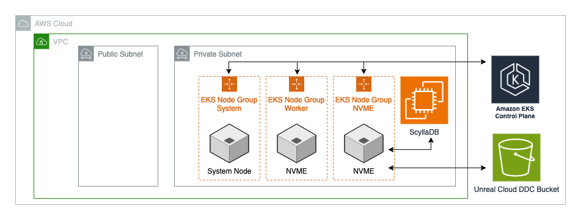
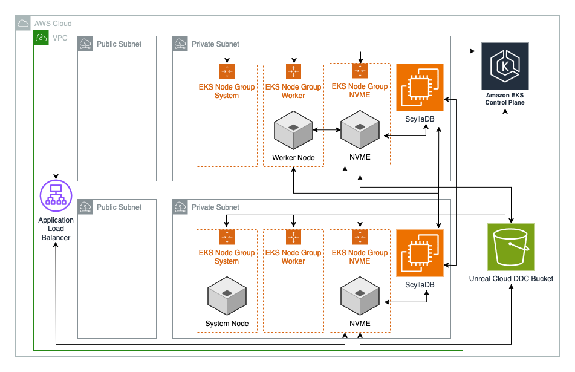

# Unreal Cloud DDC (Derived Data Cache) Module

[](LICENSE)

> **⚠️ IMPORTANT**
>
> **You MUST have Epic Games GitHub organization access to use this module.** Without access, container image pulls will fail and deployment will not work. Follow the [Epic Games Container Images Quick Start](https://dev.epicgames.com/documentation/en-us/unreal-engine/quick-start-guide-for-using-container-images-in-unreal-engine) to join the organization before proceeding.
>
> **📖 For complete DDC setup and configuration guidance, see the [Epic Games DDC Documentation](https://dev.epicgames.com/documentation/en-us/unreal-engine/how-to-set-up-a-cloud-type-derived-data-cache-for-unreal-engine).**

## Version Requirements

Consult the `versions.tf` file for requirements

**Critical Version Dependencies:**

- **Terraform >= 1.11** - Required for enhanced region support and multi-region deployments
- **AWS Provider >= 6.0** - Required for enhanced region support enabling simplified multi-region configuration
- **Kubernetes Provider >= 2.33.0** - Required for EKS cluster management and service deployment
- **Helm Provider >= 2.16.0, < 3.0.0** - Required for DDC application deployment

**DDC Application Version:**

- **Use DDC version 1.2.0** - Stable and tested
- **Avoid DDC version 1.3.0** - Has configuration parsing bugs that cause pod crashes

These version requirements enable the security patterns and multi-region capabilities used throughout this module.

## Features

- **Complete DDC Infrastructure** - Single module deploys EKS cluster, ScyllaDB database, S3 storage, and load balancers
- **ScyllaDB Database** - High-performance, self-managed database with full configuration control
- **Multi-Region Support** - Cross-region replication with automatic datacenter configuration
- **Security by Default** - Private subnets, least privilege IAM, restricted network access
- **Access Method Control** - External (internet) or internal (VPC-only) access patterns
- **Regional DNS Endpoints** - e.g. `<region>.ddc.example.com` pattern for optimal routing
- **Automatic Keyspace Management** - SSM automation fixes DDC replication strategy issues
- **Container Integration** - Direct GHCR access for Epic Games container images

## Database Options

**ScyllaDB (Self-Managed)**

- **Dedicated resources** - Guaranteed compute and memory allocation
- **Full control** - Complete configuration flexibility and custom tuning
- **Predictable costs** - Fixed EC2 pricing for consistent high-volume workloads
- **Advanced optimization** - Fine-grained performance tuning capabilities
- **Multi-region replication** - Cross-region data synchronization
- **Best for** - All production deployments, teams requiring database control

## Architecture

**Core Components:**

- **EKS Cluster**: Kubernetes cluster with specialized node groups (system, worker, NVME)
- **ScyllaDB Database**: High-performance, self-managed database for DDC metadata
- **S3 Bucket**: Object storage for cached game assets
- **Network Load Balancer**: External access with regional DNS endpoints
- **Route53 Private Hosted Zone**: DNS for internal routing between services
- **Private Subnets**: All compute resources deployed privately for security

### Single Region Architecture



#### Traffic Flow

```
┌─────────────────┐    ┌──────────────────┐    ┌─────────────────┐
│   Game Devs     │───▶│   Public NLB     │───▶│   EKS Cluster   │
│ (UE Clients)    │    │us-east-1.ddc... │    │  DDC Services   │
└─────────────────┘    └──────────────────┘    └─────────────────┘
                                │                        │
                                │               ┌─────────────────┐
                                │               │   ScyllaDB      │
                                │               │   (Metadata)    │
                                │               └─────────────────┘
                                │                        │
                                │               ┌─────────────────┐
                                │               │   S3 Bucket     │
                                │               │  (Asset Data)   │
                                │               └─────────────────┘
```

### Multi-Region Architecture



#### Traffic Flow

```
┌─────────────────┐    ┌──────────────────┐    ┌─────────────────┐
│   US East       │───▶│us-east-1.ddc... │───▶│ EKS us-east-1   │
│  Game Devs      │    │                  │    │                 │
└─────────────────┘    └──────────────────┘    └─────────────────┘
                                                         │
┌─────────────────┐    ┌──────────────────┐    ┌─────────────────┐
│   US West       │───▶│us-west-2.ddc... │───▶│ EKS us-west-2   │◀─┐
│  Game Devs      │    │                  │    │                 │  │
└─────────────────┘    └──────────────────┘    └─────────────────┘  │
                                                         │           │
                                               ┌─────────────────┐  │
                                               │   ScyllaDB      │  │
                                               │  Multi-Region   │──┘
                                               └─────────────────┘
```

## Prerequisites

### Required Access & Tools

1. **Epic Games GitHub Organization Access** (CRITICAL ⚠️)

   - Must be member of Epic Games GitHub organization
   - Required to pull DDC container images
   - Follow [Epic Games Container Images Quick Start](https://dev.epicgames.com/documentation/en-us/unreal-engine/quick-start-guide-for-using-container-images-in-unreal-engine)

2. **AWS Account Setup**

   - AWS CLI configured with deployment permissions
   - Route53 hosted zone for DNS records
   - VPC with public and private subnets

3. **GitHub Container Registry Access**

   - GitHub Personal Access Token with `packages:read` permission
   - Token stored in AWS Secrets Manager with `ecr-pullthroughcache/` prefix

4. **Network Planning**
   - Office/VPN IP ranges for security group access
   - VPC CIDR planning for multi-region deployments

### GitHub Container Registry Setup

#### Step 1: Create GitHub Personal Access Token

**Create a GitHub Personal Access Token (Classic) to access Epic Games container images:**

1. **Go to GitHub Settings**

   - Navigate to [GitHub.com](https://github.com) and sign in
   - Click your profile picture → **Settings**

2. **Access Developer Settings**

   - Scroll down to **Developer settings** (bottom of left sidebar)
   - Click **Personal access tokens** → **Tokens (classic)**

3. **Generate New Token**

   - Click **Generate new token** → **Generate new token (classic)**
   - Enter a descriptive **Note**: `DDC Container Registry Access`
   - Set **Expiration**: Choose appropriate duration (90 days recommended)

4. **Configure Permissions**

   - **REQUIRED**: Check `read:packages` - _Download packages from GitHub Package Registry_
   - Leave all other permissions unchecked

5. **Generate and Save Token**
   - Click **Generate token**
   - **CRITICAL**: Copy the token immediately - you cannot view it again
   - Store in AWS Secrets Manager (next step)

⚠️ **Prerequisites**: You must be a member of the Epic Games GitHub organization to access their private container registry. Follow the [Epic Games Container Images Quick Start](https://dev.epicgames.com/documentation/en-us/unreal-engine/quick-start-guide-for-using-container-images-in-unreal-engine) for organization access.

**Store credentials in AWS Secrets Manager:**

> **🚨 IMPORTANT**
>
> The name of the secret must EXACTLY start with `ecr-pullthroughcache/` or it will not work. Also, you must use a classic access token. The naming after the `ecr-pullthroughcache/` generally doesn't matter, but has some things to be aware of. See [these Amazon ECR docs](https://docs.aws.amazon.com/AmazonECR/latest/userguide/pull-through-cache-creating-secret.html) for more information. Since this value is a personal token that you must create in your own GitHub account, we recommend naming such as `ecr-pullthroughcache/your-github-username/name-of-the-token-in-GitHub`

```sh
aws secretsmanager create-secret \
  --name "ecr-pullthroughcache/<Whatever you want to name this>" \
  --description "GitHub PAT for DDC container images" \
  --secret-string '{"username":"your-github-username","accessToken":"your-personal-access-token"}'
```

> **ℹ️ Note**
>
> You may want to target a specific region with --region if deploying to a region different from your AWS CLI default. For multi-region deployments, create the secret in each region where DDC will be deployed. Each region's ECR pull-through cache requires its own copy of the GitHub credentials to authenticate with Epic Games' container registry and create the private ECR repository.
> This private ECR repo is used by Helm to install Unreal DDC on the EKS cluster.

## Examples

For a quickstart, please review the [examples](https://github.com/aws-games/cloud-game-development-toolkit/tree/main/modules/unreal/unreal-cloud-ddc/examples). They provide a good reference for not only the ways to declare and customize the module configuration, but how to provision and reference the infrastructure mentioned in the prerequisites. As mentioned earlier, we avoid creating infrastructure that is more general (e.g. VPCs, Subnets, Security Groups, etc.) as this can be highly nuanced . All examples show sample configurations of these resources created external to the module, but please customize based on your own needs.

This module provides examples for ScyllaDB deployments:

**ScyllaDB Examples:**

- **[Single Region Basic](https://github.com/aws-games/cloud-game-development-toolkit/tree/main/modules/unreal/unreal-cloud-ddc/examples/single-region-basic)** - ScyllaDB deployment for single region
- **[Multi-Region Basic](https://github.com/aws-games/cloud-game-development-toolkit/tree/main/modules/unreal/unreal-cloud-ddc/examples/multi-region-basic)** - ScyllaDB with cross-region replication for distributed teams

## Deployment Instructions

### Step 1: Declare and configure the module

Note, this is just a condensed sample. See the examples for the related required infrastructure.

**Single Region Example**

```terraform
module "unreal_cloud_ddc" {
  source = "../../"

  providers = {
    kubernetes = kubernetes
    helm       = helm
  }

  # - Shared -
  region = local.primary_region
  existing_vpc_id = aws_vpc.unreal_cloud_ddc_vpc.id
  existing_load_balancer_subnets = aws_subnet.public_subnets[*].id
  existing_service_subnets = aws_subnet.private_subnets[*].id
  existing_security_groups = [aws_security_group.allow_my_ip.id]

  # DNS Configuration
  existing_route53_public_hosted_zone_name = var.route53_public_hosted_zone_name
  existing_certificate_arn = aws_acm_certificate.ddc.arn

  # - DDC Infra Configuration -
  ddc_infra_config = {
    region = local.primary_region
    eks_node_group_subnets = aws_subnet.private_subnets[*].id
    eks_api_access_cidrs   = ["${chomp(data.http.my_ip.response_body)}/32"]
    scylla_subnets = aws_subnet.private_subnets[*].id
  }

  # - DDC Services Configuration -
  ddc_services_config = {
    region = local.primary_region
    ghcr_credentials_secret_manager_arn = var.ghcr_credentials_secret_manager_arn
  }
}
```

### Step 2: Deploy Infrastructure

> **⚠️ IMPORTANT**
>
> This module creates **internet-accessible** services by default. Review security configurations and restrict access to your organization's IP ranges before deployment.

```sh
# Initialize Terraform
terraform init

# Review planned changes
terraform plan

# Deploy infrastructure
terraform apply

# Note the outputs for UE configuration
# terraform output ddc_connection
```

## Verification & Testing

### Functional Test Scripts

Use the automated functional test scripts to verify your DDC deployment:

**Single Region:**

```sh
# Run from your terraform directory (where you ran 'terraform apply')
# Adjust path to script based on your location relative to the module
chmod +x ../../assets/scripts/ddc_functional_test.sh
../../assets/scripts/ddc_functional_test.sh
```

**Multi-Region:**

```sh
# Run from your terraform directory (where you ran 'terraform apply')
# Adjust path to script based on your location relative to the module
chmod +x ../../assets/scripts/ddc_functional_test_multi_region.sh
../../assets/scripts/ddc_functional_test_multi_region.sh
```

Alternatively, run the individual commands in the following sections manually if you prefer.

### Networking

**1. Basic Health Check**

**[Request]**

```sh
# Test DDC health endpoint
curl <DDC_ENDPOINT>/health/live
```

**[Response]**

After running this you should get a response that looks as the following:

```sh
HEALTHY%
```

**2. PUT a file in Unreal Cloud DDC**

**[Request]**

```sh
# Test PUT operation (write to cache)
curl -X PUT "<DDC_ENDPOINT>/api/v1/refs/ddc/default/00000000000000000000000000000000000000aa" \
  --data "test" \
  -H "content-type: application/octet-stream" \
  -H "X-Jupiter-IoHash: 4878CA0425C739FA427F7EDA20FE845F6B2E46BA" \
  -H "Authorization: ServiceAccount <BEARER_TOKEN>"
```

**[Response]**

After running this you should get a response that looks as the following:

```sh
HTTP/1.1 200 OK
Server: http
Date: Wed, 29 Jan 2025 19:15:05 GMT
Content-Type: application/json; charset=utf-8
Transfer-Encoding: chunked
Connection: keep-alive
Server-Timing: blob.put.FileSystemStore;dur=0.1451;desc="PUT to store: 'FileSystemStore'",blob.put.AmazonS3Store;dur=267.0449;desc="PUT to store: 'AmazonS3Store'",blob.get-metadata.FileSystemStore;dur=0.0406;desc="Blob GET Metadata from: 'FileSystemStore'",ref.finalize;dur=7.1407;desc="Finalizing the ref",ref.put;dur=25.2064;desc="Inserting ref"

{"needs":[]}}%
```

**3. GET the file you wrote to Unreal Cloud DDC**

**[Request]**

```sh
# Test GET operation (read from cache)
curl "<DDC_ENDPOINT>/api/v1/refs/ddc/default/00000000000000000000000000000000000000aa.json" \
  -H "Authorization: ServiceAccount <BEARER_TOKEN>"
```

**[Response]**

After running this you should get a response that looks as the following:

```sh
HTTP/1.1 200 OK
Server: http
Date: Wed, 29 Jan 2025 19:16:46 GMT
Content-Type: application/json
Content-Length: 66
Connection: keep-alive
X-Jupiter-IoHash: 7D873DCC262F62FBAA871FE61B2B52D715A1171E
X-Jupiter-LastAccess: 01/29/2025 19:16:46
Server-Timing: ref.get;dur=0.0299;desc="Fetching Ref from DB"

{"RawHash":"4878ca0425c739fa427f7eda20fe845f6b2e46ba","RawSize":4}%
```

#### ⚠️ Troubleshooting ⚠️

If the above command do not work, try to test access to the Network Load Balancer directly

**Example:**

```sh
# Test DDC health endpoint
curl <Network Load Balancer Endpoint>/health/live

# Expected response: "Healthy"
```

### Application

**1. Verify the Unreal Cloud DDC EKS Cluster Status**

**[Request]**

```sh
# Configure kubectl access
aws eks update-kubeconfig --region <your-region> --name <cluster-name>

# Check pod status
kubectl get pods -n unreal-cloud-ddc

```

**[Response]**

 <!-- Expected: All pods should be "Running" -->

```sh
NAME                                                     READY   STATUS    RESTARTS   AGE
cgd-unreal-cloud-ddc-initialize-546ff4bbfd-7dh62         1/1     Running   0          101m
cgd-unreal-cloud-ddc-initialize-546ff4bbfd-97zd2         1/1     Running   0          101m
cgd-unreal-cloud-ddc-initialize-worker-7c6dfbc66-8lw8v   1/1     Running   0          101m
```

### Database

**1. Check the status of the database nodes**

Connect to any of the Scylla Nodes and run the following command (SSM with Session Manager recommended):

**[Request]**

```sh
nodetool status
```

**[Response]**

```sh
$ nodetool status
Datacenter: us-east
===================
Status=Up/Down
|/ State=Normal/Leaving/Joining/Moving
-- Address    Load      Tokens Owns Host ID                              Rack
UN 10.0.4.73  925.51 KB 256    ?    15e58613-891d-44a4-a445-50678edb07cb 1a
UN 10.0.5.107 913.77 KB 256    ?    329cfa9f-71b3-4e5e-a5c6-c1ee91a550ba 1b
UN 10.0.6.158 948.95 KB 256    ?    1e5ac8b8-50b5-4e47-aa91-5b4fa917afd2 1c

Note: Non-system keyspaces don't have the same replication settings, effective ownership information is meaningless
```

**2. Check the keyspaces are present**

On the instance, start cqlsh session:

```sh
cqlsh
```

**[Request]**

Check if all keyspaces are there

```sh
describe keyspaces
```

**[Response]**

Should include at least the following keyspaces (names will vary depending on your region):

- **Global Keyspace (`jupiter`)**

  - Stores shared/cross-region data that all regions can access
  - Contains metadata, configuration, and shared cache entries
  - Used for multi-region coordination and global cache lookups

- **Local Keyspace (`jupiter_local_ddc_us_east_1`)**
  - Stores region-specific cache data for performance
  - Contains local cache entries that don't need cross-region replication
  - Reduces latency by keeping frequently accessed data local

```sh
system_auth                  system
system_schema                jupiter_local_ddc_us_east_1
jupiter                      system_traces
system_distributed           system_distributed_everywhere
```

**2. Check the keyspace configuration**

On the instance, start cqlsh session:

```sh
cqlsh
```

**[Request]**

Check if all keyspaces are there

```sh
describe keyspaces
```

**[Response]**

Should include at least the following keyspaces:

- jupiter
- jupiter_ddc_local

## Client Connection Guide

> **📖 For complete DDC setup and configuration guidance, see the [Epic Games DDC Documentation](https://dev.epicgames.com/documentation/en-us/unreal-engine/how-to-set-up-a-cloud-type-derived-data-cache-for-unreal-engine).**

### Unreal Engine Configuration

**1. Get connection details:**
You can either see the relevant details in the Terraform outputs after a successful apply, or separately run the following command to get all of the outputs. Ensure you have defined the outputs you would like to use at in the same directory you initialized Terraform in.

**[Request]**

```sh
# Get all outputs
terraform output -json
```

**[Response]**

**2/ Configure project (`Config/DefaultEngine.ini`):**

```ini
[DDC]
; Production configuration
Cloud=(Type=HTTPDerivedDataBackend, Host="<DDS Route53 DNS Endpoint>")

; Optional: Local cache as fallback
Local=(Type=FileSystem, Path=%GAMEDIR%DerivedDataCache, MaxFileAge=60)

; Hierarchical setup (try cloud first, then local)
Hierarchical=(Type=Hierarchical, Inner=Cloud, Inner=Local)
```

### Multi-Region Configuration

For distributed teams:

```ini
[DDC]
; Region 1 (Primary in this case)
Primary=(Type=HTTPDerivedDataBackend, Host="<DDS Route53 DNS Endpoint for Region 1>")

; Region 2
Secondary=(Type=HTTPDerivedDataBackend, Host="https://us-west-2.ddc.yourcompany.com")

; Try primary first, then secondary, then local
Hierarchical=(Type=Hierarchical, Inner=Primary, Inner=Secondary, Inner=Local)
```

> **Note:** The hierarchical setup sets priority order for cache usage. This helps optimize for both latency and disaster recovery. For more information see [these docs](https://dev.epicgames.com/documentation/en-us/unreal-engine/using-derived-data-cache-in-unreal-engine).

## Troubleshooting

### Common Issues

#### 1. Pod Crashes with Unix Socket Error

**Symptoms**: `CrashLoopBackOff`, logs show `Invalid url: 'unix:///nginx/jupiter-http.sock'`

**Cause**: For the EKS Cluster, we use an existing Network Load Balancer (NLB)which is created during deployment, instead of letting EKS create its own NLBs using the Load Balancer Controller. You can see this in our Helm Chart, where we use `ClusterIP` mode. This is to prevent race conditions with destroy. This is because the following occurs:

Without `ClusterIP` and external NLB:

`terraform apply` ✅:

1. Infra is provisioned using AWS Provider (including EKS and NLB)
2. Helm and Kubernetes Providers are used to configure the EKS Cluster (will create networking resources like NLB, Target Groups)
3. Load Balancer Controller creates load balancers and related infrastructure

`terraform destroy` ❌:

1. AWS Provider is used to destroy infra and potentially the EKS Cluster is deleted before Helm and Kubernetes is able to reset the configuration it applied to the cluster. This configuration if using `LoadBalancer` type created actual AWS infrastructure which would be orphaned in the AWS account and likely cause race conditions due to dependencies

With `ClusterIP` and external NLB:
`terraform apply` ✅:

1. Infra is provisioned using AWS Provider (including EKS and NLB)
2. Helm and Kubernetes Providers are used to configure the EKS Cluster
3. Load Balancer Controller creates load balancers and related infrastructure

`terraform destroy` ✅:

1. Helm and Kubernetes Providers are used to reset EKS configuration. There are no NLB to destroy since none were created, just associated with the exting NLB and Target Groups.
1. AWS Provider is used to destroy AWS infra and potentially the EKS Cluster is deleted before Helm and Kubernetes is able to reset the configuration it applied to the cluster. This configuration if using `LoadBalancer` type created actual AWS infrastructure which would be orphaned in the AWS account and likely cause race conditions due to dependencies

However, Unreal Cloud DDC expects NGINX and will use that networking configuration along with the default created load balancers (by load balancer controller). So to solve for this, we had to modify the configuration to use standard HTTP instead of NGINX

**Solution**: Verify NGINX is disabled in Helm values:

```sh
# First, find the actual Helm release name (default namespace: unreal-cloud-ddc)
helm list -n <namespace>

# With default variables, should be:
helm get values cgd-unreal-cloud-ddc-initialize -n unreal-cloud-ddc | grep -A5 nginx
# Should show: enabled: false

# If you customized project_prefix, ddc_infra_config.name, or ddc_infra_config.unreal_cloud_ddc_namespace,
# use the actual release name and namespace from 'helm list'
```

#### 2. DDC API Connection Timeout

**Symptoms**: `curl` commands timeout or return connection refused

**Solutions**:

1. Check security group allows your IP: `curl https://checkip.amazonaws.com/`
2. Verify DNS resolution: `nslookup us-east-1.ddc.yourcompany.com`
3. Check EKS cluster status: `kubectl get nodes`

#### GitHub Container Registry Access Denied

**Symptoms**: Pod image pull failures, `ImagePullBackOff` status

**Solutions**:

1. Verify Epic Games organization membership
2. Check GitHub PAT has `packages:read` permission
3. Confirm secret is stored correctly in AWS Secrets Manager

### Debug Commands

```sh
# Check current IP
curl https://checkip.amazonaws.com/

# Test DNS resolution
nslookup us-east-1.ddc.yourcompany.com

# Configure kubectl (REQUIRED before any kubectl commands)
aws eks update-kubeconfig --region <region> --name <cluster-name>

# Check pod logs
kubectl logs -f <pod-name> -n unreal-cloud-ddc

# Check service status
kubectl get svc -n unreal-cloud-ddc
```

## User Personas

### DevOps Team (Infrastructure Provisioners)

**Responsibilities:**

- Deploy and manage DDC infrastructure
- Configure networking and security
- Handle certificates and DNS
- Monitor infrastructure health

**Access Requirements:**

- EKS API access for kubectl/Terraform
- Full access to all AWS services
- Office/VPN network access

### Game Developers (Service Consumers)

**Responsibilities:**

- Use DDC for faster asset iteration
- Configure Unreal Engine DDC settings
- Report performance issues

**Access Requirements:**

- DDC service access only (not backend infrastructure)
- Unreal Engine Editor access

## Deployment Patterns

### Single Region Deployment

**When to Use:**

- Small teams (5-20 developers)
- Co-located teams (same geographic region)
- Prototyping/MVP projects
- Budget-conscious deployments

**Benefits:**

- Lower cost (single region)
- Simpler management
- Faster deployment

### Multi-Region Deployment

**When to Use:**

- Distributed teams (US + Europe + Asia)
- Large studios (50+ developers)
- Performance-critical workflows
- Disaster recovery requirements

**Benefits:**

- Reduced latency for global teams
- Built-in disaster recovery
- Regional data compliance

## Security & Access Patterns

For detailed configuration options and deployment patterns, see the [examples](examples/) directory:

- **Single Region**: Basic deployment for small to medium teams
- **Multi-Region**: Cross-region deployment for global teams

<!-- BEGIN_TF_DOCS -->

## Requirements

| Name                                                                        | Version            |
| --------------------------------------------------------------------------- | ------------------ |
| <a name="requirement_terraform"></a> [terraform](#requirement_terraform)    | >= 1.11            |
| <a name="requirement_aws"></a> [aws](#requirement_aws)                      | >= 6.0.0           |
| <a name="requirement_helm"></a> [helm](#requirement_helm)                   | >= 2.16.0, < 3.0.0 |
| <a name="requirement_kubectl"></a> [kubectl](#requirement_kubectl)          | >= 1.14.0          |
| <a name="requirement_kubernetes"></a> [kubernetes](#requirement_kubernetes) | >=2.33.0           |
| <a name="requirement_null"></a> [null](#requirement_null)                   | >= 3.1             |
| <a name="requirement_random"></a> [random](#requirement_random)             | >= 3.1             |
| <a name="requirement_time"></a> [time](#requirement_time)                   | >= 0.9             |

## Providers

| Name                                                      | Version |
| --------------------------------------------------------- | ------- |
| <a name="provider_aws"></a> [aws](#provider_aws)          | 6.11.0  |
| <a name="provider_http"></a> [http](#provider_http)       | 3.5.0   |
| <a name="provider_random"></a> [random](#provider_random) | 3.7.2   |

## Modules

| Name                                                                    | Source                 | Version |
| ----------------------------------------------------------------------- | ---------------------- | ------- |
| <a name="module_ddc_infra"></a> [ddc_infra](#module_ddc_infra)          | ./modules/ddc-infra    | n/a     |
| <a name="module_ddc_services"></a> [ddc_services](#module_ddc_services) | ./modules/ddc-services | n/a     |

## Resources

| Name                                                                                                                                                                    | Type        |
| ----------------------------------------------------------------------------------------------------------------------------------------------------------------------- | ----------- |
| [aws_cloudwatch_log_group.application](https://registry.terraform.io/providers/hashicorp/aws/latest/docs/resources/cloudwatch_log_group)                                | resource    |
| [aws_cloudwatch_log_group.infrastructure](https://registry.terraform.io/providers/hashicorp/aws/latest/docs/resources/cloudwatch_log_group)                             | resource    |
| [aws_cloudwatch_log_group.service](https://registry.terraform.io/providers/hashicorp/aws/latest/docs/resources/cloudwatch_log_group)                                    | resource    |
| [aws_lb.nlb](https://registry.terraform.io/providers/hashicorp/aws/latest/docs/resources/lb)                                                                            | resource    |
| [aws_lb_listener.http](https://registry.terraform.io/providers/hashicorp/aws/latest/docs/resources/lb_listener)                                                         | resource    |
| [aws_lb_listener.https](https://registry.terraform.io/providers/hashicorp/aws/latest/docs/resources/lb_listener)                                                        | resource    |
| [aws_lb_target_group.nlb_target_group](https://registry.terraform.io/providers/hashicorp/aws/latest/docs/resources/lb_target_group)                                     | resource    |
| [aws_route53_record.scylla_cluster](https://registry.terraform.io/providers/hashicorp/aws/latest/docs/resources/route53_record)                                         | resource    |
| [aws_route53_record.scylla_nodes](https://registry.terraform.io/providers/hashicorp/aws/latest/docs/resources/route53_record)                                           | resource    |
| [aws_route53_record.service_private](https://registry.terraform.io/providers/hashicorp/aws/latest/docs/resources/route53_record)                                        | resource    |
| [aws_route53_zone.private](https://registry.terraform.io/providers/hashicorp/aws/latest/docs/resources/route53_zone)                                                    | resource    |
| [aws_route53_zone_association.additional_vpcs](https://registry.terraform.io/providers/hashicorp/aws/latest/docs/resources/route53_zone_association)                    | resource    |
| [aws_s3_bucket.logs](https://registry.terraform.io/providers/hashicorp/aws/latest/docs/resources/s3_bucket)                                                             | resource    |
| [aws_s3_bucket_policy.logs_policy](https://registry.terraform.io/providers/hashicorp/aws/latest/docs/resources/s3_bucket_policy)                                        | resource    |
| [aws_secretsmanager_secret.unreal_cloud_ddc_token](https://registry.terraform.io/providers/hashicorp/aws/latest/docs/resources/secretsmanager_secret)                   | resource    |
| [aws_secretsmanager_secret_version.unreal_cloud_ddc_token](https://registry.terraform.io/providers/hashicorp/aws/latest/docs/resources/secretsmanager_secret_version)   | resource    |
| [aws_security_group.internal](https://registry.terraform.io/providers/hashicorp/aws/latest/docs/resources/security_group)                                               | resource    |
| [aws_security_group.nlb](https://registry.terraform.io/providers/hashicorp/aws/latest/docs/resources/security_group)                                                    | resource    |
| [aws_ssm_association.scylla_keyspace_replication_fix](https://registry.terraform.io/providers/hashicorp/aws/latest/docs/resources/ssm_association)                      | resource    |
| [aws_ssm_document.scylla_keyspace_replication_fix](https://registry.terraform.io/providers/hashicorp/aws/latest/docs/resources/ssm_document)                            | resource    |
| [aws_vpc_security_group_egress_rule.internal_egress](https://registry.terraform.io/providers/hashicorp/aws/latest/docs/resources/vpc_security_group_egress_rule)        | resource    |
| [aws_vpc_security_group_egress_rule.nlb_egress](https://registry.terraform.io/providers/hashicorp/aws/latest/docs/resources/vpc_security_group_egress_rule)             | resource    |
| [aws_vpc_security_group_egress_rule.nlb_to_cluster](https://registry.terraform.io/providers/hashicorp/aws/latest/docs/resources/vpc_security_group_egress_rule)         | resource    |
| [aws_vpc_security_group_ingress_rule.eks_cluster_from_nlb](https://registry.terraform.io/providers/hashicorp/aws/latest/docs/resources/vpc_security_group_ingress_rule) | resource    |
| [aws_vpc_security_group_ingress_rule.internal_scylla_cql](https://registry.terraform.io/providers/hashicorp/aws/latest/docs/resources/vpc_security_group_ingress_rule)  | resource    |
| [aws_vpc_security_group_ingress_rule.nlb_from_users](https://registry.terraform.io/providers/hashicorp/aws/latest/docs/resources/vpc_security_group_ingress_rule)       | resource    |
| [aws_vpc_security_group_ingress_rule.nlb_http_cidrs](https://registry.terraform.io/providers/hashicorp/aws/latest/docs/resources/vpc_security_group_ingress_rule)       | resource    |
| [aws_vpc_security_group_ingress_rule.nlb_http_prefix](https://registry.terraform.io/providers/hashicorp/aws/latest/docs/resources/vpc_security_group_ingress_rule)      | resource    |
| [aws_vpc_security_group_ingress_rule.nlb_http_vpc](https://registry.terraform.io/providers/hashicorp/aws/latest/docs/resources/vpc_security_group_ingress_rule)         | resource    |
| [aws_vpc_security_group_ingress_rule.nlb_https_cidrs](https://registry.terraform.io/providers/hashicorp/aws/latest/docs/resources/vpc_security_group_ingress_rule)      | resource    |
| [aws_vpc_security_group_ingress_rule.nlb_https_prefix](https://registry.terraform.io/providers/hashicorp/aws/latest/docs/resources/vpc_security_group_ingress_rule)     | resource    |
| [aws_vpc_security_group_ingress_rule.nlb_https_vpc](https://registry.terraform.io/providers/hashicorp/aws/latest/docs/resources/vpc_security_group_ingress_rule)        | resource    |
| [random_id.suffix](https://registry.terraform.io/providers/hashicorp/random/latest/docs/resources/id)                                                                   | resource    |
| [random_password.ddc_token](https://registry.terraform.io/providers/hashicorp/random/latest/docs/resources/password)                                                    | resource    |
| [random_string.bearer_token_suffix](https://registry.terraform.io/providers/hashicorp/random/latest/docs/resources/string)                                              | resource    |
| [aws_caller_identity.current](https://registry.terraform.io/providers/hashicorp/aws/latest/docs/data-sources/caller_identity)                                           | data source |
| [aws_elb_service_account.main](https://registry.terraform.io/providers/hashicorp/aws/latest/docs/data-sources/elb_service_account)                                      | data source |
| [aws_iam_policy_document.logs_policy](https://registry.terraform.io/providers/hashicorp/aws/latest/docs/data-sources/iam_policy_document)                               | data source |
| [aws_region.current](https://registry.terraform.io/providers/hashicorp/aws/latest/docs/data-sources/region)                                                             | data source |
| [aws_secretsmanager_secret_version.existing_token](https://registry.terraform.io/providers/hashicorp/aws/latest/docs/data-sources/secretsmanager_secret_version)        | data source |
| [aws_vpc.main](https://registry.terraform.io/providers/hashicorp/aws/latest/docs/data-sources/vpc)                                                                      | data source |
| [http_http.my_ip](https://registry.terraform.io/providers/hashicorp/http/latest/docs/data-sources/http)                                                                 | data source |

## Inputs

| Name                                                                                                                                                      | Description                                                                                                                                                                                                                                                                                                                                                                                                                                                                                                                                                                                                                                                                                                                                                                                                                                                                                                                                                                                                                                                                                                                                                                                                                                                                                                                                                                                                                                                                                                                                                                                                                                                                                                                                                                                                                                                                                                                                                                                                                                                                                                                                                                                                                                                                                                                                                                                                                                                                                                                         | Type                                                                                                                                                                                                                                                                                                                                                                                                                                                                                                                                                                                                                                                                                                                                                                                                                                                                                                                                                                                                                                                                                                                                                                                                                                                                                                                                                                                                                                                                                                                                                                                                                                                                                                                                                                                                                                                                                                                                                                                                                                                                                                                                                                                                                                                                                                                                                                                                                                                                                                                                                                                                                   | Default                                                                                                                                                                                                                                                                             | Required |
| --------------------------------------------------------------------------------------------------------------------------------------------------------- | ----------------------------------------------------------------------------------------------------------------------------------------------------------------------------------------------------------------------------------------------------------------------------------------------------------------------------------------------------------------------------------------------------------------------------------------------------------------------------------------------------------------------------------------------------------------------------------------------------------------------------------------------------------------------------------------------------------------------------------------------------------------------------------------------------------------------------------------------------------------------------------------------------------------------------------------------------------------------------------------------------------------------------------------------------------------------------------------------------------------------------------------------------------------------------------------------------------------------------------------------------------------------------------------------------------------------------------------------------------------------------------------------------------------------------------------------------------------------------------------------------------------------------------------------------------------------------------------------------------------------------------------------------------------------------------------------------------------------------------------------------------------------------------------------------------------------------------------------------------------------------------------------------------------------------------------------------------------------------------------------------------------------------------------------------------------------------------------------------------------------------------------------------------------------------------------------------------------------------------------------------------------------------------------------------------------------------------------------------------------------------------------------------------------------------------------------------------------------------------------------------------------------------------- | ---------------------------------------------------------------------------------------------------------------------------------------------------------------------------------------------------------------------------------------------------------------------------------------------------------------------------------------------------------------------------------------------------------------------------------------------------------------------------------------------------------------------------------------------------------------------------------------------------------------------------------------------------------------------------------------------------------------------------------------------------------------------------------------------------------------------------------------------------------------------------------------------------------------------------------------------------------------------------------------------------------------------------------------------------------------------------------------------------------------------------------------------------------------------------------------------------------------------------------------------------------------------------------------------------------------------------------------------------------------------------------------------------------------------------------------------------------------------------------------------------------------------------------------------------------------------------------------------------------------------------------------------------------------------------------------------------------------------------------------------------------------------------------------------------------------------------------------------------------------------------------------------------------------------------------------------------------------------------------------------------------------------------------------------------------------------------------------------------------------------------------------------------------------------------------------------------------------------------------------------------------------------------------------------------------------------------------------------------------------------------------------------------------------------------------------------------------------------------------------------------------------------------------------------------------------------------------------------------------------------- | ----------------------------------------------------------------------------------------------------------------------------------------------------------------------------------------------------------------------------------------------------------------------------------- | :------: |
| <a name="input_additional_vpc_associations"></a> [additional_vpc_associations](#input_additional_vpc_associations)                                        | Additional VPCs to associate with private zone (for cross-region access)                                                                                                                                                                                                                                                                                                                                                                                                                                                                                                                                                                                                                                                                                                                                                                                                                                                                                                                                                                                                                                                                                                                                                                                                                                                                                                                                                                                                                                                                                                                                                                                                                                                                                                                                                                                                                                                                                                                                                                                                                                                                                                                                                                                                                                                                                                                                                                                                                                                            | <pre>map(object({<br> vpc_id = string<br> region = string<br> }))</pre>                                                                                                                                                                                                                                                                                                                                                                                                                                                                                                                                                                                                                                                                                                                                                                                                                                                                                                                                                                                                                                                                                                                                                                                                                                                                                                                                                                                                                                                                                                                                                                                                                                                                                                                                                                                                                                                                                                                                                                                                                                                                                                                                                                                                                                                                                                                                                                                                                                                                                                                                                | `{}`                                                                                                                                                                                                                                                                                |    no    |
| <a name="input_allowed_external_cidrs"></a> [allowed_external_cidrs](#input_allowed_external_cidrs)                                                       | CIDR blocks for external access. Use prefix lists for multiple IPs.                                                                                                                                                                                                                                                                                                                                                                                                                                                                                                                                                                                                                                                                                                                                                                                                                                                                                                                                                                                                                                                                                                                                                                                                                                                                                                                                                                                                                                                                                                                                                                                                                                                                                                                                                                                                                                                                                                                                                                                                                                                                                                                                                                                                                                                                                                                                                                                                                                                                 | `list(string)`                                                                                                                                                                                                                                                                                                                                                                                                                                                                                                                                                                                                                                                                                                                                                                                                                                                                                                                                                                                                                                                                                                                                                                                                                                                                                                                                                                                                                                                                                                                                                                                                                                                                                                                                                                                                                                                                                                                                                                                                                                                                                                                                                                                                                                                                                                                                                                                                                                                                                                                                                                                                         | `[]`                                                                                                                                                                                                                                                                                |    no    |
| <a name="input_amazon_keyspaces_config"></a> [amazon_keyspaces_config](#input_amazon_keyspaces_config)                                                    | Amazon Keyspaces configuration for single and multi-region deployments.<br><br> # Current Region Configuration<br> current_region.point_in_time_recovery: Enable point-in-time recovery for tables<br><br> # Multi-Region Configuration (Global Tables)<br> enable_cross_region_replication: Create global keyspace with multi-region replication<br> peer_regions: List of regions for global table replication<br><br> # Example Single Region:<br> amazon_keyspaces_config = {<br> current_region = {<br> point_in_time_recovery = false<br> }<br> }<br><br> # Example Multi-Region (Global Tables):<br> amazon_keyspaces_config = {<br> enable_cross_region_replication = true<br> peer_regions = ["us-west-2"]<br> current_region = {<br> point_in_time_recovery = true<br> }<br> }                                                                                                                                                                                                                                                                                                                                                                                                                                                                                                                                                                                                                                                                                                                                                                                                                                                                                                                                                                                                                                                                                                                                                                                                                                                                                                                                                                                                                                                                                                                                                                                                                                                                                                                                            | <pre>object({<br> current_region = object({<br> point_in_time_recovery = optional(bool, false)<br> })<br> <br> # Global tables for multi-region (like Secrets Manager replication)<br> enable_cross_region_replication = optional(bool, false)<br> peer_regions = optional(list(string), [])<br> })</pre>                                                                                                                                                                                                                                                                                                                                                                                                                                                                                                                                                                                                                                                                                                                                                                                                                                                                                                                                                                                                                                                                                                                                                                                                                                                                                                                                                                                                                                                                                                                                                                                                                                                                                                                                                                                                                                                                                                                                                                                                                                                                                                                                                                                                                                                                                                              | `null`                                                                                                                                                                                                                                                                              |    no    |
| <a name="input_auto_cleanup_status_messages"></a> [auto_cleanup_status_messages](#input_auto_cleanup_status_messages)                                     | Show progress messages during cleanup operations with [DDC CLEANUP - COMPONENT]: format                                                                                                                                                                                                                                                                                                                                                                                                                                                                                                                                                                                                                                                                                                                                                                                                                                                                                                                                                                                                                                                                                                                                                                                                                                                                                                                                                                                                                                                                                                                                                                                                                                                                                                                                                                                                                                                                                                                                                                                                                                                                                                                                                                                                                                                                                                                                                                                                                                             | `bool`                                                                                                                                                                                                                                                                                                                                                                                                                                                                                                                                                                                                                                                                                                                                                                                                                                                                                                                                                                                                                                                                                                                                                                                                                                                                                                                                                                                                                                                                                                                                                                                                                                                                                                                                                                                                                                                                                                                                                                                                                                                                                                                                                                                                                                                                                                                                                                                                                                                                                                                                                                                                                 | `true`                                                                                                                                                                                                                                                                              |    no    |
| <a name="input_auto_cleanup_timeout"></a> [auto_cleanup_timeout](#input_auto_cleanup_timeout)                                                             | Timeout in seconds for auto cleanup operations during destroy (Helm, TGB, etc.)                                                                                                                                                                                                                                                                                                                                                                                                                                                                                                                                                                                                                                                                                                                                                                                                                                                                                                                                                                                                                                                                                                                                                                                                                                                                                                                                                                                                                                                                                                                                                                                                                                                                                                                                                                                                                                                                                                                                                                                                                                                                                                                                                                                                                                                                                                                                                                                                                                                     | `number`                                                                                                                                                                                                                                                                                                                                                                                                                                                                                                                                                                                                                                                                                                                                                                                                                                                                                                                                                                                                                                                                                                                                                                                                                                                                                                                                                                                                                                                                                                                                                                                                                                                                                                                                                                                                                                                                                                                                                                                                                                                                                                                                                                                                                                                                                                                                                                                                                                                                                                                                                                                                               | `300`                                                                                                                                                                                                                                                                               |    no    |
| <a name="input_bearer_token_replica_regions"></a> [bearer_token_replica_regions](#input_bearer_token_replica_regions)                                     | List of AWS regions to replicate the bearer token secret to for multi-region access                                                                                                                                                                                                                                                                                                                                                                                                                                                                                                                                                                                                                                                                                                                                                                                                                                                                                                                                                                                                                                                                                                                                                                                                                                                                                                                                                                                                                                                                                                                                                                                                                                                                                                                                                                                                                                                                                                                                                                                                                                                                                                                                                                                                                                                                                                                                                                                                                                                 | `list(string)`                                                                                                                                                                                                                                                                                                                                                                                                                                                                                                                                                                                                                                                                                                                                                                                                                                                                                                                                                                                                                                                                                                                                                                                                                                                                                                                                                                                                                                                                                                                                                                                                                                                                                                                                                                                                                                                                                                                                                                                                                                                                                                                                                                                                                                                                                                                                                                                                                                                                                                                                                                                                         | `[]`                                                                                                                                                                                                                                                                                |    no    |
| <a name="input_centralized_logging"></a> [centralized_logging](#input_centralized_logging)                                                                | Centralized logging configuration for DDC components by category.<br><br>IMPORTANT: This module only supports specific predefined components. Adding unsupported <br>components will result in log groups being created but no actual log shipping configured.<br><br>## Supported Components by Category:<br><br>### infrastructure (AWS managed services):<br>- "nlb" - Network Load Balancer access logs → S3 + CloudWatch<br>- "eks" - EKS control plane logs → CloudWatch<br><br>### application (Primary business logic):<br>- "ddc" - DDC application pod logs → CloudWatch (via Fluent Bit)<br><br>### service (Supporting services):<br>- "scylla" - ScyllaDB database logs → CloudWatch (via CloudWatch agent)<br><br>## Structure:<br>Log groups follow the pattern: {log_group_prefix}/{category}/{component}<br>- Default prefix: "{project_prefix}-{service_name}-{region}"<br>- Example: "cgd-unreal-cloud-ddc-us-east-1/infrastructure/nlb"<br><br>## Configuration:<br>- enabled: Enable/disable logging for this component (default: true)<br>- retention_days: CloudWatch log retention in days (defaults: infra=90, app=30, service=60)<br>- log_group_prefix: Custom prefix to replace default naming (optional)<br><br>## Examples:<br><br># Enable all supported components with defaults<br>centralized_logging = {<br> infrastructure = { nlb = {}, eks = {} }<br> application = { ddc = {} }<br> service = { scylla = {} }<br>}<br><br># Custom retention and prefix<br>centralized_logging = {<br> infrastructure = { <br> nlb = { retention_days = 365 }<br> eks = { retention_days = 180 }<br> }<br> application = { <br> ddc = { retention_days = 14 }<br> }<br> service = { <br> scylla = { retention_days = 90 }<br> }<br> log_group_prefix = "mycompany-ddc-prod"<br>}<br><br># Disable specific components<br>centralized_logging = {<br> infrastructure = { <br> nlb = { enabled = false } # Disable NLB logging<br> eks = {} # Enable EKS logging<br> }<br> application = { ddc = {} }<br> service = { scylla = {} }<br>}<br><br>## Cost Considerations:<br>- Shorter retention = lower costs<br>- infrastructure logs (90 days default) - needed for troubleshooting<br>- application logs (30 days default) - balance between debugging and cost<br>- service logs (60 days default) - database analysis and performance tuning<br><br>## Security:<br>All log groups are created with proper IAM permissions and encryption.<br>S3 bucket includes lifecycle policies for cost optimization. | <pre>object({<br> infrastructure = optional(map(object({<br> enabled = optional(bool, true)<br> retention_days = optional(number, 90)<br> })), {})<br> application = optional(map(object({<br> enabled = optional(bool, true)<br> retention_days = optional(number, 30)<br> })), {})<br> service = optional(map(object({<br> enabled = optional(bool, true)<br> retention_days = optional(number, 60)<br> })), {})<br> log_group_prefix = optional(string, null)<br> })</pre>                                                                                                                                                                                                                                                                                                                                                                                                                                                                                                                                                                                                                                                                                                                                                                                                                                                                                                                                                                                                                                                                                                                                                                                                                                                                                                                                                                                                                                                                                                                                                                                                                                                                                                                                                                                                                                                                                                                                                                                                                                                                                                                                          | `null`                                                                                                                                                                                                                                                                              |    no    |
| <a name="input_create_bearer_token"></a> [create_bearer_token](#input_create_bearer_token)                                                                | Create new DDC bearer token secret. Set to false in secondary regions to use existing token from primary region.                                                                                                                                                                                                                                                                                                                                                                                                                                                                                                                                                                                                                                                                                                                                                                                                                                                                                                                                                                                                                                                                                                                                                                                                                                                                                                                                                                                                                                                                                                                                                                                                                                                                                                                                                                                                                                                                                                                                                                                                                                                                                                                                                                                                                                                                                                                                                                                                                    | `bool`                                                                                                                                                                                                                                                                                                                                                                                                                                                                                                                                                                                                                                                                                                                                                                                                                                                                                                                                                                                                                                                                                                                                                                                                                                                                                                                                                                                                                                                                                                                                                                                                                                                                                                                                                                                                                                                                                                                                                                                                                                                                                                                                                                                                                                                                                                                                                                                                                                                                                                                                                                                                                 | `true`                                                                                                                                                                                                                                                                              |    no    |
| <a name="input_create_private_dns_records"></a> [create_private_dns_records](#input_create_private_dns_records)                                           | Create private DNS records (set to false for secondary regions to avoid conflicts)                                                                                                                                                                                                                                                                                                                                                                                                                                                                                                                                                                                                                                                                                                                                                                                                                                                                                                                                                                                                                                                                                                                                                                                                                                                                                                                                                                                                                                                                                                                                                                                                                                                                                                                                                                                                                                                                                                                                                                                                                                                                                                                                                                                                                                                                                                                                                                                                                                                  | `bool`                                                                                                                                                                                                                                                                                                                                                                                                                                                                                                                                                                                                                                                                                                                                                                                                                                                                                                                                                                                                                                                                                                                                                                                                                                                                                                                                                                                                                                                                                                                                                                                                                                                                                                                                                                                                                                                                                                                                                                                                                                                                                                                                                                                                                                                                                                                                                                                                                                                                                                                                                                                                                 | `true`                                                                                                                                                                                                                                                                              |    no    |
| <a name="input_database_migration_mode"></a> [database_migration_mode](#input_database_migration_mode)                                                    | Enable database migration mode to temporarily allow both Scylla and Keyspaces configurations during migration.<br><br>CRITICAL WARNINGS:<br>- Only enable during active database migration<br>- Creates both database infrastructures simultaneously (increased costs)<br>- Requires manual coordination of database_migration_target<br>- Must be disabled after migration completion<br>- Not intended for long-term use<br><br>MIGRATION PROCESS:<br>1. Set database_migration_mode = true, database_migration_target = "scylla"<br>2. Apply (creates both databases, DDC stays on Scylla)<br>3. Optional: Migrate data manually<br>4. Set database_migration_target = "keyspaces"<br>5. Apply (switches DDC to Keyspaces)<br>6. Remove old database config<br>7. Set database_migration_mode = false                                                                                                                                                                                                                                                                                                                                                                                                                                                                                                                                                                                                                                                                                                                                                                                                                                                                                                                                                                                                                                                                                                                                                                                                                                                                                                                                                                                                                                                                                                                                                                                                                                                                                                                            | `bool`                                                                                                                                                                                                                                                                                                                                                                                                                                                                                                                                                                                                                                                                                                                                                                                                                                                                                                                                                                                                                                                                                                                                                                                                                                                                                                                                                                                                                                                                                                                                                                                                                                                                                                                                                                                                                                                                                                                                                                                                                                                                                                                                                                                                                                                                                                                                                                                                                                                                                                                                                                                                                 | `false`                                                                                                                                                                                                                                                                             |    no    |
| <a name="input_database_migration_target"></a> [database_migration_target](#input_database_migration_target)                                              | Target database during migration when both are configured. 'scylla' or 'keyspaces'. Only used when database_migration_mode = true.                                                                                                                                                                                                                                                                                                                                                                                                                                                                                                                                                                                                                                                                                                                                                                                                                                                                                                                                                                                                                                                                                                                                                                                                                                                                                                                                                                                                                                                                                                                                                                                                                                                                                                                                                                                                                                                                                                                                                                                                                                                                                                                                                                                                                                                                                                                                                                                                  | `string`                                                                                                                                                                                                                                                                                                                                                                                                                                                                                                                                                                                                                                                                                                                                                                                                                                                                                                                                                                                                                                                                                                                                                                                                                                                                                                                                                                                                                                                                                                                                                                                                                                                                                                                                                                                                                                                                                                                                                                                                                                                                                                                                                                                                                                                                                                                                                                                                                                                                                                                                                                                                               | `"keyspaces"`                                                                                                                                                                                                                                                                       |    no    |
| <a name="input_ddc_application_config"></a> [ddc_application_config](#input_ddc_application_config)                                                       | DDC application configuration including namespaces and authentication.<br><br> # Namespaces (Map of Objects)<br> namespaces: Map where key = namespace name, value = configuration<br><br> Example:<br> namespaces = {<br> "call-of-duty" = {<br> description = "Call of Duty franchise"<br> prevent_deletion = true<br> }<br> "overwatch" = {<br> description = "Overwatch franchise"<br> prevent_deletion = true<br> }<br> "dev-sandbox" = {<br> description = "Development testing"<br> deletion_policy = "delete"<br> }<br> }<br><br> # Authentication<br> bearer_token_secret_arn: ARN of existing DDC bearer token secret. If null, creates new token.                                                                                                                                                                                                                                                                                                                                                                                                                                                                                                                                                                                                                                                                                                                                                                                                                                                                                                                                                                                                                                                                                                                                                                                                                                                                                                                                                                                                                                                                                                                                                                                                                                                                                                                                                                                                                                                                        | <pre>object({<br> namespaces = map(object({<br> description = optional(string, "")<br> prevent_deletion = optional(bool, false)<br> deletion_policy = optional(string, "retain") # "retain" or "delete"<br> }))<br> bearer_token_secret_arn = optional(string, null)<br> })</pre>                                                                                                                                                                                                                                                                                                                                                                                                                                                                                                                                                                                                                                                                                                                                                                                                                                                                                                                                                                                                                                                                                                                                                                                                                                                                                                                                                                                                                                                                                                                                                                                                                                                                                                                                                                                                                                                                                                                                                                                                                                                                                                                                                                                                                                                                                                                                      | <pre>{<br> "namespaces": {<br> "default": {<br> "description": "Default DDC namespace"<br> }<br> }<br>}</pre>                                                                                                                                                                       |    no    |
| <a name="input_ddc_infra_config"></a> [ddc_infra_config](#input_ddc_infra_config)                                                                         | Configuration object for DDC infrastructure (EKS, ScyllaDB, NLB, Kubernetes resources).<br> Set to null to skip creating infrastructure.<br><br> # General<br> name: "The string included in the naming of resources related to Unreal Cloud DDC. Default is 'unreal-cloud-ddc'"<br> project_prefix: "The project prefix for this workload. This is appended to the beginning of most resource names."<br> environment: "The current environment (e.g. dev, prod, etc.)"<br> region: "The AWS region to deploy to"<br> debug: "Enable debug mode"<br> create_seed_node: "Whether this region creates the ScyllaDB seed node (bootstrap node for cluster formation)"<br> existing_scylla_seed: "IP of existing ScyllaDB seed node (for secondary regions)"<br><br> # EKS Configuration<br> kubernetes_version: "Kubernetes version to be used by the EKS cluster."<br> eks_node_group_subnets: "A list of subnets ids you want the EKS nodes to be installed into. Private subnets are strongly recommended."<br><br> # EKS Access Configuration<br> eks_cluster_public_access: "Enable public endpoint access to EKS API server. Default: true (allows external Terraform, CI/CD, kubectl access). Set to false for VPN-only environments."<br> eks_cluster_private_access: "Enable private endpoint access to EKS API server from within VPC. Default: true (allows internal services, CodeBuild, VPC-based access)."<br> eks_api_access_cidrs: "List of CIDR blocks allowed to access the EKS API server for kubectl commands and Terraform operations. This controls WHO can manage the Kubernetes cluster, separate from DDC service access. Examples: ['203.0.113.0/24'] for office network, ['10.0.0.0/8'] for VPN users, or ['1.2.3.4/32'] for specific IP. Empty list blocks ALL public API access. IMPORTANT: This is different from security groups which control DDC service access for game clients."<br><br> # ScyllaDB Configuration<br> scylla_replication_factor: "Number of ScyllaDB replicas (3 for primary, 2 for secondary regions)"<br> scylla_subnets: "A list of subnet IDs where Scylla will be deployed. Private subnets are strongly recommended."<br> scylla_instance_type: "The type and size of the Scylla instance."<br> scylla_architecture: "The chip architecture to use when finding the scylla image."                                                                                                                                                                                           | <pre>object({<br> # General<br> name = optional(string, "unreal-cloud-ddc")<br> project_prefix = optional(string, "cgd")<br> environment = optional(string, "dev")<br> region = optional(string, null)<br> # debug is inherited from parent module debug_mode<br> create_seed_node = optional(bool, true)<br> existing_scylla_seed = optional(string, null)<br> scylla_source_region = optional(string, null)<br><br> # EKS Configuration<br> kubernetes_version = optional(string, "1.33")<br> eks_node_group_subnets = optional(list(string), [])<br><br> # Node Groups<br> nvme_managed_node_instance_type = optional(string, "i3en.large")<br> nvme_managed_node_desired_size = optional(number, 2)<br> nvme_managed_node_max_size = optional(number, 2)<br> nvme_managed_node_min_size = optional(number, 1)<br><br> worker_managed_node_instance_type = optional(string, "c5.large")<br> worker_managed_node_desired_size = optional(number, 1)<br> worker_managed_node_max_size = optional(number, 1)<br> worker_managed_node_min_size = optional(number, 0)<br><br> system_managed_node_instance_type = optional(string, "m5.large")<br> system_managed_node_desired_size = optional(number, 1)<br> system_managed_node_max_size = optional(number, 2)<br> system_managed_node_min_size = optional(number, 1)<br><br> # ScyllaDB Configuration<br> scylla_replication_factor = optional(number, 3)<br> scylla_subnets = optional(list(string), [])<br> scylla_ami_name = optional(string, "ScyllaDB 6.0.1")<br> scylla_instance_type = optional(string, "i4i.2xlarge")<br> scylla_architecture = optional(string, "x86_64")<br> scylla_db_storage = optional(number, 100)<br> scylla_db_throughput = optional(number, 200)<br><br> # EKS Access Configuration<br> eks_api_access_cidrs = optional(list(string), [])<br> eks_cluster_public_access = optional(bool, true)<br> eks_cluster_private_access = optional(bool, true)<br><br> # Kubernetes Configuration<br> unreal_cloud_ddc_namespace = optional(string, "unreal-cloud-ddc")<br> unreal_cloud_ddc_service_account_name = optional(string, "unreal-cloud-ddc-sa")<br><br> # Certificate Management<br> certificate_manager_hosted_zone_arn = optional(list(string), [])<br> enable_certificate_manager = optional(bool, false)<br><br> # Additional Security Groups (Targeted Access)<br> additional_nlb_security_groups = optional(list(string), [])<br> additional_eks_security_groups = optional(list(string), [])<br><br> # Multi-region monitoring (from cwwalb branch)<br> scylla_ips_by_region = optional(map(list(string)), {})<br> })</pre> | `null`                                                                                                                                                                                                                                                                              |    no    |
| <a name="input_ddc_services_config"></a> [ddc_services_config](#input_ddc_services_config)                                                                | Configuration object for DDC service components (Helm charts only, no AWS infrastructure).<br> Set to null to skip deploying services.<br><br> # General<br> name: "The string included in the naming of resources related to Unreal Cloud DDC applications."<br> project_prefix: "The project prefix for this workload."<br><br> # Application Settings<br> unreal_cloud_ddc_version: "Version of the Unreal Cloud DDC Helm chart. DEFAULT: 1.2.0 (HIGHLY RECOMMENDED). DDC 1.3.0 has known configuration parsing bugs that cause crashes. Only change if testing fixes or newer versions."<br> unreal_cloud_ddc_helm_values: "List of YAML files for Unreal Cloud DDC"<br> ddc_replication_region_url: "URL of primary region DDC for replication (secondary regions only)"<br><br> # Cleanup Configuration<br> auto_cleanup: "Automatically clean up Helm releases during destroy to prevent orphaned AWS resources (ENIs, Load Balancers). If false, manual cleanup required before destroying EKS cluster. Default: true (recommended)."<br> remove_tgb_finalizers: "Remove TargetGroupBinding finalizers immediately after creation to enable single-step destroy. When enabled: Allows 'terraform destroy' to complete without manual intervention. When disabled: Requires manual TGB cleanup before destroy. Default: false."<br><br> # Credentials<br> ghcr_credentials_secret_manager_arn: "ARN for credentials stored in secret manager. CRITICAL: Secret name MUST be prefixed with EXACTLY 'ecr-pullthroughcache/' AND have something after the slash (e.g., 'ecr-pullthroughcache/UnrealCloudDDC'). AWS will reject secrets named just 'ecr-pullthroughcache/' or with different prefixes."<br> oidc_credentials_secret_manager_arn: "ARN for oidc credentials stored in secret manager."                                                                                                                                                                                                                                                                                                                                                                                                                                                                                                                                                                                                                                                                                                                            | <pre>object({<br> # General<br> name = optional(string, "unreal-cloud-ddc")<br> project_prefix = optional(string, "cgd")<br> region = optional(string, "us-west-2")<br><br> # Application Settings<br> unreal_cloud_ddc_version = optional(string, "1.2.0") # HIGHLY RECOMMENDED: Do not change unless testing fixes<br><br> # Multi-region replication<br> ddc_replication_region_url = optional(string, null)<br><br> # Cleanup Configuration<br> auto_cleanup = optional(bool, true)<br> remove_tgb_finalizers = optional(bool, false)<br><br> # Credentials<br> ghcr_credentials_secret_manager_arn = string<br> oidc_credentials_secret_manager_arn = optional(string, null)<br> })</pre>                                                                                                                                                                                                                                                                                                                                                                                                                                                                                                                                                                                                                                                                                                                                                                                                                                                                                                                                                                                                                                                                                                                                                                                                                                                                                                                                                                                                                                                                                                                                                                                                                                                                                                                                                                                                                                                                                                                         | `null`                                                                                                                                                                                                                                                                              |    no    |
| <a name="input_debug_mode"></a> [debug_mode](#input_debug_mode)                                                                                           | Debug mode for development and troubleshooting. 'enabled' allows additional debug features including HTTP access. 'disabled' enforces production security settings.                                                                                                                                                                                                                                                                                                                                                                                                                                                                                                                                                                                                                                                                                                                                                                                                                                                                                                                                                                                                                                                                                                                                                                                                                                                                                                                                                                                                                                                                                                                                                                                                                                                                                                                                                                                                                                                                                                                                                                                                                                                                                                                                                                                                                                                                                                                                                                 | `string`                                                                                                                                                                                                                                                                                                                                                                                                                                                                                                                                                                                                                                                                                                                                                                                                                                                                                                                                                                                                                                                                                                                                                                                                                                                                                                                                                                                                                                                                                                                                                                                                                                                                                                                                                                                                                                                                                                                                                                                                                                                                                                                                                                                                                                                                                                                                                                                                                                                                                                                                                                                                               | `"disabled"`                                                                                                                                                                                                                                                                        |    no    |
| <a name="input_ecr_secret_suffix"></a> [ecr_secret_suffix](#input_ecr_secret_suffix)                                                                      | Suffix for ECR pull-through cache secret name (after 'ecr-pullthroughcache/'). Defaults to project_prefix-name pattern.                                                                                                                                                                                                                                                                                                                                                                                                                                                                                                                                                                                                                                                                                                                                                                                                                                                                                                                                                                                                                                                                                                                                                                                                                                                                                                                                                                                                                                                                                                                                                                                                                                                                                                                                                                                                                                                                                                                                                                                                                                                                                                                                                                                                                                                                                                                                                                                                             | `string`                                                                                                                                                                                                                                                                                                                                                                                                                                                                                                                                                                                                                                                                                                                                                                                                                                                                                                                                                                                                                                                                                                                                                                                                                                                                                                                                                                                                                                                                                                                                                                                                                                                                                                                                                                                                                                                                                                                                                                                                                                                                                                                                                                                                                                                                                                                                                                                                                                                                                                                                                                                                               | `null`                                                                                                                                                                                                                                                                              |    no    |
| <a name="input_enable_auto_cleanup"></a> [enable_auto_cleanup](#input_enable_auto_cleanup)                                                                | Enable automatic cleanup of all resources during destroy (Helm releases, ECR repos, TGB finalizers)                                                                                                                                                                                                                                                                                                                                                                                                                                                                                                                                                                                                                                                                                                                                                                                                                                                                                                                                                                                                                                                                                                                                                                                                                                                                                                                                                                                                                                                                                                                                                                                                                                                                                                                                                                                                                                                                                                                                                                                                                                                                                                                                                                                                                                                                                                                                                                                                                                 | `bool`                                                                                                                                                                                                                                                                                                                                                                                                                                                                                                                                                                                                                                                                                                                                                                                                                                                                                                                                                                                                                                                                                                                                                                                                                                                                                                                                                                                                                                                                                                                                                                                                                                                                                                                                                                                                                                                                                                                                                                                                                                                                                                                                                                                                                                                                                                                                                                                                                                                                                                                                                                                                                 | `true`                                                                                                                                                                                                                                                                              |    no    |
| <a name="input_existing_certificate_arn"></a> [existing_certificate_arn](#input_existing_certificate_arn)                                                 | ACM certificate ARN for HTTPS listeners (required for internet-facing services unless debug_mode enabled)                                                                                                                                                                                                                                                                                                                                                                                                                                                                                                                                                                                                                                                                                                                                                                                                                                                                                                                                                                                                                                                                                                                                                                                                                                                                                                                                                                                                                                                                                                                                                                                                                                                                                                                                                                                                                                                                                                                                                                                                                                                                                                                                                                                                                                                                                                                                                                                                                           | `string`                                                                                                                                                                                                                                                                                                                                                                                                                                                                                                                                                                                                                                                                                                                                                                                                                                                                                                                                                                                                                                                                                                                                                                                                                                                                                                                                                                                                                                                                                                                                                                                                                                                                                                                                                                                                                                                                                                                                                                                                                                                                                                                                                                                                                                                                                                                                                                                                                                                                                                                                                                                                               | `null`                                                                                                                                                                                                                                                                              |    no    |
| <a name="input_existing_eks_security_groups"></a> [existing_eks_security_groups](#input_existing_eks_security_groups)                                     | Additional security group IDs for EKS API access                                                                                                                                                                                                                                                                                                                                                                                                                                                                                                                                                                                                                                                                                                                                                                                                                                                                                                                                                                                                                                                                                                                                                                                                                                                                                                                                                                                                                                                                                                                                                                                                                                                                                                                                                                                                                                                                                                                                                                                                                                                                                                                                                                                                                                                                                                                                                                                                                                                                                    | `list(string)`                                                                                                                                                                                                                                                                                                                                                                                                                                                                                                                                                                                                                                                                                                                                                                                                                                                                                                                                                                                                                                                                                                                                                                                                                                                                                                                                                                                                                                                                                                                                                                                                                                                                                                                                                                                                                                                                                                                                                                                                                                                                                                                                                                                                                                                                                                                                                                                                                                                                                                                                                                                                         | `[]`                                                                                                                                                                                                                                                                                |    no    |
| <a name="input_existing_load_balancer_security_groups"></a> [existing_load_balancer_security_groups](#input_existing_load_balancer_security_groups)       | Additional security group IDs for load balancer access                                                                                                                                                                                                                                                                                                                                                                                                                                                                                                                                                                                                                                                                                                                                                                                                                                                                                                                                                                                                                                                                                                                                                                                                                                                                                                                                                                                                                                                                                                                                                                                                                                                                                                                                                                                                                                                                                                                                                                                                                                                                                                                                                                                                                                                                                                                                                                                                                                                                              | `list(string)`                                                                                                                                                                                                                                                                                                                                                                                                                                                                                                                                                                                                                                                                                                                                                                                                                                                                                                                                                                                                                                                                                                                                                                                                                                                                                                                                                                                                                                                                                                                                                                                                                                                                                                                                                                                                                                                                                                                                                                                                                                                                                                                                                                                                                                                                                                                                                                                                                                                                                                                                                                                                         | `[]`                                                                                                                                                                                                                                                                                |    no    |
| <a name="input_existing_load_balancer_subnets"></a> [existing_load_balancer_subnets](#input_existing_load_balancer_subnets)                               | Subnets for load balancers (public for internet-facing, private for internal)                                                                                                                                                                                                                                                                                                                                                                                                                                                                                                                                                                                                                                                                                                                                                                                                                                                                                                                                                                                                                                                                                                                                                                                                                                                                                                                                                                                                                                                                                                                                                                                                                                                                                                                                                                                                                                                                                                                                                                                                                                                                                                                                                                                                                                                                                                                                                                                                                                                       | `list(string)`                                                                                                                                                                                                                                                                                                                                                                                                                                                                                                                                                                                                                                                                                                                                                                                                                                                                                                                                                                                                                                                                                                                                                                                                                                                                                                                                                                                                                                                                                                                                                                                                                                                                                                                                                                                                                                                                                                                                                                                                                                                                                                                                                                                                                                                                                                                                                                                                                                                                                                                                                                                                         | n/a                                                                                                                                                                                                                                                                                 |   yes    |
| <a name="input_existing_route53_public_hosted_zone_name"></a> [existing_route53_public_hosted_zone_name](#input_existing_route53_public_hosted_zone_name) | The name of the public Route53 Hosted Zone for DDC resources (e.g., 'yourcompany.com'). Creates region-specific DNS like us-east-1.ddc.yourcompany.com                                                                                                                                                                                                                                                                                                                                                                                                                                                                                                                                                                                                                                                                                                                                                                                                                                                                                                                                                                                                                                                                                                                                                                                                                                                                                                                                                                                                                                                                                                                                                                                                                                                                                                                                                                                                                                                                                                                                                                                                                                                                                                                                                                                                                                                                                                                                                                              | `string`                                                                                                                                                                                                                                                                                                                                                                                                                                                                                                                                                                                                                                                                                                                                                                                                                                                                                                                                                                                                                                                                                                                                                                                                                                                                                                                                                                                                                                                                                                                                                                                                                                                                                                                                                                                                                                                                                                                                                                                                                                                                                                                                                                                                                                                                                                                                                                                                                                                                                                                                                                                                               | `null`                                                                                                                                                                                                                                                                              |    no    |
| <a name="input_existing_security_groups"></a> [existing_security_groups](#input_existing_security_groups)                                                 | Security group IDs for general access to public services                                                                                                                                                                                                                                                                                                                                                                                                                                                                                                                                                                                                                                                                                                                                                                                                                                                                                                                                                                                                                                                                                                                                                                                                                                                                                                                                                                                                                                                                                                                                                                                                                                                                                                                                                                                                                                                                                                                                                                                                                                                                                                                                                                                                                                                                                                                                                                                                                                                                            | `list(string)`                                                                                                                                                                                                                                                                                                                                                                                                                                                                                                                                                                                                                                                                                                                                                                                                                                                                                                                                                                                                                                                                                                                                                                                                                                                                                                                                                                                                                                                                                                                                                                                                                                                                                                                                                                                                                                                                                                                                                                                                                                                                                                                                                                                                                                                                                                                                                                                                                                                                                                                                                                                                         | `[]`                                                                                                                                                                                                                                                                                |    no    |
| <a name="input_existing_service_subnets"></a> [existing_service_subnets](#input_existing_service_subnets)                                                 | Subnets for services (EKS, databases, applications)                                                                                                                                                                                                                                                                                                                                                                                                                                                                                                                                                                                                                                                                                                                                                                                                                                                                                                                                                                                                                                                                                                                                                                                                                                                                                                                                                                                                                                                                                                                                                                                                                                                                                                                                                                                                                                                                                                                                                                                                                                                                                                                                                                                                                                                                                                                                                                                                                                                                                 | `list(string)`                                                                                                                                                                                                                                                                                                                                                                                                                                                                                                                                                                                                                                                                                                                                                                                                                                                                                                                                                                                                                                                                                                                                                                                                                                                                                                                                                                                                                                                                                                                                                                                                                                                                                                                                                                                                                                                                                                                                                                                                                                                                                                                                                                                                                                                                                                                                                                                                                                                                                                                                                                                                         | n/a                                                                                                                                                                                                                                                                                 |   yes    |
| <a name="input_existing_vpc_id"></a> [existing_vpc_id](#input_existing_vpc_id)                                                                            | VPC ID where resources will be created                                                                                                                                                                                                                                                                                                                                                                                                                                                                                                                                                                                                                                                                                                                                                                                                                                                                                                                                                                                                                                                                                                                                                                                                                                                                                                                                                                                                                                                                                                                                                                                                                                                                                                                                                                                                                                                                                                                                                                                                                                                                                                                                                                                                                                                                                                                                                                                                                                                                                              | `string`                                                                                                                                                                                                                                                                                                                                                                                                                                                                                                                                                                                                                                                                                                                                                                                                                                                                                                                                                                                                                                                                                                                                                                                                                                                                                                                                                                                                                                                                                                                                                                                                                                                                                                                                                                                                                                                                                                                                                                                                                                                                                                                                                                                                                                                                                                                                                                                                                                                                                                                                                                                                               | n/a                                                                                                                                                                                                                                                                                 |   yes    |
| <a name="input_external_prefix_list_id"></a> [external_prefix_list_id](#input_external_prefix_list_id)                                                    | Managed prefix list ID for external access (recommended for multiple IPs)                                                                                                                                                                                                                                                                                                                                                                                                                                                                                                                                                                                                                                                                                                                                                                                                                                                                                                                                                                                                                                                                                                                                                                                                                                                                                                                                                                                                                                                                                                                                                                                                                                                                                                                                                                                                                                                                                                                                                                                                                                                                                                                                                                                                                                                                                                                                                                                                                                                           | `string`                                                                                                                                                                                                                                                                                                                                                                                                                                                                                                                                                                                                                                                                                                                                                                                                                                                                                                                                                                                                                                                                                                                                                                                                                                                                                                                                                                                                                                                                                                                                                                                                                                                                                                                                                                                                                                                                                                                                                                                                                                                                                                                                                                                                                                                                                                                                                                                                                                                                                                                                                                                                               | `null`                                                                                                                                                                                                                                                                              |    no    |
| <a name="input_internet_facing"></a> [internet_facing](#input_internet_facing)                                                                            | Whether load balancers should be internet-facing (true) or internal (false)                                                                                                                                                                                                                                                                                                                                                                                                                                                                                                                                                                                                                                                                                                                                                                                                                                                                                                                                                                                                                                                                                                                                                                                                                                                                                                                                                                                                                                                                                                                                                                                                                                                                                                                                                                                                                                                                                                                                                                                                                                                                                                                                                                                                                                                                                                                                                                                                                                                         | `bool`                                                                                                                                                                                                                                                                                                                                                                                                                                                                                                                                                                                                                                                                                                                                                                                                                                                                                                                                                                                                                                                                                                                                                                                                                                                                                                                                                                                                                                                                                                                                                                                                                                                                                                                                                                                                                                                                                                                                                                                                                                                                                                                                                                                                                                                                                                                                                                                                                                                                                                                                                                                                                 | `true`                                                                                                                                                                                                                                                                              |    no    |
| <a name="input_is_primary_region"></a> [is_primary_region](#input_is_primary_region)                                                                      | Whether this is the primary region (for future use)                                                                                                                                                                                                                                                                                                                                                                                                                                                                                                                                                                                                                                                                                                                                                                                                                                                                                                                                                                                                                                                                                                                                                                                                                                                                                                                                                                                                                                                                                                                                                                                                                                                                                                                                                                                                                                                                                                                                                                                                                                                                                                                                                                                                                                                                                                                                                                                                                                                                                 | `bool`                                                                                                                                                                                                                                                                                                                                                                                                                                                                                                                                                                                                                                                                                                                                                                                                                                                                                                                                                                                                                                                                                                                                                                                                                                                                                                                                                                                                                                                                                                                                                                                                                                                                                                                                                                                                                                                                                                                                                                                                                                                                                                                                                                                                                                                                                                                                                                                                                                                                                                                                                                                                                 | `true`                                                                                                                                                                                                                                                                              |    no    |
| <a name="input_project_prefix"></a> [project_prefix](#input_project_prefix)                                                                               | The project prefix for this workload. This is appended to the beginning of most resource names.                                                                                                                                                                                                                                                                                                                                                                                                                                                                                                                                                                                                                                                                                                                                                                                                                                                                                                                                                                                                                                                                                                                                                                                                                                                                                                                                                                                                                                                                                                                                                                                                                                                                                                                                                                                                                                                                                                                                                                                                                                                                                                                                                                                                                                                                                                                                                                                                                                     | `string`                                                                                                                                                                                                                                                                                                                                                                                                                                                                                                                                                                                                                                                                                                                                                                                                                                                                                                                                                                                                                                                                                                                                                                                                                                                                                                                                                                                                                                                                                                                                                                                                                                                                                                                                                                                                                                                                                                                                                                                                                                                                                                                                                                                                                                                                                                                                                                                                                                                                                                                                                                                                               | `"cgd"`                                                                                                                                                                                                                                                                             |    no    |
| <a name="input_region"></a> [region](#input_region)                                                                                                       | AWS region to deploy resources to. If not set, uses the default region from AWS credentials/profile. For multi-region deployments, this MUST be set to a different region than the default to avoid resource conflicts and duplicates.                                                                                                                                                                                                                                                                                                                                                                                                                                                                                                                                                                                                                                                                                                                                                                                                                                                                                                                                                                                                                                                                                                                                                                                                                                                                                                                                                                                                                                                                                                                                                                                                                                                                                                                                                                                                                                                                                                                                                                                                                                                                                                                                                                                                                                                                                              | `string`                                                                                                                                                                                                                                                                                                                                                                                                                                                                                                                                                                                                                                                                                                                                                                                                                                                                                                                                                                                                                                                                                                                                                                                                                                                                                                                                                                                                                                                                                                                                                                                                                                                                                                                                                                                                                                                                                                                                                                                                                                                                                                                                                                                                                                                                                                                                                                                                                                                                                                                                                                                                               | `null`                                                                                                                                                                                                                                                                              |    no    |
| <a name="input_scylla_config"></a> [scylla_config](#input_scylla_config)                                                                                  | ScyllaDB configuration for single and multi-region deployments.<br><br> # Current Region Configuration<br> current_region.datacenter_name: ScyllaDB datacenter name (auto-generated: us-east-1 → us-east)<br> current_region.keyspace_suffix: Keyspace naming suffix (auto-generated: us-east-1 → us_east_1)<br> current_region.replication_factor: Number of data copies in this region (recommended: 3)<br> current_region.node_count: Number of ScyllaDB nodes in this region<br><br> # Multi-Region Configuration<br> peer_regions: Map of other regions for cross-region replication<br> enable_cross_region_replication: Whether to set up cross-region data sync<br><br> # Naming Strategy<br> keyspace_naming_strategy: How to name keyspaces<br> - "region_suffix": jupiter_local_ddc_us_east_1 (matches cwwalb pattern)<br> - "datacenter_suffix": jupiter_local_ddc_us_east<br><br> # Example Single Region:<br> scylla_config = {<br> current_region = {<br> replication_factor = 3<br> node_count = 3<br> }<br> }<br><br> # Example Multi-Region:<br> scylla_config = {<br> current_region = {<br> replication_factor = 3<br> node_count = 3<br> }<br> peer_regions = {<br> "us-west-2" = {<br> replication_factor = 2<br> }<br> }<br> }                                                                                                                                                                                                                                                                                                                                                                                                                                                                                                                                                                                                                                                                                                                                                                                                                                                                                                                                                                                                                                                                                                                                                                                                                                                                               | <pre>object({<br> # Current region configuration<br> current_region = object({<br> datacenter_name = optional(string, null) # Auto-generated from region if null<br> keyspace_suffix = optional(string, null) # Auto-generated from region if null<br> replication_factor = optional(number, 3)<br> node_count = optional(number, 3)<br> })<br><br> # Multi-region peer configuration (for replication setup)<br> peer_regions = optional(map(object({<br> datacenter_name = optional(string, null) # Auto-generated from region if null<br> replication_factor = optional(number, 2)<br> })), {})<br><br> # Advanced options<br> enable_cross_region_replication = optional(bool, true)<br> keyspace_naming_strategy = optional(string, "region_suffix") # "region_suffix" or "datacenter_suffix"<br> })</pre>                                                                                                                                                                                                                                                                                                                                                                                                                                                                                                                                                                                                                                                                                                                                                                                                                                                                                                                                                                                                                                                                                                                                                                                                                                                                                                                                                                                                                                                                                                                                                                                                                                                                                                                                                                                                        | `null`                                                                                                                                                                                                                                                                              |    no    |
| <a name="input_ssm_retry_config"></a> [ssm_retry_config](#input_ssm_retry_config)                                                                         | SSM automation retry configuration for DDC keyspace initialization.<br><br> max*attempts: Maximum retry attempts to check for DDC readiness (default: 20 = 10 minutes)<br> retry_interval_seconds: Seconds between retry attempts (default: 30)<br> initial_delay_seconds: Initial delay before first check (default: 60)<br><br> Total timeout: initial_delay + (max_attempts * retry*interval)<br> Default: 60s + (20 * 30s) = 660s (11 minutes)                                                                                                                                                                                                                                                                                                                                                                                                                                                                                                                                                                                                                                                                                                                                                                                                                                                                                                                                                                                                                                                                                                                                                                                                                                                                                                                                                                                                                                                                                                                                                                                                                                                                                                                                                                                                                                                                                                                                                                                                                                                                                  | <pre>object({<br> max_attempts = optional(number, 20)<br> retry_interval_seconds = optional(number, 30)<br> initial_delay_seconds = optional(number, 60)<br> })</pre>                                                                                                                                                                                                                                                                                                                                                                                                                                                                                                                                                                                                                                                                                                                                                                                                                                                                                                                                                                                                                                                                                                                                                                                                                                                                                                                                                                                                                                                                                                                                                                                                                                                                                                                                                                                                                                                                                                                                                                                                                                                                                                                                                                                                                                                                                                                                                                                                                                                  | <pre>{<br> "initial_delay_seconds": 60,<br> "max_attempts": 20,<br> "retry_interval_seconds": 30<br>}</pre>                                                                                                                                                                         |    no    |
| <a name="input_tags"></a> [tags](#input_tags)                                                                                                             | Tags to apply to resources.                                                                                                                                                                                                                                                                                                                                                                                                                                                                                                                                                                                                                                                                                                                                                                                                                                                                                                                                                                                                                                                                                                                                                                                                                                                                                                                                                                                                                                                                                                                                                                                                                                                                                                                                                                                                                                                                                                                                                                                                                                                                                                                                                                                                                                                                                                                                                                                                                                                                                                         | `map(any)`                                                                                                                                                                                                                                                                                                                                                                                                                                                                                                                                                                                                                                                                                                                                                                                                                                                                                                                                                                                                                                                                                                                                                                                                                                                                                                                                                                                                                                                                                                                                                                                                                                                                                                                                                                                                                                                                                                                                                                                                                                                                                                                                                                                                                                                                                                                                                                                                                                                                                                                                                                                                             | <pre>{<br> "IaC": "Terraform",<br> "ModuleBy": "CGD-Toolkit",<br> "ModuleName": "terraform-aws-unreal-cloud-ddc",<br> "ModuleSource": "https://github.com/aws-games/cloud-game-development-toolkit/tree/main/modules/unreal/unreal-cloud-ddc",<br> "RootModuleName": "-"<br>}</pre> |    no    |

## Outputs

| Name                                                                                                     | Description                                                 |
| -------------------------------------------------------------------------------------------------------- | ----------------------------------------------------------- |
| <a name="output_access_logs"></a> [access_logs](#output_access_logs)                                     | Access logs configuration                                   |
| <a name="output_bearer_token_secret_arn"></a> [bearer_token_secret_arn](#output_bearer_token_secret_arn) | ARN of the DDC bearer token secret                          |
| <a name="output_ddc_connection"></a> [ddc_connection](#output_ddc_connection)                            | DDC connection information for this region                  |
| <a name="output_ddc_infra"></a> [ddc_infra](#output_ddc_infra)                                           | DDC infrastructure outputs                                  |
| <a name="output_ddc_namespaces"></a> [ddc_namespaces](#output_ddc_namespaces)                            | DDC namespace configuration                                 |
| <a name="output_ddc_services"></a> [ddc_services](#output_ddc_services)                                  | DDC services outputs                                        |
| <a name="output_dns_endpoints"></a> [dns_endpoints](#output_dns_endpoints)                               | DNS endpoints for DDC services                              |
| <a name="output_internet_facing"></a> [internet_facing](#output_internet_facing)                         | Whether load balancers are internet-facing or internal      |
| <a name="output_kubectl_command"></a> [kubectl_command](#output_kubectl_command)                         | kubectl command to connect to EKS cluster                   |
| <a name="output_load_balancers"></a> [load_balancers](#output_load_balancers)                            | Load balancer information                                   |
| <a name="output_module_info"></a> [module_info](#output_module_info)                                     | Module metadata and configuration summary                   |
| <a name="output_nlb_dns_name"></a> [nlb_dns_name](#output_nlb_dns_name)                                  | NLB DNS name                                                |
| <a name="output_nlb_zone_id"></a> [nlb_zone_id](#output_nlb_zone_id)                                     | NLB zone ID                                                 |
| <a name="output_private_zone_name"></a> [private_zone_name](#output_private_zone_name)                   | Private hosted zone name                                    |
| <a name="output_scylla_alter_commands"></a> [scylla_alter_commands](#output_scylla_alter_commands)       | Generated ALTER commands for ScyllaDB keyspace replication  |
| <a name="output_scylla_configuration"></a> [scylla_configuration](#output_scylla_configuration)          | ScyllaDB configuration details for debugging and validation |
| <a name="output_scylla_connection_info"></a> [scylla_connection_info](#output_scylla_connection_info)    | ScyllaDB connection information                             |
| <a name="output_security_groups"></a> [security_groups](#output_security_groups)                         | Security group IDs created by this module                   |
| <a name="output_shared_private_zone_id"></a> [shared_private_zone_id](#output_shared_private_zone_id)    | Private hosted zone ID for cross-region DNS sharing         |
| <a name="output_ssm_automation"></a> [ssm_automation](#output_ssm_automation)                            | SSM automation configuration for keyspace fixes             |
| <a name="output_version_info"></a> [version_info](#output_version_info)                                  | Version information for multi-region consistency checks     |

<!-- END_TF_DOCS -->

## Contributing

See the [Contributing Guidelines](../../../CONTRIBUTING.md) for information on how to contribute to this project.

## License

This project is licensed under the MIT-0 License. See the [LICENSE](../../../LICENSE) file for details.
