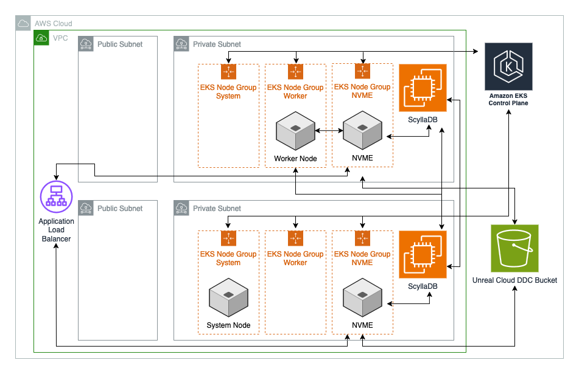

# Unreal Cloud DDC (Derived Data Cache) Module

[](LICENSE)

> **⚠️ CRITICAL REQUIREMENT**
>
> **You MUST have Epic Games GitHub organization access to use this module.** Without access, container image pulls will fail and deployment will not work. Follow the [Epic Games Container Images Quick Start](https://dev.epicgames.com/documentation/en-us/unreal-engine/quick-start-guide-for-using-container-images-in-unreal-engine) to join the organization before proceeding.

## Overview

The **Unreal Cloud DDC Module** deploys Epic Games' Derived Data Cache on AWS using EKS Auto Mode, providing high-performance caching for Unreal Engine development teams. This single Terraform module creates complete DDC infrastructure including EKS cluster, ScyllaDB database, S3 storage, and load balancers.

### Key Features

- **Complete Infrastructure** - EKS cluster, ScyllaDB, S3, load balancers in one module
- **EKS Auto Mode** - Automatic node provisioning with NVMe instance support
- **Multi-Region Support** - Cross-region replication with automatic failover
- **Security by Default** - Private subnets, least privilege IAM, restricted access
- **Epic Games Integration** - Direct GHCR access for official container images
- **Flexible Access** - External (internet) or internal (VPC-only) patterns

### User Personas

| User Type | Responsibilities | Tools Needed |
|-----------|------------------|--------------|
| **DevOps Engineers** | Deploy infrastructure, manage clusters | AWS CLI, kubectl, Terraform |
| **Game Developers** | Configure UE clients, use DDC endpoints | Unreal Engine, network access |
| **Build Engineers** | Integrate with CI/CD pipelines | CI/CD tools, DDC credentials |

## Quick Start

### 1. Prerequisites Check

**Required Access:**
- Epic Games GitHub organization membership
- AWS account with deployment permissions
- Route53 hosted zone for DNS records

**Required Tools:**
```bash
# Install required tools (macOS example)
brew install awscli kubectl helm jq terraform

# Verify versions
aws --version    # v2.12.3+
kubectl version  # cluster version ±1
helm version     # v3.0+
terraform version # v1.11+
```

### 2. Epic Games Setup

Create GitHub Personal Access Token:
1. Go to GitHub Settings → Developer settings → Personal access tokens → Tokens (classic)
2. Generate new token with `read:packages` permission
3. Store in AWS Secrets Manager:

```bash
aws secretsmanager create-secret \
  --name "github-ddc-credentials" \
  --description "GitHub PAT for DDC container images" \
  --secret-string '{"username":"your-github-username","accessToken":"your-personal-access-token"}'
```

### 3. Deploy Example

```bash
# Clone repository
git clone https://github.com/aws-games/cloud-game-development-toolkit.git
cd cloud-game-development-toolkit/modules/unreal/unreal-cloud-ddc/examples/hybrid/single-region/

# Deploy infrastructure
terraform init
terraform plan
terraform apply
```

### 4. Configure Unreal Engine

Add to your project's `Config/DefaultEngine.ini`:

```ini
[DDC]
; Production configuration
Cloud=(Type=HTTPDerivedDataBackend, Host="<DDC_ENDPOINT_FROM_OUTPUT>")

; Optional: Local cache as fallback
Local=(Type=FileSystem, Path=%GAMEDIR%DerivedDataCache, MaxFileAge=60)

; Hierarchical setup (try cloud first, then local)
Hierarchical=(Type=Hierarchical, Inner=Cloud, Inner=Local)
```

### 5. Verify Deployment

```bash
# Get connection details
terraform output

# Test DDC endpoint
curl <DDC_ENDPOINT>/health/live
# Expected: "HEALTHY"
```

## Architecture

### Single Region Architecture


**Core Components:**
- **EKS Cluster** - Kubernetes with EKS Auto Mode for automatic node provisioning
- **ScyllaDB Database** - High-performance metadata storage with configurable replication
- **S3 Bucket** - Object storage for cached game assets
- **Network Load Balancer** - External access with regional DNS endpoints
- **Private Subnets** - All compute resources deployed privately for security

**Traffic Flow:**
```
Game Developers → Public NLB → EKS Cluster → ScyllaDB + S3
(UE Clients)      (Regional DNS)  (DDC Services)   (Cache Storage)
```

### Multi-Region Architecture



**Cross-Region Replication:**
- **Primary Region** - Creates global IAM roles and bearer tokens
- **Secondary Regions** - Use shared resources from primary
- **ScyllaDB Replication** - Automatic cross-region data synchronization
- **Regional DNS** - Optimal routing (e.g., `us-east-1.ddc.example.com`)

## Prerequisites

### Epic Games Access (CRITICAL)

**GitHub Organization Membership:**
1. Must be member of Epic Games GitHub organization
2. Required to pull DDC container images from GHCR
3. Follow [Epic Games Container Images Quick Start](https://dev.epicgames.com/documentation/en-us/unreal-engine/quick-start-guide-for-using-container-images-in-unreal-engine)

**GitHub Personal Access Token:**
- Token with `read:packages` permission
- Stored in AWS Secrets Manager
- Required for container registry authentication

### AWS Infrastructure

**Account Requirements:**
- AWS CLI configured with deployment permissions
- Route53 hosted zone for DNS records
- VPC with public and private subnets

**EKS Auto Mode Subnet Tagging (REQUIRED):**

⚠️ **CRITICAL**: EKS Auto Mode requires specific subnet tags. Examples include these automatically, but verify if using existing subnets:

```bash
# Required tags for public subnets (internet-facing load balancers)
kubernetes.io/role/elb = "1"
kubernetes.io/cluster/<cluster-name> = "owned"

# Required tags for private subnets (internal load balancers)  
kubernetes.io/role/internal-elb = "1"
kubernetes.io/cluster/<cluster-name> = "owned"
```

### Local Development Tools

**Required Tools:**
```bash
# macOS
brew install awscli kubectl helm jq terraform

# Linux (Ubuntu/Debian)
sudo apt-get install awscli kubectl helm jq
# Install Terraform separately: https://developer.hashicorp.com/terraform/install

# Windows (requires WSL or Git Bash)
choco install awscli kubernetes-cli kubernetes-helm jq terraform
```

**Windows Requirements:**
- WSL2 or Git Bash required for DDC application deployment
- Windows Command Prompt/PowerShell can deploy infrastructure only
- Terraform local-exec provisioners use bash scripts

### Network Planning

**Security Configuration:**
- Office/VPN IP ranges for security group access
- VPC CIDR planning for multi-region deployments
- Certificate requirements for HTTPS access

**DNS Requirements:**
- Public hosted zone for certificate validation (hybrid/public access)
- Private hosted zone created automatically for internal routing

## Basic Deployment

### Single Region Configuration

**Minimal Example:**
```hcl
module "unreal_cloud_ddc" {
  source = "../../.."

  # Core Infrastructure
  project_prefix           = "cgd"
  vpc_id                   = aws_vpc.main.id
  certificate_arn          = aws_acm_certificate.ddc.arn
  route53_hosted_zone_name = "yourcompany.com"

  # Load Balancer Configuration
  load_balancers_config = {
    nlb = {
      internet_facing = true
      subnets         = aws_subnet.public[*].id
    }
  }

  # Security
  allowed_external_cidrs = ["203.0.113.0/24"]  # Your office IP

  # DDC Application Configuration
  ddc_application_config = {
    ddc_namespaces = {
      "our-game" = {
        description = "Main game project DDC cache"
      }
    }
  }

  # DDC Infrastructure Configuration
  ddc_infra_config = {
    region                 = "us-east-1"
    eks_node_group_subnets = aws_subnet.private[*].id

    scylla_config = {
      current_region = {
        replication_factor = 3
      }
      subnets = aws_subnet.private[*].id
    }
  }

  # GHCR Credentials
  ghcr_credentials_secret_arn = aws_secretsmanager_secret.github_credentials.arn
}
```

### Deployment Process

**Step 1: Initialize Terraform**
```bash
terraform init
```

**Step 2: Review Changes**
```bash
terraform plan
```

**Step 3: Deploy Infrastructure**
```bash
terraform apply
```

⏱️ **EKS cluster creation takes 15-20 minutes** - this is normal AWS behavior.

**Step 4: Get Connection Details**
```bash
terraform output
```

### Access Patterns

**Private Access (HTTP Internal):**
- All services accessible only within VPC
- Requires VPN/Direct Connect for external access
- HTTP protocol (Epic Games approved for trusted networks)
- No certificates required

**Hybrid Access (HTTPS Split-Horizon):**
- Public requests transition to private infrastructure
- HTTPS required for internet-facing components
- Free ACM Public certificates
- Split-horizon DNS (same domain, different resolution)

**Public Access (HTTPS Public):**
- Fully internet-accessible services
- HTTPS required for internet traffic
- Public DNS records
- Free ACM Public certificates

## Client Configuration

### Unreal Engine Setup

**Get Connection Details:**
```bash
terraform output -json
```

**Basic Configuration (`Config/DefaultEngine.ini`):**
```ini
[DDC]
; Production configuration
Cloud=(Type=HTTPDerivedDataBackend, Host="<DDC_ENDPOINT>")

; Optional: Local cache as fallback
Local=(Type=FileSystem, Path=%GAMEDIR%DerivedDataCache, MaxFileAge=60)

; Hierarchical setup (try cloud first, then local)
Hierarchical=(Type=Hierarchical, Inner=Cloud, Inner=Local)
```

**Multi-Region Configuration:**
```ini
[DDC]
; Primary region
Primary=(Type=HTTPDerivedDataBackend, Host="https://us-east-1.ddc.yourcompany.com")

; Secondary region
Secondary=(Type=HTTPDerivedDataBackend, Host="https://us-west-2.ddc.yourcompany.com")

; Local fallback
Local=(Type=FileSystem, Path=%GAMEDIR%DerivedDataCache, MaxFileAge=60)

; Try in order: primary → secondary → local
Hierarchical=(Type=Hierarchical, Inner=Primary, Inner=Secondary, Inner=Local)
```

### Authentication

**DDC Bearer Token:**
- Automatically generated during deployment
- Stored in AWS Secrets Manager
- Used for DDC API authentication
- Shared across regions in multi-region deployments

**Token Usage:**
```bash
# Get bearer token (for manual testing)
aws secretsmanager get-secret-value --secret-id <token-secret-name> --query SecretString --output text
```

## Verification & Testing

### Automated Testing

**During Deployment:**
The module includes automated validation using Terraform Actions:
- Infrastructure validation (EKS cluster, load balancers)
- Application validation (DDC health, cache operations)
- Multi-region validation (cross-region replication)

**Configuration:**
```hcl
ddc_application_config = {
  # Default: validates DDC works after deployment
  enable_single_region_validation = true

  # For faster CI/CD, disable validation:
  # enable_single_region_validation = false

  # Multi-region: only enable on primary regions
  # enable_multi_region_validation = true
  # peer_region_ddc_endpoint = "https://us-east-1.ddc.example.com"
}
```

### Manual Testing

**Platform Compatibility:**
- ✅ macOS/Linux - Native support
- ✅ Windows with WSL - Run in WSL environment
- ❌ Windows PowerShell/CMD - Use manual verification steps

**Single Region Test:**
```bash
# Run from deployment directory
chmod +x ../../../assets/scripts/ddc_functional_test.sh
../../../assets/scripts/ddc_functional_test.sh
```

**Multi-Region Test:**
```bash
# Run from deployment directory
chmod +x ../../../assets/scripts/ddc_functional_test_multi_region.sh
../../../assets/scripts/ddc_functional_test_multi_region.sh
```

### Manual Verification Steps

**1. Update kubeconfig:**
```bash
aws eks update-kubeconfig --region <region> --name <cluster-name>
```

**2. Check pod status:**
```bash
kubectl get pods -n unreal-cloud-ddc
# Expected: All pods "Running"
```

**3. Test DDC health:**
```bash
curl <DDC_ENDPOINT>/health/live
# Expected: "HEALTHY"
```

**4. Test DDC operations:**
```bash
# PUT operation
curl -X PUT "<DDC_ENDPOINT>/api/v1/refs/ddc/default/00000000000000000000000000000000000000aa" \
  --data "test" \
  -H "content-type: application/octet-stream" \
  -H "X-Jupiter-IoHash: 4878CA0425C739FA427F7EDA20FE845F6B2E46BA" \
  -H "Authorization: ServiceAccount <BEARER_TOKEN>"

# GET operation
curl "<DDC_ENDPOINT>/api/v1/refs/ddc/default/00000000000000000000000000000000000000aa.json" \
  -H "Authorization: ServiceAccount <BEARER_TOKEN>"
```

## Multi-Region Deployment

### Overview

Multi-region DDC deployments require careful coordination between regions to share global resources while maintaining regional isolation.

**Architecture Pattern:**
- **Primary Region** - Creates global IAM roles, OIDC provider, bearer token
- **Secondary Regions** - Use shared global resources from primary region
- **Regional Resources** - Each region creates EKS cluster, ScyllaDB, S3, load balancers

### Critical Requirements

⚠️ **DDC Namespace Consistency**: DDC namespaces MUST be identical across ALL regions (case-sensitive) or cross-region functionality will break.

**Best Practice - Shared Configuration:**
```hcl
locals {
  # Shared DDC namespaces across ALL regions
  shared_ddc_namespaces = {
    "project1" = { description = "Main project" }
    "project2" = { description = "Secondary project" }
  }

  # Shared compute configuration
  shared_compute_config = {
    instance_type    = "i4i.xlarge"
    cpu_requests     = "2000m"
    memory_requests  = "8Gi"
    replica_count    = 2
  }
}
```

### Primary Region Configuration

```hcl
module "unreal_cloud_ddc_primary" {
  source = "../../.."
  region = "us-east-1"

  # Multi-region Configuration - PRIMARY
  is_primary_region = true
  create_bearer_token = true
  bearer_token_replica_regions = ["us-west-1"]
  create_private_dns_records = true

  # DDC Application Configuration (using shared locals)
  ddc_application_config = {
    ddc_namespaces = local.shared_ddc_namespaces  # CRITICAL: Same across regions
    
    instance_type    = local.shared_compute_config.instance_type
    cpu_requests     = local.shared_compute_config.cpu_requests
    memory_requests  = local.shared_compute_config.memory_requests
    replica_count    = local.shared_compute_config.replica_count
  }

  # Infrastructure configuration
  ddc_infra_config = {
    region = "us-east-1"
    scylla_config = {
      current_region = {
        datacenter_name    = "us-east-1"
        replication_factor = 3
      }
      peer_regions = {
        "us-west-1" = {
          datacenter_name    = "us-west-1"
          replication_factor = 2
        }
      }
      enable_cross_region_replication = true
      create_seed_node = true
      subnets = aws_subnet.primary_private[*].id
    }
  }
}
```

### Secondary Region Configuration

```hcl
module "unreal_cloud_ddc_secondary" {
  source = "../../.."
  region = "us-west-1"

  # Multi-region Configuration - SECONDARY
  is_primary_region = false
  create_bearer_token = false
  create_private_dns_records = false

  # DDC Application Configuration (using shared locals)
  ddc_application_config = {
    ddc_namespaces = local.shared_ddc_namespaces  # CRITICAL: Must match primary exactly
    
    instance_type    = local.shared_compute_config.instance_type
    cpu_requests     = local.shared_compute_config.cpu_requests
    memory_requests  = local.shared_compute_config.memory_requests
    replica_count    = local.shared_compute_config.replica_count

    # Use shared bearer token from primary
    bearer_token_secret_arn = module.unreal_cloud_ddc_primary.bearer_token_secret_arn
  }

  # Infrastructure configuration
  ddc_infra_config = {
    region = "us-west-1"

    # Use IAM roles from primary region
    eks_cluster_role_arn = module.unreal_cloud_ddc_primary.iam_roles.eks_cluster_role_arn
    eks_node_group_role_arns = module.unreal_cloud_ddc_primary.iam_roles.eks_node_group_role_arns
    oidc_provider_arn = module.unreal_cloud_ddc_primary.iam_roles.oidc_provider_arn

    scylla_config = {
      current_region = {
        datacenter_name    = "us-west-1"
        replication_factor = 2
      }
      peer_regions = {
        "us-east-1" = {
          datacenter_name    = "us-east-1"
          replication_factor = 3
        }
      }
      enable_cross_region_replication = true
      create_seed_node = false
      existing_scylla_seed = module.unreal_cloud_ddc_primary.ddc_infra.scylla_seed
      scylla_source_region = "us-east-1"
      subnets = aws_subnet.secondary_private[*].id
    }
  }

  depends_on = [module.unreal_cloud_ddc_primary]
}
```

### Deployment Process

**Step 1: Deploy Primary Region First**
```bash
cd examples/hybrid/multi-region/

# Deploy primary region only
terraform plan -target=module.unreal_cloud_ddc_primary
terraform apply -target=module.unreal_cloud_ddc_primary
```

**Step 2: Deploy Secondary Region**
```bash
# Deploy secondary region (uses outputs from primary)
terraform plan -target=module.unreal_cloud_ddc_secondary
terraform apply -target=module.unreal_cloud_ddc_secondary
```

**Step 3: Apply Complete Configuration**
```bash
# Apply any remaining resources
terraform apply
```

### Variable Coordination

| Variable | Primary Region | Secondary Region | Purpose |
|----------|----------------|------------------|---------|
| `is_primary_region` | `true` | `false` | Controls global IAM resource creation |
| `create_bearer_token` | `true` | `false` | Primary creates, secondary uses existing |
| `create_private_dns_records` | `true` | `false` | Avoids DNS record conflicts |
| `bearer_token_replica_regions` | `["us-west-1"]` | Not set | Replicates token to secondary regions |
| `bearer_token_secret_arn` | Not set | From primary output | Secondary uses primary's token |
| `eks_cluster_role_arn` | Not set | From primary output | Secondary uses primary's IAM role |
| `create_seed_node` | `true` | `false` | Primary creates ScyllaDB seed node |
| `existing_scylla_seed` | Not set | From primary output | Secondary connects to primary seed |

### Destroy Process

⚠️ **CRITICAL**: Destroy in reverse order to avoid dependency issues

```bash
# Step 1: Destroy secondary region first
terraform destroy -target=module.unreal_cloud_ddc_secondary

# Step 2: Destroy primary region
terraform destroy -target=module.unreal_cloud_ddc_primary

# Step 3: Clean up remaining resources
terraform destroy
```

## Advanced Configuration

### Compute Configuration (EKS Auto Mode)

**Application-Driven Infrastructure:**
With EKS Auto Mode, the DDC application requests infrastructure (not Terraform):

```hcl
ddc_application_config = {
  # Pod requirements drive node creation
  instance_type    = "i4i.xlarge"  # NVMe for performance
  cpu_requests     = "2000m"       # 2 CPU cores per pod
  memory_requests  = "8Gi"         # 8GB RAM per pod
  replica_count    = 2             # Number of replicas
}
```

**Why NVMe Instances Required:**
- EKS Auto Mode automatically mounts NVMe drives at `/mnt/.ephemeral`
- DDC requires high-speed NVMe storage for optimal cache performance
- Only NVMe instance families supported (i4i, i3, i3en, etc.)

### Security Configuration

**Network Security:**
```hcl
# External access control
allowed_external_cidrs = ["203.0.113.0/24"]  # Office IP ranges
external_prefix_list_id = "pl-12345678"      # Managed prefix list

# EKS API access
ddc_infra_config = {
  endpoint_public_access  = true                    # Internet access to EKS API
  endpoint_private_access = true                    # VPC access to EKS API
  public_access_cidrs     = ["203.0.113.0/24"]     # Restrict internet access
}
```

**Access Patterns:**
- **Private**: VPC-only access, HTTP protocol, no certificates
- **Hybrid**: Public → private transition, HTTPS, free ACM certificates
- **Public**: Full internet access, HTTPS, public DNS

### ScyllaDB Configuration

**Replication Strategy:**
```hcl
scylla_config = {
  current_region = {
    datacenter_name    = "us-east-1"
    replication_factor = 3  # Creates 3 ScyllaDB instances AND stores 3 data copies
  }
  peer_regions = {
    "us-west-1" = {
      datacenter_name    = "us-west-1"
      replication_factor = 2
    }
  }
  enable_cross_region_replication = true
}
```

**Performance Tuning:**
```hcl
scylla_config = {
  scylla_instance_type = "i4i.2xlarge"  # High-performance instances
  scylla_db_storage    = 100            # GB of additional storage
  scylla_db_throughput = 200            # IOPS throughput
}
```

### DNS Configuration

**Regional DNS Pattern:**
- Primary: `us-east-1.ddc.yourcompany.com`
- Secondary: `us-west-1.ddc.yourcompany.com`
- Private: `scylla.ddc.cgd.internal` (internal routing)

**Custom DNS:**
```hcl
route53_hosted_zone_name = "yourcompany.com"  # Public hosted zone
# Creates: us-east-1.ddc.yourcompany.com
```

### Logging Configuration

**Centralized Logging:**
```hcl
enable_centralized_logging = true
log_retention_days         = 30
log_group_prefix          = "/aws/cgd-toolkit"
```

**Log Groups Created:**
- `/aws/cgd-toolkit/unreal-cloud-ddc/infrastructure`
- `/aws/cgd-toolkit/unreal-cloud-ddc/application`
- `/aws/cgd-toolkit/unreal-cloud-ddc/service`

## Troubleshooting

### Critical Requirements

⚠️ **NEVER Use Default VPC/Subnets/Route Tables**

**You MUST use custom networking resources** (not AWS account defaults):

**✅ REQUIRED Pattern:**
```hcl
# Create custom VPC and networking
resource "aws_vpc" "main" {
  cidr_block           = "10.0.0.0/16"
  enable_dns_hostnames = true
  enable_dns_support   = true
}

# Create custom route tables (NOT default)
resource "aws_route_table" "public" {
  vpc_id = aws_vpc.main.id
}
```

**❌ NEVER Do This:**
```hcl
# DON'T use AWS account default VPC
data "aws_vpc" "default" {
  default = true  # This will cause destroy failures
}
```

### Common Issues

#### 1. Terraform Destroy Hangs on Internet Gateway

**Symptoms:**
```
aws_internet_gateway.igw: Still destroying... [20m00s elapsed]
Error: DependencyViolation: Network vpc-xxx has some mapped public address(es)
```

**Root Cause:** Using default route tables or improper networking setup

**Solution:** Use custom route tables (see examples for correct pattern)

#### 2. TargetGroupBinding Issues

**Symptoms:** TargetGroupBinding shows `Ready=False`, DDC service unreachable

**Diagnosis:**
```bash
kubectl describe targetgroupbinding <name-prefix>-tgb -n <namespace>
kubectl logs -n kube-system deployment/aws-load-balancer-controller
```

**Common Fixes:**
- Check subnet alignment between target group and pods
- Verify security group allows traffic
- Ensure pods are ready and healthy

#### 3. GitHub Container Registry Access Denied

**Symptoms:** Pod image pull failures, `ImagePullBackOff` status

**Solutions:**
1. Verify Epic Games organization membership
2. Check GitHub PAT has `packages:read` permission
3. Confirm secret format in AWS Secrets Manager

#### 4. DDC API Connection Timeout

**Diagnosis Steps:**
```bash
# Check your IP is allowed
curl https://checkip.amazonaws.com/
# Verify this IP is in allowed_external_cidrs

# Test DNS resolution
nslookup us-east-1.ddc.yourcompany.com

# Check EKS cluster status
aws eks update-kubeconfig --region <region> --name <cluster-name>
kubectl get nodes
```

### Debug Commands

**Network Diagnostics:**
```bash
curl https://checkip.amazonaws.com/
nslookup <ddc-endpoint>
```

**Kubernetes Diagnostics:**
```bash
aws eks update-kubeconfig --region <region> --name <cluster-name>
kubectl get nodes
kubectl get pods -n unreal-cloud-ddc
kubectl logs -f <pod-name> -n unreal-cloud-ddc
```

**AWS Resource Diagnostics:**
```bash
aws ec2 describe-vpcs --vpc-ids <vpc-id>
aws ec2 describe-route-tables --filters "Name=vpc-id,Values=<vpc-id>"
aws ec2 describe-network-interfaces --filters "Name=vpc-id,Values=<vpc-id>"
```

### Safe Destroy Process

**Recommended Approach:**
```bash
# 1. Verify correct directory
pwd
ls terraform.tfstate  # Should exist

# 2. Generate destroy plan (optional)
terraform plan -destroy > destroy_plan.txt

# 3. Execute destroy
terraform destroy -auto-approve
```

**If Destroy Fails:**
```bash
# Clean up TargetGroupBinding manually
aws eks update-kubeconfig --region <region> --name <cluster-name>
kubectl delete targetgroupbinding --all -n <namespace> --ignore-not-found=true

# Wait 2-3 minutes for ENI cleanup, then retry
terraform destroy
```

## Examples

Complete examples with VPC setup, security groups, and detailed instructions:

- **[Single Region](examples/hybrid/single-region/)** - Basic deployment for most use cases
- **[Multi-Region](examples/hybrid/multi-region/)** - Global teams with cross-region replication

Examples use hybrid access pattern (public → private) with both public and private EKS API endpoints for flexible access patterns.

## Reference

### Module Interface

**Core Variables:**
- `project_prefix` - Resource naming prefix
- `vpc_id` - VPC for deployment
- `certificate_arn` - ACM certificate for HTTPS
- `route53_hosted_zone_name` - DNS zone for records

**Configuration Objects:**
- `ddc_application_config` - DDC app settings, namespaces, compute
- `ddc_infra_config` - EKS, ScyllaDB, networking configuration
- `load_balancers_config` - NLB settings and subnets

**Security:**
- `allowed_external_cidrs` - IP allowlist for external access
- `eks_access_entries` - Additional EKS cluster access

### Key Outputs

**Connection Information:**
- `ddc_connection.endpoint` - DDC service URL
- `ddc_connection.bearer_token_secret_arn` - Authentication token
- `kubectl_command` - EKS cluster access command

**Multi-Region Sharing:**
- `iam_roles` - Shared IAM roles for secondary regions
- `bearer_token_secret_arn` - Shared authentication token

### Namespace Architecture

**Three Distinct Namespace Types:**

1. **Kubernetes Namespace** - Infrastructure container (`unreal-cloud-ddc`)
2. **DDC Logical Namespaces** - Game project isolation (URL paths)
3. **ScyllaDB Keyspaces** - Database schema isolation (1:1 with DDC namespaces)

**Data Flow:**
```
URL: /api/v1/refs/project1/default/hash
 ↓
DDC Service: Routes to "project1" namespace
 ↓
ScyllaDB: Queries "project1" keyspace
 ↓
S3: Retrieves from "project1/" prefix
```

### Known AWS Service Issues

The module includes automatic workarounds for known AWS service bugs:

**EKS Auto Mode Security Group Cleanup Bug:**
- EKS creates security groups but fails to clean them up
- Module includes automatic cleanup with 30-minute retry logic
- Only affects deployments with LoadBalancer services

**External-DNS Record Cleanup Bug:**
- External-DNS creates DNS records but doesn't clean them up
- Module includes automatic cleanup during destroy

These are upstream AWS service limitations, not module issues.

<!-- markdownlint-disable -->
<!-- BEGIN_TF_DOCS -->
## Requirements

| Name | Version |
|------|---------|
| <a name="requirement_terraform"></a> [terraform](#requirement\_terraform) | >= 1.11 |
| <a name="requirement_aws"></a> [aws](#requirement\_aws) | >= 6.0.0 |
| <a name="requirement_awscc"></a> [awscc](#requirement\_awscc) | >= 1.0.0 |
| <a name="requirement_helm"></a> [helm](#requirement\_helm) | >= 2.16.0, < 3.0.0 |
| <a name="requirement_null"></a> [null](#requirement\_null) | >= 3.1 |
| <a name="requirement_random"></a> [random](#requirement\_random) | >= 3.1 |
| <a name="requirement_time"></a> [time](#requirement\_time) | >= 0.9 |

## Providers

| Name | Version |
|------|---------|
| <a name="provider_aws"></a> [aws](#provider\_aws) | >= 6.0.0 |
| <a name="provider_http"></a> [http](#provider\_http) | n/a |
| <a name="provider_random"></a> [random](#provider\_random) | >= 3.1 |

## Modules

| Name | Source | Version |
|------|--------|---------|
| <a name="module_ddc_app"></a> [ddc\_app](#module\_ddc\_app) | ./modules/ddc-app | n/a |
| <a name="module_ddc_infra"></a> [ddc\_infra](#module\_ddc\_infra) | ./modules/ddc-infra | n/a |

## Resources

| Name | Type |
|------|------|
| [aws_cloudwatch_log_group.logs](https://registry.terraform.io/providers/hashicorp/aws/latest/docs/resources/cloudwatch_log_group) | resource |
| [aws_lb.nlb](https://registry.terraform.io/providers/hashicorp/aws/latest/docs/resources/lb) | resource |
| [aws_lb_listener.http](https://registry.terraform.io/providers/hashicorp/aws/latest/docs/resources/lb_listener) | resource |
| [aws_lb_listener.https](https://registry.terraform.io/providers/hashicorp/aws/latest/docs/resources/lb_listener) | resource |
| [aws_lb_target_group.nlb_target_group](https://registry.terraform.io/providers/hashicorp/aws/latest/docs/resources/lb_target_group) | resource |
| [aws_route53_record.scylla_cluster](https://registry.terraform.io/providers/hashicorp/aws/latest/docs/resources/route53_record) | resource |
| [aws_route53_record.scylla_nodes](https://registry.terraform.io/providers/hashicorp/aws/latest/docs/resources/route53_record) | resource |
| [aws_route53_record.service_private](https://registry.terraform.io/providers/hashicorp/aws/latest/docs/resources/route53_record) | resource |
| [aws_route53_zone.private](https://registry.terraform.io/providers/hashicorp/aws/latest/docs/resources/route53_zone) | resource |
| [aws_route53_zone_association.additional_vpcs](https://registry.terraform.io/providers/hashicorp/aws/latest/docs/resources/route53_zone_association) | resource |
| [aws_s3_bucket.logs](https://registry.terraform.io/providers/hashicorp/aws/latest/docs/resources/s3_bucket) | resource |
| [aws_s3_bucket_policy.logs_policy](https://registry.terraform.io/providers/hashicorp/aws/latest/docs/resources/s3_bucket_policy) | resource |
| [aws_secretsmanager_secret.unreal_cloud_ddc_token](https://registry.terraform.io/providers/hashicorp/aws/latest/docs/resources/secretsmanager_secret) | resource |
| [aws_secretsmanager_secret_version.unreal_cloud_ddc_token](https://registry.terraform.io/providers/hashicorp/aws/latest/docs/resources/secretsmanager_secret_version) | resource |
| [aws_security_group.internal](https://registry.terraform.io/providers/hashicorp/aws/latest/docs/resources/security_group) | resource |
| [aws_security_group.nlb](https://registry.terraform.io/providers/hashicorp/aws/latest/docs/resources/security_group) | resource |
| [aws_ssm_association.scylla_keyspace_replication_fix](https://registry.terraform.io/providers/hashicorp/aws/latest/docs/resources/ssm_association) | resource |
| [aws_ssm_document.scylla_keyspace_replication_fix](https://registry.terraform.io/providers/hashicorp/aws/latest/docs/resources/ssm_document) | resource |
| [aws_vpc_endpoint.eks](https://registry.terraform.io/providers/hashicorp/aws/latest/docs/resources/vpc_endpoint) | resource |
| [aws_vpc_endpoint.logs](https://registry.terraform.io/providers/hashicorp/aws/latest/docs/resources/vpc_endpoint) | resource |
| [aws_vpc_endpoint.s3](https://registry.terraform.io/providers/hashicorp/aws/latest/docs/resources/vpc_endpoint) | resource |
| [aws_vpc_endpoint.secretsmanager](https://registry.terraform.io/providers/hashicorp/aws/latest/docs/resources/vpc_endpoint) | resource |
| [aws_vpc_endpoint.ssm](https://registry.terraform.io/providers/hashicorp/aws/latest/docs/resources/vpc_endpoint) | resource |
| [aws_vpc_security_group_egress_rule.internal_egress](https://registry.terraform.io/providers/hashicorp/aws/latest/docs/resources/vpc_security_group_egress_rule) | resource |
| [aws_vpc_security_group_egress_rule.nlb_egress](https://registry.terraform.io/providers/hashicorp/aws/latest/docs/resources/vpc_security_group_egress_rule) | resource |
| [aws_vpc_security_group_egress_rule.nlb_to_cluster](https://registry.terraform.io/providers/hashicorp/aws/latest/docs/resources/vpc_security_group_egress_rule) | resource |
| [aws_vpc_security_group_ingress_rule.cluster_from_nlb](https://registry.terraform.io/providers/hashicorp/aws/latest/docs/resources/vpc_security_group_ingress_rule) | resource |
| [aws_vpc_security_group_ingress_rule.internal_scylla_cql](https://registry.terraform.io/providers/hashicorp/aws/latest/docs/resources/vpc_security_group_ingress_rule) | resource |
| [aws_vpc_security_group_ingress_rule.nlb_from_users](https://registry.terraform.io/providers/hashicorp/aws/latest/docs/resources/vpc_security_group_ingress_rule) | resource |
| [aws_vpc_security_group_ingress_rule.nlb_http_cidrs](https://registry.terraform.io/providers/hashicorp/aws/latest/docs/resources/vpc_security_group_ingress_rule) | resource |
| [aws_vpc_security_group_ingress_rule.nlb_http_prefix](https://registry.terraform.io/providers/hashicorp/aws/latest/docs/resources/vpc_security_group_ingress_rule) | resource |
| [aws_vpc_security_group_ingress_rule.nlb_http_vpc](https://registry.terraform.io/providers/hashicorp/aws/latest/docs/resources/vpc_security_group_ingress_rule) | resource |
| [aws_vpc_security_group_ingress_rule.nlb_https_cidrs](https://registry.terraform.io/providers/hashicorp/aws/latest/docs/resources/vpc_security_group_ingress_rule) | resource |
| [aws_vpc_security_group_ingress_rule.nlb_https_prefix](https://registry.terraform.io/providers/hashicorp/aws/latest/docs/resources/vpc_security_group_ingress_rule) | resource |
| [aws_vpc_security_group_ingress_rule.nlb_https_vpc](https://registry.terraform.io/providers/hashicorp/aws/latest/docs/resources/vpc_security_group_ingress_rule) | resource |
| [random_id.suffix](https://registry.terraform.io/providers/hashicorp/random/latest/docs/resources/id) | resource |
| [random_password.ddc_token](https://registry.terraform.io/providers/hashicorp/random/latest/docs/resources/password) | resource |
| [random_string.bearer_token_suffix](https://registry.terraform.io/providers/hashicorp/random/latest/docs/resources/string) | resource |
| [aws_caller_identity.current](https://registry.terraform.io/providers/hashicorp/aws/latest/docs/data-sources/caller_identity) | data source |
| [aws_elb_service_account.main](https://registry.terraform.io/providers/hashicorp/aws/latest/docs/data-sources/elb_service_account) | data source |
| [aws_iam_policy_document.logs_policy](https://registry.terraform.io/providers/hashicorp/aws/latest/docs/data-sources/iam_policy_document) | data source |
| [aws_region.current](https://registry.terraform.io/providers/hashicorp/aws/latest/docs/data-sources/region) | data source |
| [aws_secretsmanager_secret_version.existing_token](https://registry.terraform.io/providers/hashicorp/aws/latest/docs/data-sources/secretsmanager_secret_version) | data source |
| [aws_vpc.main](https://registry.terraform.io/providers/hashicorp/aws/latest/docs/data-sources/vpc) | data source |
| [http_http.my_ip](https://registry.terraform.io/providers/hashicorp/http/latest/docs/data-sources/http) | data source |

## Inputs

| Name | Description | Type | Default | Required |
|------|-------------|------|---------|:--------:|
| <a name="input_additional_vpc_associations"></a> [additional\_vpc\_associations](#input\_additional\_vpc\_associations) | Additional VPCs to associate with private zone (for cross-region access) | <pre>map(object({<br>    vpc_id = string<br>    region = string<br>  }))</pre> | `null` | no |
| <a name="input_allowed_external_cidrs"></a> [allowed\_external\_cidrs](#input\_allowed\_external\_cidrs) | CIDR blocks for external access. Use prefix lists for multiple IPs. | `list(string)` | `null` | no |
| <a name="input_bearer_token_replica_regions"></a> [bearer\_token\_replica\_regions](#input\_bearer\_token\_replica\_regions) | List of AWS regions to replicate the bearer token secret to for multi-region access | `list(string)` | `null` | no |
| <a name="input_certificate_arn"></a> [certificate\_arn](#input\_certificate\_arn) | ACM certificate ARN for HTTPS listeners (required for internet-facing services unless debug\_mode enabled) | `string` | `null` | no |
| <a name="input_create_bearer_token"></a> [create\_bearer\_token](#input\_create\_bearer\_token) | Create new DDC bearer token secret. Set to false in secondary regions to use existing token from primary region. | `bool` | `true` | no |
| <a name="input_create_private_dns_records"></a> [create\_private\_dns\_records](#input\_create\_private\_dns\_records) | Create private DNS records (set to false for secondary regions to avoid conflicts) | `bool` | `true` | no |
| <a name="input_ddc_application_config"></a> [ddc\_application\_config](#input\_ddc\_application\_config) | DDC application configuration with flattened structure | `object` | `{}` | no |
| <a name="input_ddc_infra_config"></a> [ddc\_infra\_config](#input\_ddc\_infra\_config) | Configuration object for DDC infrastructure (EKS, ScyllaDB, NLB, Kubernetes resources) | `object` | `null` | no |
| <a name="input_debug"></a> [debug](#input\_debug) | Enable debug mode for detailed troubleshooting output | `bool` | `false` | no |
| <a name="input_debug_mode"></a> [debug\_mode](#input\_debug\_mode) | Debug mode for development and troubleshooting | `string` | `"disabled"` | no |
| <a name="input_eks_access_entries"></a> [eks\_access\_entries](#input\_eks\_access\_entries) | EKS access entries for granting cluster access to additional IAM principals | `map(object)` | `{}` | no |
| <a name="input_enable_centralized_logging"></a> [enable\_centralized\_logging](#input\_enable\_centralized\_logging) | Enable centralized logging with CloudWatch log groups | `bool` | `false` | no |
| <a name="input_environment"></a> [environment](#input\_environment) | Environment name for deployment (dev, staging, prod, etc.) | `string` | `"dev"` | no |
| <a name="input_external_prefix_list_id"></a> [external\_prefix\_list\_id](#input\_external\_prefix\_list\_id) | Managed prefix list ID for external access | `string` | `null` | no |
| <a name="input_ghcr_credentials_secret_arn"></a> [ghcr\_credentials\_secret\_arn](#input\_ghcr\_credentials\_secret\_arn) | ARN of AWS Secrets Manager secret containing GitHub credentials for Epic Games container registry access | `string` | `null` | no |
| <a name="input_is_primary_region"></a> [is\_primary\_region](#input\_is\_primary\_region) | Whether this is the primary region (for future use) | `bool` | `true` | no |
| <a name="input_load_balancers_config"></a> [load\_balancers\_config](#input\_load\_balancers\_config) | Load balancers configuration. Supports conditional creation based on presence. | `object` | `null` | no |
| <a name="input_log_group_prefix"></a> [log\_group\_prefix](#input\_log\_group\_prefix) | Prefix for CloudWatch log group names | `string` | `""` | no |
| <a name="input_log_retention_days"></a> [log\_retention\_days](#input\_log\_retention\_days) | CloudWatch log retention period in days | `number` | `30` | no |
| <a name="input_name"></a> [name](#input\_name) | Name for this workload | `string` | `"unreal-cloud-ddc"` | no |
| <a name="input_project_prefix"></a> [project\_prefix](#input\_project\_prefix) | The project prefix for this workload | `string` | `"cgd"` | no |
| <a name="input_region"></a> [region](#input\_region) | AWS region to deploy resources to | `string` | `null` | no |
| <a name="input_route53_hosted_zone_name"></a> [route53\_hosted\_zone\_name](#input\_route53\_hosted\_zone\_name) | The name of the public Route53 Hosted Zone for DDC resources | `string` | `null` | no |
| <a name="input_ssm_retry_config"></a> [ssm\_retry\_config](#input\_ssm\_retry\_config) | SSM automation retry configuration for DDC keyspace initialization | `object` | Default retry config | no |
| <a name="input_tags"></a> [tags](#input\_tags) | Tags to apply to resources | `map(any)` | Default tags | no |
| <a name="input_vpc_endpoints"></a> [vpc\_endpoints](#input\_vpc\_endpoints) | VPC endpoints configuration for private AWS API access | `object` | `null` | no |
| <a name="input_vpc_id"></a> [vpc\_id](#input\_vpc\_id) | VPC ID where resources will be created | `string` | n/a | yes |

## Outputs

| Name | Description |
|------|-------------|
| <a name="output_access_logs"></a> [access\_logs](#output\_access\_logs) | Access logs configuration |
| <a name="output_bearer_token_secret_arn"></a> [bearer\_token\_secret\_arn](#output\_bearer\_token\_secret\_arn) | ARN of the DDC bearer token secret |
| <a name="output_ddc_connection"></a> [ddc\_connection](#output\_ddc\_connection) | DDC connection information for this region |
| <a name="output_ddc_infra"></a> [ddc\_infra](#output\_ddc\_infra) | DDC infrastructure outputs |
| <a name="output_ddc_namespaces"></a> [ddc\_namespaces](#output\_ddc\_namespaces) | DDC namespace configuration |
| <a name="output_ddc_services"></a> [ddc\_services](#output\_ddc\_services) | DDC services outputs |
| <a name="output_default_ddc_namespace"></a> [default\_ddc\_namespace](#output\_default\_ddc\_namespace) | Default DDC logical namespace for API URLs and test scripts |
| <a name="output_dns_endpoints"></a> [dns\_endpoints](#output\_dns\_endpoints) | DNS endpoints for DDC services |
| <a name="output_iam_roles"></a> [iam\_roles](#output\_iam\_roles) | IAM role ARNs for sharing across regions |
| <a name="output_internet_facing"></a> [internet\_facing](#output\_internet\_facing) | Whether load balancers are internet-facing or internal |
| <a name="output_kubectl_command"></a> [kubectl\_command](#output\_kubectl\_command) | kubectl command to connect to EKS cluster |
| <a name="output_load_balancers"></a> [load\_balancers](#output\_load\_balancers) | Load balancer information |
| <a name="output_module_info"></a> [module\_info](#output\_module\_info) | Module metadata and configuration summary |
| <a name="output_name_prefix"></a> [name\_prefix](#output\_name\_prefix) | Standardized name prefix for consistent resource naming |
| <a name="output_nlb_arns"></a> [nlb\_arns](#output\_nlb\_arns) | List of NLB ARNs created by the module |
| <a name="output_nlb_dns_name"></a> [nlb\_dns\_name](#output\_nlb\_dns\_name) | NLB DNS name |
| <a name="output_nlb_zone_id"></a> [nlb\_zone\_id](#output\_nlb\_zone\_id) | NLB zone ID |
| <a name="output_private_zone_name"></a> [private\_zone\_name](#output\_private\_zone\_name) | Private hosted zone name |
| <a name="output_scylla_alter_commands"></a> [scylla\_alter\_commands](#output\_scylla\_alter\_commands) | Generated ALTER commands for ScyllaDB keyspace replication |
| <a name="output_scylla_configuration"></a> [scylla\_configuration](#output\_scylla\_configuration) | ScyllaDB configuration details for debugging and validation |
| <a name="output_scylla_connection_info"></a> [scylla\_connection\_info](#output\_scylla\_connection\_info) | ScyllaDB connection information |
| <a name="output_security_groups"></a> [security\_groups](#output\_security\_groups) | Security group IDs created by this module |
| <a name="output_shared_private_zone_id"></a> [shared\_private\_zone\_id](#output\_shared\_private\_zone\_id) | Private hosted zone ID for cross-region DNS sharing |
| <a name="output_ssm_automation"></a> [ssm\_automation](#output\_ssm\_automation) | SSM automation configuration for keyspace fixes |
| <a name="output_version_info"></a> [version\_info](#output\_version\_info) | Version information for multi-region consistency checks |
| <a name="output_vpc_endpoints"></a> [vpc\_endpoints](#output\_vpc\_endpoints) | VPC endpoint information including IDs and DNS names |
<!-- END_TF_DOCS -->
<!-- markdownlint-enable -->

## Contributing

See the [Contributing Guidelines](../../../CONTRIBUTING.md) for information on contributing to this project.

## License

This project is licensed under the MIT-0 License. See the [LICENSE](../../../LICENSE) file for details.

---

> **📖 For complete DDC setup and configuration guidance, see the [Epic Games DDC Documentation](https://dev.epicgames.com/documentation/en-us/unreal-engine/how-to-set-up-a-cloud-type-derived-data-cache-for-unreal-engine).**