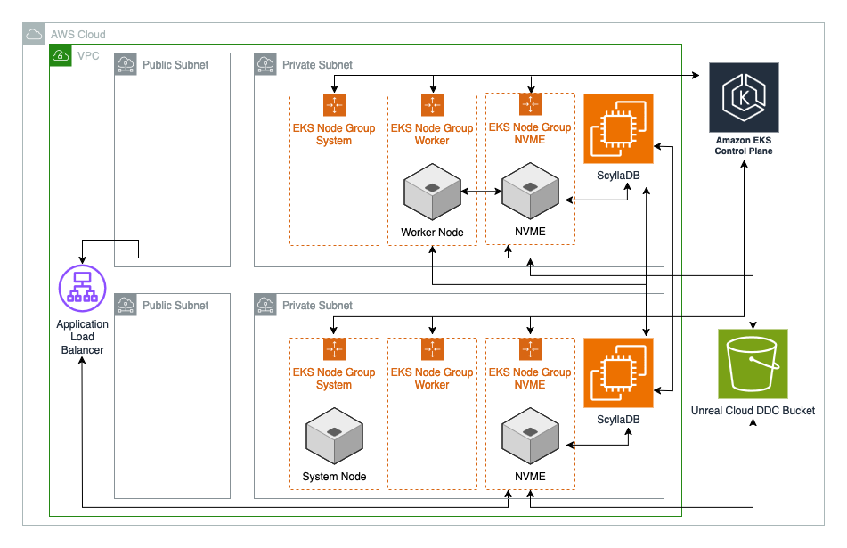

# Unreal Cloud DDC Single Region

This example deploys **[Unreal Cloud DDC](https://github.com/EpicGames/UnrealEngine/tree/release/Engine/Source/Programs/UnrealCloudDDC)** in a single AWS region. The deployment is a comprehensive solution that leverages several AWS services to create a robust and efficient data caching system. It uses a well-designed Virtual Private Cloud (VPC) to ensure network isolation and security, employs an Amazon Elastic Kubernetes Service (EKS) Cluster with Node Groups to manage and orchestrate containerized applications, and includes an instance of ScyllaDB, a high-performance NoSQL database, running on specially optimized Amazon EC2 instances. The Unreal Cloud Derived Data Cache Container is managed by Helm and uses Amazon S3 for durable storage.

## Architecture



## Important

### Provider Configuration

This example uses a unified module that supports both single and multi-region deployments. **All provider aliases must be defined even for single-region deployments** due to the module's design. For single-region, point the secondary providers to the same configurations as primary:

```hcl
providers = {
  aws.primary        = aws          # Creates AWS resources (EKS, EC2, S3)
  aws.secondary      = aws          # Required but unused for single-region
  awscc.primary      = awscc        # Creates AWS Cloud Control resources
  awscc.secondary    = awscc        # Required but unused for single-region
  kubernetes.primary = kubernetes   # Deploys to EKS cluster
  kubernetes.secondary = kubernetes # Required but unused for single-region
  helm.primary       = helm         # Installs Helm charts
  helm.secondary     = helm         # Required but unused for single-region
}
```

### Region Configuration

**Important**: The deployment will create resources in the **exact region specified** in the `regions` variable, regardless of your AWS CLI/session default region.

```hcl
regions = {
  primary = { region = "us-east-1" }  # Resources deployed HERE, not your session region
}
```

**Key constraints:**
- Keys must be exactly `"primary"` (cannot use `"main"`, `"east"`, etc.)
- Region string must be explicit (not `data.aws_region.current.name`)
- Your AWS session region does **not** affect where resources are deployed

**⚠️ Avoid using data sources for regions:**
```hcl
# DON'T DO THIS - risky and unpredictable
regions = {
  primary = { region = data.aws_region.current.name }
}

# DO THIS - explicit and safe
regions = {
  primary = { region = "us-east-1" }
}
```

**Why explicit regions are safer:**
- **Predictable**: Always deploys to the same region
- **Team-safe**: Works regardless of individual AWS profile configurations
- **CI/CD-safe**: No dependency on runtime environment
- **Change-safe**: Won't propose region changes when team members have different default regions

### GitHub Credentials Setup

Before deployment, you must create GitHub credentials in AWS Secrets Manager **in the same region** as your deployment (matching your `regions.primary.region` value) to access the Unreal Cloud DDC container image. The secret must be prefixed with `ecr-pullthroughcache/` and follow the naming pattern `ecr-pullthroughcache/{project_prefix}-{name}-github-credentials`.

Example secret name: `ecr-pullthroughcache/cgd-unreal-cloud-ddc-github-credentials`

Secret format:
```json
{
  "username": "GITHUB-USER-NAME",
  "accessToken": "GITHUB-ACCESS-TOKEN"
}
```

### Deployment Time

The deployment takes approximately 30 minutes, with EKS cluster and node group creation requiring around 20 minutes.

### Post-Deployment

The example deploys Route53 DNS records for accessing your Unreal DDC services:
- **DDC Service**: `ddc.<your-domain>` - Main DDC API endpoint
- **Monitoring**: `monitoring.ddc.<your-domain>` - ScyllaDB monitoring dashboard

Where `<your-domain>` is the value you provided for `route53_public_hosted_zone_name`.

**DNS Record Locations:**
- **Public Records**: All DNS records are created in your existing **public hosted zone**
- **Private Zone**: The module also creates a private hosted zone for internal service discovery

These records point to load balancers which may take additional time to become fully available after deployment completes. You can view the provisioning status in the EC2 Load Balancing console.

The Unreal Cloud DDC module creates a Service Account and valid bearer token for testing. This bearer token is stored in AWS Secrets Manager.

### Post-Deployment Testing

#### Quick Sanity Check
After deployment, test your setup using the provided sanity check script:

```bash
cd assets
./sanity_check.sh
```

This script automatically tests the DDC API by putting and getting test data.

#### Manual Testing
To manually validate you can put an object:

```bash
curl http://<unreal_ddc_url>/api/v1/refs/ddc/default/00000000000000000000000000000000000000aa -X PUT --data 'test' -H 'content-type: application/octet-stream' -H 'X-Jupiter-IoHash: 4878CA0425C739FA427F7EDA20FE845F6B2E46BA' -i -H 'Authorization: ServiceAccount <secret-manager-token>'
```

#### Comprehensive Testing
For comprehensive testing, use the [benchmarking tools](https://github.com/EpicGames/UnrealEngine/tree/release/Engine/Source/Programs/UnrealCloudDDC/Benchmarks) with an x2idn.32xlarge instance:

```bash
docker run --network host jupiter_benchmark --seed --seed-remote --host http://<unreal_ddc_url> --namespace ddc \
--header="Authorization: ServiceAccount <unreal-cloud-ddc-bearer-token>" all
```

**Note**: Specify the namespace as `ddc` since the token only has access to that namespace.

### Monitoring

The deployment includes a ScyllaDB monitoring stack with Prometheus, Alertmanager, and Grafana for real-time insights into database performance. Access the Grafana dashboard using the `monitoring_url` provided in the Terraform outputs. For more information, see the [ScyllaDB Monitoring Stack Documentation](https://monitoring.docs.scylladb.com/branch-4.10/intro.html).

### Production Recommendations

**It is recommended that for production use you change the authentication mode from Service Account to Bearer and use an IDP for authentication with TLS termination.**

<!-- BEGIN_TF_DOCS -->
## Requirements

| Name | Version |
|------|---------|
| <a name="requirement_terraform"></a> [terraform](#requirement\_terraform) | >= 1.10.3 |
| <a name="requirement_aws"></a> [aws](#requirement\_aws) | >=6.2.0 |
| <a name="requirement_awscc"></a> [awscc](#requirement\_awscc) | >= 1.26.0 |
| <a name="requirement_helm"></a> [helm](#requirement\_helm) | >= 2.9.0, < 3.0.0 |
| <a name="requirement_http"></a> [http](#requirement\_http) | >= 3.4.5 |
| <a name="requirement_kubernetes"></a> [kubernetes](#requirement\_kubernetes) | >= 2.24.0 |
| <a name="requirement_null"></a> [null](#requirement\_null) | >=3.2.0 |
| <a name="requirement_random"></a> [random](#requirement\_random) | 3.7.2 |

## Providers

| Name | Version |
|------|---------|
| <a name="provider_aws"></a> [aws](#provider\_aws) | 6.2.0 |
| <a name="provider_awscc"></a> [awscc](#provider\_awscc) | 1.49.0 |
| <a name="provider_http"></a> [http](#provider\_http) | 3.5.0 |

## Modules

| Name | Source | Version |
|------|--------|---------|
| <a name="module_unreal_cloud_ddc_infra"></a> [unreal\_cloud\_ddc\_infra](#module\_unreal\_cloud\_ddc\_infra) | ../../modules/unreal/unreal-cloud-ddc/unreal-cloud-ddc-infra | n/a |
| <a name="module_unreal_cloud_ddc_intra_cluster"></a> [unreal\_cloud\_ddc\_intra\_cluster](#module\_unreal\_cloud\_ddc\_intra\_cluster) | ../../modules/unreal/unreal-cloud-ddc/unreal-cloud-ddc-intra-cluster | n/a |
| <a name="module_unreal_cloud_ddc_vpc"></a> [unreal\_cloud\_ddc\_vpc](#module\_unreal\_cloud\_ddc\_vpc) | ./vpc | n/a |

## Resources

| Name | Type |
|------|------|
| [aws_acm_certificate.scylla_monitoring](https://registry.terraform.io/providers/hashicorp/aws/latest/docs/resources/acm_certificate) | resource |
| [aws_acm_certificate_validation.scylla_monitoring](https://registry.terraform.io/providers/hashicorp/aws/latest/docs/resources/acm_certificate_validation) | resource |
| [aws_route53_record.scylla_monitoring](https://registry.terraform.io/providers/hashicorp/aws/latest/docs/resources/route53_record) | resource |
| [aws_route53_record.scylla_monitoring_cert](https://registry.terraform.io/providers/hashicorp/aws/latest/docs/resources/route53_record) | resource |
| [aws_route53_record.unreal_cloud_ddc](https://registry.terraform.io/providers/hashicorp/aws/latest/docs/resources/route53_record) | resource |
| [aws_security_group.unreal_ddc_load_balancer_access_security_group](https://registry.terraform.io/providers/hashicorp/aws/latest/docs/resources/security_group) | resource |
| [aws_vpc_security_group_egress_rule.unreal_ddc_load_balancer_egress_sg_rules](https://registry.terraform.io/providers/hashicorp/aws/latest/docs/resources/vpc_security_group_egress_rule) | resource |
| [aws_vpc_security_group_ingress_rule.unreal_ddc_load_balancer_http2_ingress_rule](https://registry.terraform.io/providers/hashicorp/aws/latest/docs/resources/vpc_security_group_ingress_rule) | resource |
| [aws_vpc_security_group_ingress_rule.unreal_ddc_load_balancer_http_ingress_rule](https://registry.terraform.io/providers/hashicorp/aws/latest/docs/resources/vpc_security_group_ingress_rule) | resource |
| [aws_vpc_security_group_ingress_rule.unreal_ddc_load_balancer_https_ingress_rule](https://registry.terraform.io/providers/hashicorp/aws/latest/docs/resources/vpc_security_group_ingress_rule) | resource |
| [awscc_secretsmanager_secret.unreal_cloud_ddc_token](https://registry.terraform.io/providers/hashicorp/awscc/latest/docs/resources/secretsmanager_secret) | resource |
| [aws_availability_zones.available](https://registry.terraform.io/providers/hashicorp/aws/latest/docs/data-sources/availability_zones) | data source |
| [aws_caller_identity.current](https://registry.terraform.io/providers/hashicorp/aws/latest/docs/data-sources/caller_identity) | data source |
| [aws_ecr_authorization_token.token](https://registry.terraform.io/providers/hashicorp/aws/latest/docs/data-sources/ecr_authorization_token) | data source |
| [aws_region.current](https://registry.terraform.io/providers/hashicorp/aws/latest/docs/data-sources/region) | data source |
| [aws_route53_zone.root](https://registry.terraform.io/providers/hashicorp/aws/latest/docs/data-sources/route53_zone) | data source |
| [aws_secretsmanager_secret_version.unreal_cloud_ddc_token](https://registry.terraform.io/providers/hashicorp/aws/latest/docs/data-sources/secretsmanager_secret_version) | data source |
| [http_http.public_ip](https://registry.terraform.io/providers/hashicorp/http/latest/docs/data-sources/http) | data source |

## Inputs

| Name | Description | Type | Default | Required |
|------|-------------|------|---------|:--------:|
| <a name="input_allow_my_ip"></a> [allow\_my\_ip](#input\_allow\_my\_ip) | Automatically add your IP to the security groups allowing access to the Unreal DDC and SycllaDB Monitoring load balancers | `bool` | `true` | no |
| <a name="input_github_credential_arn"></a> [github\_credential\_arn](#input\_github\_credential\_arn) | ARN of the secret in AWS Secrets Manager corresponding to your GitHub credentials (username and accessToken). This is used to allow access to the Unreal Cloud DDC repository in GitHub | `string` | n/a | yes |
| <a name="input_route53_public_hosted_zone_name"></a> [route53\_public\_hosted\_zone\_name](#input\_route53\_public\_hosted\_zone\_name) | The root domain name for the Hosted Zone where the ScyllaDB monitoring record should be created. | `string` | n/a | yes |

## Outputs

| Name | Description |
|------|-------------|
| <a name="output_monitoring_url"></a> [monitoring\_url](#output\_monitoring\_url) | n/a |
| <a name="output_unreal_cloud_ddc_bearer_token_arn"></a> [unreal\_cloud\_ddc\_bearer\_token\_arn](#output\_unreal\_cloud\_ddc\_bearer\_token\_arn) | n/a |
| <a name="output_unreal_ddc_url"></a> [unreal\_ddc\_url](#output\_unreal\_ddc\_url) | n/a |
<!-- END_TF_DOCS -->
| Name | Description |
|------|-------------|
| <a name="output_monitoring_url"></a> [monitoring\_url](#output\_monitoring\_url) | n/a |
| <a name="output_unreal_cloud_ddc_bearer_token_arn"></a> [unreal\_cloud\_ddc\_bearer\_token\_arn](#output\_unreal\_cloud\_ddc\_bearer\_token\_arn) | n/a |
| <a name="output_unreal_ddc_url"></a> [unreal\_ddc\_url](#output\_unreal\_ddc\_url) | n/a |
<!-- END_TF_DOCS -->
<!-- BEGIN_TF_DOCS -->
## Requirements

| Name | Version |
|------|---------|
| <a name="requirement_terraform"></a> [terraform](#requirement\_terraform) | >= 1.10.3 |
| <a name="requirement_aws"></a> [aws](#requirement\_aws) | >=6.2.0 |
| <a name="requirement_awscc"></a> [awscc](#requirement\_awscc) | >= 1.26.0 |
| <a name="requirement_helm"></a> [helm](#requirement\_helm) | >= 2.9.0, < 3.0.0 |
| <a name="requirement_http"></a> [http](#requirement\_http) | >= 3.4.5 |
| <a name="requirement_kubernetes"></a> [kubernetes](#requirement\_kubernetes) | >= 2.24.0 |
| <a name="requirement_null"></a> [null](#requirement\_null) | >=3.2.0 |
| <a name="requirement_random"></a> [random](#requirement\_random) | 3.7.2 |

## Providers

| Name | Version |
|------|---------|
| <a name="provider_aws"></a> [aws](#provider\_aws) | 6.2.0 |
| <a name="provider_awscc"></a> [awscc](#provider\_awscc) | 1.49.0 |
| <a name="provider_http"></a> [http](#provider\_http) | 3.5.0 |

## Modules

| Name | Source | Version |
|------|--------|---------|
| <a name="module_unreal_cloud_ddc_infra"></a> [unreal\_cloud\_ddc\_infra](#module\_unreal\_cloud\_ddc\_infra) | ../../modules/unreal/unreal-cloud-ddc/unreal-cloud-ddc-infra | n/a |
| <a name="module_unreal_cloud_ddc_intra_cluster"></a> [unreal\_cloud\_ddc\_intra\_cluster](#module\_unreal\_cloud\_ddc\_intra\_cluster) | ../../modules/unreal/unreal-cloud-ddc/unreal-cloud-ddc-intra-cluster | n/a |
| <a name="module_unreal_cloud_ddc_vpc"></a> [unreal\_cloud\_ddc\_vpc](#module\_unreal\_cloud\_ddc\_vpc) | ./vpc | n/a |

## Resources

| Name | Type |
|------|------|
| [aws_acm_certificate.scylla_monitoring](https://registry.terraform.io/providers/hashicorp/aws/latest/docs/resources/acm_certificate) | resource |
| [aws_acm_certificate_validation.scylla_monitoring](https://registry.terraform.io/providers/hashicorp/aws/latest/docs/resources/acm_certificate_validation) | resource |
| [aws_route53_record.scylla_monitoring](https://registry.terraform.io/providers/hashicorp/aws/latest/docs/resources/route53_record) | resource |
| [aws_route53_record.scylla_monitoring_cert](https://registry.terraform.io/providers/hashicorp/aws/latest/docs/resources/route53_record) | resource |
| [aws_route53_record.unreal_cloud_ddc](https://registry.terraform.io/providers/hashicorp/aws/latest/docs/resources/route53_record) | resource |
| [aws_security_group.unreal_ddc_load_balancer_access_security_group](https://registry.terraform.io/providers/hashicorp/aws/latest/docs/resources/security_group) | resource |
| [aws_vpc_security_group_egress_rule.unreal_ddc_load_balancer_egress_sg_rules](https://registry.terraform.io/providers/hashicorp/aws/latest/docs/resources/vpc_security_group_egress_rule) | resource |
| [aws_vpc_security_group_ingress_rule.unreal_ddc_load_balancer_http2_ingress_rule](https://registry.terraform.io/providers/hashicorp/aws/latest/docs/resources/vpc_security_group_ingress_rule) | resource |
| [aws_vpc_security_group_ingress_rule.unreal_ddc_load_balancer_http_ingress_rule](https://registry.terraform.io/providers/hashicorp/aws/latest/docs/resources/vpc_security_group_ingress_rule) | resource |
| [aws_vpc_security_group_ingress_rule.unreal_ddc_load_balancer_https_ingress_rule](https://registry.terraform.io/providers/hashicorp/aws/latest/docs/resources/vpc_security_group_ingress_rule) | resource |
| [awscc_secretsmanager_secret.unreal_cloud_ddc_token](https://registry.terraform.io/providers/hashicorp/awscc/latest/docs/resources/secretsmanager_secret) | resource |
| [aws_availability_zones.available](https://registry.terraform.io/providers/hashicorp/aws/latest/docs/data-sources/availability_zones) | data source |
| [aws_caller_identity.current](https://registry.terraform.io/providers/hashicorp/aws/latest/docs/data-sources/caller_identity) | data source |
| [aws_ecr_authorization_token.token](https://registry.terraform.io/providers/hashicorp/aws/latest/docs/data-sources/ecr_authorization_token) | data source |
| [aws_region.current](https://registry.terraform.io/providers/hashicorp/aws/latest/docs/data-sources/region) | data source |
| [aws_route53_zone.root](https://registry.terraform.io/providers/hashicorp/aws/latest/docs/data-sources/route53_zone) | data source |
| [aws_secretsmanager_secret_version.unreal_cloud_ddc_token](https://registry.terraform.io/providers/hashicorp/aws/latest/docs/data-sources/secretsmanager_secret_version) | data source |
| [http_http.public_ip](https://registry.terraform.io/providers/hashicorp/http/latest/docs/data-sources/http) | data source |

## Inputs

| Name | Description | Type | Default | Required |
|------|-------------|------|---------|:--------:|
| <a name="input_allow_my_ip"></a> [allow\_my\_ip](#input\_allow\_my\_ip) | Automatically add your IP to the security groups allowing access to the Unreal DDC and SycllaDB Monitoring load balancers | `bool` | `true` | no |
| <a name="input_github_credential_arn"></a> [github\_credential\_arn](#input\_github\_credential\_arn) | Github Credential ARN | `string` | n/a | yes |
| <a name="input_route53_public_hosted_zone_name"></a> [route53\_public\_hosted\_zone\_name](#input\_route53\_public\_hosted\_zone\_name) | The root domain name for the Hosted Zone where the ScyllaDB monitoring record should be created. | `string` | n/a | yes |

## Outputs

| Name | Description |
|------|-------------|
| <a name="output_monitoring_url"></a> [monitoring\_url](#output\_monitoring\_url) | n/a |
| <a name="output_unreal_cloud_ddc_bearer_token_arn"></a> [unreal\_cloud\_ddc\_bearer\_token\_arn](#output\_unreal\_cloud\_ddc\_bearer\_token\_arn) | n/a |
| <a name="output_unreal_ddc_url"></a> [unreal\_ddc\_url](#output\_unreal\_ddc\_url) | n/a |
<!-- END_TF_DOCS -->
