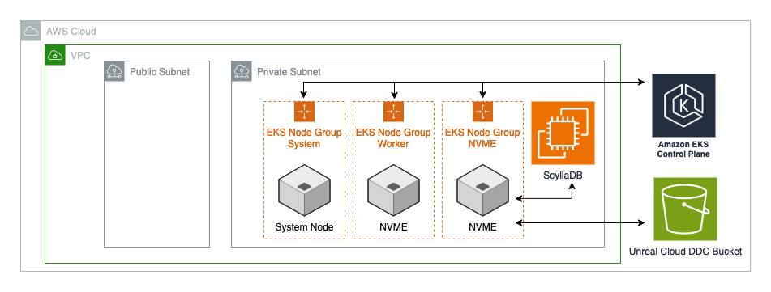

# DDC Infrastructure Submodule

This submodule creates the core infrastructure for Unreal Cloud DDC including EKS cluster, ScyllaDB database, S3 storage, and networking components.

> **📖 For complete DDC setup and user guidance, see the [parent module documentation](../../README.md).**

**What this submodule creates**: EKS Auto Mode cluster with custom NodePools, ScyllaDB cluster for metadata storage, S3 bucket for asset storage, IAM roles with IRSA, security groups, and CloudWatch logging infrastructure.

## Architecture



**Core Infrastructure Components:**
- **EKS Auto Mode Cluster**: Kubernetes cluster with automatic node provisioning
- **Custom NodePools**: NVMe-optimized compute for DDC performance requirements
- **ScyllaDB Cluster**: High-performance database for DDC metadata
- **S3 Bucket**: Object storage for cached game assets
- **IAM Roles**: Service accounts with least-privilege permissions
- **Security Groups**: Network access control for cluster and database
- **CloudWatch Logs**: Centralized logging for all components

## Prerequisites

### Required Infrastructure (from parent module)
- **VPC**: Custom VPC with proper subnet tagging
- **Subnets**: Public and private subnets with EKS Auto Mode tags
- **Route53**: Hosted zone for DNS management
- **Secrets Manager**: GitHub credentials for container access

### Required Subnet Tags for EKS Auto Mode
- **Public subnets**: `kubernetes.io/role/elb = "1"` (for external load balancers)
- **Private subnets**: `kubernetes.io/role/internal-elb = "1"` (for internal load balancers)
- **All subnets**: `kubernetes.io/cluster/<cluster-name> = "owned"` (for cluster association)


## EKS Auto Mode Architecture

**Application-Driven Infrastructure:**
With EKS Auto Mode, the DDC application requests infrastructure (not Terraform):

- **No manual node groups**: EKS Auto Mode handles everything automatically
- **Pod requirements drive nodes**: Application specifies needs via nodeSelector and resource requests
- **Karpenter provisions nodes**: Reads pod requirements, creates matching EC2 instances on-demand
- **NVMe instance enforcement**: Custom NodePool restricts to NVMe families only

**NodePool Architecture:**
```
EKS Auto Mode
├── Default NodePools (c, m, r families)
│   └── ❌ No NVMe storage → DDC pods fail to schedule
└── Custom NodePool (i family only)
    └── ✅ NVMe storage → DDC pods schedule successfully
```

**Why Custom NodePool is Required:**
- **Default EKS Auto Mode**: Only supports `[c, m, r]` instance families (no NVMe)
- **DDC Requirements**: Needs NVMe storage for cache performance
- **Our Solution**: Custom NodePool that allows `[i]` family (NVMe instances)
- **Automatic Provisioning**: When DDC pods request `i4i.xlarge`, EKS Auto Mode creates them

## Security Architecture

### Security Group Design

**EKS Cluster Security Group (`cluster_security_group`)**:
- **Purpose**: Controls access to EKS cluster nodes and pod communication
- **Ingress**: Self-referencing (all traffic between cluster nodes), kubelet API (port 10250 from VPC CIDR), HTTPS (port 443 from VPC CIDR), DNS (port 53 from VPC CIDR)
- **Egress**: All traffic to 0.0.0.0/0 (internet access for pods)

**ScyllaDB Security Group (`scylla_security_group`)**:
- **Purpose**: Isolates ScyllaDB cluster communication
- **Ingress**: ScyllaDB ports (7000, 7001, 9042, etc.) from self-referencing rules, CQL port (9042) from VPC CIDR for EKS access
- **Egress**: All traffic to 0.0.0.0/0 (updates, SSM), self-referencing for inter-node communication

### Administrative Access

**AWS Systems Manager Session Manager**:
- **ScyllaDB instances** support SSM Session Manager for secure shell access
- **No SSH keys required** - uses AWS IAM for authentication
- **Access method**: `aws ssm start-session --target <instance-id>`

## Troubleshooting

### Common Issues

**ScyllaDB Cluster Formation:**
- **Symptom**: Nodes not joining cluster
- **Solution**: Verify security group allows ScyllaDB ports (7000, 7001, 9042) between instances via self-referencing rules

**EKS Auto Mode Failures:**
- **Symptom**: Pods stuck in Pending state
- **Solution**: Check Custom NodePool configuration and NVMe instance availability

**EKS Addon Issues:**
- **Symptom**: External-DNS not creating Route53 records
- **Solution**: Verify Route53 hosted zone exists and IAM permissions are correct

### Validation Commands

**EKS Cluster Health:**
```bash
# Configure kubectl access
aws eks update-kubeconfig --region <region> --name <cluster-name>
kubectl get nodes
```

**ScyllaDB Cluster Status:**
```bash
# Access ScyllaDB node via Session Manager
aws ssm start-session --target <instance-id>
nodetool status
```

<!-- BEGIN_TF_DOCS -->
## Requirements

| Name | Version |
|------|---------|
| <a name="requirement_terraform"></a> [terraform](#requirement\_terraform) | >= 1.11 |
| <a name="requirement_aws"></a> [aws](#requirement\_aws) | >= 6.0.0 |
| <a name="requirement_null"></a> [null](#requirement\_null) | >= 3.1 |
| <a name="requirement_random"></a> [random](#requirement\_random) | >= 3.1 |

## Providers

| Name | Version |
|------|---------|
| <a name="provider_aws"></a> [aws](#provider\_aws) | >= 6.0.0 |
| <a name="provider_null"></a> [null](#provider\_null) | >= 3.1 |
| <a name="provider_random"></a> [random](#provider\_random) | >= 3.1 |

## Modules

No modules.

## Resources

| Name | Type |
|------|---------|
| [aws_cloudwatch_log_group.unreal_cluster_cloudwatch](https://registry.terraform.io/providers/hashicorp/aws/latest/docs/resources/cloudwatch_log_group) | resource |
| [aws_eks_access_entry.additional](https://registry.terraform.io/providers/hashicorp/aws/latest/docs/resources/eks_access_entry) | resource |
| [aws_eks_access_policy_association.additional](https://registry.terraform.io/providers/hashicorp/aws/latest/docs/resources/eks_access_policy_association) | resource |
| [aws_eks_cluster.unreal_cloud_ddc_eks_cluster](https://registry.terraform.io/providers/hashicorp/aws/latest/docs/resources/eks_cluster) | resource |
| [null_resource.aws_load_balancer_controller](https://registry.terraform.io/providers/hashicorp/null/latest/docs/resources/resource) | resource |
| [null_resource.aws_load_balancer_controller_crds](https://registry.terraform.io/providers/hashicorp/null/latest/docs/resources/resource) | resource |
| [null_resource.cert_manager](https://registry.terraform.io/providers/hashicorp/null/latest/docs/resources/resource) | resource |
| [null_resource.ddc_nodepool](https://registry.terraform.io/providers/hashicorp/null/latest/docs/resources/resource) | resource |

## Inputs

| Name | Description | Type | Default | Required |
|------|-------------|------|---------|:--------:|
| <a name="input_create_seed_node"></a> [create\_seed\_node](#input\_create\_seed\_node) | Whether this region creates the ScyllaDB seed node (bootstrap node for cluster formation) | `bool` | `true` | no |
| <a name="input_debug"></a> [debug](#input\_debug) | Enable debug mode | `bool` | `false` | no |
| <a name="input_eks_access_entries"></a> [eks\_access\_entries](#input\_eks\_access\_entries) | EKS access entries for additional users/services | `map(object({...}))` | `{}` | no |
| <a name="input_eks_node_group_subnets"></a> [eks\_node\_group\_subnets](#input\_eks\_node\_group\_subnets) | Subnets for EKS Auto Mode compute | `list(string)` | `[]` | no |
| <a name="input_enable_certificate_manager"></a> [enable\_certificate\_manager](#input\_enable\_certificate\_manager) | Install cert-manager addon | `bool` | `false` | no |
| <a name="input_enable_centralized_logging"></a> [enable\_centralized\_logging](#input\_enable\_centralized\_logging) | Create CloudWatch log groups | `bool` | `false` | no |
| <a name="input_endpoint_private_access"></a> [endpoint\_private\_access](#input\_endpoint\_private\_access) | Enable VPC API access | `bool` | `true` | no |
| <a name="input_endpoint_public_access"></a> [endpoint\_public\_access](#input\_endpoint\_public\_access) | Enable public API access | `bool` | `true` | no |
| <a name="input_environment"></a> [environment](#input\_environment) | Environment name | `string` | `"dev"` | no |
| <a name="input_existing_scylla_seed"></a> [existing\_scylla\_seed](#input\_existing\_scylla\_seed) | IP of existing ScyllaDB seed node | `string` | `null` | no |
| <a name="input_is_primary_region"></a> [is\_primary\_region](#input\_is\_primary\_region) | Whether this is the primary region | `bool` | `true` | no |
| <a name="input_kubernetes_version"></a> [kubernetes\_version](#input\_kubernetes\_version) | EKS cluster version | `string` | `"1.33"` | no |
| <a name="input_log_retention_days"></a> [log\_retention\_days](#input\_log\_retention\_days) | CloudWatch log retention period | `number` | `30` | no |
| <a name="input_name"></a> [name](#input\_name) | Workload name | `string` | `"unreal-cloud-ddc"` | no |
| <a name="input_project_prefix"></a> [project\_prefix](#input\_project\_prefix) | Project prefix for resource names | `string` | `"cgd"` | no |
| <a name="input_public_access_cidrs"></a> [public\_access\_cidrs](#input\_public\_access\_cidrs) | IP allowlist for public API access | `list(string)` | `null` | no |
| <a name="input_region"></a> [region](#input\_region) | AWS region | `string` | n/a | yes |
| <a name="input_route53_hosted_zone_name"></a> [route53\_hosted\_zone\_name](#input\_route53\_hosted\_zone\_name) | Route53 hosted zone name | `string` | `null` | no |
| <a name="input_scylla_ami_name"></a> [scylla\_ami\_name](#input\_scylla\_ami\_name) | ScyllaDB AMI name | `string` | `"ScyllaDB 6.0.1"` | no |
| <a name="input_scylla_architecture"></a> [scylla\_architecture](#input\_scylla\_architecture) | ScyllaDB architecture | `string` | `"x86_64"` | no |
| <a name="input_scylla_db_storage"></a> [scylla\_db\_storage](#input\_scylla\_db\_storage) | ScyllaDB EBS volume size (GB) | `number` | `100` | no |
| <a name="input_scylla_db_throughput"></a> [scylla\_db\_throughput](#input\_scylla\_db\_throughput) | ScyllaDB EBS volume throughput | `number` | `200` | no |
| <a name="input_scylla_instance_type"></a> [scylla\_instance\_type](#input\_scylla\_instance\_type) | ScyllaDB instance type | `string` | `"i4i.2xlarge"` | no |
| <a name="input_scylla_replication_factor"></a> [scylla\_replication\_factor](#input\_scylla\_replication\_factor) | ScyllaDB replication factor | `number` | `3` | no |
| <a name="input_scylla_source_region"></a> [scylla\_source\_region](#input\_scylla\_source\_region) | Source region for ScyllaDB cluster | `string` | `null` | no |
| <a name="input_scylla_subnets"></a> [scylla\_subnets](#input\_scylla\_subnets) | Subnets for ScyllaDB instances | `list(string)` | `[]` | no |
| <a name="input_tags"></a> [tags](#input\_tags) | Resource tags | `map(any)` | `{}` | no |
| <a name="input_unreal_cloud_ddc_namespace"></a> [unreal\_cloud\_ddc\_namespace](#input\_unreal\_cloud\_ddc\_namespace) | Kubernetes namespace | `string` | `"unreal-cloud-ddc"` | no |
| <a name="input_unreal_cloud_ddc_service_account_name"></a> [unreal\_cloud\_ddc\_service\_account\_name](#input\_unreal\_cloud\_ddc\_service\_account\_name) | Kubernetes service account name | `string` | `"unreal-cloud-ddc-sa"` | no |
| <a name="input_vpc_id"></a> [vpc\_id](#input\_vpc\_id) | VPC ID | `string` | n/a | yes |

## Outputs

| Name | Description |
|------|-------------|
| <a name="output_cluster_arn"></a> [cluster\_arn](#output\_cluster\_arn) | EKS cluster ARN |
| <a name="output_cluster_name"></a> [cluster\_name](#output\_cluster\_name) | EKS cluster name |
| <a name="output_database_connection"></a> [database\_connection](#output\_database\_connection) | Database connection information |
| <a name="output_s3_bucket_id"></a> [s3\_bucket\_id](#output\_s3\_bucket\_id) | S3 bucket ID for DDC assets |
| <a name="output_scylla_datacenter_name"></a> [scylla\_datacenter\_name](#output\_scylla\_datacenter\_name) | ScyllaDB datacenter name |
| <a name="output_scylla_ips"></a> [scylla\_ips](#output\_scylla\_ips) | ScyllaDB instance IPs |
| <a name="output_scylla_keyspace_suffix"></a> [scylla\_keyspace\_suffix](#output\_scylla\_keyspace\_suffix) | ScyllaDB keyspace suffix |
| <a name="output_scylla_seed_instance_id"></a> [scylla\_seed\_instance\_id](#output\_scylla\_seed\_instance\_id) | ScyllaDB seed instance ID |
| <a name="output_service_account_arn"></a> [service\_account\_arn](#output\_service\_account\_arn) | DDC service account ARN |
| <a name="output_ssm_document_name"></a> [ssm\_document\_name](#output\_ssm\_document\_name) | SSM document name for keyspace management |
<!-- END_TF_DOCS -->