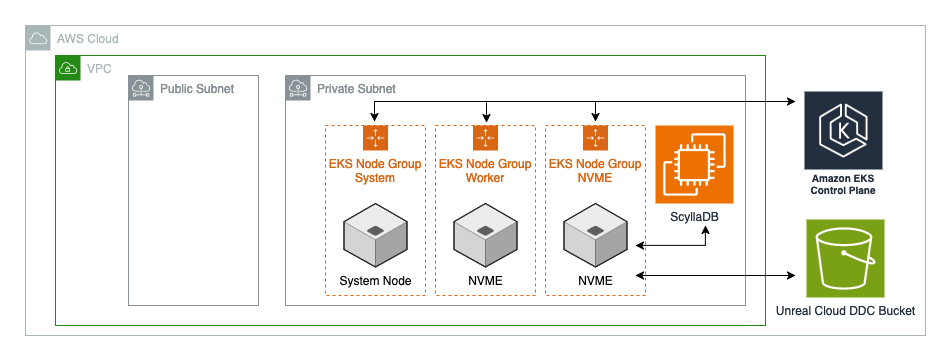

# Unreal Cloud DDC Infra Module

[Unreal Cloud Derived Data Cache](https://dev.epicgames.com/documentation/en-us/unreal-engine/using-derived-data-cache-in-unreal-engine) ([source code](https://github.com/EpicGames/UnrealEngine/tree/release/Engine/Source/Programs/UnrealCloudDDC)) is a caching system that stores additional data required to use assets, such as compiled shaders. This allows the engine to quickly retrieve this data instead of having to regenerate it, saving time and disk space for the development team. For distributed teams, a cloud-hosted DDC enables efficient collaboration by ensuring all team members have access to the same cached data regardless of their location. This module deploys the core infrastructure for Unreal Engine's Cloud Derived Data Cache (DDC) on AWS. It creates a scalable, secure, and high-performance environment that optimizes asset processing and distribution throughout your game development pipeline, reducing build times and improving team collaboration.

The Unreal Cloud Derived Data Cache (DDC) infrastructure module implements Epic's recommended architecture using ScyllaDB, a high-performance Cassandra-compatible database. This module provisions the following AWS resources:

1. ScyllaDB Database Layer:
    - Deployed on EC2 instances
    - Supports both single-node and multi-node cluster configurations
    - Optimized for high-throughput DDC operations
    - Configured with AWS Systems Manager Session Manager to provide secure shell access without requiring SSH or bastion hosts

2. ScyllaDB Monitoring Stack:
    - Deployed on an EC2 instance
    - Uses Prometheus for metrics collection, Alertmanager for handling alerts, and Grafana for visualization
    - Creates a Application Load Balancer for accessing the Grafana UI for real-time insights into ScyllaDB node performance

3. Amazon EKS Cluster with specialized node groups:
    - System node group: Handles core Kubernetes components and system workloads
    - NVME node group: Optimized for high-performance storage operations
    - Worker node group: Manages regional data replication and distribution
    - Configured with AWS Systems Manager Session Manager to provide secure shell access without requiring SSH or bastion hosts

3. S3 Bucket:
    - Provides durable storage for cached assets
    - Enables cross-region asset availability
    - Serves as a persistent backup layer

## Deployment Architecture

 

 

## Prerequisites

#### Network Infrastructure Requirements

At a minimum, the Cloud DDC Module requires a Virtual Private Cloud (VPC) with a specific subnet configuration. The suggested configuration includes:

- 2 public subnets
- 2 private subnets
- Coverage across 2 Availability Zones
- An S3 interface endpoint

This architecture ensures high availability and secure communication patterns for your DDC infrastructure.

 

<!-- ## Examples

For example configurations, please see the [examples](https://github.com/aws-games/cloud-game-development-toolkit/tree/main/modules/unreal/unreal-cloud-ddc/unreal-cloud-ddc-infra/examples). -->

<!-- TODO -->
<!-- ## Deployment Instructions -->

#### Configuring Node Groups and ScyllaDB Deployment

The footprint of your Cloud DDC deployment can be configured through 2 variables:

 

EKS Node Group Configuration: `eks_node_group_subnets`

The `eks_node_group_subnets` variable defines the subnet distribution for your EKS node groups. Each specified subnet serves as a potential target for node placement, providing granular control over the geographical distribution of your EKS infrastructure. Adding more subnets to this configuration increases deployment flexibility and enables broader availability zone coverage for your workloads at the cost of increased network complexity and potential inter-AZ data transfer charges.

 

ScyllaDB Instance Distribution: `scylla_subnets`

The `scylla_subnets` variable determines the deployment topology of your ScyllaDB instances. Each specified subnet receives a dedicated ScyllaDB instance, with multiple subnet configurations automatically establishing a distributed cluster architecture. Configurations of two or more subnets enable high availability and data resilience through native ScyllaDB clustering at the cost of increased infrastructure complexity and proportionally higher operational expenses.

<!-- BEGIN_TF_DOCS -->
## Requirements

| Name | Version |
|------|---------|
|  [terraform](#requirement\_terraform) | >= 1.10.3 |
|  [aws](#requirement\_aws) | >=5.89.0 |
|  [random](#requirement\_random) | 3.7.2 |
|  [tls](#requirement\_tls) | >= 4.0.6 |

## Providers

| Name | Version |
|------|---------|
|  [aws](#provider\_aws) | 6.10.0 |
|  [random](#provider\_random) | 3.7.2 |
|  [tls](#provider\_tls) | 4.1.0 |

## Modules

No modules.

## Resources

| Name | Type |
|------|------|
| [aws_cloudwatch_log_group.unreal_cluster_cloudwatch](https://registry.terraform.io/providers/hashicorp/aws/latest/docs/resources/cloudwatch_log_group) | resource |
| [aws_eks_cluster.unreal_cloud_ddc_eks_cluster](https://registry.terraform.io/providers/hashicorp/aws/latest/docs/resources/eks_cluster) | resource |
| [aws_eks_node_group.nvme_node_group](https://registry.terraform.io/providers/hashicorp/aws/latest/docs/resources/eks_node_group) | resource |
| [aws_eks_node_group.system_node_group](https://registry.terraform.io/providers/hashicorp/aws/latest/docs/resources/eks_node_group) | resource |
| [aws_eks_node_group.worker_node_group](https://registry.terraform.io/providers/hashicorp/aws/latest/docs/resources/eks_node_group) | resource |
| [aws_iam_instance_profile.scylla_instance_profile](https://registry.terraform.io/providers/hashicorp/aws/latest/docs/resources/iam_instance_profile) | resource |
| [aws_iam_instance_profile.scylla_monitoring_profile](https://registry.terraform.io/providers/hashicorp/aws/latest/docs/resources/iam_instance_profile) | resource |
| [aws_iam_openid_connect_provider.unreal_cloud_ddc_oidc_provider](https://registry.terraform.io/providers/hashicorp/aws/latest/docs/resources/iam_openid_connect_provider) | resource |
| [aws_iam_role.eks_cluster_role](https://registry.terraform.io/providers/hashicorp/aws/latest/docs/resources/iam_role) | resource |
| [aws_iam_role.nvme_node_group_role](https://registry.terraform.io/providers/hashicorp/aws/latest/docs/resources/iam_role) | resource |
| [aws_iam_role.scylla_monitoring_role](https://registry.terraform.io/providers/hashicorp/aws/latest/docs/resources/iam_role) | resource |
| [aws_iam_role.scylla_role](https://registry.terraform.io/providers/hashicorp/aws/latest/docs/resources/iam_role) | resource |
| [aws_iam_role.system_node_group_role](https://registry.terraform.io/providers/hashicorp/aws/latest/docs/resources/iam_role) | resource |
| [aws_iam_role.worker_node_group_role](https://registry.terraform.io/providers/hashicorp/aws/latest/docs/resources/iam_role) | resource |
| [aws_iam_role_policy.scylla_monitoring_policy](https://registry.terraform.io/providers/hashicorp/aws/latest/docs/resources/iam_role_policy) | resource |
| [aws_iam_role_policy_attachments_exclusive.eks_cluster_policy_attachement](https://registry.terraform.io/providers/hashicorp/aws/latest/docs/resources/iam_role_policy_attachments_exclusive) | resource |
| [aws_iam_role_policy_attachments_exclusive.nvme_policy_attachement](https://registry.terraform.io/providers/hashicorp/aws/latest/docs/resources/iam_role_policy_attachments_exclusive) | resource |
| [aws_iam_role_policy_attachments_exclusive.scylla_policy_attachement](https://registry.terraform.io/providers/hashicorp/aws/latest/docs/resources/iam_role_policy_attachments_exclusive) | resource |
| [aws_iam_role_policy_attachments_exclusive.system_policy_attachement](https://registry.terraform.io/providers/hashicorp/aws/latest/docs/resources/iam_role_policy_attachments_exclusive) | resource |
| [aws_iam_role_policy_attachments_exclusive.worker_policy_attachement](https://registry.terraform.io/providers/hashicorp/aws/latest/docs/resources/iam_role_policy_attachments_exclusive) | resource |
| [aws_instance.scylla_ec2_instance_other_nodes](https://registry.terraform.io/providers/hashicorp/aws/latest/docs/resources/instance) | resource |
| [aws_instance.scylla_ec2_instance_seed](https://registry.terraform.io/providers/hashicorp/aws/latest/docs/resources/instance) | resource |
| [aws_instance.scylla_monitoring](https://registry.terraform.io/providers/hashicorp/aws/latest/docs/resources/instance) | resource |
| [aws_launch_template.nvme_launch_template](https://registry.terraform.io/providers/hashicorp/aws/latest/docs/resources/launch_template) | resource |
| [aws_launch_template.system_launch_template](https://registry.terraform.io/providers/hashicorp/aws/latest/docs/resources/launch_template) | resource |
| [aws_launch_template.worker_launch_template](https://registry.terraform.io/providers/hashicorp/aws/latest/docs/resources/launch_template) | resource |
| [aws_lb.scylla_monitoring_alb](https://registry.terraform.io/providers/hashicorp/aws/latest/docs/resources/lb) | resource |
| [aws_lb_listener.scylla_monitoring_listener](https://registry.terraform.io/providers/hashicorp/aws/latest/docs/resources/lb_listener) | resource |
| [aws_lb_target_group.scylla_monitoring_alb_target_group](https://registry.terraform.io/providers/hashicorp/aws/latest/docs/resources/lb_target_group) | resource |
| [aws_lb_target_group_attachment.scylla_monitoring](https://registry.terraform.io/providers/hashicorp/aws/latest/docs/resources/lb_target_group_attachment) | resource |
| [aws_s3_bucket.scylla_monitoring_lb_access_logs_bucket](https://registry.terraform.io/providers/hashicorp/aws/latest/docs/resources/s3_bucket) | resource |
| [aws_s3_bucket.unreal_ddc_s3_bucket](https://registry.terraform.io/providers/hashicorp/aws/latest/docs/resources/s3_bucket) | resource |
| [aws_s3_bucket_lifecycle_configuration.access_logs_bucket_lifecycle_configuration](https://registry.terraform.io/providers/hashicorp/aws/latest/docs/resources/s3_bucket_lifecycle_configuration) | resource |
| [aws_s3_bucket_policy.alb_access_logs_bucket_policy](https://registry.terraform.io/providers/hashicorp/aws/latest/docs/resources/s3_bucket_policy) | resource |
| [aws_s3_bucket_public_access_block.access_logs_bucket_public_block](https://registry.terraform.io/providers/hashicorp/aws/latest/docs/resources/s3_bucket_public_access_block) | resource |
| [aws_s3_bucket_public_access_block.unreal_ddc_s3_acls](https://registry.terraform.io/providers/hashicorp/aws/latest/docs/resources/s3_bucket_public_access_block) | resource |
| [aws_security_group.cluster_security_group](https://registry.terraform.io/providers/hashicorp/aws/latest/docs/resources/security_group) | resource |
| [aws_security_group.nvme_security_group](https://registry.terraform.io/providers/hashicorp/aws/latest/docs/resources/security_group) | resource |
| [aws_security_group.scylla_monitoring_lb_sg](https://registry.terraform.io/providers/hashicorp/aws/latest/docs/resources/security_group) | resource |
| [aws_security_group.scylla_monitoring_sg](https://registry.terraform.io/providers/hashicorp/aws/latest/docs/resources/security_group) | resource |
| [aws_security_group.scylla_security_group](https://registry.terraform.io/providers/hashicorp/aws/latest/docs/resources/security_group) | resource |
| [aws_security_group.system_security_group](https://registry.terraform.io/providers/hashicorp/aws/latest/docs/resources/security_group) | resource |
| [aws_security_group.worker_security_group](https://registry.terraform.io/providers/hashicorp/aws/latest/docs/resources/security_group) | resource |
| [aws_vpc_security_group_egress_rule.cluster_egress_sg_rule](https://registry.terraform.io/providers/hashicorp/aws/latest/docs/resources/vpc_security_group_egress_rule) | resource |
| [aws_vpc_security_group_egress_rule.nvme_egress_sg_rules](https://registry.terraform.io/providers/hashicorp/aws/latest/docs/resources/vpc_security_group_egress_rule) | resource |
| [aws_vpc_security_group_egress_rule.scylla_monitoring_lb_sg_egress_rule](https://registry.terraform.io/providers/hashicorp/aws/latest/docs/resources/vpc_security_group_egress_rule) | resource |
| [aws_vpc_security_group_egress_rule.scylla_monitoring_sg_egress_rule](https://registry.terraform.io/providers/hashicorp/aws/latest/docs/resources/vpc_security_group_egress_rule) | resource |
| [aws_vpc_security_group_egress_rule.self_scylla_egress_sg_rules](https://registry.terraform.io/providers/hashicorp/aws/latest/docs/resources/vpc_security_group_egress_rule) | resource |
| [aws_vpc_security_group_egress_rule.ssm_egress_sg_rules](https://registry.terraform.io/providers/hashicorp/aws/latest/docs/resources/vpc_security_group_egress_rule) | resource |
| [aws_vpc_security_group_egress_rule.system_egress_sg_rules](https://registry.terraform.io/providers/hashicorp/aws/latest/docs/resources/vpc_security_group_egress_rule) | resource |
| [aws_vpc_security_group_egress_rule.worker_egress_sg_rules](https://registry.terraform.io/providers/hashicorp/aws/latest/docs/resources/vpc_security_group_egress_rule) | resource |
| [aws_vpc_security_group_ingress_rule.cluster_lb_ingress_sg_rule](https://registry.terraform.io/providers/hashicorp/aws/latest/docs/resources/vpc_security_group_ingress_rule) | resource |
| [aws_vpc_security_group_ingress_rule.scylla_monitoring_ingress_node_exporter](https://registry.terraform.io/providers/hashicorp/aws/latest/docs/resources/vpc_security_group_ingress_rule) | resource |
| [aws_vpc_security_group_ingress_rule.scylla_monitoring_ingress_prometheus](https://registry.terraform.io/providers/hashicorp/aws/latest/docs/resources/vpc_security_group_ingress_rule) | resource |
| [aws_vpc_security_group_ingress_rule.scylla_monitoring_lb_monitoring](https://registry.terraform.io/providers/hashicorp/aws/latest/docs/resources/vpc_security_group_ingress_rule) | resource |
| [aws_vpc_security_group_ingress_rule.self_ingress_cluster_sg_rule](https://registry.terraform.io/providers/hashicorp/aws/latest/docs/resources/vpc_security_group_ingress_rule) | resource |
| [aws_vpc_security_group_ingress_rule.self_ingress_sg_rules](https://registry.terraform.io/providers/hashicorp/aws/latest/docs/resources/vpc_security_group_ingress_rule) | resource |
| [random_string.scylla_monitoring_lb_access_logs_bucket_suffix](https://registry.terraform.io/providers/hashicorp/random/3.7.2/docs/resources/string) | resource |
| [aws_ami.amazon_linux](https://registry.terraform.io/providers/hashicorp/aws/latest/docs/data-sources/ami) | data source |
| [aws_ami.scylla_ami](https://registry.terraform.io/providers/hashicorp/aws/latest/docs/data-sources/ami) | data source |
| [aws_elb_service_account.main](https://registry.terraform.io/providers/hashicorp/aws/latest/docs/data-sources/elb_service_account) | data source |
| [aws_iam_policy_document.access_logs_bucket_alb_write](https://registry.terraform.io/providers/hashicorp/aws/latest/docs/data-sources/iam_policy_document) | data source |
| [aws_iam_policy_document.scylla_monitoring_assume_role](https://registry.terraform.io/providers/hashicorp/aws/latest/docs/data-sources/iam_policy_document) | data source |
| [aws_iam_policy_document.scylla_monitoring_policy_doc](https://registry.terraform.io/providers/hashicorp/aws/latest/docs/data-sources/iam_policy_document) | data source |
| [tls_certificate.eks_tls_certificate](https://registry.terraform.io/providers/hashicorp/tls/latest/docs/data-sources/certificate) | data source |

## Inputs

| Name | Description | Type | Default | Required |
|------|-------------|------|---------|:--------:|
|  [alb\_certificate\_arn](#input\_alb\_certificate\_arn) | The ARN of the certificate to use on the ALB | `string` | `null` | no |
|  [create\_application\_load\_balancer](#input\_create\_application\_load\_balancer) | Whether to create an application load balancer for the Scylla monitoring dashboard. | `bool` | `true` | no |
|  [create\_scylla\_monitoring\_stack](#input\_create\_scylla\_monitoring\_stack) | Whether to create the Scylla monitoring stack | `bool` | `true` | no |
|  [debug](#input\_debug) | Enable debug mode | `bool` | `false` | no |
|  [eks\_cluster\_cloudwatch\_log\_group\_prefix](#input\_eks\_cluster\_cloudwatch\_log\_group\_prefix) | Prefix to be used for the EKS cluster CloudWatch log group. | `string` | `"/aws/eks/unreal-cloud-ddc/cluster"` | no |
|  [eks\_cluster\_logging\_types](#input\_eks\_cluster\_logging\_types) | List of EKS cluster log types to be enabled. | `list(string)` | <pre>[   "api",   "audit",   "authenticator",   "controllerManager",   "scheduler" ]</pre> | no |
|  [eks\_cluster\_private\_access](#input\_eks\_cluster\_private\_access) | Allows private access of the EKS Control Plane from subnets attached to EKS Cluster | `bool` | `true` | no |
|  [eks\_cluster\_public\_access](#input\_eks\_cluster\_public\_access) | Allows public access of EKS Control Plane should be used with | `bool` | `false` | no |
|  [eks\_cluster\_public\_endpoint\_access\_cidr](#input\_eks\_cluster\_public\_endpoint\_access\_cidr) | List of the CIDR Ranges you want to grant public access to the EKS Cluster's public endpoint. | `list(string)` | `[]` | no |
|  [eks\_node\_group\_subnets](#input\_eks\_node\_group\_subnets) | A list of subnets ids you want the EKS nodes to be installed into. Private subnets are strongly recommended. | `list(string)` | `[]` | no |
|  [enable\_scylla\_monitoring\_lb\_access\_logs](#input\_enable\_scylla\_monitoring\_lb\_access\_logs) | Whether to enable access logs for the Scylla monitoring load balancer. | `bool` | `false` | no |
|  [enable\_scylla\_monitoring\_lb\_deletion\_protection](#input\_enable\_scylla\_monitoring\_lb\_deletion\_protection) | Whether to enable deletion protection for the Scylla monitoring load balancer. | `bool` | `false` | no |
|  [environment](#input\_environment) | The current environment (e.g. dev, prod, etc.) | `string` | `"dev"` | no |
|  [existing\_security\_groups](#input\_existing\_security\_groups) | List of existing security groups to add to the monitoring and Unreal DDC load balancers | `list(string)` | `[]` | no |
|  [internal\_facing\_application\_load\_balancer](#input\_internal\_facing\_application\_load\_balancer) | Whether the application load balancer should be internal-facing. | `bool` | `false` | no |
|  [kubernetes\_version](#input\_kubernetes\_version) | Kubernetes version to be used by the EKS cluster. | `string` | `"1.31"` | no |
|  [monitoring\_application\_load\_balancer\_subnets](#input\_monitoring\_application\_load\_balancer\_subnets) | The subnets in which the ALB will be deployed | `list(string)` | `null` | no |
|  [name](#input\_name) | Unreal Cloud DDC Workload Name | `string` | `"unreal-cloud-ddc"` | no |
|  [nvme\_managed\_node\_desired\_size](#input\_nvme\_managed\_node\_desired\_size) | Desired number of nvme managed node group instances | `number` | `2` | no |
|  [nvme\_managed\_node\_instance\_type](#input\_nvme\_managed\_node\_instance\_type) | Nvme managed node group instance type | `string` | `"i3en.large"` | no |
|  [nvme\_managed\_node\_max\_size](#input\_nvme\_managed\_node\_max\_size) | Max number of nvme managed node group instances | `number` | `2` | no |
|  [nvme\_managed\_node\_min\_size](#input\_nvme\_managed\_node\_min\_size) | Min number of nvme managed node group instances | `number` | `1` | no |
|  [nvme\_node\_group\_label](#input\_nvme\_node\_group\_label) | Label applied to nvme node group. These will need to be matched in values for taints and tolerations for the worker pod definition. | `map(string)` | <pre>{   "unreal-cloud-ddc/node-type": "nvme" }</pre> | no |
|  [project\_prefix](#input\_project\_prefix) | The project prefix for this workload. This is appended to the beginning of most resource names. | `string` | `"cgd"` | no |
|  [region](#input\_region) | The AWS region to deploy to | `string` | `"us-west-2"` | no |
|  [scylla\_ami\_name](#input\_scylla\_ami\_name) | Name of the Scylla AMI to be used to get the AMI ID | `string` | `"ScyllaDB 6.0.1"` | no |
|  [scylla\_architecture](#input\_scylla\_architecture) | The chip architecture to use when finding the scylla image. Valid | `string` | `"x86_64"` | no |
|  [scylla\_db\_storage](#input\_scylla\_db\_storage) | Size of gp3 ebs volumes attached to Scylla DBs | `number` | `100` | no |
|  [scylla\_db\_throughput](#input\_scylla\_db\_throughput) | Throughput of gp3 ebs volumes attached to Scylla DBs | `number` | `200` | no |
|  [scylla\_instance\_type](#input\_scylla\_instance\_type) | The type and size of the Scylla instance. | `string` | `"i4i.2xlarge"` | no |
|  [scylla\_monitoring\_instance\_storage](#input\_scylla\_monitoring\_instance\_storage) | Size of gp3 ebs volumes in GB attached to Scylla monitoring instance | `number` | `20` | no |
|  [scylla\_monitoring\_instance\_type](#input\_scylla\_monitoring\_instance\_type) | The type and size of the Scylla monitoring instance. | `string` | `"t3.xlarge"` | no |
|  [scylla\_monitoring\_lb\_access\_logs\_bucket](#input\_scylla\_monitoring\_lb\_access\_logs\_bucket) | Name of the S3 bucket to store the access logs for the Scylla monitoring load balancer. | `string` | `null` | no |
|  [scylla\_monitoring\_lb\_access\_logs\_prefix](#input\_scylla\_monitoring\_lb\_access\_logs\_prefix) | Prefix to use for the access logs for the Scylla monitoring load balancer. | `string` | `null` | no |
|  [scylla\_subnets](#input\_scylla\_subnets) | A list of subnet IDs where Scylla will be deployed. Private subnets are strongly recommended. | `list(string)` | `[]` | no |
|  [system\_managed\_node\_desired\_size](#input\_system\_managed\_node\_desired\_size) | Desired number of system managed node group instances. | `number` | `1` | no |
|  [system\_managed\_node\_instance\_type](#input\_system\_managed\_node\_instance\_type) | Monitoring managed node group instance type. | `string` | `"m5.large"` | no |
|  [system\_managed\_node\_max\_size](#input\_system\_managed\_node\_max\_size) | Max number of system managed node group instances. | `number` | `2` | no |
|  [system\_managed\_node\_min\_size](#input\_system\_managed\_node\_min\_size) | Min number of system managed node group instances. | `number` | `1` | no |
|  [system\_node\_group\_label](#input\_system\_node\_group\_label) | Label applied to system node group | `map(string)` | <pre>{   "pool": "system-pool" }</pre> | no |
|  [tags](#input\_tags) | Tags to apply to resources. | `map(any)` | <pre>{   "IaC": "Terraform",   "ModuleBy": "CGD-Toolkit",   "ModuleName": "Unreal DDC" }</pre> | no |
|  [vpc\_id](#input\_vpc\_id) | String for VPC ID | `string` | n/a | yes |
|  [worker\_managed\_node\_desired\_size](#input\_worker\_managed\_node\_desired\_size) | Desired number of worker managed node group instances. | `number` | `1` | no |
|  [worker\_managed\_node\_instance\_type](#input\_worker\_managed\_node\_instance\_type) | Worker managed node group instance type. | `string` | `"c5.large"` | no |
|  [worker\_managed\_node\_max\_size](#input\_worker\_managed\_node\_max\_size) | Max number of worker managed node group instances. | `number` | `1` | no |
|  [worker\_managed\_node\_min\_size](#input\_worker\_managed\_node\_min\_size) | Min number of worker managed node group instances. | `number` | `0` | no |
|  [worker\_node\_group\_label](#input\_worker\_node\_group\_label) | Label applied to worker node group. These will need to be matched in values for taints and tolerations for the worker pod definition. | `map(string)` | <pre>{   "unreal-cloud-ddc/node-type": "worker" }</pre> | no |

## Outputs

| Name | Description |
|------|-------------|
|  [cluster\_arn](#output\_cluster\_arn) | ARN of the EKS Cluster |
|  [cluster\_certificate\_authority\_data](#output\_cluster\_certificate\_authority\_data) | Public key for the EKS Cluster |
|  [cluster\_endpoint](#output\_cluster\_endpoint) | EKS Cluster Endpoint |
|  [cluster\_name](#output\_cluster\_name) | Name of the EKS Cluster |
|  [external\_alb\_dns\_name](#output\_external\_alb\_dns\_name) | DNS endpoint of Application Load Balancer (ALB) |
|  [external\_alb\_zone\_id](#output\_external\_alb\_zone\_id) | Zone ID for internet facing load balancer |
|  [nvme\_node\_group\_label](#output\_nvme\_node\_group\_label) | Label for the NVME node group |
|  [oidc\_provider\_arn](#output\_oidc\_provider\_arn) | OIDC provider for the EKS Cluster |
|  [peer\_security\_group\_id](#output\_peer\_security\_group\_id) | ID of the Peer Security Group |
|  [s3\_bucket\_id](#output\_s3\_bucket\_id) | Bucket to be used for the Unreal Cloud DDC assets |
|  [scylla\_ips](#output\_scylla\_ips) | IPs of the Scylla EC2 instances |
|  [system\_node\_group\_label](#output\_system\_node\_group\_label) | Label for the System node group |
|  [worker\_node\_group\_label](#output\_worker\_node\_group\_label) | Label for the Worker node group |
<!-- END_TF_DOCS -->
<!-- BEGIN_TF_DOCS -->
## Requirements

| Name | Version |
|------|---------|
|  [terraform](#requirement\_terraform) | >= 1.10.3 |
|  [aws](#requirement\_aws) | >=5.89.0 |
|  [random](#requirement\_random) | 3.7.2 |
|  [tls](#requirement\_tls) | >= 4.0.6 |

## Providers

| Name | Version |
|------|---------|
|  [aws](#provider\_aws) | 6.4.0 |
|  [random](#provider\_random) | 3.5.1 |
|  [tls](#provider\_tls) | 4.1.0 |

## Modules

No modules.

## Resources

| Name | Type |
|------|------|
| [aws_cloudwatch_log_group.unreal_cluster_cloudwatch](https://registry.terraform.io/providers/hashicorp/aws/latest/docs/resources/cloudwatch_log_group) | resource |
| [aws_eks_cluster.unreal_cloud_ddc_eks_cluster](https://registry.terraform.io/providers/hashicorp/aws/latest/docs/resources/eks_cluster) | resource |
| [aws_eks_node_group.nvme_node_group](https://registry.terraform.io/providers/hashicorp/aws/latest/docs/resources/eks_node_group) | resource |
| [aws_eks_node_group.system_node_group](https://registry.terraform.io/providers/hashicorp/aws/latest/docs/resources/eks_node_group) | resource |
| [aws_eks_node_group.worker_node_group](https://registry.terraform.io/providers/hashicorp/aws/latest/docs/resources/eks_node_group) | resource |
| [aws_iam_instance_profile.scylla_instance_profile](https://registry.terraform.io/providers/hashicorp/aws/latest/docs/resources/iam_instance_profile) | resource |
| [aws_iam_instance_profile.scylla_monitoring_profile](https://registry.terraform.io/providers/hashicorp/aws/latest/docs/resources/iam_instance_profile) | resource |
| [aws_iam_openid_connect_provider.unreal_cloud_ddc_oidc_provider](https://registry.terraform.io/providers/hashicorp/aws/latest/docs/resources/iam_openid_connect_provider) | resource |
| [aws_iam_role.eks_cluster_role](https://registry.terraform.io/providers/hashicorp/aws/latest/docs/resources/iam_role) | resource |
| [aws_iam_role.nvme_node_group_role](https://registry.terraform.io/providers/hashicorp/aws/latest/docs/resources/iam_role) | resource |
| [aws_iam_role.scylla_monitoring_role](https://registry.terraform.io/providers/hashicorp/aws/latest/docs/resources/iam_role) | resource |
| [aws_iam_role.scylla_role](https://registry.terraform.io/providers/hashicorp/aws/latest/docs/resources/iam_role) | resource |
| [aws_iam_role.system_node_group_role](https://registry.terraform.io/providers/hashicorp/aws/latest/docs/resources/iam_role) | resource |
| [aws_iam_role.worker_node_group_role](https://registry.terraform.io/providers/hashicorp/aws/latest/docs/resources/iam_role) | resource |
| [aws_iam_role_policy.scylla_monitoring_policy](https://registry.terraform.io/providers/hashicorp/aws/latest/docs/resources/iam_role_policy) | resource |
| [aws_iam_role_policy_attachments_exclusive.eks_cluster_policy_attachement](https://registry.terraform.io/providers/hashicorp/aws/latest/docs/resources/iam_role_policy_attachments_exclusive) | resource |
| [aws_iam_role_policy_attachments_exclusive.nvme_policy_attachement](https://registry.terraform.io/providers/hashicorp/aws/latest/docs/resources/iam_role_policy_attachments_exclusive) | resource |
| [aws_iam_role_policy_attachments_exclusive.scylla_policy_attachement](https://registry.terraform.io/providers/hashicorp/aws/latest/docs/resources/iam_role_policy_attachments_exclusive) | resource |
| [aws_iam_role_policy_attachments_exclusive.system_policy_attachement](https://registry.terraform.io/providers/hashicorp/aws/latest/docs/resources/iam_role_policy_attachments_exclusive) | resource |
| [aws_iam_role_policy_attachments_exclusive.worker_policy_attachement](https://registry.terraform.io/providers/hashicorp/aws/latest/docs/resources/iam_role_policy_attachments_exclusive) | resource |
| [aws_instance.scylla_ec2_instance_other_nodes](https://registry.terraform.io/providers/hashicorp/aws/latest/docs/resources/instance) | resource |
| [aws_instance.scylla_ec2_instance_seed](https://registry.terraform.io/providers/hashicorp/aws/latest/docs/resources/instance) | resource |
| [aws_instance.scylla_monitoring](https://registry.terraform.io/providers/hashicorp/aws/latest/docs/resources/instance) | resource |
| [aws_launch_template.nvme_launch_template](https://registry.terraform.io/providers/hashicorp/aws/latest/docs/resources/launch_template) | resource |
| [aws_launch_template.system_launch_template](https://registry.terraform.io/providers/hashicorp/aws/latest/docs/resources/launch_template) | resource |
| [aws_launch_template.worker_launch_template](https://registry.terraform.io/providers/hashicorp/aws/latest/docs/resources/launch_template) | resource |
| [aws_lb.scylla_monitoring_alb](https://registry.terraform.io/providers/hashicorp/aws/latest/docs/resources/lb) | resource |
| [aws_lb_listener.scylla_monitoring_listener](https://registry.terraform.io/providers/hashicorp/aws/latest/docs/resources/lb_listener) | resource |
| [aws_lb_target_group.scylla_monitoring_alb_target_group](https://registry.terraform.io/providers/hashicorp/aws/latest/docs/resources/lb_target_group) | resource |
| [aws_lb_target_group_attachment.scylla_monitoring](https://registry.terraform.io/providers/hashicorp/aws/latest/docs/resources/lb_target_group_attachment) | resource |
| [aws_s3_bucket.scylla_monitoring_lb_access_logs_bucket](https://registry.terraform.io/providers/hashicorp/aws/latest/docs/resources/s3_bucket) | resource |
| [aws_s3_bucket.unreal_ddc_s3_bucket](https://registry.terraform.io/providers/hashicorp/aws/latest/docs/resources/s3_bucket) | resource |
| [aws_s3_bucket_lifecycle_configuration.access_logs_bucket_lifecycle_configuration](https://registry.terraform.io/providers/hashicorp/aws/latest/docs/resources/s3_bucket_lifecycle_configuration) | resource |
| [aws_s3_bucket_policy.alb_access_logs_bucket_policy](https://registry.terraform.io/providers/hashicorp/aws/latest/docs/resources/s3_bucket_policy) | resource |
| [aws_s3_bucket_public_access_block.access_logs_bucket_public_block](https://registry.terraform.io/providers/hashicorp/aws/latest/docs/resources/s3_bucket_public_access_block) | resource |
| [aws_s3_bucket_public_access_block.unreal_ddc_s3_acls](https://registry.terraform.io/providers/hashicorp/aws/latest/docs/resources/s3_bucket_public_access_block) | resource |
| [aws_security_group.cluster_security_group](https://registry.terraform.io/providers/hashicorp/aws/latest/docs/resources/security_group) | resource |
| [aws_security_group.nvme_security_group](https://registry.terraform.io/providers/hashicorp/aws/latest/docs/resources/security_group) | resource |
| [aws_security_group.scylla_monitoring_lb_sg](https://registry.terraform.io/providers/hashicorp/aws/latest/docs/resources/security_group) | resource |
| [aws_security_group.scylla_monitoring_sg](https://registry.terraform.io/providers/hashicorp/aws/latest/docs/resources/security_group) | resource |
| [aws_security_group.scylla_security_group](https://registry.terraform.io/providers/hashicorp/aws/latest/docs/resources/security_group) | resource |
| [aws_security_group.system_security_group](https://registry.terraform.io/providers/hashicorp/aws/latest/docs/resources/security_group) | resource |
| [aws_security_group.worker_security_group](https://registry.terraform.io/providers/hashicorp/aws/latest/docs/resources/security_group) | resource |
| [aws_vpc_security_group_egress_rule.cluster_egress_sg_rule](https://registry.terraform.io/providers/hashicorp/aws/latest/docs/resources/vpc_security_group_egress_rule) | resource |
| [aws_vpc_security_group_egress_rule.nvme_egress_sg_rules](https://registry.terraform.io/providers/hashicorp/aws/latest/docs/resources/vpc_security_group_egress_rule) | resource |
| [aws_vpc_security_group_egress_rule.scylla_monitoring_lb_sg_egress_rule](https://registry.terraform.io/providers/hashicorp/aws/latest/docs/resources/vpc_security_group_egress_rule) | resource |
| [aws_vpc_security_group_egress_rule.scylla_monitoring_sg_egress_rule](https://registry.terraform.io/providers/hashicorp/aws/latest/docs/resources/vpc_security_group_egress_rule) | resource |
| [aws_vpc_security_group_egress_rule.self_scylla_egress_sg_rules](https://registry.terraform.io/providers/hashicorp/aws/latest/docs/resources/vpc_security_group_egress_rule) | resource |
| [aws_vpc_security_group_egress_rule.ssm_egress_sg_rules](https://registry.terraform.io/providers/hashicorp/aws/latest/docs/resources/vpc_security_group_egress_rule) | resource |
| [aws_vpc_security_group_egress_rule.system_egress_sg_rules](https://registry.terraform.io/providers/hashicorp/aws/latest/docs/resources/vpc_security_group_egress_rule) | resource |
| [aws_vpc_security_group_egress_rule.worker_egress_sg_rules](https://registry.terraform.io/providers/hashicorp/aws/latest/docs/resources/vpc_security_group_egress_rule) | resource |
| [aws_vpc_security_group_ingress_rule.cluster_lb_ingress_sg_rule](https://registry.terraform.io/providers/hashicorp/aws/latest/docs/resources/vpc_security_group_ingress_rule) | resource |
| [aws_vpc_security_group_ingress_rule.scylla_monitoring_ingress_node_exporter](https://registry.terraform.io/providers/hashicorp/aws/latest/docs/resources/vpc_security_group_ingress_rule) | resource |
| [aws_vpc_security_group_ingress_rule.scylla_monitoring_ingress_prometheus](https://registry.terraform.io/providers/hashicorp/aws/latest/docs/resources/vpc_security_group_ingress_rule) | resource |
| [aws_vpc_security_group_ingress_rule.scylla_monitoring_lb_monitoring](https://registry.terraform.io/providers/hashicorp/aws/latest/docs/resources/vpc_security_group_ingress_rule) | resource |
| [aws_vpc_security_group_ingress_rule.self_ingress_cluster_sg_rule](https://registry.terraform.io/providers/hashicorp/aws/latest/docs/resources/vpc_security_group_ingress_rule) | resource |
| [aws_vpc_security_group_ingress_rule.self_ingress_sg_rules](https://registry.terraform.io/providers/hashicorp/aws/latest/docs/resources/vpc_security_group_ingress_rule) | resource |
| [random_string.scylla_monitoring_lb_access_logs_bucket_suffix](https://registry.terraform.io/providers/hashicorp/random/3.7.2/docs/resources/string) | resource |
| [aws_ami.amazon_linux](https://registry.terraform.io/providers/hashicorp/aws/latest/docs/data-sources/ami) | data source |
| [aws_ami.scylla_ami](https://registry.terraform.io/providers/hashicorp/aws/latest/docs/data-sources/ami) | data source |
| [aws_elb_service_account.main](https://registry.terraform.io/providers/hashicorp/aws/latest/docs/data-sources/elb_service_account) | data source |
| [aws_iam_policy_document.access_logs_bucket_alb_write](https://registry.terraform.io/providers/hashicorp/aws/latest/docs/data-sources/iam_policy_document) | data source |
| [aws_iam_policy_document.scylla_monitoring_assume_role](https://registry.terraform.io/providers/hashicorp/aws/latest/docs/data-sources/iam_policy_document) | data source |
| [aws_iam_policy_document.scylla_monitoring_policy_doc](https://registry.terraform.io/providers/hashicorp/aws/latest/docs/data-sources/iam_policy_document) | data source |
| [tls_certificate.eks_tls_certificate](https://registry.terraform.io/providers/hashicorp/tls/latest/docs/data-sources/certificate) | data source |

## Inputs

| Name | Description | Type | Default | Required |
|------|-------------|------|---------|:--------:|
|  [alb\_certificate\_arn](#input\_alb\_certificate\_arn) | The ARN of the certificate to use on the ALB | `string` | `null` | no |
|  [create\_application\_load\_balancer](#input\_create\_application\_load\_balancer) | Whether to create an application load balancer for the Scylla monitoring dashboard. | `bool` | `true` | no |
|  [create\_scylla\_monitoring\_stack](#input\_create\_scylla\_monitoring\_stack) | Whether to create the Scylla monitoring stack | `bool` | `true` | no |
|  [debug](#input\_debug) | Enable debug mode | `bool` | `false` | no |
|  [eks\_cluster\_cloudwatch\_log\_group\_prefix](#input\_eks\_cluster\_cloudwatch\_log\_group\_prefix) | Prefix to be used for the EKS cluster CloudWatch log group. | `string` | `"/aws/eks/unreal-cloud-ddc/cluster"` | no |
|  [eks\_cluster\_logging\_types](#input\_eks\_cluster\_logging\_types) | List of EKS cluster log types to be enabled. | `list(string)` | <pre>[   "api",   "audit",   "authenticator",   "controllerManager",   "scheduler" ]</pre> | no |
|  [eks\_cluster\_private\_access](#input\_eks\_cluster\_private\_access) | Allows private access of the EKS Control Plane from subnets attached to EKS Cluster | `bool` | `true` | no |
|  [eks\_cluster\_public\_access](#input\_eks\_cluster\_public\_access) | Allows public access of EKS Control Plane should be used with | `bool` | `false` | no |
|  [eks\_cluster\_public\_endpoint\_access\_cidr](#input\_eks\_cluster\_public\_endpoint\_access\_cidr) | List of the CIDR Ranges you want to grant public access to the EKS Cluster's public endpoint. | `list(string)` | `[]` | no |
|  [eks\_node\_group\_subnets](#input\_eks\_node\_group\_subnets) | A list of subnets ids you want the EKS nodes to be installed into. Private subnets are strongly recommended. | `list(string)` | `[]` | no |
|  [enable\_scylla\_monitoring\_lb\_access\_logs](#input\_enable\_scylla\_monitoring\_lb\_access\_logs) | Whether to enable access logs for the Scylla monitoring load balancer. | `bool` | `false` | no |
|  [enable\_scylla\_monitoring\_lb\_deletion\_protection](#input\_enable\_scylla\_monitoring\_lb\_deletion\_protection) | Whether to enable deletion protection for the Scylla monitoring load balancer. | `bool` | `false` | no |
|  [environment](#input\_environment) | The current environment (e.g. dev, prod, etc.) | `string` | `"dev"` | no |
|  [existing\_security\_groups](#input\_existing\_security\_groups) | List of existing security groups to add to the monitoring and Unreal DDC load balancers | `list(string)` | `[]` | no |
|  [internal\_facing\_application\_load\_balancer](#input\_internal\_facing\_application\_load\_balancer) | Whether the application load balancer should be internal-facing. | `bool` | `false` | no |
|  [kubernetes\_version](#input\_kubernetes\_version) | Kubernetes version to be used by the EKS cluster. | `string` | `"1.31"` | no |
|  [monitoring\_application\_load\_balancer\_subnets](#input\_monitoring\_application\_load\_balancer\_subnets) | The subnets in which the ALB will be deployed | `list(string)` | `null` | no |
|  [name](#input\_name) | Unreal Cloud DDC Workload Name | `string` | `"unreal-cloud-ddc"` | no |
|  [nvme\_managed\_node\_desired\_size](#input\_nvme\_managed\_node\_desired\_size) | Desired number of nvme managed node group instances | `number` | `2` | no |
|  [nvme\_managed\_node\_instance\_type](#input\_nvme\_managed\_node\_instance\_type) | Nvme managed node group instance type | `string` | `"i3en.large"` | no |
|  [nvme\_managed\_node\_max\_size](#input\_nvme\_managed\_node\_max\_size) | Max number of nvme managed node group instances | `number` | `2` | no |
|  [nvme\_managed\_node\_min\_size](#input\_nvme\_managed\_node\_min\_size) | Min number of nvme managed node group instances | `number` | `1` | no |
|  [nvme\_node\_group\_label](#input\_nvme\_node\_group\_label) | Label applied to nvme node group. These will need to be matched in values for taints and tolerations for the worker pod definition. | `map(string)` | <pre>{   "unreal-cloud-ddc/node-type": "nvme" }</pre> | no |
|  [project\_prefix](#input\_project\_prefix) | The project prefix for this workload. This is appended to the beginning of most resource names. | `string` | `"cgd"` | no |
|  [region](#input\_region) | The AWS region to deploy to | `string` | `"us-west-2"` | no |
|  [scylla\_ami\_name](#input\_scylla\_ami\_name) | Name of the Scylla AMI to be used to get the AMI ID | `string` | `"ScyllaDB 6.0.1"` | no |
|  [scylla\_architecture](#input\_scylla\_architecture) | The chip architecture to use when finding the scylla image. Valid | `string` | `"x86_64"` | no |
|  [scylla\_db\_storage](#input\_scylla\_db\_storage) | Size of gp3 ebs volumes attached to Scylla DBs | `number` | `100` | no |
|  [scylla\_db\_throughput](#input\_scylla\_db\_throughput) | Throughput of gp3 ebs volumes attached to Scylla DBs | `number` | `200` | no |
|  [scylla\_instance\_type](#input\_scylla\_instance\_type) | The type and size of the Scylla instance. | `string` | `"i4i.2xlarge"` | no |
|  [scylla\_monitoring\_instance\_storage](#input\_scylla\_monitoring\_instance\_storage) | Size of gp3 ebs volumes in GB attached to Scylla monitoring instance | `number` | `20` | no |
|  [scylla\_monitoring\_instance\_type](#input\_scylla\_monitoring\_instance\_type) | The type and size of the Scylla monitoring instance. | `string` | `"t3.xlarge"` | no |
|  [scylla\_monitoring\_lb\_access\_logs\_bucket](#input\_scylla\_monitoring\_lb\_access\_logs\_bucket) | Name of the S3 bucket to store the access logs for the Scylla monitoring load balancer. | `string` | `null` | no |
|  [scylla\_monitoring\_lb\_access\_logs\_prefix](#input\_scylla\_monitoring\_lb\_access\_logs\_prefix) | Prefix to use for the access logs for the Scylla monitoring load balancer. | `string` | `null` | no |
|  [scylla\_subnets](#input\_scylla\_subnets) | A list of subnet IDs where Scylla will be deployed. Private subnets are strongly recommended. | `list(string)` | `[]` | no |
|  [system\_managed\_node\_desired\_size](#input\_system\_managed\_node\_desired\_size) | Desired number of system managed node group instances. | `number` | `1` | no |
|  [system\_managed\_node\_instance\_type](#input\_system\_managed\_node\_instance\_type) | Monitoring managed node group instance type. | `string` | `"m5.large"` | no |
|  [system\_managed\_node\_max\_size](#input\_system\_managed\_node\_max\_size) | Max number of system managed node group instances. | `number` | `2` | no |
|  [system\_managed\_node\_min\_size](#input\_system\_managed\_node\_min\_size) | Min number of system managed node group instances. | `number` | `1` | no |
|  [system\_node\_group\_label](#input\_system\_node\_group\_label) | Label applied to system node group | `map(string)` | <pre>{   "pool": "system-pool" }</pre> | no |
|  [tags](#input\_tags) | Tags to apply to resources. | `map(any)` | <pre>{   "IaC": "Terraform",   "ModuleBy": "CGD-Toolkit",   "ModuleName": "Unreal DDC" }</pre> | no |
|  [vpc\_id](#input\_vpc\_id) | String for VPC ID | `string` | n/a | yes |
|  [worker\_managed\_node\_desired\_size](#input\_worker\_managed\_node\_desired\_size) | Desired number of worker managed node group instances. | `number` | `1` | no |
|  [worker\_managed\_node\_instance\_type](#input\_worker\_managed\_node\_instance\_type) | Worker managed node group instance type. | `string` | `"c5.large"` | no |
|  [worker\_managed\_node\_max\_size](#input\_worker\_managed\_node\_max\_size) | Max number of worker managed node group instances. | `number` | `1` | no |
|  [worker\_managed\_node\_min\_size](#input\_worker\_managed\_node\_min\_size) | Min number of worker managed node group instances. | `number` | `0` | no |
|  [worker\_node\_group\_label](#input\_worker\_node\_group\_label) | Label applied to worker node group. These will need to be matched in values for taints and tolerations for the worker pod definition. | `map(string)` | <pre>{   "unreal-cloud-ddc/node-type": "worker" }</pre> | no |

## Outputs

| Name | Description |
|------|-------------|
|  [cluster\_arn](#output\_cluster\_arn) | ARN of the EKS Cluster |
|  [cluster\_certificate\_authority\_data](#output\_cluster\_certificate\_authority\_data) | Public key for the EKS Cluster |
|  [cluster\_endpoint](#output\_cluster\_endpoint) | EKS Cluster Endpoint |
|  [cluster\_name](#output\_cluster\_name) | Name of the EKS Cluster |
|  [external\_alb\_dns\_name](#output\_external\_alb\_dns\_name) | DNS endpoint of Application Load Balancer (ALB) |
|  [external\_alb\_zone\_id](#output\_external\_alb\_zone\_id) | Zone ID for internet facing load balancer |
|  [nvme\_node\_group\_label](#output\_nvme\_node\_group\_label) | Label for the NVME node group |
|  [oidc\_provider\_arn](#output\_oidc\_provider\_arn) | OIDC provider for the EKS Cluster |
|  [peer\_security\_group\_id](#output\_peer\_security\_group\_id) | ID of the Peer Security Group |
|  [s3\_bucket\_id](#output\_s3\_bucket\_id) | Bucket to be used for the Unreal Cloud DDC assets |
|  [scylla\_ips](#output\_scylla\_ips) | IPs of the Scylla EC2 instances |
|  [system\_node\_group\_label](#output\_system\_node\_group\_label) | Label for the System node group |
|  [worker\_node\_group\_label](#output\_worker\_node\_group\_label) | Label for the Worker node group |
<!-- END_TF_DOCS -->
